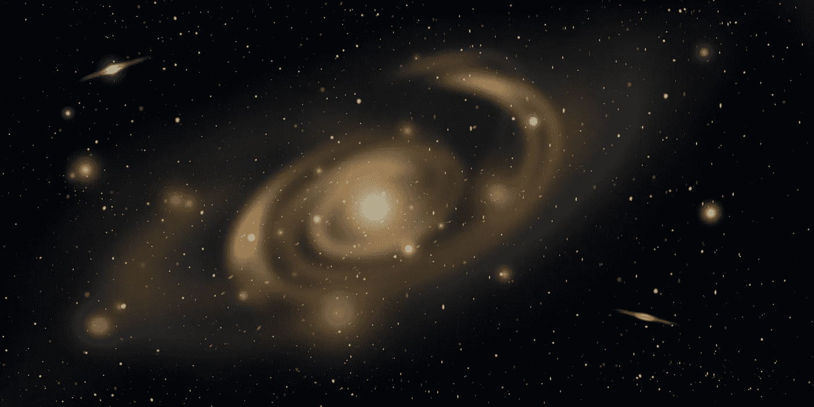

# 银河系及更远的地方:科学家公布了近 20 亿颗恒星的新数据

> 原文：<https://medium.datadriveninvestor.com/the-milky-way-and-beyond-scientists-publish-new-data-on-nearly-2-billion-stars-44d9a152a4e4?source=collection_archive---------23----------------------->

## 盖亚太空望远镜已经绘制了 18 亿颗恒星的精确位置，并掌握了其中大多数恒星与地球的精确距离，以及它们的空中活动

Image by [Gerhard G.](https://pixabay.com/users/blende12-201217/?utm_source=link-attribution&utm_medium=referral&utm_campaign=image&utm_content=4036236) from [Pixabay](https://pixabay.com/?utm_source=link-attribution&utm_medium=referral&utm_campaign=image&utm_content=4036236)

欧洲盖亚太空望远镜的最新观测发现，银河系中的恒星数量达到 18 亿。这份最新的星表被称为“终极天书”。12 月 3 日，科学家发布了银河系目前观测到的最新恒星数量。

到目前为止，盖亚太空望远镜已经绘制了 18 亿颗恒星的精确位置，并掌握了其中大多数恒星与地球的精确距离以及它们在天空中的运动。

据悉，盖亚太空望远镜于 2013 年发射，目前仍可服役 4 年。但现在，这台“宇宙探索机器”依然以不可思议的速度带给人类对宇宙的新见解。平均每天发表 3 篇学术论文，全部基于望远镜的观测数据。

> **就生产力而言**

任何探测器都无法与之匹敌，即使是强大的哈勃太空望远镜。英国莱斯特大学的马丁·巴斯托(Martin Barstow)说:“盖亚数据就像扫过天体一样。物理学领域的一场海啸！望远镜的观测范围涵盖了天体物理学的所有领域，从与地球相邻的恒星到太阳系中的行星，一直延伸到宇宙的边缘。”

欧洲航天局的盖亚太空望远镜看起来像一顶旋转的大帽子。距离地球 160.8 万公里。它使用英国制造的相机以惊人的精度记录太空中所有发光和移动的天体。

这在测量空间距离时尤其重要。盖亚太空望远镜通过跟踪天体绕恒星旋转时如何轻微摆动来测量天体的距离。

**这是三角视差原理**

随着时间的推移，盖亚空间望远镜将逐渐消除评估数据中的不确定性。观测一颗 15 类恒星，模糊程度远远超出肉眼可见范围，但盖亚空间望远镜的观测误差为 0.027 微秒。

爱丁堡大学的尼古拉斯·罗威尔博士解释说，这相当于盯着 20 万公里外的一枚英镑硬币。

 [## 蓝色起源能摧毁 SpaceX 的垄断吗？数据驱动的投资者

### 争夺太空主导权的战争即将升级吗？距离第一枚 SpaceX 猎鹰 9 号火箭升空已经过去 7 年了…

www.datadriveninvestor.com](https://www.datadriveninvestor.com/2020/11/26/could-blue-origin-demolish-the-spacex-monopoly/) 

**2016 年**，科学家首次更新了盖亚太空望远镜的观测数据。当时观测到银河系的恒星数量是 11 亿颗。但是到了 2018 年，这个数据上升到了 16 亿。12 月 3 日，最新数据显示，银河系已观测到 18 亿颗恒星。

Photo by [NASA](https://unsplash.com/@nasa?utm_source=unsplash&utm_medium=referral&utm_content=creditCopyText) on [Unsplash](https://unsplash.com/s/photos/stars?utm_source=unsplash&utm_medium=referral&utm_content=creditCopyText)

> 对于这 18 亿个光源

盖亚太空望远镜可以准确掌握它们的位置和亮度。其中记录了 15 亿颗恒星的距离和横向运动。相似的恒星用相同的颜色标注，这对了解恒星的性质非常重要。，比如温度，成分，恒星的年龄。

**目前**，盖亚太空望远镜已经计算出 720 万颗恒星的径向速度——它们靠近或远离地球的速度。有些恒星的径向速度非常快，达到每秒 500 多公里。

穆拉德空间科学实验室的乔治·西布罗克博士推测，这个速度意味着一些恒星可能来自银河系之外。它们通常是晕星。它们大部分时间都远离银河系盘面，稍后我们可能会观测到。

突然穿过银河系的盘面，其中一部分可能是入侵者。通过对它们的全面分析，应该可以确定它们的来源。

12 月 3 日公布的焦点数据是关于银河系的质量对太阳施加的引力加速度，使得太阳和太阳系的行星围绕银河系的中心运行。盖亚太空望远镜是基于一个“固定的光点”，并使用遥远的星系作为参考坐标系进行测量。

**结果显示**太阳的引力加速度很小，每秒 16 皮米，1 皮米是一米的万亿分之一。这将使我们太阳系的轨道发生偏转，但不会造成太阳在宇宙中的位置。“弹射器”。

Image by [Lumina Obscura](https://pixabay.com/users/lumina_obscura-4128746/?utm_source=link-attribution&utm_medium=referral&utm_campaign=image&utm_content=3608029) from [Pixabay](https://pixabay.com/?utm_source=link-attribution&utm_medium=referral&utm_campaign=image&utm_content=3608029)

> **英国剑桥大学的 Floor van Leeuwen 博士表示，三年前**

一篇论文指出，盖亚空间望远镜观测数据意义重大，可以观测到小到无法测量的天体，但实际上，我们可以测量这些遥远的天体，到盖亚空间望远镜服务结束时，应该可以达到 1%左右的精度，这是天文学家无法想象的。

太阳的引力大约一半来自银河系中的可见物质，另一半来自不可见物质——所谓的“暗物质”。科学家还不知道暗物质是什么，但可以肯定的是，它们对宇宙中的正常物质产生了影响。

**来自剑桥大学的 Gerry Gilmore** 教授说:“我们希望通过后续的实验，能够使观测数据更加准确，并在不同的尺度上开展实验。也许我们可以观察不同类型的暗物质。所以这些对质量分布和物体运动的精确测量实际上是在探索基础物理的极限。”

*盖亚太空望远镜的寿命受到推进器储存的氮气量的影响。当燃料储备耗尽时，它的任务就结束了。预计望远镜的“死亡时间”是 2024 年。*

## 获得专家观点— [订阅 DDI 英特尔](https://datadriveninvestor.com/ddi-intel)