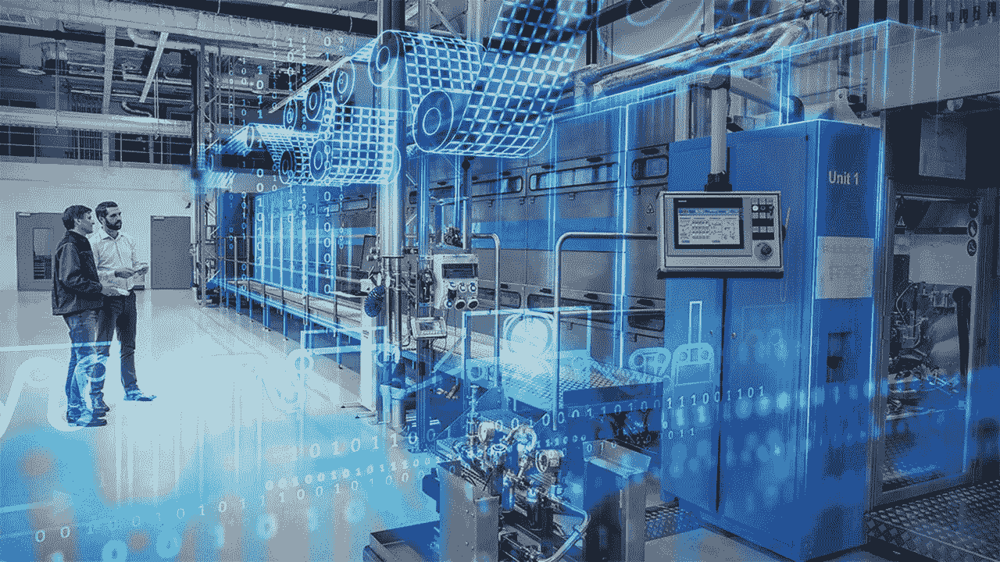
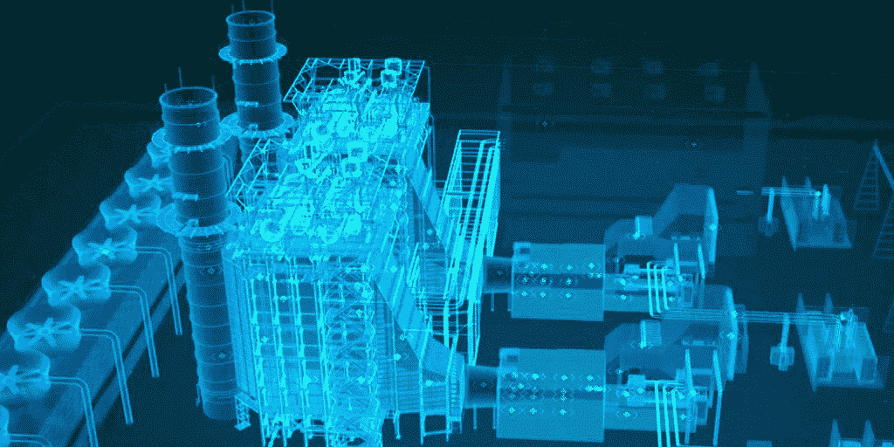
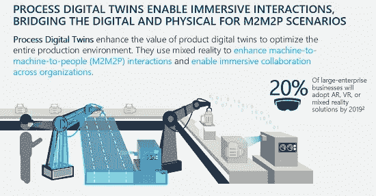
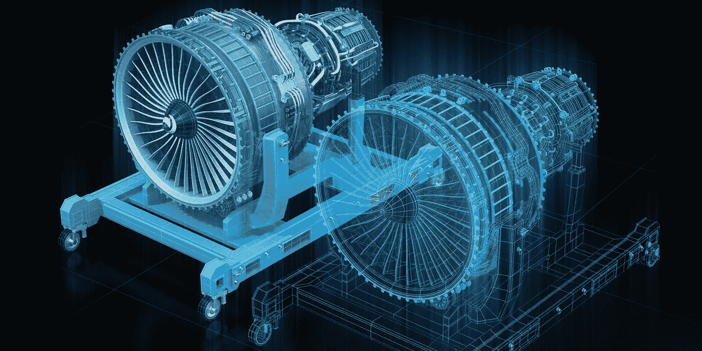
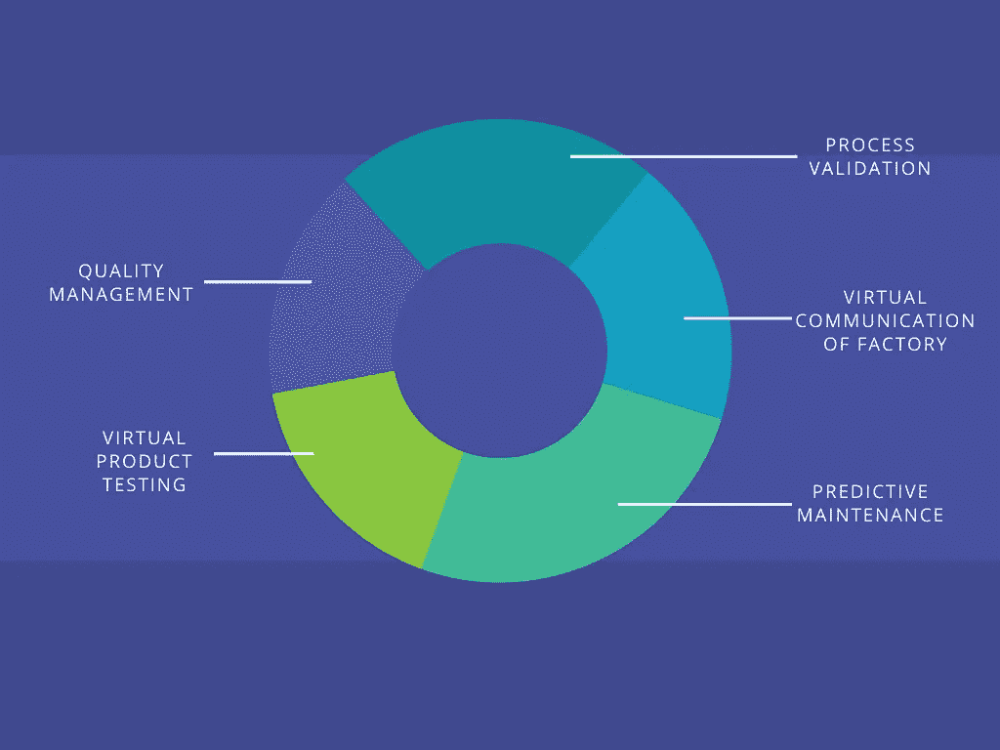

# 机器的大脑——数字双胞胎

> 原文：<https://medium.datadriveninvestor.com/the-mind-of-a-machine-digital-twin-5f00dfdac140?source=collection_archive---------14----------------------->

The Digital Twin Technology (source: plm.automation.siemens.com)

时间在流逝，技术在进步，但有一个部门总是被同样的旧技术卡住，那就是制造业。随着时间的推移，研究人员一直试图将技术与世俗的制造方法相结合，这导致了建模、模拟、分析、工业物联网等时代的到来。在工业 4.0 时代，主要的座右铭是在瞬间以最小的成本提高生产率，这最终导致了数字孪生技术的兴起。

# 让我们来了解一下**到底什么是数字孪生？**

一个**数字孪生**是一个**流程**、**产品**、**、**或**服务**的虚拟模型。虚拟世界和物理世界的这种配对允许分析数据和监控系统，以在问题发生之前阻止问题，防止停机，开发新的机会，甚至通过使用模拟来规划未来。

Digital Twin of Oil and Gas Industry (Source: community.nasscom.in)

让我们来看一个例子，**电动马达的数字双胞胎**不仅展示了马达布局，还分析了从轴的旋转到热传导的各种功能。数字孪生不断发展，并接受用户体验反馈和输入。以这种方式，产品可以在物理原型建立之前很久就被设计和分析。

Digital Twin of DC Motor (source: youtube.com)

> “数字双胞胎的最终愿景是在虚拟环境中创建、测试和建造我们的设备，”美国宇航局首席制造专家兼美国宇航局国家先进制造中心经理约翰·维克斯说。“只有当它达到我们的要求时，我们才会实际制造它。然后，我们希望物理建筑通过传感器与数字建筑联系起来，以便数字建筑包含我们通过检查物理建筑获得所有信息。”

让我们对制造业中使用的双胞胎进行分类

 [## 认知计算——一套被广泛认为是……

### 作为它的用户，我们已经习惯了科技。这些天几乎没有什么是司空见惯的…

www.datadriveninvestor.com](https://www.datadriveninvestor.com/2020/02/19/cognitive-computing-a-skill-set-widely-considered-to-be-the-most-vital-manifestation-of-artificial-intelligence/) 

# **处理数字孪生**

产品的每一部分都是从原材料开始的，这些原材料在进入市场之前必须经过几道制造工序。这些制造过程是产品质量、生产效率等的关键。Process twin 有助于高效规划生产流程，在部署和调整生产流程之前对其进行验证，以实现所需的生产质量和效率。

Process Digital Twin (source: cloudblogs.microsoft.com)

# **机器双胞胎**

机器双胞胎是车间机器的双胞胎，如传送带、计算机化数字控制、直流电动机和其他重工业机器，它们是制造产品所必需的。

Machine Twin of a Turbojet Engine (source: job-wizards.com)

> “到 2020 年，30%的 G2000 公司将使用物联网连接产品和资产的数字双胞胎数据来提高产品创新成功率和组织生产力。”— ( IDC，2017 年 11 月)。

# 我们还有一枚未被发现的硬币，**为什么是数字孪生？**

## ***节本***

通过实现精益制造，借助预测性维护节省原型成本和维护成本。

*客户可以更快地获得创新产品，并及时交付产品。*

## ****更快的上市时间****

*这可以通过避免原型造成的延迟来实现。*

## ****优化效率****

*通过预测机器故障和调整生产流程。*

## ****收益率更高****

*通过优化生产流程、实现精益制造、优化效率和优化生产线。*

## ****精密质量****

*持续监控质量，优化流程，并严格监控材料质量。*

*上面提到的几点给了我们一个简单的想法，但是我们如何将它与现实生活中的业务问题进行比较。让我们看看通用电气公司对此有何打算，通用电气公司的*“数字风电场”*开辟了提高生产率的新途径。GE 使用数字环境在建造之前通知每个风力涡轮机的配置。它的目标是通过分析来自每个涡轮机的数据，将效率提高 20%,这些数据被输入到它的虚拟等效物中。*

# *扩展我们的讨论，让我们深入到**数字孪生用例***

**

*Pictorial Representation of Digital Twin Use Cases (source: canva.com)*

## ****虚拟产品测试****

*生产前在各种模拟条件下测试产品。这节省了与产品原型相关的成本，并在产品开发生命周期的早期阶段改进了设计。*

## **质量管理**

*监控生产流程的每个部分并建立模型，以确定可能出现质量问题的地方，并分析正在生产的产品的成分，以确定是否有更好的材料和生产流程可以使用。*

## **流程验证**

*它使我们能够模拟产品定制将如何影响生产流程，并改变流程的工作方式以适应这种定制。*

## ***工厂虚拟通信***

*与工程用例非常相似，调试中的数字双胞胎的目标是在工厂建成之前实际运行工厂。这使得自动化和操作人员能够提前检测和解决问题，同时减少在实际物理环境中安装时的实际调整需求。*

## ***预测性维护***

*由 digital twins 支持的预测性维护有助于精确监控设备，并及时识别潜在异常或设备故障。*

*通常，人工智能和机器学习被用来分析数字双胞胎所代表的操作模型，无论真实的设施位于何处——即使设备在太空中。*

**美国国家航空航天局(NASA )* 从太空探索的早期开始，就使用配对技术(数字孪生技术的前身)来解决当你不在系统附近时操作、维护和修理系统的问题。这正是地球上的工程师和宇航员决定如何营救*阿波罗 13 号任务*的方法。今天，数字双胞胎在美国宇航局被用于探索下一代车辆和飞机。*

# *在一个**结束音符上***

*所有迹象似乎都预示着我们正处于数字孪生技术爆炸的尖端。更多的公司将了解真实世界和试点项目的成功故事，并希望部署自己的数字双胞胎以获得竞争优势。*

*请随意分享关于这篇文章的反馈。感谢阅读！呆在家里，注意安全！*