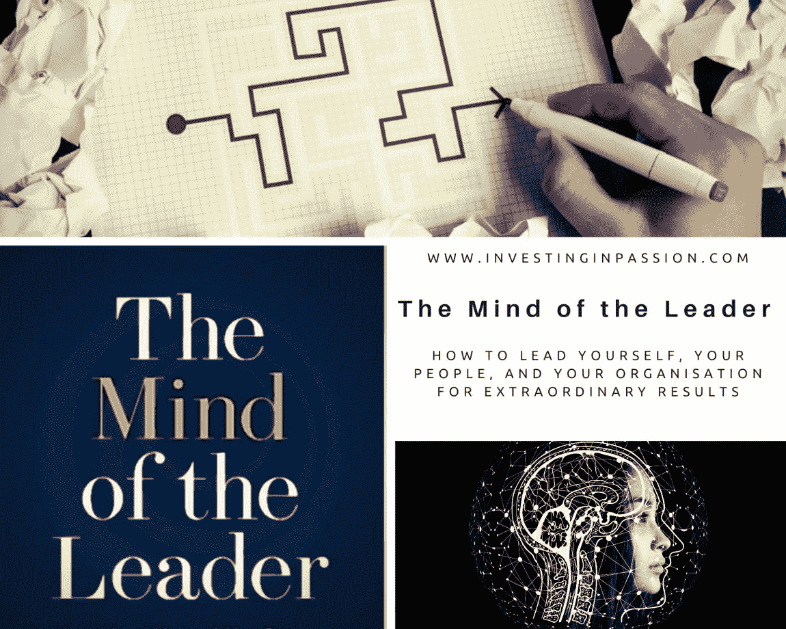
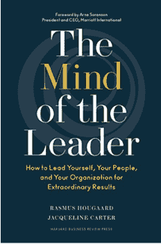
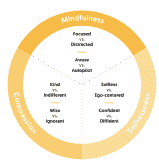

# “领导者的思想”

> 原文：<https://medium.datadriveninvestor.com/the-mind-of-the-leader-19a844089ab0?source=collection_archive---------6----------------------->

*……*

*…拉斯莫斯·胡加德和杰奎琳·卡特的书*。**

****

**我总是着迷于那些没做什么特别的事，没有任何压力去脱颖而出，但是被尊重，被追随，成功，并取得非凡成就的人。我在思考这个问题，我有一些关于做你喜欢的事情的理论，真实、一致、自然、诚实，当我把它与现实进行交叉核对，并把这个清单应用到我见过的领导者身上时，它有了某种意义。在我有意识地观察生活的这些年里，这是一种猜测和收集一些结论，但这仍然是我个人的感觉和猜测为什么这比其他东西更好。这一切最近变得更加清楚，当我被推荐阅读'****领袖的头脑*** '时。***

**我的一些害羞的假设被很好地框定并放进了理论中，这个理论扩展并彻底改变了成为成功领导者的古老而流行的方法。这个理论很简单，但是我看到了很多现实生活中的证明来支持它。它叫做**理学硕士** : *正念——无私——慈悲*，字面上结合了正念和无私的技能，以增强我们情感慈悲的能力。这些是让领导力最成功的能力(得到科学证实)，令人惊讶的是，这一理论始于领导者，而不是你应该管理的人(实际上，管理已经没有什么剩余了)。许多著名的、古老的、仍在教授的领导力培训涵盖了人员管理、变革管理、组织管理，但却忽略了最重要的组成部分，即第一步，这是成功、受人尊敬和持久的领导力的基础，即了解和领导自己的能力。新的(至少对我来说是以这种特殊的形式)方法从你作为一名领导者开始，并解释了 MSC(如果存在的话)如何成为成功和有思想的领导的最大基础。当人们工作不是因为他们不得不工作时，当人们工作是因为他们想要并对他们所做的事情充满激情。这是当他们被认可，被尊重，并且感觉与他们的个人价值观一致的时候。为自己和周围的人做人是一个必须具备的，也是传奇领导力非常基本的一步。**

****对过去一年的反思&我的 MBA 经历加速了我对领导力的理解&发展****

**-带着满足感离开办公室的人会带着快乐和动力回来，
-目的和影响对人们很重要(通常是最重要的)，
-晋升、免费食物、豪华办公室不是最好的激励因素(这是少数几个不如内在因素重要的外部条件之一)，
-意思是，需要在工作环境中创造连通性快乐，
-为了领导团队并创造一个繁荣的环境，领导者应该具备 M(专注+意识)S(无私)C(同情心):**

****

**Snapshot from the book**

**-所有 3 个特征都可以学习、增强和完全实现。一个加强另一个并使其更加强大，**

**-听比说更重要。让人们发言，你在最后表明立场，**

**-谦逊有待提高，**

**-自我最小化或完全消除，**

**-每天练习意识，10 分钟，完全专注于此刻，**

**——培养自信无私。它让你站起来，坚持你的想法，而不是被自我和骄傲所驱使——推动者，道德模范，伦理巨人，**

**——训练自己的无私，反思用‘我’，换成像‘我们’这样更包容的称呼，**

**——人的内在动机是关键。你应该注意他们想要什么，而不是你认为他们想要什么。了解他们的动机和驱动力，**

**-存在感、信任感和心理安全感是团队表现的关键决定因素。**

****对去年加速我领导力发展的 MBA 经历的反思****

***今年，作为 MBA 课程的一部分，我参加了为期一年的领导力项目，我的思维方式得到了成倍的增长，我与来自 40 多个国家的数百名优秀人士进行了互动，我几乎有 70%的时间都在自己的舒适区之外(剩下的 30%可能是在房间里)，这帮助我从不同的角度看待领导力。我吸收并驯服了不舒服和未知的感觉，我把我对正常的理解扩展到几种不同的文化、思维方式和行为模式。在过去的几个月里，我在超过 15 个不同的团队中工作，经历了外部和内部的限制。我可以理解和接受自己，增强挑战他人的能力，帮助他们发挥潜力，这是我一生中最美好的经历之一。***

** [## 领导力。赢得|数据驱动型投资者需要更广阔的视角

### 不管他们愿不愿意，领导者都是快速运转的机器中的齿轮，这就要求他们夹住自己的爪子…

www.datadriveninvestor.com](https://www.datadriveninvestor.com/2020/02/07/leadership-it-takes-a-wider-perspective-to-win/) 

最初发表于[www.InvestingInPassion.com](http://www.InvestingInPassion.com)

**进入专家视角—** [**订阅 DDI 英特尔**](https://datadriveninvestor.com/ddi-intel)**