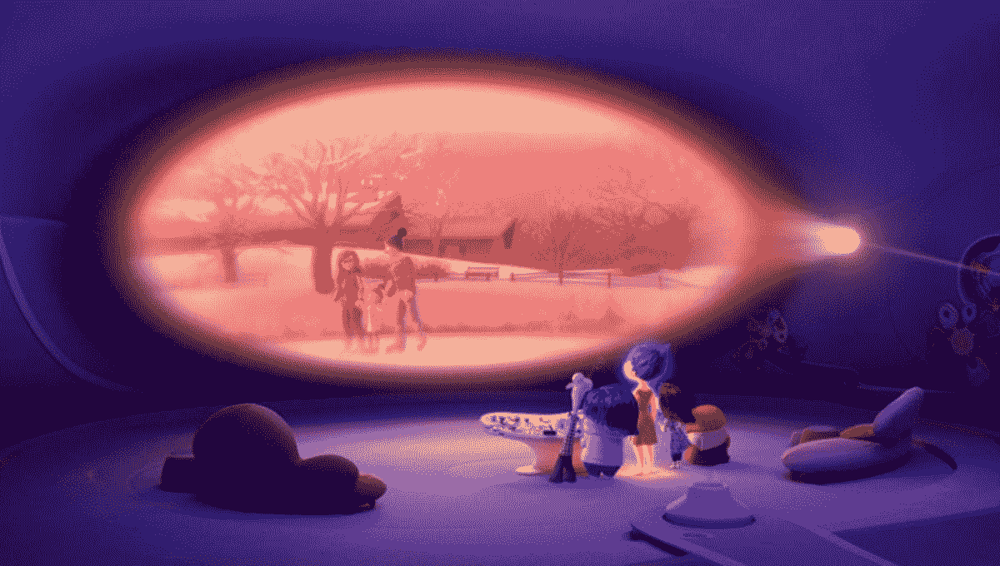
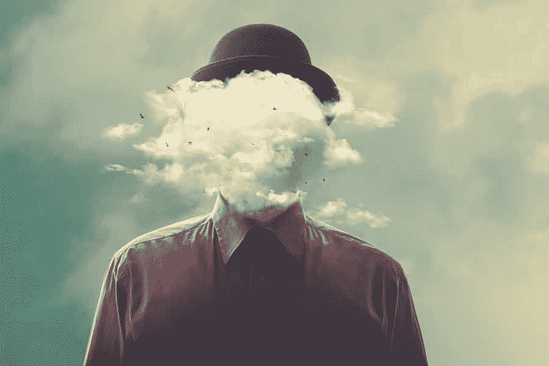
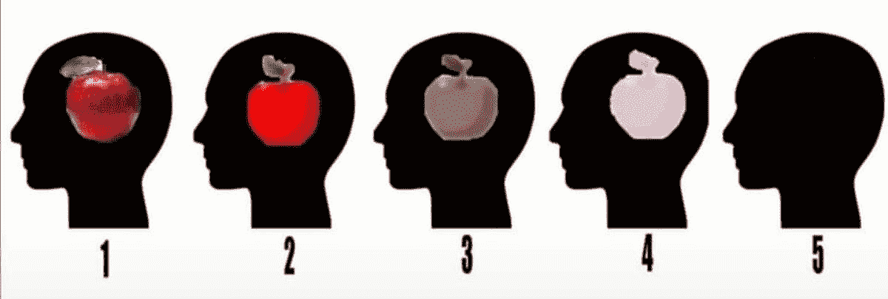

# 心灵之眼

> 原文：<https://medium.datadriveninvestor.com/the-minds-eye-825dfc2e5268?source=collection_archive---------0----------------------->

想象一下你最后吃了什么。你坐在桌子旁边吗？食物是什么？它是分开的还是全部混合在一起的？你是用盘子还是用碗吃的？你用餐具了吗？房间里是暗还是亮？这些问题应该有助于在你大脑中被称为你的**心灵之眼**的部分形成一幅图像。

How I think of my mind’s eye

首先，你的“心眼”是什么？尽管名字如此，但它并不是你心目中的巨眼。它实际上是你大脑中回忆和创造图像的地方。你曾经想象过的一切都在你的脑海里。我喜欢把它想象成一个巨大的电影屏幕，就像电影《颠倒》中那样。它让你看到记忆，记住图像，甚至看到新的图片和想法。大多数人会觉得这些图像有点模糊不清，就好像你透过一块脏玻璃在看它们一样，但有些人的情况是他们的心眼太极端了。

## **失语症**

第一种叫做**失语症**。aphantasia 这个词来源于两个希腊词，“ **a** ”的意思是没有，而“ **phantasia** ”的意思是想象。合在一起，它们意味着你“没有想象力”，无法形成心理图像。这看起来很疯狂，对吗？对于没有这种症状的人来说，看不到对他们来说如此自然的东西似乎是不可能的，但是大多数有这种症状的人把他们看到的东西描述为什么也没有或者是黑色的。有些人甚至称之为虚空。基本上，当没有失语症的人想象他们吃了什么时，他们能看到，但是失语症患者不能。

Seeing nothing

这个想法最早是由心理学家弗朗西斯·高尔顿在 1880 年提出的。他将其描述为一种无法想象意象的状态。他的想法没有被采纳，直到 2015 年行为和认知神经学家亚当·泽曼发现了这种情况，才开始进行研究。他有一个病人来找他，说他们在手术后失去了想象事物的能力。他们在做梦时仍能看到图像，但他们不能主动想象事物。经过一些研究和测试，泽曼将这种情况命名为失语症。他强调，这是一种情况，而不是残疾，因为它不允许某人做事情，但却有好处。

 [## 释放结果的简单哲学|数据驱动的投资者

### 这是我们播客中帕迪·布鲁斯南的一段话。帕迪是一个正念和冥想老师，一个…

www.datadriveninvestor.com](https://www.datadriveninvestor.com/2020/03/16/a-simple-philosophy-to-unlock-results/) 

## **失语症的利与弊**

这些好处包括，拥有它的人在数学或逻辑主导的领域表现出色，因为他们有更强的分析能力。这也表明他们犯的记忆错误更少，因为他们不会因为想象不同的场景而感到困惑。早期的研究认为他们没有受到创伤后应激障碍的影响，因为他们无法生动地回忆起他们所经历的苦难。这导致了这样一种观点，即他们更多地活在当下，因为这样不太可能陷入他们看不到的过去或未来。

和任何事情一样，仍然有缺点。许多患有这种疾病的人说，阅读的乐趣减少了，因为他们看不到任何图像。如果作者描述了骑在龙背上穿越海洋和森林的惊险经历，而我们看到了这张照片，失语症患者不会，对他们来说这只是一堆单词。虽然他们在记忆中的错误较少，但这都是基于事实的，所以试图记住一幅风景是什么样子要困难得多。这也使得学习某些像艺术这样使用心理图像的东西变得更加困难。

## **失语症患者**

也就是说，这根本不是不可能做到的。皮克斯和华特·迪士尼动画公司的前总裁艾德·卡姆尔患有失语症。这并没有阻止他革新 3D 图形和领导一吨的动画电影，如玩具总动员，海底总动员，里面了，和更多。他解释说，他的许多同事也有这种情况，包括一位在《冰雪奇缘》中工作的艺术家，但这并不能阻止他们做自己喜欢的事情。这一点以及更多可以在 BBC 关于 T2 的一篇文章中找到。

Ed Catmull- former president of Pixar

和他一起，火狐的联合创始人布雷克·罗斯也有失语症，他擅长编程和开发。领导了人类基因组第一份序列草案的生物化学家克雷格·文特尔也有这种情况。这表明职业不会因为失语症而受到限制。只是思维方式不同而已。

## 色盲过度

失语症的另一个极端叫做过度语感。这是一种你不费吹灰之力就能在脑海中看到极其详细清晰的图像的状态。这些图像可以被操纵，就好像你真的在那里一样，所以如果你想象一个苹果，你可以转动它，看到它的 360 度视图。有些人把这种情况称为过度活跃的想象，因为它有可能看到任何东西。

我发现我有过度性欲，我会用同样的方式描述它。想象事物对我来说是如此自然和清晰，以至于我没有意识到大多数人看事物并不清晰或根本不清晰。当我想到图像时，我看到它们就像我在那里，用我的眼睛看着它们。这无疑让阅读变得更加有趣。

How I imagine things while reading

## **对增生的利与弊**

这种情况有很多好处，但也有一些缺点。在非逻辑主导的领域，如摄影、艺术或写作，能够可视化很有帮助。有了摄影和艺术，患有色盲的人可以想象他们想要的照片是什么样子，并相应地调整他们的相机或画笔。在写作中，他们可以看到故事将如何展开，并在脑海中浏览场景，以确保它有正确的情感和感觉。超感症也有助于实现目标，因为人们可以生动地描绘出结果、实现目标的所有步骤，以及当他们达到目标时的感受。

一些缺点是更容易陷入过去或未来，因为他们可以如此清楚地看到他们犯下的每个错误或他们想要的生活。他们很容易被白日梦分散注意力，成为不适应的白日梦者，这在试图完成工作时没有帮助。一些人迷失在他们的精神图像中，以至于他们很难分辨什么是真实的，什么不是，这有时会导致创伤后应激障碍或精神分裂症。

## **食欲过盛的人**

患有这种疾病的人并不多，但人们怀疑著名作曲家莫扎特患有这种疾病，因为据说他能听到一段音乐，并能在钢琴上完美地演奏出来。这也解释了他是如何如此容易地创作出音乐，并对其进行编排，使其在有多个声部时听起来很好，但在独奏时也很好。

也有人怀疑伟大的发明家尼古拉·特斯拉有恐惧症，因为他发明了太多的东西。据说他会在脑海中构建发明，这样他就可以知道自己需要什么零件和材料，以及它们是如何组合在一起的。这将有助于他在头脑中测试发明，看看它们是否可行，如果不可行，如何修复它们。

## **如何确定你的形象生动程度**

我敢肯定，现在你对自己的精神想象水平有点好奇，所以这里有一个由失语症网络[做的](https://aphantasia.com/)[测验](https://aphantasia.com/vviq/)，如果诚实回答，它会让你对自己的水平有一个准确的了解。它应该需要大约 5-10 分钟，但是如果你想要一个更快(但是不太准确)的测试，闭上眼睛想象一个苹果。当你睁开眼睛的时候，把你脑海中的图像和下面的图表进行比较。如果你看不到图像 5 中的任何东西，你有失语症，如果你的图像看起来像 1，那么你可能有或接近失语症。

Hyperphantasia — Normal Imagery — Aphantasia

## **关键要点**

*   你的心灵之眼是创造和回忆图像的地方
*   失语症是一种你无法形成心理图像的状况
*   色盲是一种你的想象力极其丰富的情况
*   这两种情况都不会限制你，它们只是思维方式不同而已

非常感谢您阅读我关于心灵之眼的文章！我希望你喜欢它并且学到一些新的东西。如果你有任何问题，评论或者你喜欢的东西，请在下面留下你的评论！如果你想读更多我的文章，看看这篇关于创造未来的文章。