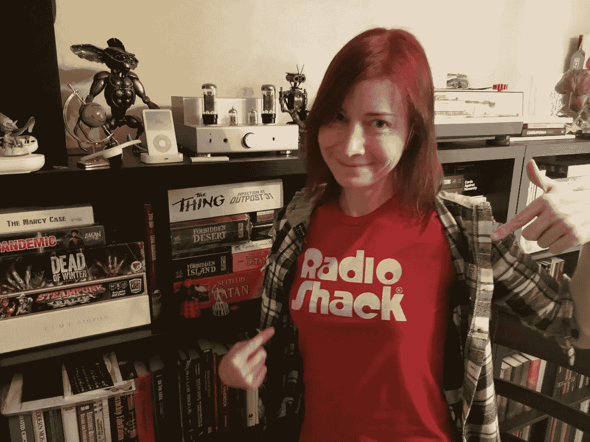
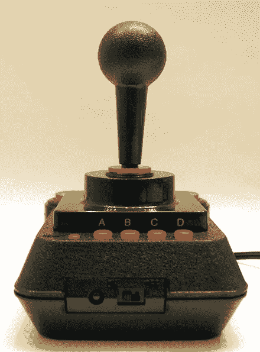
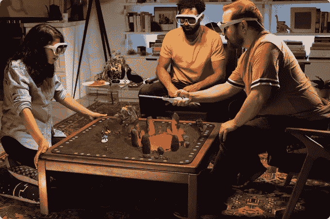

# 现代的史蒂夫·沃兹尼亚克用她的新 AR 公司 Tilt Five 重新发明了桌游。

> 原文：<https://medium.datadriveninvestor.com/the-modern-day-steve-wozniak-reinvents-board-games-with-her-new-ar-company-tilt-five-95466c6f3ea?source=collection_archive---------3----------------------->

> “我还把杰里·埃尔斯沃斯和查尔斯·泰克——PARC 施乐公司的主要硬件设计师(她也非常擅长软件)——相提并论，因为她能真正处理计算技术、建筑、相关科学和设计的基础。”—艾伦·凯

在我们谈话的早期， [Croquet](https://croquet.io/) 首席执行官 [David A. Smith](https://en.wikipedia.org/wiki/David_A._Smith_(computer_scientist)) 建议我与 [Jeri Ellsworth](https://twitter.com/jeriellsworth) 谈谈，她正在做一些空间计算方面最有趣的工作，她的最新项目是 [Tilt Five](https://www.tiltfive.com/) ，这是一个全息桌面游戏平台，配有增强现实眼镜、电路板和融合物理和虚拟世界的魔杖。她是大卫在这个世界上最喜欢的人之一，而且——在我认识他的短暂时间里——大卫是我在这个世界上最喜欢的人之一。这将使杰里，由协会，也是我最喜欢的人在世界上。我给杰里写了信，我们通了电话。我本想早点写下她的故事，但我需要了解更多，让这些想法慢慢酝酿。

 [## 人工智能和虚拟现实的融合-你能期待什么|数据驱动的投资者

### 在技术领域，融合是合乎逻辑的一步。就在几十年前，你可能需要一个专门的…

www.datadriveninvestor.com](https://www.datadriveninvestor.com/2018/08/30/the-convergence-of-ai-rv-what-you-can-expect/) 

杰里的工作已经被广泛报道了很长一段时间。《纽约时报》曾在 2004 年发表过一篇名为[一个玩具的报道，讲述了 Jeri 成功地将一台 20 年前的](https://www.nytimes.com/2004/12/20/technology/a-toy-with-a-story.html) [Commodore 64](https://en.wikipedia.org/wiki/Commodore_64) 家用电脑的整个电路安装到一个芯片上，一个内置 30 个游戏的操纵杆中。连接到电视的操纵杆被命名为 [Commodore C64 Direct-to-TV](https://en.wikipedia.org/wiki/C64_Direct-to-TV) ，它的立即成功将杰里推到了聚光灯下。在更近的 2019 年的一篇名为 [Always Building，从车库到她的公司](https://www.nytimes.com/2019/10/24/technology/jeri-ellsworth-augmented-reality.html?smtyp=cur&smid=tw-nytimesbusiness)的报道中，作为《纽约时报》的[远见者](https://www.nytimes.com/spotlight/visionaries) 系列的一部分，Jeri 再次成为焦点，这一次是她的最新作品《倾斜五》(Tilt Five)。

在听到 Jeri 在 AR Insider 访谈 [XR Talks 中最新提到的一件事之后，我的故事终于开始了:来自一位 AR 传奇人物](https://arinsider.co/2020/01/17/xr-talks-notes-from-an-ar-legend/)与 Avi Bar-Zeev 的笔记，Avi Bar-Zeev 是 Croquet 的顾问之一(与 Alan Kay 和 Dan Ingalls 一起)，也是 Jeri 的非官方顾问。Avi 是 Google Earth 背后公司的创始人之一，他在微软帮助创建和发明了 HoloLens。听起来 Jeri 也是 Avi 在这个世界上最喜欢的人之一，所以我赶紧回去写我的故事，希望它能最终走到一起。

Jeri designed the circuitry for the [Commodore Direct-to-TV](https://en.wikipedia.org/wiki/C64_Direct-to-TV), using a single-chip implementation of the [Commodore 64](https://en.wikipedia.org/wiki/Commodore_64) computer, which fit 30 games into a joystick. 70,000 units were sold on the first day.

高中时，Jeri 开始了她的第一次创业，当时她和她的父亲一起设计、制造、比赛和销售泥地赛车,赚了足够的钱后，她辍学全职从事这项事业。对于一个年轻时拆解东西的人来说，这是一个可行的进展，包括她父亲为她哥哥带回家的 Commodore 64。Jeri 当时一点也不知道，她自学的编程技能和汽车制造技能将在未来几十年中为她服务。

“I Really Do Know How To Build Race Cars — Don’t Make Me Pull Out the Trophies,” from [Jeri’s “Race Car Fabrication” playlist on her YouTube channel](https://www.youtube.com/channel/UClTpDNIOtgfRkyT-AFGNWVw).

1995 年，21 岁的 Jeri 在俄勒冈州开了一家由 5 家电脑商店组成的连锁店，后来在上大学之前卖掉了公司，在那里她找不到志同道合的思想家，仅仅一年后就辍学了。她开足马力，奔向硅谷，追寻制造电子设备的梦想。

Jeri at her “Computers Made Easy” store in Oregon. She eventually owned 5 stores in small towns, which she would later sell, and return to her love for hobbyist electronics.

在接下来的 20 年里，Jeri 不断完善她的芯片设计技能。2000 年，她在 Commodore 博览会上的出现引起了 Mammoth Toys 的注意，她与他们合作设计了 Commodore C64 Direct-to-TV*操纵杆。后来，她成为了 [TiVO](https://en.wikipedia.org/wiki/TiVo) 芯片设计的首席设计师，在公司发现她的 [YouTube 频道](https://www.youtube.com/user/jeriellsworth)后，她被视频游戏开发商 [Valve](https://en.wikipedia.org/wiki/Valve_Corporation) 聘用。在 Valve 工作期间，Jeri 成立了一个研发部门，其使命是开发产品，将家庭聚集到客厅玩游戏。在那里，她还遇到了大卫·a·史密斯，当时他参观了 Valve，演示他正在研究的一些技术。她后来在一次活动中再次遇见了他，一段友谊由此诞生。然而，在这些公司工作的整个过程中，Jeri 都被困在大公司设计和生产约束的范式中。*

*2013 年，Jeri 与一位曾在 Valve 工作过的同事一起创建了 [castAR](https://en.wikipedia.org/wiki/CastAR) ，离开后，他们购买了他们在公司期间开发的技术，以便他们可以构建增强和虚拟现实眼镜。在发展到 70 名员工后，该公司于 2017 年关闭，Jeri 正在进行她的下一个创业项目，Tilt Five，使用她从 castAR 获得的技术。*

*Tilt Five 于 2019 年 9 月在 Kickstarter 上推出，获得了巨大的成功，在 35 天内筹集了 1，767，301 美元，推动 Jeri 进入了她的旅程的下一阶段。这一次，她将设计和制造一款易于理解、易于使用、有趣的产品，供家人在客厅玩耍。通过专注于桌面 AR 游戏，Tilt Five 能够为消费者创造完美的高质量体验。它也很实惠，起价 299.99 美元，包括几款游戏和允许开发者开发自己游戏的 SDK。它也有大众市场的吸引力，正如 Avi 在他的 AR 内幕采访中所说:*“我想在百思买看到那个东西。我想看到你在周五晚上做的事情，和你的朋友围坐在桌子旁玩这些游戏，一年后它将成为垄断。”**

*Jeri 将 Tilt Five 的成功归因于他们限制了很多技术。她对我说:*“我们没有像*[*Magic Leap*](https://en.wikipedia.org/wiki/Magic_Leap)*或* [*微软 HoloLens*](https://en.wikipedia.org/wiki/Microsoft_HoloLens) *那样试图煮沸海洋，而是只专注于桌面体验，我们优化了设计。这是一副眼镜，你只要戴上它，翻开游戏板，魔法就会出现在你的桌上。我们并不是要把图形放在世界各地…我们只是成本的一小部分，你可以用 Magic Leap 耳机的价格购买 5 或 6 个耳机。”**

*Jeri announces the launch of [Tilt Five’s Kickstarter campaign](https://www.kickstarter.com/projects/tiltfive/holographic-tabletop-gaming/description) in September 2019, on [her YouTube channel](https://www.youtube.com/user/jeriellsworth).*

*传统游戏被打破了。玩家在独立的电脑上玩游戏，通过耳机交流，无需身体互动，全息桌面游戏体验通过使游戏更具协作性和沉浸感解决了这个问题。Tilt Five 可能是协作游戏最成功的实现，我想知道更多 Jeri 对协作技术如槌球的想法。"*从我的角度来看，Croquet 相对于其他网络的优势是，网络对于应用程序来说总是一个问题，无缝连接总是被破坏。你总是试图在世界上找到你的朋友，建立联系，有时会有巨大的延迟，这是一种可变的，你会与你的朋友们正在做的事情不同步，看起来他们已经解决了所有的问题，这太棒了…这在 AR 领域很重要，我认为这就是为什么 Croquet 对 AR 和我们面向消费者的技术感到非常兴奋。我们将能够部署数百万个单元，他们的系统可以同时同步数千、数百万人，因此我们几乎是地平线上唯一一个具有这种影响力的平台。增强现实领域的所有其他技术都太贵，太笨重，无法成为大众市场的产品，而且它们还有很长的路要走。”**

**

*[Tilt Five](https://www.tiltfive.com/) is a holographic tabletop game platform that comes with augmented reality glasses, a board and wands that meld the physical and virtual worlds, and is [available for pre-order](https://tilt-five.backerkit.com/hosted_preorders/).*

*游戏行业正在快速变化，AR 行业也在快速变化，Jeri 同时改变了这两个行业。她引领着游戏平台革命，与任天堂、PlayStation 和 Xbox 等公司展开平等竞争。但游戏只是增强现实可能带来的体验世界的开始，无论是在客厅、教室、办公室，还是在其他任何人们希望合作的地方。杰里正沿着人迹罕至的道路前进，开着她的土路赛车开辟新的道路。*

# *谢谢你*

*感谢 Jeri Ellsworth 分享 Tilt 的五个故事，以及你对 AR 未来的展望。大卫·a·史密斯，谢谢你建议我和杰瑞谈谈。感谢 Avi Bar-Zeev 将 Tilt Five 描述为“一年后的垄断”，并鼓励我完成这篇报道。*

# *倾斜五度*

*   *[倾斜五个网站](https://www.tiltfive.com/)*
*   *[Tilt Five Kickstarter 活动](https://www.kickstarter.com/projects/tiltfive/holographic-tabletop-gaming)*
*   *[推特上的 Tilt Five](https://twitter.com/tiltfive)*
*   *[倾斜五个工作岗位](https://www.indeedjobs.com/tilt-five-inc/jobs)*
*   *[杰里·埃尔斯沃斯在推特上](https://twitter.com/jeriellsworth)*
*   *[杰里·埃尔斯沃斯网站](https://www.jeriellsworth.com/)*

# *槌球戏*

*   *[门球网站](http://croquet.io/)*
*   *[槌球——协作系统架构](http://www.vpri.org/pdf/tr2003001_croq_collab.pdf)(大卫·史密斯，艾伦·凯，安德里亚斯·拉布，大卫·p·里德，2003)*
*   *槌球——一群新的用户界面(大卫·A·史密斯，安德烈亚斯·拉布，大卫·p·里德，艾伦·凯，2004)*
*   *[为什么 AR 会赢——为什么它如何赢很重要](http://www.croquet.zone/2019/01/why-ar-will-win-and-why-it-matters-how.html)(大卫·a·史密斯，2019)*

# *计算思想的历史*

*   *人机共生(J. C. R .利克里德，1960 年)*
*   *增强人类智力:一个概念框架(道格·恩格尔巴特，1962)*
*   *[作为交流工具的计算机](https://signallake.com/innovation/LickliderApr68.pdf) (J.C.R. Licklider 和 Robert W. Taylor，1968)*
*   *[分布式计算机系统中的命名和同步](https://dspace.mit.edu/handle/1721.1/16279)(大卫·p·里德，1979)*

# *艾伦·凯*

*   *[艾伦·凯维基百科页面](https://en.wikipedia.org/wiki/Alan_Kay)*
*   *艾伦·凯会谈*
*   *[观点研究院论文](http://www.vpri.org/writings.php)*

# *我写的故事*

*   *Queue 为电子竞技视频回放带来实时协作，由 Croquet 提供支持。*
*   *[槌球，领先业界的协作技术。](https://medium.com/@saadsahawneh/croquet-leading-the-industry-in-collaborative-technology-f343b68f0bf4)*
*   *使用 Croquet 创建交互式的基于网络的演示。*
*   *[抛弃流行文化](https://medium.com/@saadsahawneh/abandoning-pop-culture-fdcb6d8da231)。*
*   *[狂上传往事](https://medium.com/@saadsahawneh/binge-uploading-the-past-44d86a963459)。*
*   *[一个叫槌球的房间](https://medium.com/@saadsahawneh/a-room-called-croquet-ad3f056ebae5)。*
*   *[一次一个想法](https://medium.com/@saadsahawneh/one-mind-at-a-time-8378bbde94fb)。*
*   *[几粒沙子](https://medium.com/@saadsahawneh/a-few-grains-of-sand-76c2dfb9bfab)。*
*   *[互联网的 N 个问题](https://medium.com/@saadsahawneh/the-internets-n%C2%B2-problem-36410bbd65af)。*
*   *[收音机上的按钮](https://medium.com/@saadsahawneh/the-button-on-the-radio-ba5208c31622)。*
*   *嘘…真正的计算机革命还没有发生。*
*   *让玛利亚·蒙台梭利活着。*
*   *让道格·恩格尔巴特活着。*