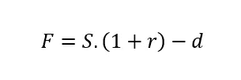
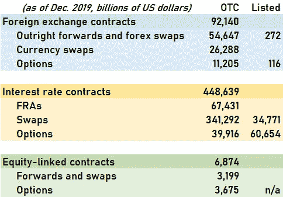

# 最重要的财务公式

> 原文：<https://medium.datadriveninvestor.com/the-most-important-financial-formula-of-all-8bdd63c64264?source=collection_archive---------13----------------------->

Photo by [JESHOOTS.COM](https://unsplash.com/@jeshoots?utm_source=unsplash&utm_medium=referral&utm_content=creditCopyText) on [Unsplash](https://unsplash.com/s/photos/mathematics?utm_source=unsplash&utm_medium=referral&utm_content=creditCopyText)

不是开玩笑，这再简单不过了:F = S.(1+r) - d

世界上最基本的方程式是一个古老的主题。作家和记者经常挑选一些被认为是现代科学最基本的组成部分的数学关系。任何人都不应该怀疑这项工作的有用性:它让我们其他人得以一瞥那些大多遥不可及的领域。我们中很少有人能够真正理解这些公式，即使对于那些受过足够教育能够破译这些符号的人来说，他们深刻的含义和影响也是不可能理解的。

令人惊讶的是，在我看过的各种名单中，经常会有一个局外人。从量子力学，到流体动力学，到引力或热力学，许多学科都有代表。这就来了，出乎意料的，通常在最后，会出现费希尔·布莱克和迈伦·斯克尔斯的期权定价“布莱克和斯科尔斯”公式。

作为一名 25 年的市场从业者，我确实认为 Black & Scholes 应该是这个名单的一部分，因为他们的思想已经在金融数学和风险管理领域取得了巨大的进步。特别是“或有债权”的定价和风险分析，即取决于随机变量值的金融债权。有人可能会说，这个公式确实构成了更深入理解自然的基础，因为风险得到了更好的定价，因此无论我们有什么用途(包括非金融风险)，都可以更好地理解和控制。

话虽如此，我今天的建议是:尽管布莱克&斯科尔斯公式理应获得荣耀，但它在另一个公式之后很久才出现，这个公式已经存在了几千年，并释放出了更大的好处。输入期货合约或我们将看到的“延期交割”合约的定价公式:

这篇文章将集中在基础上，即它是什么和如何得到它。在接下来的一篇文章中，我将探讨这一公式背后的巨大含义，特别是在一个叫做*担保贷款*的业务领域。

作为起点，让我们考虑有两个参与者的最基本的市场:一个农民有玉米要卖，一个食品加工公司有玉米要买。彼此利益的匹配正是市场的目的。买方和卖方将见面，讨论，谈判，并最终交易。交易采取交换的形式:玉米买方购买玉米并接受交付，玉米卖方交付并接受付款。一切都发生在此时此地的交易称为“现货”交易。这是最基本也是最安全的形式:双方都可以从身体上证实对方能够兑现承诺。

然而，一些改进是可能的，其中“延期交付”已经存在了相当一段时间。“延期交货”是指交易在此时此地完成，但交货发生在较晚的日期。

> 现货交易+延期交割=衍生产品(期货合约)

延期交货创造了一种新的产品，这种产品带有嵌入式合同，因为双方需要在稍后的日期再次交换货物(现金对玉米)。这种安排是一种“衍生合约”，被称为*期货*。维基百科告诉我们，[期货早在 17 世纪](https://en.wikipedia.org/wiki/Futures_contract)[郁金香狂热](https://en.wikipedia.org/wiki/Tulip_mania)期间就已经进行了交易，或者远至日本的多岛大米交易所。1864 年，第一批谷物期货在芝加哥期货交易所上市。的确，早在布莱克&斯科尔斯之前。

 [## 如何在不牺牲孩子或财务的情况下安全理智地离婚|数据驱动…

### 在美国，七月是以孩子为中心的离婚月。作为 cdfaⓡ的专业人士，我可以向你保证，从长远来看…

www.datadriveninvestor.com](https://www.datadriveninvestor.com/2020/07/28/how-to-divorce-safely-and-sanely-without-sacrificing-your-children-or-your-finances/) 

为什么延期交货是如此强大的创新？玉米和其他商品的问题在于收成往往不可预测。如果你是一个有着非季节性需求的玉米买家，那么努力确保全年的玉米库存是非常有意义的。相反，如果你在种植玉米，你可能希望通过推迟交付来平滑未来的收入。因此，推迟交货符合买卖双方的利益。今天定价有意义吗？没错，因为双方现在都少了一件需要担心的事情:“一鸟在手胜过双鸟在林”。合同一旦敲定，剩下唯一要做的就是到时候安排现金支付和玉米交割。

然而，消除一个风险(玉米价格)并不能取代所有其他风险。每一方都必须能够在以后兑现自己的承诺:玉米卖家必须确保自己有足够的库存，而买家必须能够支付货款。责任和风险并没有被消灭，只是被置换了。卖方可以:i/将玉米储存在可以接受交付的条件下，ii/承担未来收成将生产足够玉米的风险，iii/通过从现在到交付日期之间从其他人那里购买其他方式获得玉米(或以上的任何组合)。买方必须保持偿付能力。

一个月后交割的玉米价格应该和今天交割的玉米价格一样吗？没有理由为什么它应该是。卖方必须支付仓储和保险费用，而买方更长时间地享受现金(即利率)的好处。那么，我们如何着手计算这个价格呢？先给它起个名字:C(dd)，延期交割。C(0)将是今天交割(并支付)的玉米价格。r 是相关利率，C 是相关存储和保险成本(为方便起见，用 C(0)的百分比表示)。

为了确定公允价格 C(dd)应该是多少，我们来介绍一个套利的情况。这种推理是资本市场的基础，因为它能够对几乎所有的线性衍生产品进行定价。非线性产品(也称为“凸型”)用 Black-Scholes 或类似概念的变体来定价。除了买方和卖方之外，让我们介绍一个投机者，他的目标是获利。投机者可以获得资本，但对玉米不感兴趣，即有能力购买和储存，但最终会平仓所有实物头寸。

我们的投机者感觉到某个地方有利润，于是进行了以下交易:

*   他以 C(0)从生产商那里购买现货玉米
*   他在相关期限内以 r 的利率借入必要的金额 C(0)
*   他以 C(dd)价向消费者出售延期交货的玉米
*   他签订了有关时期的仓储和保险合同，费用为 c.C(0)(在时期结束时支付)

今天的现金流动情况如下:

*现金流量(今天)= -C(0) + C(0) = 0*

-C(0)代表玉米现货的支付；+C(0)是贷方的现金。交付时，现金流如下:

*现金流量(交割)= -C(0)。(1+r) - c.C(0) + C(dd)*

-C(0)。(1+r)代表银行的偿付，包括利息；-c.C(0)代表存储和保险成本(也称为*携带成本*)；C(dd)代表当时销售的收益。

一旦头寸到位，投机者就不再有任何风险:玉米价格可以变化，他已经锁定了一个头寸，通过这个头寸，他肯定会以 1:1 的比例接收和交付玉米。在一个完美的世界中，没有风险就意味着没有回报，投机者不应该从他的头寸中获得任何回报，因此有以下等式:*现金流(交割)= 0。*

它如下: *C(dd) = C(0)。(1+r+c)*

C(dd)是零利润预期下可以签订延期交货合同的理论价格。根据定义，它是期货合约的价格。当然，投机者不会以这个价格交易，但会试图讨价还价出一个更高的价格，一个能回报他的努力(和所用资本)的价格。

我们还没有完全掌握上面介绍的公式，所以让我们开始吧。考虑一只股票以价格 S 交易，在未来某个日期支付股息 d。市场包括延期买方、现货卖方和套利者。

套利者进入如上所述的位置:

*   他在 50 美元时买入股票现货
*   他在相关期限内以 r 的利率借入必要的金额 S
*   他以 F(期货价格)出售延期交货的股票
*   他持有股票一段时间，因此得到股利 d

*现金流量(今天)= -S + S = 0*

*现金流(交割)= -S.(1+r) + F + d*

一个无套利的情况导致如下关系:*现金流(交割)= 0* ，因此:F = S.(1+r) - d .这就是我们要找的。

这个公式和布莱克&斯科尔斯公式的根本区别在于它是*线性*，没有随机性。像上面这样的套利确实可以完全按照描述来执行。这里或那里有一些小的因素需要调整，但是全世界的交易者例行执行这些交易，价值数千亿美元。

以下是国际清算银行的未平仓头寸数据:

source: Bank for International Settlement, BIS.org

就所有意图和目的而言，“完全远期”、“外汇掉期”、“fra”、“远期和掉期”是定价与上述类似的产品。交易员称这些产品为“delta One ”,因为它们没有凸性(这是期权定价背后的实际复杂性),因此没有 Delta 风险(换句话说，Delta 总是 100%)。期权是一个活跃而庞大的隔间，但与延期交割合约的绝对数量相比，它们就相形见绌了。

这是为什么呢？期货合约可以实现一对一的现金/衍生品转换。如果我签订了一份合同，我得到的经济风险就和我购买的基础产品(上面例子中的玉米)一样。不同之处在于，当购买玉米时，我必须付款，而对于期货，我签订了一份合约，直到以后某个日期才付款(实际上，有一种东西叫做“初始保证金”，但我们可以忽略它，而不会对论点产生重大扭曲)。由此产生的头寸是杠杆化的，即来自投机者的债务融资。期货本质上是一种将杠杆引入系统的工具，特别是杠杆投机。同样的灵活性适用于所有参与者:当存在价格差异可供利用时，或者当现金稀缺(或充足)时，每个参与者都可以从合约转移到实物，然后再转移回来。这就是套利交易的意义所在。

## 访问专家视图— [订阅 DDI 英特尔](https://datadriveninvestor.com/ddi-intel)