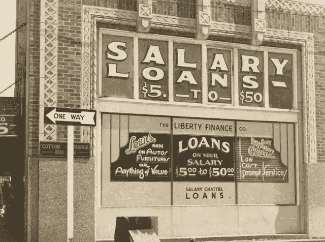
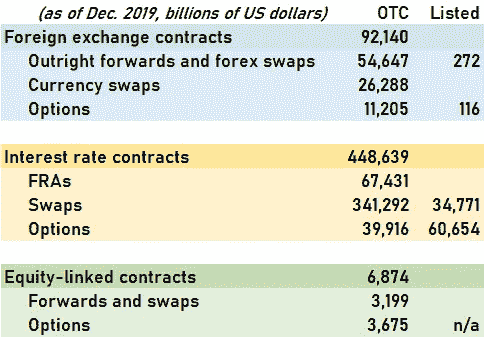

# 最重要的财务公式——第二部分

> 原文：<https://medium.datadriveninvestor.com/the-most-important-financial-formula-of-all-part-ii-187d8274b7af?source=collection_archive---------7----------------------->

Photo by [The New York Public Library](https://unsplash.com/@nypl?utm_source=unsplash&utm_medium=referral&utm_content=creditCopyText) on [Unsplash](https://unsplash.com/s/photos/loan?utm_source=unsplash&utm_medium=referral&utm_content=creditCopyText)

解耦市场与信用风险

在之前的[文章](https://medium.com/datadriveninvestor/the-most-important-financial-formula-of-all-8bdd63c64264)中，我解释了什么是“延期交货”,以及如何从现货价格中推导出它的价格。我们需要的小数学已经过去了，这一部分将着重于当远期合约变得容易获得时会发生什么。

注意:延期交货、远期合同和期货是唯一的。具体情况有所不同——例如，期货是交易所上市的产品，但它们都是指一种安排，根据这种安排，今天的价格是固定的，而交割，无论形式如何，都推迟到以后的日期。

所以让我们回到我们的市场，有一个玉米生产者，一个玉米消费者，和一个投机者/套利者，他们有资本，但对实物库存没有特别的兴趣。假设生产者现在想出售玉米，因为他需要现金来投资他的活动，而消费者不准备购买，因为他还有上次购买留下的存货。双方需求不可调和，需要第三方介入。

投机者感觉到服务于双方并获利的机会存在。因此，他从生产商那里购买现货玉米，然后卖给消费者。注意，他需要借钱来锁定双方。现货玉米的价格是当前的市场价格，而玉米远期的理论价格很容易用我们建立的公式计算出来(可以总结为:远期价格=现货价格+持有成本)。有人会反对和新来的人打交道吗？当然不是生产者，如果投机者能够证明他有能力支付他的购买。消费者可能出于两个原因反对:1/他现在与投机者而不是生产者有合同；2/他应该得到高质量产品的交付，并且可以合理地认为生产者能够更好地将玉米储存在不会变质的条件下。然而，如果投机者能够证明所有适当的处置都已经到位，那么消费者没有根本的理由不接受该交易。

远期交割价格应该是多少？我们知道理论价格有一个下限。投机者不会在低于价格时卖出，因为他无法收回成本。事实上，一个新的风险已经产生，因为资金是借来的。投机者必须支付利息，总的来说，他们需要为所提供的服务获得利润。因此，远期玉米的实际价格很可能会高于理论价格(投机者只能达到盈亏平衡)。高多少？嗯，这是一个谈判的问题。如果几个投机者竞相提供同样的服务，情况就更是如此。

 [## 金融顾问今天应该拥抱虚拟实践模式的 5 个理由|数据驱动…

### 随着对办公空间长期租赁的需求在新冠肺炎疫情时代彻底崩溃，办公空间的需求也在下降

www.datadriveninvestor.com](https://www.datadriveninvestor.com/2020/05/21/5-reasons-why-financial-advisors-should-embrace-the-virtual-practice-model-today/) 

投机者已经进入了一个套利交易，购买和出售实质上相同的产品，只是结算方式不同。在金融术语中，这种类型的头寸被称为“现购自运”。只要有办法妥善储存玉米(事实上，套利者甚至可以从生产商那里租赁仓库)，自运现金头寸从根本上来说就是一种融资头寸。借的钱以库存的玉米作担保。如果投机者资不抵债，这些存货将被出售，贷方将得到偿还。如果远期买方在到期时无法履行自己的职责，同样的事情也会发生:套利者将出售玉米并偿还贷款人。

> 延期交货是一个非常好的工具，因为它可以在没有市场风险的情况下实现担保融资。获得资金本身并不是什么新鲜事。新的是，市场风险对贷方来说是中性的。

抵押贷款机构有一个组合风险敞口:借款人的信誉，以及房地产市场，因为如果价格大幅下跌，它可能无法从担保贷款的房地产中收回足够的资金。此外，这些风险敞口是相互关联的(“顺周期”):宏观经济低迷可能导致业主被解雇，房地产价格大幅下跌(这正是 2008 年危机中发生的情况)。在我们简化的玉米市场中，市场和信贷风险之间完全脱钩。贷款由玉米库存担保，不受市场行为的影响。玉米价格的经济风险实际上落在了远期买家身上:因为远期价格是一劳永逸地确定的，所以买家放弃了从交割时的低价中获益的选择。相反，如果价格上涨，预先商定的价格将证明非常有利。这顺便带来了以下非直觉的评论:经济风险的产生不是因为价格不确定，而是因为价格在过去已经固定，无论价格后来如何演变，这种参与都不能取消。我们每个人都为自己的房子承担风险，不是因为房地产价格不同，而是因为我们为它支付了一定的价格，并为此借了一定的钱。最终，只有当房价跌破这个下限时，我们才会陷入困境。

听起来很简单，远期交易的出现是一个巨大的进步。为了认识到这一点，让我们将上述讨论转化为现代资本市场。投资者正在积极交易股票，套利者可以为远期合约定价。一个投资者试图投资一只特定的股票，他有两个选择:1/购买现货交割的股票，2/购买远期合约。在第一种情况下，他将不得不支付购买，而远期合同包含一个隐含的贷款，直到到期日。投资者将支付贷款的相关利率，但不必申请贷款。然而，在所有情况下，投资者都承担了对标的股票的预期经济风险。

现货对远期的选择随时存在:当需要时，持有者可以找到套利者卖出他的现货头寸，再买入远期合约。转移头寸套利将释放现金，而不影响股票的经济风险。交易双方交换一项资产，同时进行远期交易，这种交易确实非常频繁，被称为“实物交换”，这是一种字面上的描述。

在某些领域，交易已经成熟到可以匿名了。如今，基金经理可以轻松找到单一工具、指数篮子甚至整个投资组合的远期价格。例如，标准普尔 500 期货只不过是代表整个标准普尔 500 指数的一篮子证券的延期交割合约。“总回报掉期”(TRS)是定制投资组合的非上市等价物。这是大宗经纪商的一个基本组成部分:他们经常与客户进行 TRS 交易，大宗经纪商提供资金，而客户保持基础头寸的经济敞口。

在股票上可能发生的事情，在其它任何资产类别上自然都很容易。无论是债券、外汇、大宗商品还是黄金，延期交割都被广泛交易，通常以互换的形式进行。有了这些知识，我们可以回到国际清算银行关于 OTC 产品的统计数据:

尽管 Black & Scholes 拥有强大的实力，但它不是延期交割的对手。

[注意:感兴趣的读者会在我的书《现代金融导论:15 条原则》中找到更多关于这个主题和许多其他有趣话题的内容]

## 获得专家视图— [订阅 DDI 英特尔](https://datadriveninvestor.com/ddi-intel)