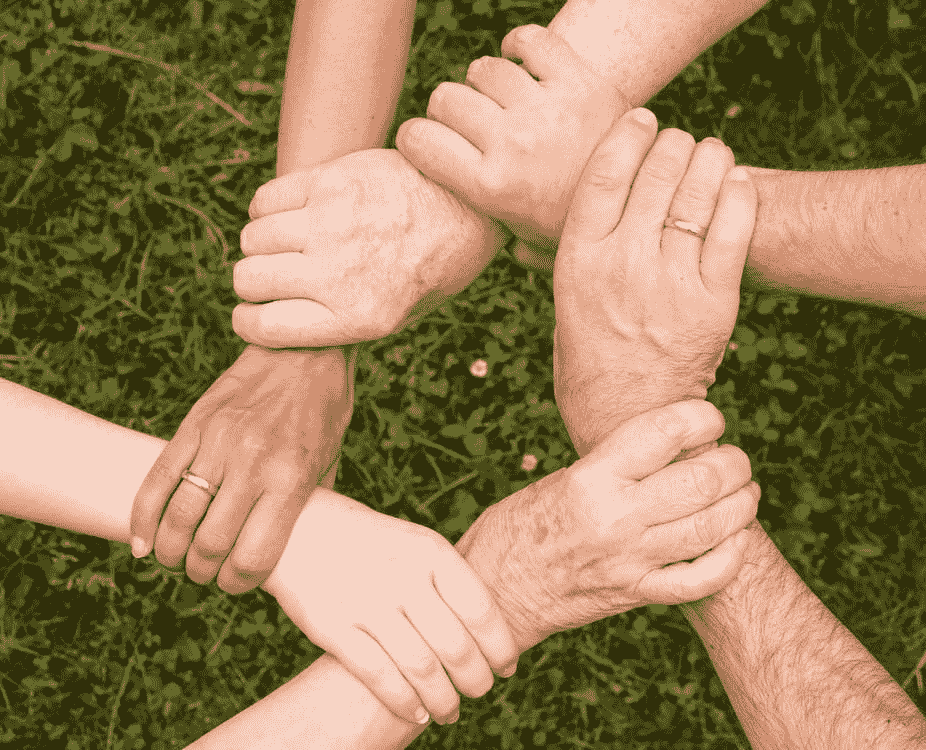

# 最强大的操纵者

> 原文：<https://medium.datadriveninvestor.com/the-most-powerful-manipulator-8598439852e4?source=collection_archive---------19----------------------->

对美国信任的攻击。

Trust is the foundation of society

美国商业的基础是建立在信任之上的。我收回那句话。我们整个社会的基础是建立在信任的基础上的。信任是一种善变的货币。一句古老的谚语将信任描述为一点一滴收集起来，一桶一桶丢掉的东西。你在社会中的地位越高，你得到的信任就越多。你得到的报酬越高，你就越受信任。你可以在 99%的时间里做对每件事，但是当你做错的时候，你就会失去对同事的信任。难怪美国国内的焦虑上升到历史新高。在任何给定的时刻，我们被迫不断评估我们是否信任我们谈话中的人、关系、商业、政府，甚至我们自己。“相信你自己”是前总统布什在就职前给当选总统[巴拉克奥巴马](https://medium.com/u/9e422a605dc5?source=post_page-----8598439852e4--------------------------------)的建议。我们每天必须做出成千上万个基于信任的决定，不断警惕我们信任的人会让人筋疲力尽。

信任是一种植根于自信的有趣的货币。当你开着增压宝马 M8 上路时，你心里清楚，如果有人做出错误的决定，可能会毁了你的车。更糟糕的是，如果有人做了一个非常糟糕的决定，它可能会结束你的生活。不知何故，我们每次开车都要冒这个险。我们必须相信坐在我们旁边开着 91 年款丰田卡罗拉的人不会撞上我们。这是一种继承信任，存在于整个社会。我曾经听到一位美国领导人讨论是什么让美国变得伟大。从根本上说，当你在美国做生意时，你可以相信供应商会做正确的事情。交易之所以发生，是因为我们可以相信对方会说到做到。如果没有，我们会起诉他们。

作为佩恩集团(Penn Group)的总裁兼首席执行官，我对围绕信任、恐惧和焦虑的心理学非常着迷。作为一名网络安全专家，我的部分工作是让我工作的组织相信我和我的团队，我们已经控制了工作。网络安全不是一门简单明了的科学。即使有最好的意图和防御，组织也可能在任何时候被攻破。有时，即使最大的组织已经在安全上投入了数亿美元，也可能被一个人的攻击[。随着此类事件的发生，向组织证明价值的压力呈指数级增长。高管们开始质疑他们为什么要在安全上花钱，如果这看起来毫无意义的话。](https://www.capitalone.com/facts2019/)

 [## 商务沟通不畅是网络安全问题的 5 个原因|数据驱动型投资者

### 沟通是商业的命脉。没有协作就不会有想法，没有合作就不会有交易

www.datadriveninvestor.com](https://www.datadriveninvestor.com/2020/09/01/5-reasons-why-poor-business-communication-is-a-cybersecurity-issue/) 

## 信任受到攻击

撇开网络安全不谈，在选举年，我们正处于全球疫情的中心。对危机的回应已经被政治化到了极致。(冠状病毒和总统)客观地说，已经有几十万人死于这种病毒。从主观上来说，高达 96%的冠状病毒死亡案例都是可疑的死亡根源。由于我们收到的信息准确性的不确定性，对我们领导的不信任，以及不断传播的错误信息，试图判断什么是对的，什么是错的是压倒性的。然后，我们陷入了与我们需要消费的重要信息隔离的漩涡，因为它变得太费钱了，以至于我们无法弄清楚所有的信息。然后，我们考虑当今政治格局的两极分化。民粹主义让人们走向极端，这是由对政府、极端分子和反对政党的愤怒所推动的。

 [## 误传的代价|冠状病毒和总统

### 历史不会善待那些乱了轻重缓急的领导人。

medium.com](https://medium.com/swlh/the-price-of-misinformation-coronavirus-and-the-president-b105244f1f76) 

不确定性由缺乏信任而加剧，导致恐惧。恐惧是我们经历的最强大的情绪。恐惧是我们身体发出危险警告的自然机制。出于生存的本能需要，我们相信我们根深蒂固的恐惧是合理的。恐惧存在于确定性结束的地方。在写这篇文章的时候，没有人真正知道冠状病毒会发生什么。没人知道会不会有第二波。没有人知道经济是否会衰退。根据人口统计，一些人群已经被隔离了 6 个月。恐惧无处不在，令人麻痹。有些人利用恐惧为自己谋利。在某些情况下，这种恐惧被用来控制人们，扼杀观点，或将人们推向极端主义的边缘，这正是我们的政治家们通常犯下的罪行。恐惧被用作终极操纵者。毕竟，如果有人真的害怕，他们会做任何事情。恐惧让人做出疯狂的事情。

展示自信是领导者的工作。领导人必须让担惊受怕的民众放心，危机不会陷入混乱。领导人必须有能力恢复人们对这些机构的信任。领导者必须能够用他们的责任建立信任。领导者团结而不是煽动。

一个真正的美国领导人是可以信任的。

 [## 信任的丧失

### 在一个没有信任的世界里，我们能有安全感吗？

medium.com](https://medium.com/datadriveninvestor/the-erosion-of-trust-d80a69615ee6) 

*奥斯哈曼是* [*宾州集团*](https://thepenn.group/about/) *的总裁& CEO。他目前拥有梦寐以求的 CISSP 认证，以及分别来自 ISC2 和 CompTIA 的 CCSP、CAP 和 Security+认证。他住在俄亥俄州的哥伦布市。*

**访问专家视图—** [**订阅 DDI 英特尔**](https://datadriveninvestor.com/ddi-intel)