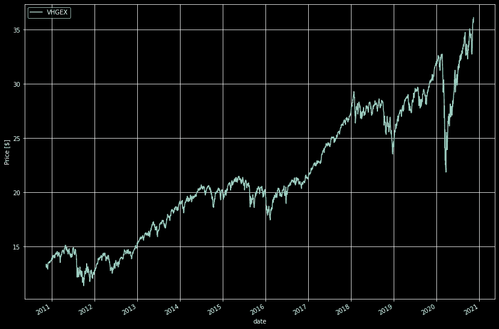

# 如何用指数基金分散你的投资组合

> 原文：<https://medium.datadriveninvestor.com/the-most-profitable-investment-in-2020-3a97be030d29?source=collection_archive---------13----------------------->

## 为什么全球指数基金是目前世界状况下最有效的投资方式。

PHOTOGRAPH: TIM ROBBERTS/GETTY IMAGES

随着 2020 年 5 月股市“崩盘”，我想“嘿，我应该能从这种情况中受益”。所以我决定学习一点投资和股票市场的知识，以充分挖掘它的潜力。

于是研究开始了。

很多信息都试图告诉你，你自己可以战胜市场。你可以学习如何评估一家公司。你可以建立一个日内交易策略来保证你的收益。如果你花时间学习这一系列新的能力，你将会获得极大的利润。

他们告诉你，你可以成为下一个沃伦·巴菲特，而且很快就会被联系到。

有趣的是，实际上看到**这个建议来自那些从你的所有活动中赚取佣金的经纪人或平台背后的公司**。所以让你交易对他们来说很方便(尤其是当你赔钱的时候)。他们会试图说服你在他们的交易平台上实施所有这些策略和技术，这是有道理的。因为**他们只是想要你的钱。**

你可能会说“但我有一些金融背景，我可以战胜市场”。嗯……也许吧。我表示怀疑。但是你可以做任何你想做的事。相反，我的建议是**不要浪费时间**评估公司、分析市场和进行复杂的黑客活动，你**应该明智地进行投资，利用业余时间赚到实际的钱**并进行投资。

Photo by [rupixen.com](https://unsplash.com/@rupixen?utm_source=medium&utm_medium=referral) on [Unsplash](https://unsplash.com?utm_source=medium&utm_medium=referral)

让我解释一下我的意思。

一个价值投资者可以每周花 40 个小时学习价值投资、交易和策略。然后，他选择了一些公司，决定投资 5000€，他相信他将在一年内从投资中获得大约 5%的收益(由于分散投资很少，这显然是非常冒险的)。这将为你赢得 5000€ x 5% = 250€。

如果你把这 40 个小时用来做兼职，每小时能给你 10€呢？那就是 40 x 10€ = 400€。这比以前的租金还要高！你可以每周都做！然后你可以用零时间的方式投资这 400€，你不用做任何决定，还能获得额外的利润。

底线是**自己选择投资什么根本不赚钱。**

但是我能信任谁来替我做这件事呢？

一句话:**全球指数基金**。但是，什么是指数基金，我为什么要投资它们，我该怎么做？

## 什么是全球指数基金？

全球指数基金基本上是你能买到的最多样化的资产(全球)，佣金很低(指数)，你的钱由第三方管理(基金)。

*   指数意味着它试图跟随一个指数，比如标准普尔 500 指数，纳斯达克指数或者西班牙 IBEX 指数。这意味着要投资一份经过高度筛选的公司名单，因为没有人会手动选择，所以佣金非常低。
*   **全球**意味着它跟踪全世界的指数。这意味着一种保证长期利润的极端多样化。只要相信世界作为一个整体有能力随着时间的推移而改善。

## 我为什么要投资全球指数基金？

我几乎不可能知道哪些公司未来会盈利，即使我知道，也需要大量的时间。所以与其把时间浪费在学习公司估值上，我会把时间花在自己擅长的事情上，赚钱，让别人替我投资。这种方法是基于长期投资的力量，以尽快授权退休。

我选择了指数基金，但是为什么呢？

1.  指数基金通常胜过共同基金(95%的情况下)。这意味着人类又一次被机器打败了。
2.  即使当共同基金击败指数基金时，它们的佣金几乎是指数基金的 10 倍多([来源](https://www.nerdwallet.com/blog/investing/index-funds-vs-mutual-funds-the-differences-that-matter-most-to-investors/))，这意味着让人们为你投资的利润更低，让机器人来做更好。
3.  消除人为错误将保护你免于跌倒。
4.  如果你还不信服，就连全球最富有的投资家**沃伦巴菲特**都推荐指数基金 ( [来源](https://www.businessinsider.com/personal-finance/warren-buffett-recommends-index-funds-for-most-investors))。([西班牙语](https://www.gestionpasiva.com/warren-buffett-y-los-fondos-indexados/))

Vanguard Global Stock Index Fund Price (by author)

## 我确信。我该怎么做？

第一步是在提供你正在寻找的资金的经纪人那里开一个账户。评级最高的全球指数基金是 Vanguard，在西班牙只有两家券商可以接触到它们:[**Indexa Capital**](https://indexacapital.com/es/esp/t/QQFDgz)和 [**MyInvestor**](https://myinvestor.page.link/uF5K79NYnjS4g4cs5) 。

> 那么我应该报哪个呢？

2020 年最好的指数基金可能是:

*   **Indexa Capital** 只提供指数化投资组合，其中包含多个指数基金，根据你的风险承受能力**将风险最小化**。如果你想要出奇低的价格、大量的用户和投资组合调整等功能，这是最好的选择。他们甚至为你的孩子提供账户！你可以通过这个[链接](https://indexacapital.com/es/esp/t/QQFDgz)注册并获得**第一年免佣金**。开户的最低金额是 **3000€** 。
*   **MyInvestor** 也提供指数化投资组合，但你也可以随心所欲地购买特定的指数基金。如果你没有 3000€这将是一条路要走。我推荐全球指数投资组合(carteras)。继续操作并[开户](https://myinvestor.page.link/uF5K79NYnjS4g4cs5)。你不投资的每一天都在赔钱！

 [## 如何用 Python 实现布林线

### 利用熊猫和 Plotly 来实施一个美丽的布林线策略。

danielcarlander.medium.com](https://danielcarlander.medium.com/how-to-implement-bollinger-bands-in-python-1106b90da8d1) 

当然，开户只是一个开始。你应该计划每月定期向你的投资组合转移资金，以增加利润和降低风险。

## 进一步阅读

*   格雷戈里奥·埃尔南德斯·希门尼斯。我多次被推荐这本书，事实上这本书很有用。对金融市场的精彩介绍和广阔视野。你可以用一个 [Kindle 无限免费试用](https://www.amazon.es/kindle-dbs/hz/signup?tag=danicrg-21)来读这本书。
*   这本书改变了游戏规则，对低市值投资和指数基金进行了中肯的分析。我向所有人强烈推荐这本书，因为它是一本两小时的读物，并且免费赠送 Kindle 无限免费试用版。
*   Francisco García Paramés 著，介绍西班牙规模最大、业绩最佳的基金 Bestinver。深入了解其内部工作原理，以了解另一面的情况。