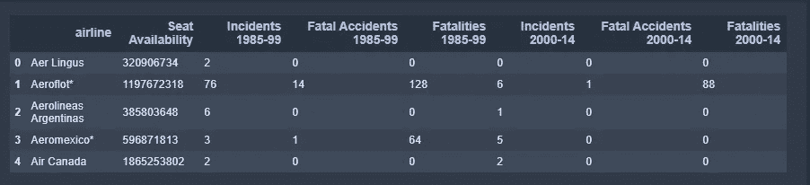
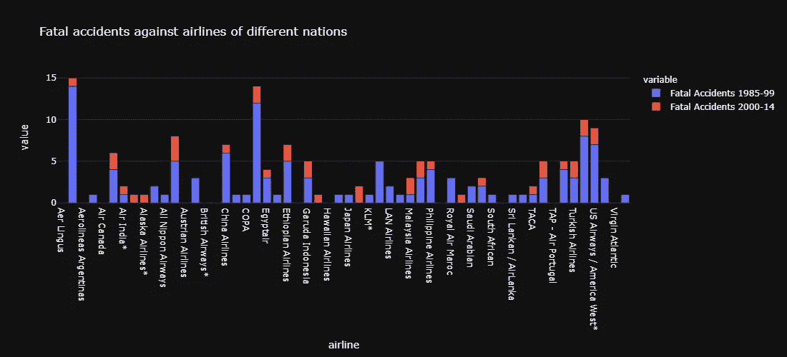
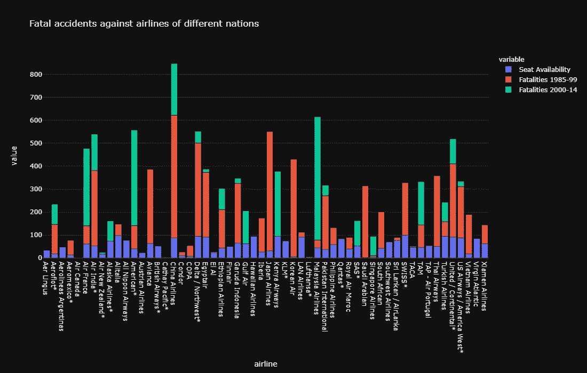
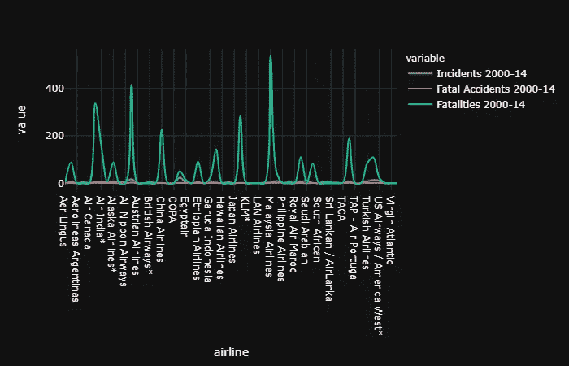
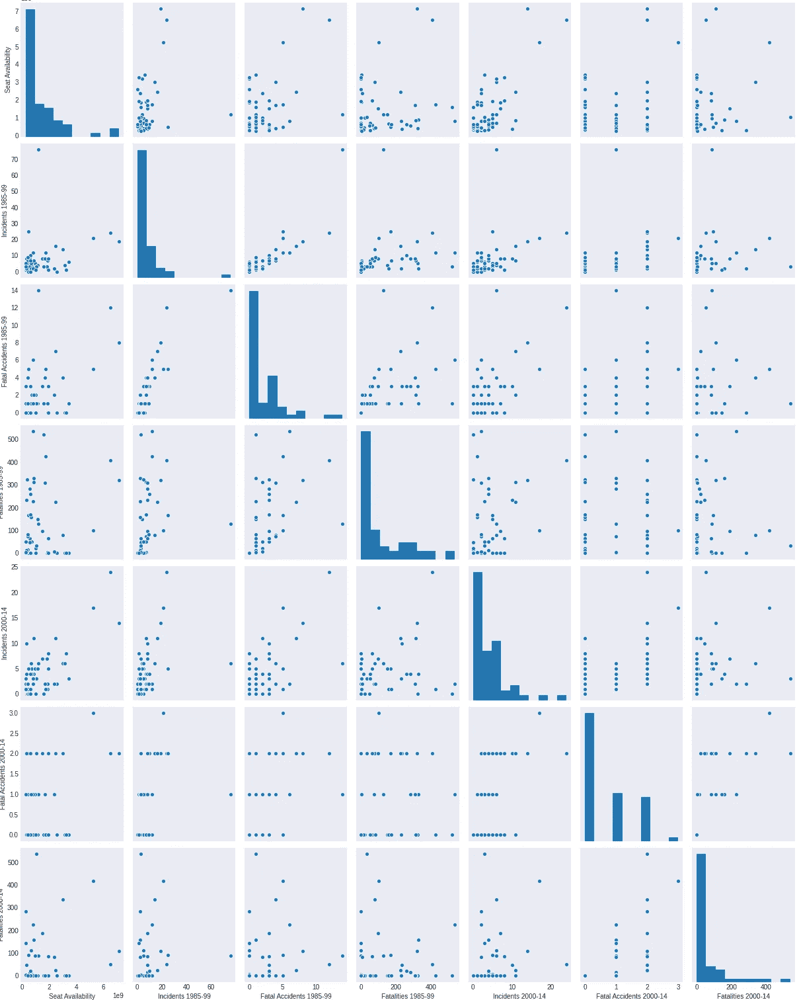

# 2021 年最无挑战的 EDA:数据科学

> 原文：<https://medium.datadriveninvestor.com/the-most-unchallenging-eda-of-2021-data-science-fe04c3713494?source=collection_archive---------23----------------------->

这是我做过的最没有挑战性的数据分析，在最简单的数据集上:*航空公司但是你会喜欢的！*

Photo by [Joel & Jasmin Førestbird](https://unsplash.com/@theforestbirds?utm_source=unsplash&utm_medium=referral&utm_content=creditCopyText) on [Unsplash](https://unsplash.com/s/photos/airplane?utm_source=unsplash&utm_medium=referral&utm_content=creditCopyText)

对于任何数据科学项目来说，这都是一段很长的休息时间。我做的上一个项目并不成功，耗费了我 90 多个小时在我的酷睿 i3 电脑上开发新的框架。我知道这很头疼。我不能带着所有的悲伤开始我的新年。用一些有趣的、有启发性的、简单的(最重要的)东西开始 2021 年是我渴望的。

我打开电脑，开始搜索 Kaggle 上的一组数据。我提醒自己，这是一个简单的数据集..就一个简单的..在这里，我向你们展示了最有成效的数据分析…这些分析实际上让我意识到我的可视化基础是多么薄弱！

请注意，这真的令人印象深刻！让我们开始吧。

*本文假设读者熟悉 python 语言，包括 NumPy 和 pandas*

# 步骤 1:导入我们的数据集

我们使用的是*航空公司*的数据集，这是它的样子，

# 步骤 2:导入模块

# 第三步:让我们想象一下！

让我们绘制一个不同国家航空公司致命事故的柱状图。

以 x 轴为`airline`名，y 轴为`Fatal accidents of 1985-99`和`2000-14`

这是输出条形图。

使用模板`plotly-dark`获得黑色背景。在这里，可以清楚地看到，与 1985 年至 1999 年期间发生的事故相比，2000 年至 2014 年期间发生的事故有所减少

同样的，

**现在让我们绘制一张 2000 年至 2014 年间发生的所有事故和死亡人数的线图**

这是如上图所示的美丽图表。为线条形状引入参数`spline`使它看起来更平滑，尝试不同的参数，没有它也一样。

最后，让我们用一个`seaborn` `pairplot`来总结一切

是的，就这么简单，您只需传递数据框，并根据您的方便在`inches`中提供高度，这里的`aspect`只是并排显示的每个图表的宽度

如果你像我一样，被最后一个项目弄得筋疲力尽，那么你可以从简单容易的事情开始，这会再次增强你的信心！别忘了一次只走一步！

祝你好运！

*链接到* [*数据集*](https://github.com/Irene-123/Data-sets/blob/main/airline.csv)

*链接到* [*笔记本*](https://www.kaggle.com/kirtipurohit/airline-safety)