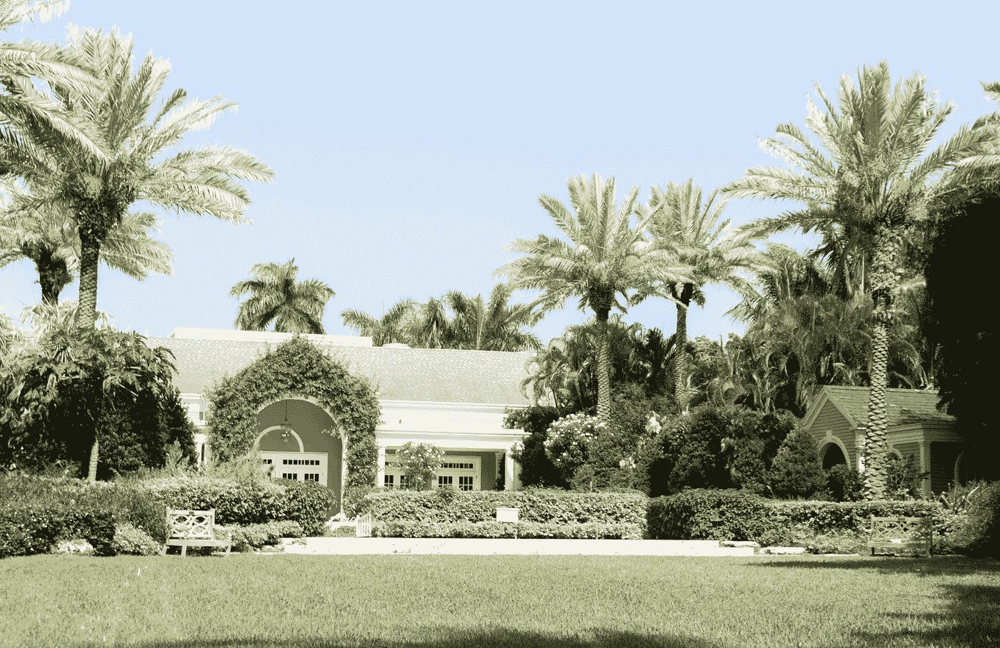

# 最不可能成功的财富管理顾问

> 原文：<https://medium.datadriveninvestor.com/the-most-unlikely-successful-wealth-management-advisor-e9af91b9dc29?source=collection_archive---------5----------------------->

他不是最精明的市场战术家，也不是最努力的员工，也不是最聪明的人，也不是最富有的外表、行为或穿着。他不是这样的。他不需要这样。哈利很— **讨喜。**

Photo by Tessa Wilson on Unsplash

我见过的最成功的财富管理人之一也是最不落俗套的。我很确定不是故意的。我和那个家伙一起参加了培训班，他在街区尽头的电影院看日场的时间比上课的时间还多。

在我们通过了所有的资格考试之后，他们让我们对投资大众放松；哈利显示了他的优越感。他不是最精明的市场战术家，也不是最努力的员工，也不是最聪明的人，也不是最富有的外表、行为或穿着。哈利不是这样的。他不需要这样。他是可爱的。

这就是他——可爱。

而且非常成功！

如果你解剖哈利，一部分一部分地观察他，你会认为每一部分都不吸引人。但综合起来，整体是——可爱的。他接触过的每个人都有这种感觉。

我认识的人中没有一个人知道这是为什么。

哈里和我过去常常在财富管理预约中合作，那时我们会审查一个特别富有的投资者。

我必须说，当我和哈里在一起时，每个和约会有关的人似乎都对哈里的怪癖感到惊讶。这最终是令人满意的，因为哈利感受到的每一种情绪都立即在他的脸上表现出来。每个人都通过看哈里的脸知道他们的立场。

在 20 世纪 90 年代末，我们这些相信美国工业的人大量投资于股票市场，我们的建议反映了这一信念。

当时，具有高额前期佣金的共同基金是谨慎的投资。事实证明，我们的建议在很大程度上是正确的，共同基金长期表现良好。即使从最初投资中扣除了一大笔佣金，这项投资也是合理的。

我认为，通过从客户手中撤资投机性股票，并将收益再投资于 Putnam、Fidelity 和 Keystone 等大型共同基金家族，我们节省了许多退休储蓄。

这些基金最近已经失宠，取而代之的是 ETF 和其他指数基金，它们只收取最低管理费，不收取前端佣金。对投资者来说，这是一个更好的机会。当然，所有这些投资的成功都取决于这些投资持有的公司的成功。

就像哈利会说的，“**如果你不相信美国工业，你还不如投资俄罗斯战争债券！**”

当哈里和我看到我们的一个好客户时；通常是在晚饭后，大家都很放松。我们在销售培训中被告知，在这些约会中绝不喝酒——你知道，头脑清醒，头脑冷静，诸如此类。

哈里和我共有一个客户，他的家族在纽约地区有一个大型肉类包装厂。乔丹和他的妻子伊迪丝卖掉了他们的企业。他们最近退休了，在佛罗里达买了一栋漂亮的房子。

哈里接到一对刚退休的夫妇打来的电话，询问他和我是否可以飞去重新安排他们的投资组合，以反映他们生活中的新情况。

当然，答案是一个热情的是！一个在隆冬时节去佛罗里达赚钱的借口——没错！

接下来的一周，我和哈里飞往奥兰多。我们租了我们能找到的最干净的面向老鼠的住处。

在我们 7 点的约会前几乎没有时间换衣服和吃饭。

哈利穿着他的约会服装:细条纹蒂芙尼蓝色双排扣夹克和一条卡其布裤子，粉色衬衫，领带上有一只鹦鹉*哈利对佛罗里达州的感激之情*，半美元大小的假钻石袖扣，四分之一大小的凸起领带夹；有些人认为它不吸引人，过于浮华，但大多数人认为它很可爱。

想法可能是:有趣的家伙，不在乎一个 300 磅的财富管理顾问应该穿着有纽扣的衣服和翼尖。好吧，让我们给他一个机会；如果他有信心穿得这么滑稽，可能真的知道他的东西。

我朴素的服装更加传统和传统。

那天晚上，大约 7 点左右，我们开着租来的车去了客户宏伟的新家。这些约会通常持续到 9 点左右；每个人都有一个很早的夜晚。反正计划是这样的。

当我们到达时，乔丹像欢迎毕业后定居在阿拉斯加巴罗角的失散多年的兄弟会成员一样欢迎哈利；他害怕再也见不到的那个人。

我只是——一个附属品。

热情地问候了乔丹之后，伊迪丝和我走过去坐在书房的沙发上。这似乎是这对夫妇退休后做生意的地方。

哈利在我旁边坐下。

出于只有他自己知道的原因，哈利跳了起来，紧紧地拥抱了乔丹和伊迪丝。因为我没有被包括在内，所以我可以——观察。

乔丹头上稀疏的染黑头发变得蓬乱；失去了它的秃斑覆盖卷伞的样子。此外，由于哈利的超级身材，乔丹的老豆被强有力地和痛苦地卡在哈利的超大领结图钉鼻子第一。

伊迪丝看上去像是被班上的恶霸骗去进行一对一的转瓶子决斗的女孩。明显不舒服的挤压；突然冒出来的是她的舌头和眼睛吗？

哈利捕捉到了夜晚，就像他几乎总是做的那样。乔丹和伊迪丝向他提出了所有的问题和谈话。

我被忽视了。

所有的投资建议分发完毕后，我们放松了，不知道公司的规定，我们的顾问在提供投资建议时不能喝酒，乔登请我和哈里喝了一杯。

哈里解释说，投资建议已经给出，他感激地接受了。

我弃权了。

一杯接着一杯。哈利、乔丹和伊迪丝继续为彼此的成功干杯。

伊迪丝变得有点草率，无意中透露这对夫妇在她名下的单独投资组合中还有 100 多万美元。他们没有向我们——他们的财富管理人——披露这笔资金，希望对冲可能的咨询灾难——我猜。

哈利，现在更加嗡嗡作响，命令伊迪丝拿出股票的流氓名单。她在某个地方消失了大约 5 分钟。当她回来的时候，她有一张笔记本，上面用她小小的笔迹写着难以置信的长股票档案:如此精致，如此整洁，如此多的股票——如此丰富！

哈利从伊迪丝手里抢走了名单。然后他站起来，用他的大爪子挥舞着一长串股票，价值——哦，这么多钱！

哈利看都没看股票一眼，手臂戏剧性地一挥，宣布这个投资组合是纯粹的，**狗屎**！

然后，他开始撕掉笔记本纸，上面有伊迪丝疯狂投资的数百万美元股票的全部清单。

伊迪丝抬头用崇拜的目光看着哈利，恳求道:“我们该怎么办，哈利？”

“我明天通知你！”哈利自信地说，仍然没有看一眼她单子上的一只股票。

他把她精心制作的股票清单的碎片塞进他的蒂芙尼蓝色双排扣运动夹克的口袋里。我迅速把这对夫妇剩下的财务文件装进我的公文包，准备跟在喝醉了的哈里、喝醉了的乔丹和喝醉了的苦恼的伊迪丝的摇摆队伍后面。

当我听到屋前的吵闹声时，我停下来抚摸了一下猫。

我从前门走出来，看到哈利穿着他的蒂芙尼蓝色西装外套、粉色衬衫、松开的鹦鹉领带和袖扣；所有这些都在九重葛和蔓生的长春花中翻滚，构成了这座迷你宅邸精致的前门。我看到乔丹拉着哈利的胳膊，但收效甚微，他冒着患退休疝气的危险试图让哈利站直。伊迪丝瘦削、布满青筋的小胳膊使劲地颤抖着，向上拉着那个庞大的哈利。

*我无法摆脱一只搁浅鲸鱼的形象。*

乔丹担心地喊道:“救命，布赖恩，哈利可能受伤了！”

乔丹、伊迪丝和我终于把哈里塞进了我们租来的汽车，准备开车回旅馆。他似乎没有受伤。

哈利主动提出；我来开车。

第二天我们回到了费城。

哈利桌上的电话响了，是伊迪丝。她想知道他感觉如何。

她还提到，她想让哈利把塞在哈利蒂芙尼蓝色夹克口袋里的几百万疯狂资金投资组合再投资，那件衣服现在在洗衣店。

哈利告诉她，他正在分析她的情况；他明天会回复她的。

我为什么喜欢那家伙？