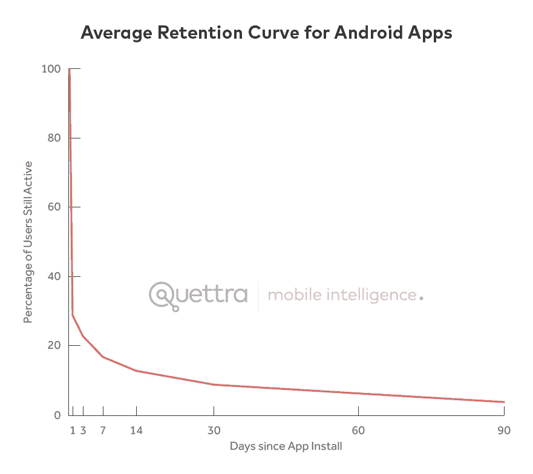
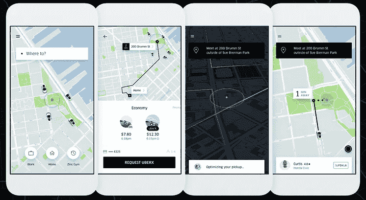
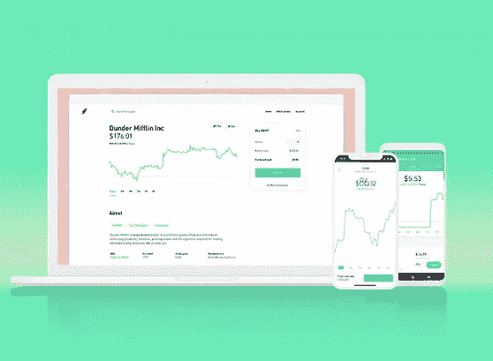
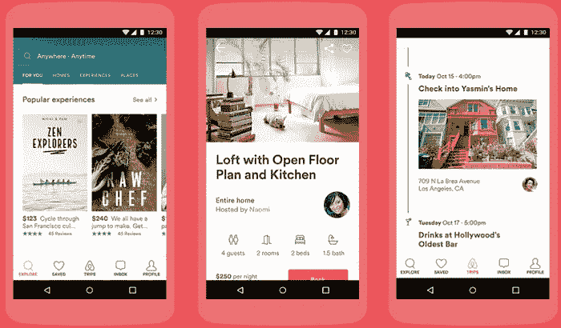
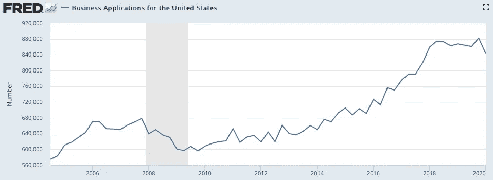
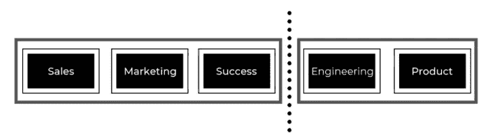

# 未来十年最有价值的雇佣将是设计师

> 原文：<https://medium.datadriveninvestor.com/the-most-valuable-hires-of-the-next-decade-will-be-designers-e22166b789c2?source=collection_archive---------4----------------------->

## 为什么未来成功的公司今天会在产品设计上大量投资

Photo by [Jess Bailey](https://unsplash.com/@jessbailey?utm_source=medium&utm_medium=referral) on [Unsplash](https://unsplash.com?utm_source=medium&utm_medium=referral)

软件设计的审美标准已经提高，随着消费者对产品的要求越来越高，企业将面临产品功能和简单性之间的权衡。我相信未来十年最重要的雇佣将是以用户为中心的设计师，他们能够有效地简化复杂的系统。

## 软件购买者的市场已经改变

如今的软件购买者是员工，而不是部门领导，这些用户基于他们对面向消费者的应用程序的体验，有着复杂的技术期望。[数据](https://andrewchen.co/new-data-shows-why-losing-80-of-your-mobile-users-is-normal-and-that-the-best-apps-do-much-better/)显示，一般移动应用程序在下载三天内会失去 80%的用户。企业软件的新用户变化无常，允许价值展示的时间窗口很小，而且越来越紧。

[https://andrewchen.co/new-data-shows-why-losing-80-of-your-mobile-users-is-normal-and-that-the-best-apps-do-much-better/](https://andrewchen.co/new-data-shows-why-losing-80-of-your-mobile-users-is-normal-and-that-the-best-apps-do-much-better/)

如今，平均注意力持续时间只有 8 秒——这使得我们作为一个物种的注意力低于[金鱼](https://time.com/3858309/attention-spans-goldfish/)。我们是生活在一个混乱世界中的混乱生物，对于企业来说，要想在吸引我们注意力的竞争中脱颖而出，第一印象很重要。

第一次评价一个网站时，人们在 [50 毫秒](https://www.tandfonline.com/doi/abs/10.1080/01449290500330448)内形成观点。软件产品的购买者在几分之一秒内就能确定产品质量的基线，理解这种区别对于软件公司的战略来说是至关重要的。

过去十年的软件公司已经明白了设计简化的重要性，用户也是受益者。随着产品功能的增长，简化受到了影响。将复杂的系统重新打包成用户友好的界面是所有企业都必须面对的挑战。正如乔·斯帕拉诺所说，“好的设计是显而易见的。伟大的设计是透明的。”

软件的新买家很快做出判断，很难给人留下深刻印象。为了迎合这种不断变化的人口统计，组织中最有才华的人将是那些负责充分利用 50 毫秒时间的人。

## 竞争迫使产品分销策略发生变化

开源资源、基于云的解决方案和 API 极大地减少了创业所需的时间、资本支出和步骤。这种资源的可用性推动了业务应用程序数量的增加，业务的饱和导致了有利于消费者的环境。

[https://fred.stlouisfed.org/series/BUSAPPSAUS](https://fred.stlouisfed.org/series/BUSAPPSAUS)

尽管创业容易，但成长成本却比以往任何时候都高。激烈的竞争使得接触新用户变得更加困难，基于广告的支出也在飙升。有条件地，一场价格战随之而来，导致在定价上的竞争和在广告支出上的竞争。

为了证明获得客户所需的成本上升是合理的，产品必须从客户身上榨取更多。然而，在一个似乎有无限选择的世界里，为价格上涨辩护变得更加困难。通过广告赚钱的传统方法与优秀的产品设计相矛盾。消费者一直直言不讳地表达他们对广告的憎恨，通过分散页面注意力来赚钱牺牲了无缝的用户体验。

泛滥的市场使得获取新用户变得更加昂贵，组织必须重新思考他们的商业模式以适应这种变化。

免费增值模式已经变得标准化，因为消费者在同意付费之前需要试用软件。LinkedIn、YouTube、Dropbox、Spotify、Tinder、concept 和 Figma 等公司已经证明了提供免费增值服务的好处，我希望许多其他公司也能效仿。免费增值版本提供了容易的客户和增加的品牌资产，但是免费提供你的产品也带来了挑战。

 [## 数据驱动始于数据素养|数据驱动的投资者

### 光是听到“数据”这个词就令人生畏。老实说，只有 21%的全球员工对自己的工作充满信心

www.datadriveninvestor.com](https://www.datadriveninvestor.com/2020/03/22/data-driven-starts-with-data-literacy/) 

从设计的角度来看，缺乏使用障碍会更加强调产品的外观质量。支持免费用户是免费增值模式的致命缺陷，产品团队面临的挑战是提供足够多的产品使用信息，同时又不泄露太多信息，以至于非付费用户永远不会转化为付费用户。如前所述，创造一个人们持续使用的产品是非常困难的；设计一个有足够粘性的免费产品来说服用户付费是一项更加艰巨的任务。

再也不能通过专有代码和传统的销售方法来达到用户的临界质量。出售一个组织需要更加重视产品设计，我希望组织资源的增加能够填补这一空白。

## 结构性变化即将到来

传统的组织结构把产品放在事后才考虑，这阻碍了大规模的产品开发。

典型的销售导向型企业可以分为两个部门:利润中心和成本中心。利润中心包括销售、营销和成功团队，他们在组织中的唯一目的是引入新徽标和服务现有客户。成本中心包括工程和产品团队，他们的任务是开发和迭代满足客户需求和请求的软件。

将一个组织分成两个独立部分的问题是跨部门的目标不一致。以销售为先导，以产品调整为跟进，迫使组织优先考虑大客户，并最大限度地减少必要的产品调整。一旦签下一个大账户，董事会和员工就会施加压力，要求他们以后只签类似规模的账户。这种类型的策略鼓励反对迭代，而不是在不理解参与的情况下激励增长，这种方法等同于长期的不满和流失。

Photo by [ThisisEngineering RAEng](https://unsplash.com/@thisisengineering?utm_source=medium&utm_medium=referral) on [Unsplash](https://unsplash.com?utm_source=medium&utm_medium=referral)

从投资者的角度来看，设计越来越重要，这将会改变他们的内部评估过程。

风险投资家利用有限的数据点工作，并且历史上依赖于许多指标来衡量给定交易的质量。在尽职调查过程中，会评估经常性收入、流失、员工人数增长和一系列其他数据，但这些框架中有许多已经过时并被过度使用。

如果最好的公司能够实现有机增长，那么员工人数增长是一个多么好的指标？如果免费增值模式没有收获足够长的时间让用户转化为付费账户，那么收入是一个多么好的指标？定性信息更难理解。好的设计是美学上的，理解产品设计的无关紧要的细节需要教授和学习。

好产品卖；伟大的产品推销自己。他们与客户建立信任，推动有机增长，并培养一个获得重复购买的品牌。设计是下一个护城河，创始人和投资者将需要调整他们的评估框架，以反映这一变化。