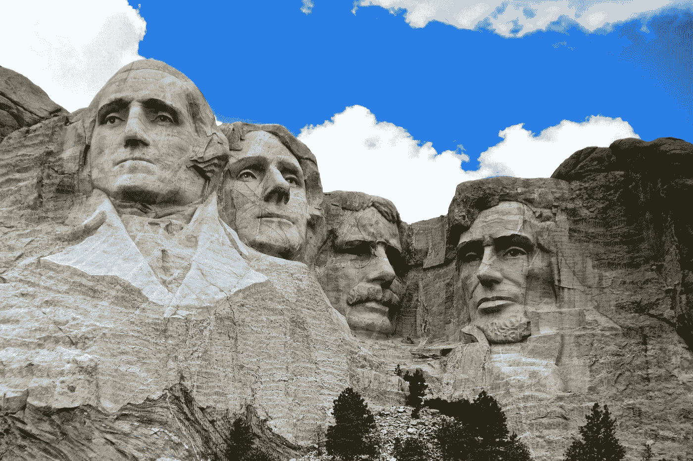

# 群山在生长。

> 原文：<https://medium.datadriveninvestor.com/the-mountains-grew-280e68a9e359?source=collection_archive---------11----------------------->

## 总统是如何输掉选举的。

Photo by [Stephen](https://unsplash.com/@steve02?utm_source=unsplash&utm_medium=referral&utm_content=creditCopyText) on [Unsplash](https://unsplash.com/s/photos/mount-rushmore?utm_source=unsplash&utm_medium=referral&utm_content=creditCopyText)

2004 年，当我的约翰·克里预言没有实现时，我往自己脸上砸了一个鸡蛋。“詹姆斯·卡维尔

起初没有人认为它们是山，至少没有到引起政治阴谋的程度。如果有什么不同的话，它们更像是穿过人们草坪的抽象花岗岩雕塑。与此同时，地震学家注意到横跨两个大陆架的海底断层越来越多。随着山脉的增长，海平面下降，导致了专家所说的“地震异常”，这可能是地球核心的火山活动迫使更坚硬的花岗岩露出地表的结果。

代表沿海地区的政治家们首先提出了担忧。全球变暖不是应该导致海平面上升吗？为什么新英格兰的海岸线低了六英尺，像金属礁一样暴露出大量的垃圾。曾经吹嘘深水停泊处的港口现在点缀着红色浮标，标记着船只可能搁浅或刮到旧渔船和沉没潜艇的区域。

> 亚特兰大郊外发生 20 辆汽车连环相撞事故，当时 20 号州际公路上出现两个花岗岩道钉。

在更远的内陆，花岗岩角穿透了人们的地下室，树木倒下，天坑出现。马里兰报道了一个有 200 年历史的谷仓，它建在石头地基上。亚特兰大郊外发生 20 辆汽车连环相撞事故，当时 20 号州际公路上出现两个花岗岩道钉。

很快，供水系统，化粪池系统，下水道，煤气管道，都从地下拔地而起。花岗岩巨石从后院的水池中伸出来。灯光标准倾斜，街道被视为危险。犹他州的一名采矿工程师炸开了穿过他花园的岩层。几天后，它又像动物的新角一样长了出来。在南达科他州，拉科塔社区在花岗岩塔尖上绘有古代诸神的面孔。

在整个南部圣经地带，牧师和福音传道者都警告会众在地狱的石头手指升起并摧毁他们的田地和高尔夫球场之前忏悔。三 k 党在佐治亚州梅肯市各处的岩石突起处标上白色十字。密歇根州迪尔伯恩郊外的一块岩层看起来非常像巨石阵，人类学家被邀请来确定这是否也是外星人的某种古代发射台。

在华盛顿，代表们想宣布进入紧急状态，但总统说这需要批准。说实话，他在等待秋季选举前的临时投票结果。德克萨斯州和路易斯安那州沿海地区接连三次飓风已经让他付出了沉重的代价，即使救灾工作正在系统中进行。告诉全国人民他们正在经历巨大的基岩喷发，这不是总统或者任何人想要谈论的事情。

> 山脉本身看起来没有逻辑顺序，所以除了用星条旗装饰它们之外，坦率地说，每个人都被难住了。

总统和参谋长联席会议就山区问题进行了辩论，特别是这将如何影响秋季的选举。每个部门都表示怀疑能做些什么。山脉本身看起来没有逻辑顺序，所以除了用星条旗装饰它们之外，坦率地说，每个人都被难住了。

一些国会议员仍然强烈要求进入紧急状态，或者举行公民投票来决定他们下一步该做什么。总统觉得这会引起恐慌，宁愿在选举结束前低调处理一切。几个星期以来，他坚持认为山脉本身会消失，可能在春天大地解冻的时候。正如他解释的那样，“他们会回到他们来的地方。”

当国家地震活动研究所对此提出异议时，资金被削减，许多地震学家离开了这个行业。该部剩下的大部分工作是收集信息，政府也对此加以限制。最终，方法和手段委员会认为该部没有必要，剩下的少数工作人员被转移到自然资源部。

随着选举的临近，新闻发布会变成了激烈的比赛。记者们正被护送出大楼。总统指责民主党夸大了山脉的影响。在他的许多推文中，他将媒体——以及民主党人——称为“大婴儿”。

民主党人用新的事实和数据进行了回应，其中许多来自总统没有封锁或关闭的部门。尤其是农业受到的打击最大。许多农民无法用巨大的花岗岩突起收获庄稼。运输部估计数千英里的高速公路无法使用，因为大石块穿透了沥青。

 [## 区块链投票和美国选举|数据驱动的投资者

### 在不到 70 天的时间里，这个世界上最古老的民主国家将以前所未有的方式面临最大的摊牌…

www.datadriveninvestor.com](https://www.datadriveninvestor.com/2020/08/26/blockchain-voting-and-the-american-elections/) 

总统继续淡化形势的严重性。直到 7 月份，他个人受到了影响。当他在佛罗里达州的一个私人高尔夫球场打高尔夫球时，他的球从一块巨石上倾斜下来，掉进了附近的一个池塘里。他没有派一名特工下水，而是从口袋里掏出一个球扔在池塘边。这个显而易见的骗局，连同一张特别不讨喜的他露出肚子的照片，被摄像机拍了下来，卖给了一家主要的报业辛迪加。

第二天，总统飞回华盛顿，召集参谋长会议。当他们进入房间时，总统正在看《城市快报》的头版。一座巨大的花岗岩尖顶从拉什莫尔山脚下的瓦砾中拔地而起。它看起来就要飞进泰迪·罗斯福的鼻子里了。

坐在桌子另一端的是地震活动研究所的科学家。梅纳德博士是最后一分钟加入的。没有人确定他们是否需要地震专家。里氏震级上什么也没有出现，这意味着这些山脉几乎没有震动。

> “总统先生，”梅纳德博士说，“考虑到地球本质上是一个火山岩浆球，你所说的这些山脉不应该让我们感到惊讶。”

“嗯，梅纳德？”总统对他说。“你是这方面的专家。我们该拿这些山怎么办？”

“总统先生，”梅纳德博士说，他的厚厚的眼镜似乎蒙上了一层雾，“考虑到地球本质上是一个火山岩浆球，你所说的这些山脉不应该让我们感到惊讶。如果我们看看其他星球的地形，花岗岩巨石，有些高达珠穆朗玛峰，是非常常见的。”

“谁在乎其他星球？”总统说。“我有高尔夫球场要担心。看看这个，”他说着，把*快速城市日报*扔给他。“泰迪·罗斯福是我们最敬爱的总统之一。我要参加选举了，梅纳德。我们到底该怎么办？”

“老实说，总统先生，”梅纳德说，“我不确定我们能做什么。基于地球的构成——“

“我对作文不感兴趣，”总统打断道，再次抓起*快速城市日报*。“我们不能让一块石头砸到泰迪·罗斯福的鼻子上。人们不会容忍这种事的。我们必须在 11 月前做点什么，梅纳德，否则我们就完蛋了。难道我们不能用核武器炸这些山什么的吗？”

国防部长在这一点上发表了意见。他说这将是一个昂贵的，而不是无关紧要的。“我们已经在应对海平面下降的问题了，总统先生，”他说。"据我们所知，核化这些东西可能会导致我们所有的淡水湖干涸."

“这是真的吗，梅纳德？”总统问道。

“有可能，”梅纳德说。“地下任何种类的核活动都会造成裂缝。我不知道他们会在多大程度上耗尽所有的淡水。很有可能，他们会。”

“好吧，那么，忘了核武器吧，”总统说，“你有什么建议？”

“总统先生，”梅纳德擦着眼镜说道。“考虑到我们对这些喷发所知甚少——如果我们想这么称呼它们的话——在它们停止之前，我们什么也做不了。那就是*如果*他们停下来。通常它们会随着大陆板块的稳定而出现。也许会，也许不会。”

“这是一个很大的可能，梅纳德，”总统说。“听着，要么我告诉人们一些事情，要么该死的新闻媒体会制造更多的假新闻。看在上帝的份上，其他国家在做什么？”

“中国把其中一个变成了滑雪场，”外交部长说。“在江苏省。空中报告正在传来。”

> “恕我直言，”梅纳德说。“我们甚至不知道这些山是否会稳定下来。中国可能行动过早。”

“我们怎么没想到这一点？”总统说。“我们滑雪比中国人多。我们能把多少座山变成滑雪山？”

“恕我直言，”梅纳德说。“我们甚至不知道这些山是否会稳定下来。中国可能行动过早。”

“该死，”总统说，“我马上就要进行初选了。在辩论中我要说什么？我甚至不能把这些山变成滑雪山，因为我的地震活动研究所的专家不建议这样做？”

“总统先生，”外交部长说。“去年中国人不是在罗布泊遗址进行了低水平核试验吗？我们可以责怪他们。”

“这主意不错，莫特，”总统说。“他们破坏了我们的武器协议，现在我们到处都是山。见鬼，我甚至威胁要把账单寄给他们。对我有用。你们其他人呢？”

"我应该在今天的新闻发布会上提到这一点吗？"新闻秘书说。“他们一直在问，我一直在说总统正在调查这件事。”

“当然，告诉我，看在上帝的份上，”总统说。“中国一直在进行低水平的核试验，扰乱了整个——他们到底在扰乱什么，梅纳德？来吧，给我一些大词。”

"核分裂导致的跨大陆板块移动？"梅纳德说。

“是的，就这么办，”总统对他的新闻秘书说。“告诉我，我们正在想办法拯救我们的农民、我们的海洋产业，以及你能想到的任何东西。林业呢？这些愚蠢的山在毁坏森林吗？不管怎样，扔进去吧。确保重点是中国人。他们在滑雪，而我在拯救经济。”

“我马上就去办，总统先生，”新闻秘书说。"如果他们问我们给中国人开了多少钱怎么办？"

> “还在他的鼻子里，”内政部长说。

“我不知道，几十亿——几万亿！”总统说。“反正他们不会付钱。我也要实行禁运。泰迪在拉什莫尔山发生了什么事，有什么新消息吗？”

“还在他的鼻子里，”内政部长说。

“拿几把手提钻上去。我不能失去南达科他州。”

“炸药可能更快，总统先生。”

“好主意，莫特，”总统说。“我们越早把泰迪鼻子里的石头取出来，我们就能越早扭转这场选举。”

“是的，总统先生。我们现在就去做。”

> 随着初选的临近，总统抨击媒体，抱怨他们更多地关注华盛顿的耳朵，而不是泰迪·罗斯福不再有鼻子有眼的事实。

第二天，拉什莫尔山发生了爆炸。北至拉皮特城都能听到。尘埃落定后，泰迪·罗斯福清除了所有的岩石突起。不幸的是，乔治·华盛顿的耳朵是在下面的一个岩石堆上发现的。当天晚上，它很快就被撤下了，但在此之前，当地一家报纸的标题是:“总统有华盛顿的耳朵吗？”

随着初选的临近，总统抨击媒体，抱怨他们更多地关注华盛顿的耳朵，而不是泰迪·罗斯福不再有鼻子有眼的事实。

“我试图做些好事，”总统在一条短信中说，但这导致民主党在那年 11 月取得了压倒性的胜利，总统退休到了佛罗里达州，那里的山脉继续增长，他被摄像头捕捉到，用一根 9 号铁杆击中了一块岩石，然后退休到俱乐部会所，在那里他点了四个巨无霸和同样数量的可乐。

罗伯特·科马克是讽刺作家、小说家和博客作者。他的第一部小说[“你可以把马牵到水边(但你不能让它潜水)”](http://robertcormack.net/)在网上和大多数主要书店都有售。查看[天马出版社](http://skyhorsepublishing.com/)或[西蒙和舒斯特](http://simonandschuster.ca/)了解更多细节。

**访问专家视图—** [**订阅 DDI 英特尔**](https://datadriveninvestor.com/ddi-intel)