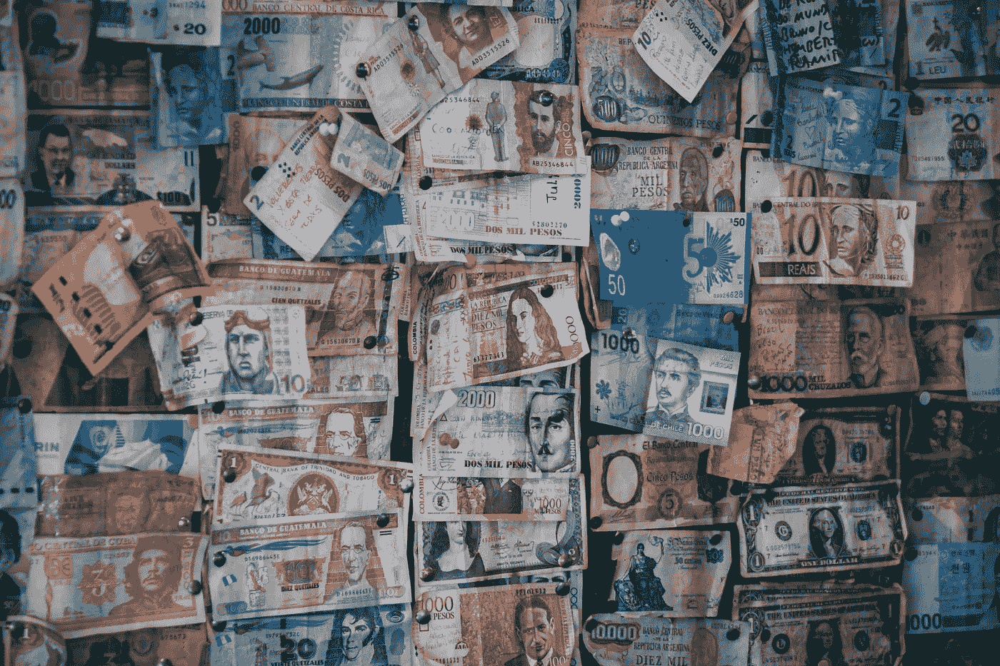
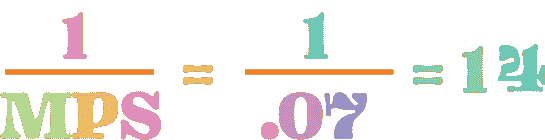

# 乘数效应&继续每月 1200 美元支票的理由

> 原文：<https://medium.datadriveninvestor.com/the-multiplier-effect-the-case-for-continuing-a-1-200-monthly-check-a080ea4618bc?source=collection_archive---------1----------------------->

Photo by [Geronimo Giqueaux](https://unsplash.com/@ggiqueaux?utm_source=unsplash&utm_medium=referral&utm_content=creditCopyText) on [Unsplash](https://unsplash.com/s/photos/spending-money?utm_source=unsplash&utm_medium=referral&utm_content=creditCopyText)

我手上的皮肤正在脱落。这是由于过度但必要的洗手和过度消毒造成的。我知道这是我现在最不担心的。遛狗的时候，我经常走街道，因为那里很少有车。我尽量避开人行道，因为当有人向我走来时，即使我戴着口罩，也很难保持 6 英尺的距离。

不幸的是，我是整个冠状病毒超现实中的高危人群:1 型糖尿病、哮喘和高血压。我确实不超重，相信我，我每天早上都在跑步机上锻炼。这样过了两个月，我在哀悼我们的国家变成了什么样子。好消息是我昨天收到了政府支票。这只是我们家庭每月开支的一小部分，但当然总比没有强。

我们现在所处的反乌托邦式的孤立状态让我想起了我的孩子还在襁褓中的时候，我们住在俄亥俄州时我雇的一个保姆。她是一个可爱的人，名叫加利纳，是由我们当地的犹太人联合会资助从乌克兰来到美国的，当时乌克兰是苏联的一员。改革开始时，加利纳和她的丈夫索尔以及他们的小儿子一起去了美国，儿子的名字我记不清了。索尔是一名出色的工程师，但他几乎不会说英语，口音很重，因此只能做杂工。

 [## 如果资本主义失败了，那么还有什么选择呢？数据驱动的投资者

### 在当前政治领域的修辞之旅中，我们都可以面对面地接触到流行词汇，如…

www.datadriveninvestor.com](https://www.datadriveninvestor.com/2020/03/16/if-capitalism-is-a-failure-then-what-is-the-alternative/) 

1986 年，当核电站反应堆爆炸起火时，他们曾经住在切尔诺贝利附近。他们在基辅附近的郊区足够远，他们不会面临直接的危险。然而，这让他们本已充满挑战的生活更加痛苦。例如，加利纳不能母乳喂养她刚出生的儿子，因为她的身体吸收了太多的辐射。索尔每次去商店买奶粉都要开 7 个小时的车，据他说，他每周去一次。加利纳患有明显的皮肤癌——一颗出血的痣，她一直用绷带包扎着。我恳求她让医生看看，她告诉我，她有，但它仍然有一段时间，然后我搬到了加州，我再也没有见过她。他们许多仍留在苏联的家人和朋友都生病去世了。我希望她过得更好。

下班后索尔会来接加利纳。俄亥俄州的冬天非常寒冷。我记得有一次，在一个气温远低于冰点的晚上，索尔站在我们的前门，他穿着一件风衣。我问他冷不冷。他嗤之以鼻地挥了挥手，表示“寒冷的天气没什么”，他“在西伯利亚呆过一段时间”。

有几次，加利纳和索尔讲述了他们在切尔诺贝利灾难中的可怕经历。除了美国的犹太人，没有人能帮助他们。他们救了他们，救了他们的儿子。现在，谁将在冠状病毒疫情的噩梦中拯救我们？

我们从美国财政部得到的 1200 美元到底能帮到我们多少？它将通过商品和服务的消费进入经济，并继续帮助他人。我想知道我们的救援支票会给美国经济增加多少，所以我决定用经济学中一个叫做乘数效应的工具来计算。

乘数效应是指支出的增加带来的国民收入和消费的增长大于最初的支出。当我在宾夕法尼亚州立大学最初的宏观经济学课上第一次了解到这个绝妙的概念时，我决定将我的大学专业从兽医预科改为农业经济学。我不再只是照顾动物，我要经营农场。

乘数效应背后有数学公式。当然，这毕竟是经济学，尽管涉及心理学，但经济学是一门科学。然而，我相信乘数效应的重要性是其背后的简单常识。我将结合我们的财政和货币政策来解释。(关于财政和货币政策的初级读本，你可以阅读我之前的文章“特朗普总统如何防止我们的经济崩溃”)

当人们收到钱或收入时，他们只能用它做两件事:存钱，或花(消费)钱。大多数美国人消费远远超过储蓄。Bankrate.com 最近的一项调查发现，69%的人将收入的 10%存起来。这将使平均储蓄率 69%除以 10%或 0.69/. 1 =储蓄收入的 6.9%。当然，这是一个平均数，穷人不存任何东西，富人存更多，但我会把它四舍五入到总收入的 7%，并使用这个数字。

因为人们只能做那两件事，储蓄或消费，边际储蓄倾向(MPS)和边际消费倾向(MPC)，加起来一定是 1 或 100%。

所以，如果我们的储蓄率是 7%，那么我们的消费率一定是 93%。听起来差不多。对于你收到的每一美元收入，你可能会花掉其中的 93%，存下其中的 7%。这是 2019 年完成的一项研究，所以我敢肯定，现在收入支出的百分比甚至更高，但出于本文的目的，我们将坚持 2019 年的数字。

有了 MPS 之后，你必须计算出**简单支出乘数**的比率，即 1/MPS。 ***储蓄*** (边际百分比)。)

如果你的 MPS 是 0.07，那么你的简单支出比率是 1/MPS 或 1/.07 或大约 14。

因此，如果美国政府在《医改法案》刺激计划的第一部分上花费 2 万亿美元，它将创造出 28 万亿美元的巨额收入。这就是所谓的财政刺激。

这是怎么回事？举个例子，让我们以政府给我们所有符合条件的人的 1200 美元为例。对于每个从政府获得 1200 美元刺激支票的人来说，他们将花费 93%。这 93%的人和他们消费的地方也会消费 93%。而那些地方会花 93%等等。这就是乘数效应。就像创造货币一样。

为了计算你将从你的 1，200 美元中单独创造的金额，请看下面的电子表格。A 列是 1，200 美元，乘以 93%或 B 列中的 0.93 来计算 C 列。在下一行中，A 列是其上的 C 列金额，现在乘以 B 列，以此类推。一路下来，145 人左右，直到零…

…你会产生将近 16，000 美元的资金进入经济。当然，你可以使用我们上面计算的简单支出乘数 14。1200 美元乘以 14 = 16800 美元。(差异来自舍入数字。)

# ***保持资金流动。***

Photo by [Martin Adams](https://unsplash.com/@martinadams?utm_source=unsplash&utm_medium=referral&utm_content=creditCopyText) on [Unsplash](https://unsplash.com/s/photos/motion?utm_source=unsplash&utm_medium=referral&utm_content=creditCopyText)

在这个不确定的时期，你可能会忍不住把钱藏在床垫下。不要这样做。因为如果你把存款存入银行，在货币政策上有同样的乘数效应。

在这种情况下，乘数不是储蓄和支出，而是来自存款和贷款。人们把钱存入银行。一部分作为银行准备金(每家银行都必须保留)，一部分被借出。

借出的那部分，已经花掉了。收到你花掉的钱的人或公司，花掉一部分，然后把一部分存在银行里，银行的储备金里保留一个百分比，一个百分比再借出去。诸如此类。

乘数效应的一个障碍是人们囤积金钱。在这个不确定的时期，人们的床垫下确实藏着很多钱。亨里克·a·科瓦尔茨克也在《媒介》上发表了一篇出色的文章，追踪了这一现象；[现金为王，比我们想象的更有效](https://medium.com/datadriveninvestor/cash-is-king-more-potent-than-we-think-98f422843a7a)。显然，不花钱或不存钱会阻碍乘数效应。

***花钱，还是存钱。如果你存了，就存进银行。***

乘数效应的美妙之处在于，它对许多其他事情都有效，比如教育。当我们投资于孩子的教育时，这种投资会带来收入更高的工作、更多的消费和银行存款的增加。

这让我想到了 2020 年总统候选人杨安泽推广的自由红利的概念。你能想象如果每个人每月收到 1200 美元吗？通过乘数效应创造的流动性和货币数量将是巨大的。产生的税收收入将很容易支付它。

我认为这是一个我们都应该认真对待的概念，特别是在失业率飙升和自动化取代人们工作的情况下。假设有 1.22 亿人(符合最近财政刺激计划的美国人)每月获得 1200 美元的自由红利。这将花费政府 1220 亿人口乘以 1200 美元，相当于每月 1464 亿美元。但是，如果你将 1.22 亿人乘以通过乘数效应创造的货币量，15，942.40 美元将创造大约 1.9 万亿美元。

根据经合组织的数据，2019 年美国人的平均税率约为 24%。自由红利将每月产生 4670 亿美元。这应该足以支付 1464 亿美元的财政刺激。

# 真相在数字中。

最后，我们应该认真考虑每个合格的美国人每月 1200 美元的自由红利。我们尤其应该考虑在冠状病毒及其造成的反乌托邦社会时期这样做。这不是切尔诺贝利，但对一些人来说，这是它自己的饥饿和遗弃的荒地。加利纳和索尔能够从犹太人联合会及其社区那里得到持续的帮助。这就是我们美国现在需要的。请在下面的评论区告诉我你的想法。

*辛西娅·怀利是企鹅兰登书屋出版的儿童书籍作者，拥有乔治城大学经济学硕士学位。她为数据驱动投资者撰写商业和经济方面的文章。当她不写作的时候，她为***做商业咨询和扭转战略。**

**由 Dennis P. Kamoen 主编，创始人&主编，项目顾问。**