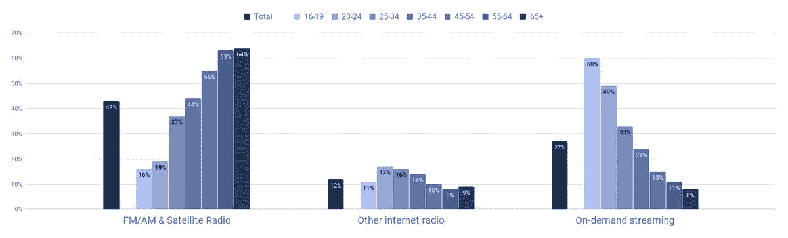

# 音乐产业隐藏的无线电崩溃

> 原文：<https://medium.datadriveninvestor.com/the-music-industrys-hidden-collapse-of-radio-bf86fcd835fd?source=collection_archive---------20----------------------->

## 我是美国人的主食。我把你小时候喜欢的歌都介绍给你了。如今，世代更替威胁着一个支离破碎的市场的强制整合。

Source: Self Created Image with Canva

无线电行业的生存挑战与你想象的不同。

引入流媒体后，收入短暂下降，但找到了稳定的支持。消费并没有大幅下降，但发生变化的是人们消费收音机的样本。

iHeart 破产案表明，在我们的数字时代，最大的玩家正在努力适应稳定的金融模式。 ***收入不等于利润*** 。

16-25 岁的美国人是最大的流动人口。广播在特定的人群中蓬勃发展。电台拥有 35 岁以上的听众。广播听众的迅速老龄化被认为是对广播业的主要威胁。

流媒体也连续多年保持两位数增长。有一个挥之不去的问题。

广播电台能吸引年轻听众保持其当前的身份吗？

如果广播未能接纳新的流媒体一代，我们可能会在未来几年看到该行业的收入迅速下降。这意味着像 Cumulus Media(纳斯达克股票代码:CMLS)、Emmis Communications Corp(场外股票代码:EMMS)和 Entercom Communications Corp(纽约证券交易所股票代码:ETM)这样的公司的市值将出现底线下跌。

 [## 后疫情经济中的基本 GTM 变革策略|数据驱动的投资者

### 新冠肺炎以一种新的不可想象的方式开展业务。这个疫情甚至强迫…

www.datadriveninvestor.com](https://www.datadriveninvestor.com/2020/08/11/an-essential-gtm-change-strategies-in-the-post-pandemic-economy/) 

**了解动态**

下面是来自音乐商业协会 Audiencenet 的图表。

Source: Audiencenet, Music Business Association.

回顾[audience net 2018 年 7 月的研究](https://musicbiz.org/wp-content/uploads/2018/09/AM_US_2018_V5.pdf)，所有音乐消费中有 43%是通过广播发生的(包括 airplay 和广播的数字流)。这些数字超过了占整体份额 27%的点播流媒体。数字广播服务(如 Pandora)处于灰色地带。潘多拉的功能相当于一台流媒体收音机。流媒体广播占另外 12%。有了 Pandora，你还可以创建播放列表，再也不用收听电台了。所以，这是混合的。

> 电台的问题是，虽然它仍然负责所有新人才发现的 49%,但它不给艺人任何报酬。

从商业角度来看，专业艺术家的歌曲让人们收听广播来帮助这个行业是没有意义的。

如果艺术家不再允许收音机免费播放他们的音乐，不要感到惊讶。

艺术家们采取协调一致的行动，只使用按次付费的场地，这将会摧毁美国的地面广播。

广播正处于十字路口。流媒体平台和卫星广播都支付机械和流媒体版税来播放歌曲。地面电台说曝光就够了。艺术家所需要做的就是决定曝光率不够，并且只使用流媒体平台。

暴露的证据之山正在迅速缩小。竞争对手正在付钱让传统的无线电广播停业。这个论点在 2020 年没有意义。

**赌短**

了解这些动态可以带来一些有价值的盈利机会。*电台目前是 2007 年房地产市场的所在地*。**所有电台股票价格都被高估**。了解风险敞口并不具有相同的市场价值是很重要的。

每个市场都有它的门槛。每个市场都有一个转折点，它必须往南走。无线电不会消亡，但它将在范围、目的和形象上大幅收缩。

如果你在 2040 年收听的所有广播节目都是:紧急广播、本地新闻、音频采访、独家本地音频节目和类似的广播播客，不要感到惊讶。

广播可能不会停止存在，但它现在正经历一场身份危机。

观看流媒体突破 35%的市场份额。这是人们讨论收购竞争对手的要点。收音机已经过时了。新资金可能会投降。被收购意味着大量新资金，但如果新资金说“不”，彩带将杀死老恐龙。

有时哥斯拉转身太慢，以至于没被背后的核弹击中。

祝你知识成功！

***

关于 Christopher:Christopher Knight Lopez 是一名职业骗子，在他的职业生涯中，他与职业企业家进行了广泛的合作。在他 14 年的职业生涯中，Christopher 已经开了超过 7 家公司。克里斯托弗的目的是利用各种市场驱动的机会。Christopher 是注册项目经理(MPM)和认证财务分析师(AFA)。Christopher 之前通过了 65 系列证券执照考试。克里斯托弗也有他的总路线——人寿、意外、健康和健康维护组织。Christopher 已经管理了总计 2 . 86 亿美元的报告管理资产和建议资产。Christopher 在 29 个国家有工作经验，为各种业务筹集了超过 5000 万美元，在他的个人职业生涯中总收入超过 1300 万美元。Christopher 曾在高科技行业工作:生物技术、金融、证券、制造、房地产和住房抵押贷款。克里斯托弗是一名美国空军老兵。克里斯托弗热爱家庭、竞技体育、钓鱼、武术，并倡导企业家精神。克里斯托弗为崭露头角的企业家提供自助课程。克里斯托弗对导师的热情来自于企业家和骗子需要指导的信念。这个世界充满了关于企业家身份的相互矛盾的信息。在[www.christopherklopez.com 看更多。](http://www.christopherklopez.com.)

免责声明:这些信息并不意味着是一种投资建议或财务建议。不要把这种情况应用到你自己的个人环境中。各种风险包括:商业风险、投资风险、政治风险和其他风险。此信息仅用于信息和教育目的。请不要向作者寻求任何投资策略或哲学。针对自己的情况，请咨询自己的理财顾问或法律顾问。不是任何形式的推荐或认可。

**访问专家视图—** [**订阅 DDI 英特尔**](https://datadriveninvestor.com/ddi-intel)