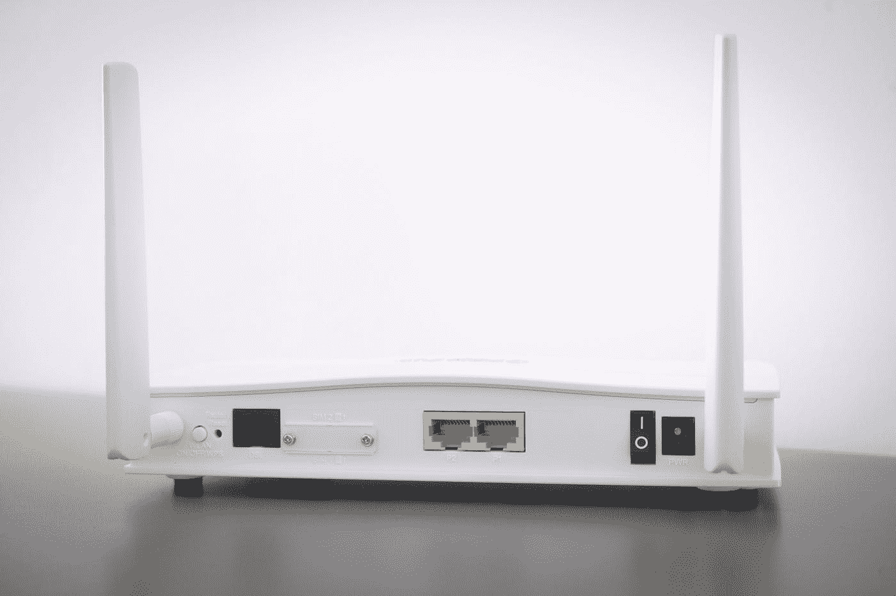
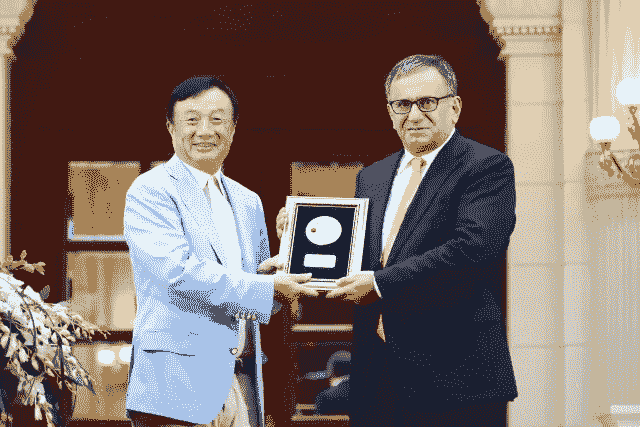

# 5G 技术背后的神秘土耳其人…

> 原文：<https://medium.datadriveninvestor.com/the-mysterious-turk-behind-5g-technology-5ae0ca1dfa8b?source=collection_archive---------4----------------------->

## 华为和埃尔达尔阿里坎对抗世界其他地区

Photo by [Compare Fibre](https://unsplash.com/@comparefibre?utm_source=medium&utm_medium=referral) on [Unsplash](https://unsplash.com?utm_source=medium&utm_medium=referral)

几年来，人们一直在谈论 5G 技术，这是宽带蜂窝网络的新技术标准。我们知道，有了这项技术，我们的电信和互联网连接将会非常快，许多人工智能应用将会被集成，这样我们就进入了信息世界的新时代。

但与此同时，这项技术在全球范围内成为了一个讨论的话题，这导致了国家之间的正式秘密战争，通过华为案例可以看到美国和中国之间的秘密战争，但也包括大型电信公司之间的秘密战争，而且今天仍然有很多阴谋论，就像在电晕危机期间与这项技术有关的阴谋论。它甚至被包括在军情六处的报告中，这些报告明确指出，中国将最终利用这项技术接管世界的领导权，但如果这是真的情况，或者是我们在伊拉克战争期间看到的极端牵强的分析，最终没有发现大规模杀伤性武器，我们将需要更多的时间，直到它发展成为我们生活中的日常标准。

但在这场战争中，这些年来我们在这个话题的表面上移动了这么多，除了公众对 5 G 的一点点信息外，我们，还有世界各地的官员，他们如此关注它，并与中国进行极端的对抗，实际上对该技术的发展细节知之甚少，更不用说为我们提供任何深入的分析或信息。

像任何技术一样，这个新的信息世界最重要的支柱之一是基于专门为它编写的代码，最有可能的是，正如华为已经宣布并测试过几次的那样，他们正在考虑使用 Polar 代码方法，实际上解决方案的根源不在中国或美国，而是在土耳其。

是的，一个名叫**埃尔达尔·阿里坎**的人。

[Picture by Haberler.com](https://www.haberler.com/huawei-kurucusu-ren-zhengfei-den-turk-profesor-11093770-haberi/)

中国城市深圳在 2018 年举办了一场非凡的仪式。他们邀请了一位土耳其科学家来深圳建造的会议中心。

公司首席执行官郭萍在一个盛大的仪式上授予 Erdal arkan 一枚金质奖章，以表彰他“对通信技术发展做出的杰出贡献”。

在公司准备的播放莫扎特经典歌曲《土耳其进行曲》的视频中，热烈庆祝了 arkan 教授的到来，华为总裁兼创始人任郑飞亲自走上红地毯迎接。

他被称为**【极地编码之父】**

[Video by Huawei Digital Power on Youtube](https://youtu.be/BE5HuqEg0oY)

**为什么会有这样的大惊小怪？**

因为埃尔达尔·阿里坎教授为信息世界解决了一个长达半个世纪的问题。

出生于 1958 年的 Erdal arkan 教授是幸运的科学家之一，他在 2008 年发表的“极坐标编码”研究经过 20 年的学术工作后，在短短 10 年内成为现实。事实上，arkan 不应该认为新编码建议的实际应用会在短时间内实现；因为他在 2013 年接受国际电气和电子工程师协会(IEEE)的贝克奖(Baker Award)后接受采访时说:*“把这说成是学术进步更正确。实际上，需要时间才能感受到效果。”*他说；但是时间过得比他预料的要快。理论应用于实践的时间如此之短，以至于 arkan 在深圳的仪式上发表讲话时说，“对一名工程师来说，最大的回报莫过于看到自己的想法变成现实。”

另一方面，华为感谢“极性编码”的发明者，这为他们提供了 5G 技术的巨大竞争优势。

他们认为他们欠阿尔坎更多，这用华为首席执行官郭萍*的话来表达:“埃尔达尔·阿里坎教授不仅是土耳其的英雄，也是通信行业的英雄。”*

一个相当平庸的家伙，在某种意义上说“不像任何引人注目的人”，作为一名学者工作多年，并在安卡拉的土耳其比尔肯特大学担任教学职务，他将通过他的发明和电信行业的改进塑造信息世界，也许是在下一个世纪。

5G 可以以比 4G 快 100 倍的速度和每公里连接 1000 万台设备的大容量，使数字产业渗透到生活的方方面面。世界经济论坛(WEF)和电子工程师协会(IEEE)等国际组织表示，5G 将为新的应用打开大门，这些应用将提高自主对象、物联网(IoT)和机器对机器通信(M2M)领域的效率，新的移动技术将引发工业革命。

因为有了 5G，将有可能将几乎所有东西和几乎瞬间与云计算、人工智能和工业物联网的应用连接起来，即时监控数据，并在极短的时间内达到高级算法的分析并采取行动。

无人智能工厂可以在不浪费的情况下，以最高效的方式使用自己的资源和能源，进行定制化生产。医院可以提供个性化的敏感医疗服务。城市管理部门可以立即控制他们的城市上层建筑和基础设施；可以预测电力、水和天然气网络的故障。

它可以采取措施，如改变交通灯的持续时间，以优先考虑繁忙的方向，同时监控交通拥堵可能发生的点和时间。他们可以指挥空车去拥挤不堪的车站。由于即时连接，增强现实(AR)应用的数量可能会爆炸式增长。从购物到旅游，从客户服务到国防和安全，几乎每个领域都可以体验到独特的体验。自主物体，如无人驾驶汽车、无人驾驶飞行器和机器人，由于其即时数据，可以更加安全和精确地移动。

然而，5G 技术也有重要的要求:

*为了实现数据传输速度比 4G 快 100 倍的目标，网络必须在高频(450 MHz 和 52 GHz)下以极低(1 mm)波长传输。毫米波有一个很严重的范围问题:4G 使用 15 到 40 厘米的波有 10 公里的范围，而毫米波的范围只有 300 米！此外，毫米波大部分时间都会受到建筑物、电子和电动车辆以及雨水的影响。*

*因此，毫米波浮动网在城市中每平方公里需要建立 15-20 个基站。对于 4G 技术，这个数字从每平方公里 2 到 5 不等。更多的基站意味着更高的投资成本和过多的能源消耗。*

正是在这里，Erdal arkan 提出的新编码方法开始发挥作用。Polar 码不仅可以显著提高 5G 通信性能，还可以通过降低编码复杂度来节省能源。

Photo by [Radowan Nakif Rehan](https://unsplash.com/@radowanrehan?utm_source=medium&utm_medium=referral) on [Unsplash](https://unsplash.com?utm_source=medium&utm_medium=referral)

与世界各地的许多科学家相反，埃达尔·阿里坎决定向另一个方向发展。在美国完成博士学位后，他回到了自己的祖国，并从 1987 年开始在比尔肯特大学从事研究工作，他解释说:

我从 1987 年开始在比尔肯特大学工作，那里为我的研究创造了一个非常稳定的环境。我不确定我是否能在美国做这项长期研究。比尔肯特是一个非常特殊的支持基础研究的机构。”

在这种情况下，我们必须承认，在一个快速发展的信息世界中，我们对任何将塑造我们未来的新技术的深度和细节知之甚少，除了新闻报道中围绕它的战争和一些不合逻辑的阴谋论，甚至许多受过教育的人都陷入其中。

当我们谈论 5 G 技术时，它不仅仅是关于中国、美国、华为或西方公约对抗东方公约，而是在冰山之下，还有更多我们一无所知的东西。

也许，特别是在华为为埃达尔·阿里坎举行仪式之后，我们有些人听说过他的名字，但当我们在街上或地铁上遇见他时，有多少人会认出他是 5 G 技术背后的主要人物之一？

**当然，他不是中本聪，也不是那个开发了比特币和疯狂的区块链技术的神秘日本人，但埃达尔·阿里坎的神秘个性更多是因为我们作为一个人类整体，对我们世界和未来的重大变化以及这些努力背后的人缺乏兴趣和深度的知识。**

**与其专注于“5 G 导致冠状病毒传播”这样的阴谋论，我们应该给我们的孩子这些人类努力和成就的例子，而不是让他们每天模仿任何 Youtubers 或抖音冠军。我们面前有一个未来，它比明年被遗忘的任何流行明星偶像都要多得多，但 5 G 和许多其他技术将伴随我们几代人。**

作者:哈伦·雷斯特·艾登