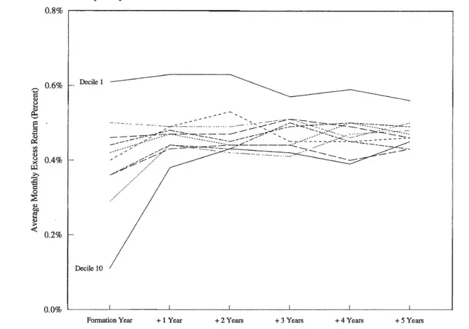
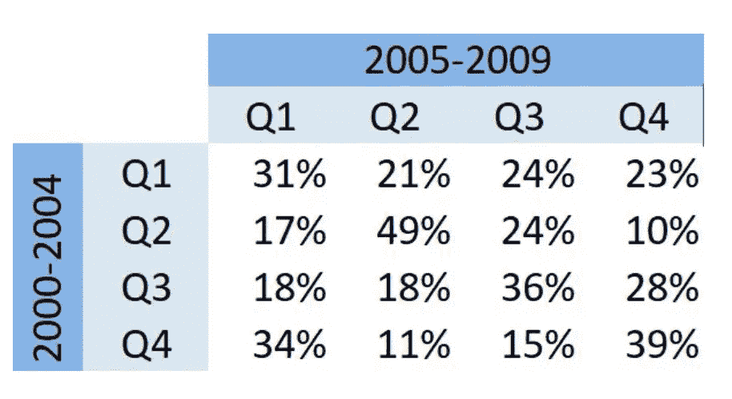
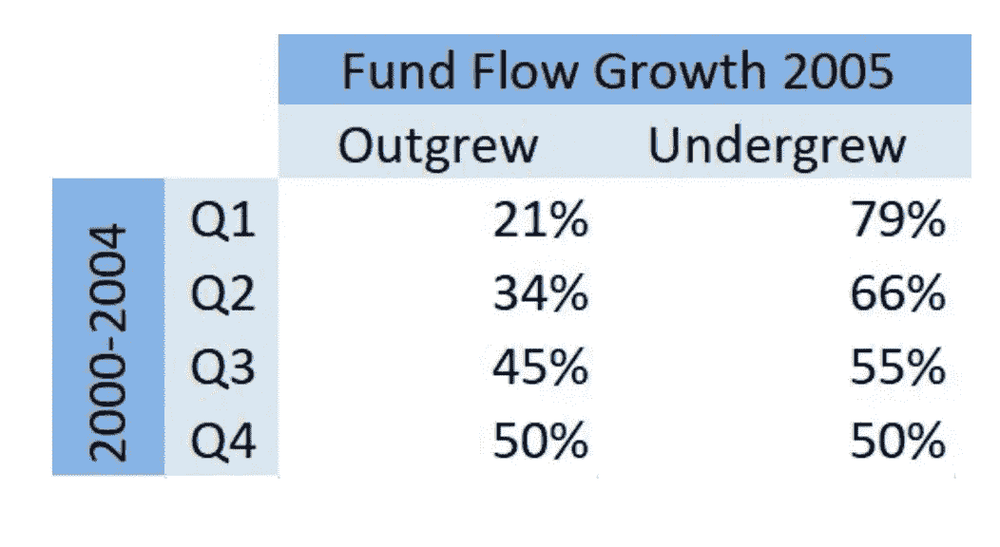

# 追星的神话

> 原文：<https://medium.datadriveninvestor.com/the-myth-of-chasing-stars-80c70c0f6d88?source=collection_archive---------10----------------------->

## 为什么你不应该跟踪股票赢家

谈到投资股市，人们喜欢追星。当你看到新闻说苹果公司刚刚度过了一个梦幻般的财年，或者一个共同基金经理的表现超过了 99%的其他人，你想投资他们。你相信他们的成功一定有原因，你想上他们的公共汽车，这样你也可以赚一些钱。但是，你会吗？

# 总会有赢家

在一群投资者中，总会有一个股票回报率最高的赢家。但这就一定说明他有选股的最大天赋吗？要回答这个问题，我们先做一个思维实验。假设你决定参加一场不同寻常的比赛:总共有 100 个人，每个人必须从一个盒子里随机挑选一个球。总共有 100 个球，每个球上都写有独特的股票名称。之后，你和其他人将根据你的球上股票的最近表现进行排名，排名第一的人将赢得一百万美元。你能通过赢得比赛得出结论，你是参与者中最好的投资者吗？不，你赢了，因为你足够幸运，挑到了最好的球。同样的想法也适用于股票市场:有可能“年度最佳基金经理”只是运气好，尽管他声称自己在选股方面有丰富的经验/知识/技能。

# 恶作剧

有一项由[研究附属机构](http://www.rallc.com/Pages/home.aspx)完成的研究强调了 100 只猴子向一家报纸*的股票版面投掷飞镖的模拟结果。*自 1964 年以来，猴子的平均回报率每年高出市场 1.7%。这听起来可能有点疯狂。但是如果你上过投资理论课，你会知道根据 [CAPM](https://www.investopedia.com/terms/c/capm.asp) ，如果我们假设市场足够有效，股票回报与其风险正相关。小公司占市场中股票的大多数，同时它们通常比大公司风险更大，因此平均回报率更高。另一方面，市场回报是使用资本化加权回报计算的。因此，尽管股票市场上有许多小公司，但由于它们的低资本化，它们只占市场回报的一小部分。因此，市场回报通常低于小公司股票的平均回报。

 [## 决策的移情设计方法如何工作|数据驱动的投资者

### 移情设计是一种产品设计方法，首先由多萝西·伦纳德和杰弗里·雷波特在哈佛大学提出

www.datadriveninvestor.com](https://www.datadriveninvestor.com/2018/07/18/how-the-empathic-design-method-of-decision-making-works/) 

现在，如果我们让 100 只猴子向报纸的股票版面投掷飞镖，飞镖击中小公司股票的几率将远远大于大公司。因此，如果猴子在他们“挑选”的每只股票上投资 10，000 美元，他们最终将拥有一个主要由小公司股票组成的投资组合。由于一种叫做“小盘股溢价”的效应，投资组合的回报率会高于市场。

> “一只被蒙住眼睛的猴子向一份报纸的金融版投掷飞镖，可能会选择一个与专家精心挑选的投资组合一样好的投资组合。”—伯顿·马尔基

# 回归平均水平

根据短期表现，很难确定一个“明星”基金经理是否真的拥有帮助他成功的特殊技能。一些经理通过解释他们投资决策背后的理由来反驳这种观点，并相信这些理由会导致他们的成功。这个论点有两个问题。第一，没有办法找出基本原理和成功之间是否有因果关系。第二，[后见之明偏差](https://en.wikipedia.org/wiki/Hindsight_bias)可能形成他们事后逻辑的基础，这是他们由于人类“完成故事”的倾向而无意识编造的。在这两种情况下，运气都是他们成功的潜在原因。

然而，现在让我们假设我们有一个连续 10 年在市场上排名前 1%的基金经理。他的出色表现完全是因为运气的可能性有多大？嗯，1E-20。换句话说，像彼得·林奇或沃伦·巴菲特这样的人靠运气持续跑赢市场几乎是不可能的。长期投资的成功为拥有真正的人才提供了更有说服力的证据。不幸的是，没有多少人能做到这一点。从长远来看，无论一个经理在开始时是好是坏，他最终都很可能成为一个普通的投资者。这种现象也被称为[回归均值](https://en.wikipedia.org/wiki/Regression_toward_the_mean)。在 Mark Grinblatt 和 Sheridan Titman 所做的一项著名研究中，共同基金根据它们的表现被分成了同等权重的十分之一。然后他们跟踪了未来五年每十分位数的平均回报。下图总结了结果。

很明显，所有的十分位数最终都回归到平均值，只有十分位数 1 例外，它实际上连续 5 年跑赢了市场。

# 案例研究

## 两个时期的共同基金业绩

为了重现马克和谢里丹的发现，我和我的同事们决定进行一项研究，比较大约 3000 只共同基金在 2000 年至 2004 年和 2005 年至 2009 年期间的表现。我们的第一步是根据两个时期的回报分配每个基金的四分位数，例如，第四季度表明该基金的月回报在前 25%。之后，我们做了一个数据透视表来显示基金的头寸是如何随着时间变化的。

我们可以看到，在 2000 年至 2004 年期间处于最后四分之一的基金中，有 39%在 2005 年至 2009 年期间继续表现出色，而在下一个时期，它们中的 34%落入了第一个四分之一。在 2000 年至 2004 年期间处于第三个四分位数的基金中，有 28%的基金改善了业绩，并在下一个时期处于最后一个四分位数，而其中 36%的基金继续处于第三个四分位数。此外，在第一期跑赢大盘(第三和第四四分位数)的基金中，约有 59%在第二期继续跑赢大盘。因此，数据显示了跑赢市场的基金的一些一致表现。这在一定程度上符合马克和谢里登的发现。

另一方面，在 2000 年至 2004 年期间，第一个四分位数中有 31%的基金在第二个四分位数期间没有太大改善，其中 21%的基金改善了业绩，但与市场相比仍然表现不佳。第一期第二四分位数有 17%的基金表现很差，下期被放在最低四分位数。49%的第二四分位数基金表现一致，继续保持在第二四分位数。大约 59%在 2000-2004 年表现不佳的基金在下一个时期继续表现不佳。这与马克和谢里丹的发现相矛盾，他们的发现表明大多数表现不佳的基金最终回归到平均回报率。

## 投资者反应

如前所述，投资者喜欢将资金投入刚刚获得好成绩的基金，或者从表现不佳的基金中抽走资金。在我们的研究中，我们还试图确定投资者在业绩报告发布时的反应。我们从计算 2005 年第一阶段结束时的资金流量中值开始。如果 2005 年的资金流量大于中值，则被归类为 OG，如果低于中值，则被归类为 UG。然后我们计算了第一阶段每个四分位数的 OG 和 UG 的百分比。结果如下所示。

根据我们上面的分析，我们可以得出结论，表现不佳的基金或所谓的“冷基金”见证了投资者的过度反应。这可以在表格的第一行看到:与中位数相比，第一个四分位数基金中有 79%的资金净流出，只有 21%的资金流入量超过中位数。在第二个四分位数中，66%的基金有资金流出，其中 34%的基金获得了比中位数更多的资金。

然而，在跑赢大盘或“热门基金”中没有观察到投资者的过度反应，因为与中位数相比，第三个四分位数中只有 45%的人见证了较高的资金流量，55%的人收到的资金较少。第四个四分位数在两个方向上的流量相等，因为其中 50%的流量较高，而另一半的流量低于中位数。

# 为什么我们不应该追星

在马克和谢里丹以及我的研究中，我们可以看到，从长期来看，一部分共同基金确实跑赢了市场(分别为 10%和 59%)。然而，由于以下原因，追逐明星基金仍然不是一个好主意:

1.  两项研究中使用的数据都存在生存偏差。在现实世界中，一些共同基金在计算基金回报时会排除某些投资组合，以使数字看起来更令人印象深刻。因此，一些糟糕的投资决策从未反映在报告的回报中。
2.  这两项研究都不够严谨，不能完全排除跑赢大盘基金的成功仍然是因为运气的可能性。在 Mark 和 Sheridan 的研究中，他们只测量了 5 年的数据，而在我的研究中，我只包括了 2 个时期。持续时间不够长，不足以确定我们的结论。
3.  即使一个共同基金经理真的拥有选择股票的特殊技能，并有持续惊人的回报，几乎可以肯定的是，他会收取高额服务费，抵消了他的才华所带来的任何增值。

# 参考

[1]:[https://www . Forbes . com/sites/Rick ferri/2012/12/20/any-monkey-can-beat-the-market/# 1 F7 Abd 5630 AE](https://www.forbes.com/sites/rickferri/2012/12/20/any-monkey-can-beat-the-market/#1f7abd5630ae)\

[2]:[https://rortybomb . WordPress . com/2011/03/04/the-financial-ecometrics-of-distribution-of-mutual-fund-performance/](https://rortybomb.wordpress.com/2011/03/04/the-financial-econometrics-of-the-distribution-of-mutual-fund-performance/)