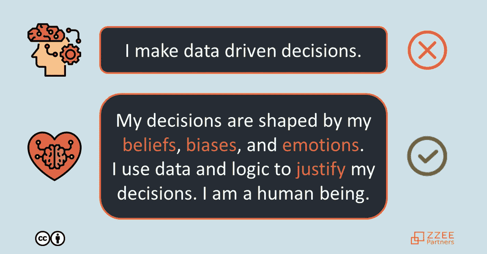

# 数据驱动型决策者的神话

> 原文：<https://medium.datadriveninvestor.com/the-myth-of-the-data-driven-decision-maker-52127a483dfe?source=collection_archive---------39----------------------->

LinkedIn 搜索显示了 264 万份自称为“数据驱动”的简介。我相信真正的数据驱动决策就像被闪电击中一样常见。我们是人类。我们的决定是由我们的信念、偏见和情绪塑造的。我们用数据和逻辑来**证明**我们的决策。

不服气？假设你同意根据数据做出决定；60%或更高我们前进，否则我们停止。数据显示为 59.7%。你最初的本能反应是什么？

*   “我就知道。这是一个坏主意；我一直都是这么说的。”*或*
*   “这将四舍五入到 60%。这证明它像预期的那样工作。我们去争取吧！”

数据是**同**。唯一的区别是你的反应，基于你喜欢的结果。