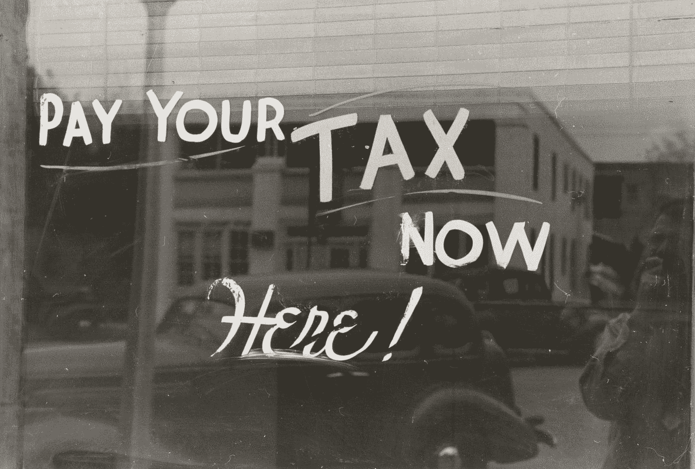

# 学生贷款减免计划中等待着一些人的令人讨厌的惊喜

> 原文：<https://medium.datadriveninvestor.com/the-nasty-surprise-awaiting-some-in-the-student-loan-forgiveness-program-f726867429f?source=collection_archive---------10----------------------->

Photo by [The New York Public Library](https://unsplash.com/@nypl?utm_source=medium&utm_medium=referral) on [Unsplash](https://unsplash.com?utm_source=medium&utm_medium=referral)

有几十个项目可以帮助那些借了学生贷款的人免除全部或部分学生贷款债务。听起来好得难以置信，不是吗？许多人参加这个项目时认为他们必须支付 20 到 25 年的费用，而政府将会清除剩余的费用。没有混乱，没有大惊小怪。你自由了！

然而，事实并非如此非黑即白。首先，学生贷款债务免除计划有令人困惑和复杂的资格标准，你必须满足入学。国税局还设置了一个狡猾的陷阱，在他们免除你的学生债务后，可能会给纳税年度带来巨大的麻烦。

# 贷款豁免的基础

即使你没有完成你的课程，给你原始学生贷款的实体也希望你全额偿还(加上利息)。如果你对自己接受的教育不满意，或者在相关领域找不到工作，你必须偿还这笔钱。就算签期票的时候不满 18 岁，也要还。在某些情况下，贷款人可能会原谅你的贷款，解除它，或取消它。它们包括:

[**死亡出院**](https://studentaid.gov/manage-loans/forgiveness-cancellation#death)

*   如果借款人死亡，他们的联邦学生贷款将被免除。如果你有父母加贷款和你的孩子受益于这笔贷款死亡，贷款人将免除余额。从 2018 年 1 月 1 日到 2025 年 12 月 1 日，死亡出院计划免税。

[**残疾出院**](https://studentaid.gov/manage-loans/forgiveness-cancellation/disability-discharge)

*   如果你成为永久和完全残疾，任何联邦学生贷款借款人有资格获得贷款豁免。美国国税局过去可以对残疾出院征税，但自 2018 年 1 月 1 日起，这一情况发生了变化。这项法律只持续到 2025 年，如果国会不将其永久化或更新，国税局可能会在 2026 年再次开始征税。

[**珀金斯贷款减免**](https://studentaid.gov/manage-loans/forgiveness-cancellation/perkins)

*   如果你申请了联邦珀金斯贷款，这笔贷款由政府担保，但由大学或学院发放。这些贷款通常有较低的利率，余额，并附有合理的还款计划。珀金斯贷款有资格获得几个基于工作的贷款豁免计划，尤其是如果你在医疗保健或教育领域。这个项目是免税的

[**【PSLF】公共服务贷款减免**](https://studentaid.gov/manage-loans/forgiveness-cancellation/public-service)

*   这是一个联邦学生贷款减免计划。在你支付了 120 次“合格付款”后，贷方会原谅你的余额。这是 10 年的付款。要将你的付款归类为“合格付款”，你必须使用 10 年标准计划或收入驱动的还款计划直接向联邦学生贷款。此外，你必须在非营利或公共部门全职工作，或者你必须是一名合格的公共服务雇员。这个项目是免税的。。

[**校本不端行为赦**](https://studentaid.gov/manage-loans/forgiveness-cancellation/borrower-defense)

*   任何联邦学生贷款借款人，如果是代表学校的欺骗、不公平或非法行为的受害者，都可以根据这一标准请求免除他们的贷款。围绕这个特殊的宽恕项目有几十起法律纠纷。然而，美国国税局不会对[借款人还款抗辩](https://www.irs.gov/pub/irs-drop/rp-15-57.pdf)计划下的任何豁免余额征税。国税局还表示，任何因学校关闭而无法完成学位课程的借款人都不必为他们的豁免余额缴税。

**学生贷款结算**

*   任何拖欠学生贷款并且无法支付的人都可以选择学生贷款解决方案。有了这个计划，你的债务会比你欠的少。与联邦学生贷款有关的结算必须遵循非常严格的联邦指导方针，而私人贷款则更加灵活和开放。但是，如果你取消的贷款金额超过 600 美元，美国国税局将征税。

# 美国国税局如何对学生贷款减免余额征税

因此，如果你是一个不幸的人，属于免税学生贷款的范围，你可能会在下一年的纳税时间里有一个令人讨厌的惊喜。即使你可能认为这是天赐良机，你设法让你的部分或全部债务被取消，原谅，或解除，国税局正在等待。

 [## 教科书行业如何最终被颠覆，并将继续改变|数据驱动…

### 就此而言，教科书产业在美国乃至全世界都有着悠久的历史。事实上，他们已经…

www.datadriveninvestor.com](https://www.datadriveninvestor.com/2018/09/25/how-the-textbook-industry-has-finally-been-disrupted-and-will-continue-to-change/) 

基本上，你必须在所得税申报单上把你已经免除、取消或清偿的债务金额作为收入上报给国税局。这适用于根据以下条款免除的几乎所有贷款:

*   现收现付还款计划(PAYE)
*   修订后的现收现付还款计划
*   基于收入的还款(IBR)
*   视收入而定的还款(ICR)

一旦你用合格的付款方式支付了这些贷款的 20 到 25 年，你可以请求免除余额。这很容易导致对贷款人免除的金额增加 10%到 37%的税收。例如，假设你忠实地支付了 20 到 25 年的贷款，你还剩 40，000 美元。贷方会给你发一份 1099-C 表格，注明他们免除的 40，000 美元。你必须将此作为收入上报给国税局，这可能会让你的税单增加数千美元。

假设你以个人身份申报，在加上你的学生贷款减免总额之前，你有 50，000 美元的应税收入。你的所得税总额估计为 6，859 美元。如果我们将 40，000 美元的学生贷款债务免除包括在内，将你的应税收入提高到 90，000 美元，你将剩下 8，916 美元的税单。

再举一个例子，假设你和你的配偶一起报税，你有两个受抚养人。你申请了标准扣除额，你的应税收入总计 10 万美元。这将使你正好处于 12%的税率等级，到 4 月 15 日，你将欠美国国税局 4684 美元。

假设你的配偶前一年获得了 50，000 美元的学生贷款。这将把你的应税收入提高到 150，000 美元，并使你进入 22%的税级范围。你现在的税单是 15349 美元，这是 10665 美元的巨大差额。

Photo by [The New York Public Library](https://unsplash.com/@nypl?utm_source=medium&utm_medium=referral) on [Unsplash](https://unsplash.com?utm_source=medium&utm_medium=referral)

# 如果你付不起税单怎么办？

如果你因为学生贷款减免计划而收到一份意外的税单，而你又付不起，你会怎么做？忽视国税局不是一个选择，因为他们会让生活变得非常困难。国税局确实允许[付款计划和分期付款协议](https://www.irs.gov/payments/payment-plans-installment-agreements)。

然而，你想尽快付清这些，因为国税局还会对你每个月没有全额付清余额的情况收取费用和利息。2020 年第一季度，美国国税局将对你的余额每月收取 5%的利息。

如果国税局认为你资不抵债，并声称你的负债远远高于你的资产，他们可以允许你排除部分或全部的学生贷款债务。但是，如果你知道你没有钱支付你的税单，最好早点开始。这样，你就能以尽可能少的费用更快地还清贷款。