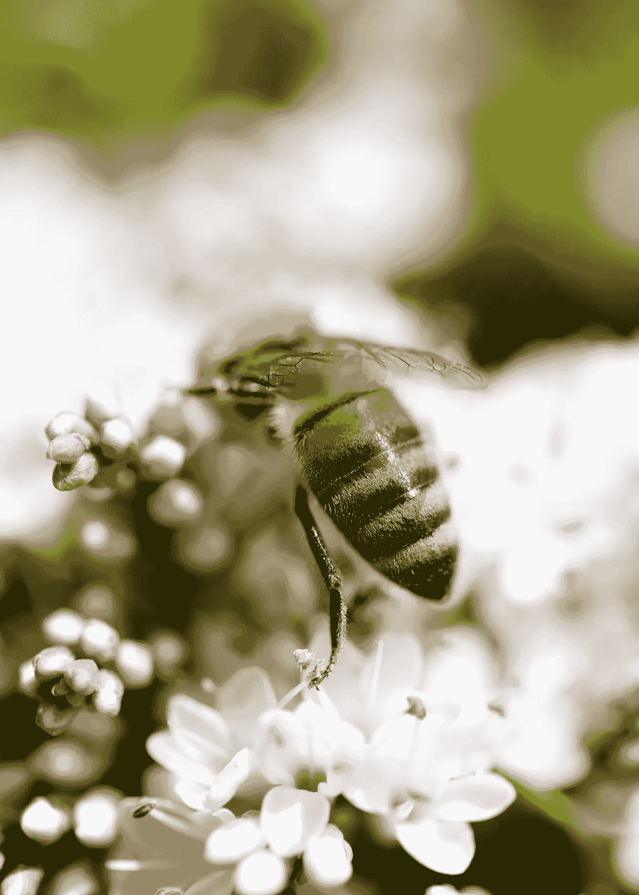
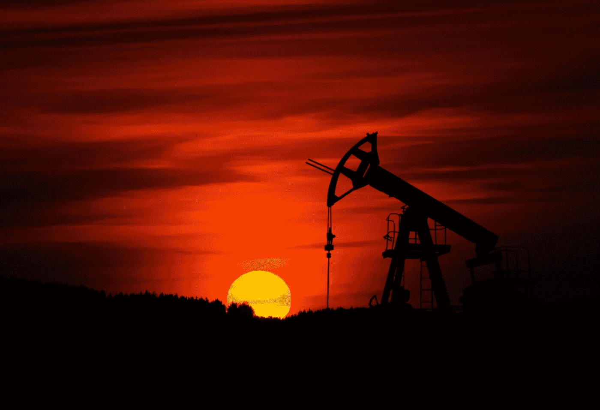

# 以不同方式思考的需要

> 原文：<https://medium.datadriveninvestor.com/the-need-to-think-differently-a3dd64d846b3?source=collection_archive---------16----------------------->

Photo by [Sandy Millar](https://unsplash.com/@sandym10?utm_source=unsplash&utm_medium=referral&utm_content=creditCopyText) on [Unsplash](https://unsplash.com/s/photos/environmental-portait?utm_source=unsplash&utm_medium=referral&utm_content=creditCopyText)

最近，在研究一个课题时，我碰巧读到了哈佛大学经济学家 N·格里高利·曼昆的一篇文章《捍卫那百分之一》。[【1】](#_ftn1)曼昆从一个荒谬的思想实验开始。他写道，“想象一个经济完全平等的社会。”当然，没有这样的地方，他的思想实验和他文章的其余部分一样失败了。像学术界、政府和其他地方的许多人一样，曼昆生活和工作在一个舒适的泡沫中，与我们大多数人每天面临的现实隔绝。我在这里的目的不是解构曼昆的文章。你可以自己检查一下。

也就是说，我的观察是，经济学家在我们的文化中是独一无二的。没有一个团体被允许谈论这么多而知道这么少，他们最大限度地行使他们的许可。花些时间来看看十几位最近的诺贝尔经济学家的著作。我的问题与他们奇特的统计创造以及他们用作人类行为和活动模型的东西有很大关系。曼昆试图捍卫 1%的努力是一个很好的例子。

在一个充斥着统计数据和数据流的世界里，经济学家似乎基本上是孤立的，他们忽略和无视现实，在得出结论时无视重大的社会成本，而这只是冰山一角。经济模型不包括所有的成本，只包括那些被认为是重要的和值得包含的成本。正如上面引用的文章所说明的，他们建立了许多没有现实基础的假设情况。他们简单地声明他们正在处理一个变量或一组变量，其他的一切都保持不变或假定不变。这种想法可能在硬科学或学术界行得通，但在人类有血有肉生活、工作、吃饭和玩耍并努力生存的地方，没有什么是理所当然的。然而，经济学家并没有被吓倒，而是通过推理提出了他们广泛的统计概括，最小化或忽略了关键的数据，同时弱弱地否认他们遗漏或忽略了任何相关的东西。

 [## 为什么包容性财富指数比 GDP 更能衡量社会进步？|数据驱动…

### 你不需要成为一个经济奇才或金融大师就能知道 GDP 的定义。即使你从未拿过 ECON 奖…

www.datadriveninvestor.com](https://www.datadriveninvestor.com/2019/03/08/why-inclusive-wealth-index-is-a-better-measure-of-societal-progress-than-gdp/) 

经济学非常唯物主义。它认为效率比其他因素更重要。然而，如果我们真的有效率，我们将创造一个尽可能少在地球上留下足迹的经济，而不是把它撕裂和吸干，让所有的生命悬而未决。如果我们有效率，我们会找到可再生和替代能源解决方案，以取代使用效率极低的化石资源。我们对化石燃料的持续使用和依赖正在摧毁我们赖以生存的地球。它们还需要巨大且不断增加的资本、材料、能源和劳动力投入，带来灾难性后果和收益递减。当前的经济模式允许环境成本，像社会成本一样，被忽略。它们只是被外化、隐藏和遗忘。随着气候变化开始给我们带来越来越大的打击，我们不能忽视我们的活动对我们赖以生存的空气、水和土壤的影响。健康和保护生物多样性是人类生活的基础，对我们的生存和繁荣至关重要。

The sun is setting for fossil fuels. Photo by [Zbynek Burival](https://unsplash.com/@zburival?utm_source=unsplash&utm_medium=referral&utm_content=creditCopyText) on [Unsplash](https://unsplash.com/s/photos/mining?utm_source=unsplash&utm_medium=referral&utm_content=creditCopyText)

经济学家可以发表任何荒谬的言论，而我们应该接受它的正确性，因为一位神谕，一位神圣受膏的弟兄，正在把它传给我们。伪科学或“社会”科学的终极梦想是发现一种“统一场论”，使一切都完全可预测、可量化、可测量和可计数。然后我们都可以去一个经济高效、科技发达、极权主义的天堂，从此过上幸福的生活。每个学科都有这样的人，他们相信他们的群体拥有通往真理、智慧和救赎的唯一途径。

一些人会认为经济问题并不存在。例如，一个佛教徒会在被问到“我有多少钱”时回答。我可能会回答，“显而易见的迹象是，一个人所拥有的等于他所需要的，因此，想要更多是没有意义的。”

经济学应该考察的是什么，而不是应该是什么。然而，我意识到现实是由我所看到的、我认为我看到的或我想看到的决定的。这是感知，我没有绝对的证据证明我“看到的”不受我想看的影响。同样，由于海森堡的测不准原理，物理实验者影响他的实验结果。

如果我们建立的模型中不包含价值观，如何研究人类的行为？我不能接受“历史”是一门社会科学。从定义上来说，它要宽泛得多，必须考虑到事件的方方面面，而不仅仅是对行为的研究。

如果我们根据与期望的产品或目的相关的能量、资本和劳动的数量来判断效率；那么我们的社会就是效率最低的社会。它看起来有效率，只是因为我们要么不考虑，要么隐藏真实成本，不报告。

对我来说，卡尔·马克思一直是一个发人深省的历史人物，因为他提出了许多关于资本主义的有趣问题，他对未来的预测也被证明是具有挑衅性的。我指的是马克思对资本主义的分析，而不是列宁、斯大林和毛主席创造的马克思主义模式，那是非常荒谬的，只不过是赤裸裸的利用一种伪装的国家资本主义——黑帮——的力量。

当前的经济模式允许将农业废水倾倒到野生动物保护区，这破坏了保护区，杀死并损害了野生动物。为什么？只是为了保护大农场的利润，以便种植更多的塑料蔬菜。这是理性的人吗？这是效率在行动吗？当前的经济模式只不过是我们非理性和低效行为的啦啦队长和借口来源，以及我们强奸和掠夺地球的借口。

辩证的方法可能描述一个过程，但它会导致一个高度结构化的死胡同。由此产生的环境问题比简单地归咎于生产方式、经济体制或社会要复杂得多。这些东西通过使问题成为一个模糊的抽象概念而将问题从视野中移开。作为个人，我们有责任，只有首先作为个人，我们才能做出任何改变或改变。

西方文明的失败在于，除了我们创造的简单的经济学定义之外，我们无法为成本找到一个综合的含义，并且我们对浪费我们所有资源——自然资源、物质资源、经济资源、政治资源、社会资源，尤其是人类资源——的实际成本视而不见。首先意识到这一点并致力于变革的国家或社会将引领并拥有未来。

在农业和其他领域一样，我们在使其变得更大的过程中，用更多的资本、更多的能源和更多的材料来获得更多的产量。农业已经成为另一种典型结果的工厂工业。

不幸的是，当大型农业企业购买土地时，为了提高产量，他们变得不太关心土地的质量。因此，在过去的半个多世纪里，个体农民已经放弃了大多数保持土地健康的保护方法，而代之以化学品和大型设备来增加产量，所有这些都基于化石燃料的使用。

虽然美国的农业被认为是高效的，并因其令人难以置信的生产率而受到称赞，但没有人看幕后。从输入的能量和获得的能量来看，这个系统的效率和破坏性都是惊人的。我们被所有的闪光和亮光蒙蔽了双眼，既看不到也不关心这些做法对明天的影响。今天最重要的是利润最大化。我们心甘情愿地做这些事情，却牺牲了我们自己孙辈子女的福利。

将近 200 年前，当我们的殖民者祖先发现密西西比河以西的地方时，有人称之为美国大沙漠。那里开阔的平原绵延数百英里，没有树木，一片空旷。如果我们继续我们现在的农业实践，我们会看到术语变成事实。大平原将成为美国的大沙漠。

很难相信我们被短期的财务收益蒙蔽了双眼，看不到更大的图景。我们是邪恶的帝国，在一场摧毁我们星球以满足我们欲望的竞赛中。在哥斯达黎加，雨林正在消失，所以可以种植更多的牛，不是为了喂养哥斯达黎加人，而是出口到美国和像汉堡王这样的快餐店！在哥伦比亚，农民正在失去他们的土地，以形成大型农场来种植出口到美国的饲料谷物。塞内加尔出口花生和蔬菜，而当地人却在挨饿。农民被迫在没有化肥的情况下种植这些转基因作物，直到土地耗尽，然后他们放弃土地。在菲律宾，政府征用农民的土地，交给跨国公司种植出口食品。

巴西正在清除热带雨林，种植大豆和甘蔗来制造汽车用酒精。在肯尼亚，土地被从农民手中夺走，交给像都乐这样的公司种植菠萝用于出口。墨西哥向美国出口食品，而墨西哥农民却在挨饿。北美自由贸易协定迫使墨西哥农民使用来自美国的种子玉米，这种玉米只能在一个生长季节使用，而且产生的玉米不会发芽，所以他们不得不购买更多他们负担不起的种子。在过去的一段时间里，这家名为 Gulf & Western 的公司控制了多米尼加共和国 85%的经济。

Photo by [Heather Shevlin](https://unsplash.com/@thehmstravels?utm_source=unsplash&utm_medium=referral&utm_content=creditCopyText) on [Unsplash](https://unsplash.com/s/photos/environmental-portait?utm_source=unsplash&utm_medium=referral&utm_content=creditCopyText)

最先认识到需要将其思维和经济转变为真正的绿色经济的国家，将在 21 世纪引领这个国家在这个星球的经济和政治事务中脱颖而出。选择是留在原地发牢骚，还是做我们的祖先会做的事情，改变自己以迎接新世界的挑战。

[【1】](#_ftnref1)【捍卫百分之一】N·格里高利·曼昆，2013 年 6 月 8 日，*经济透视*。