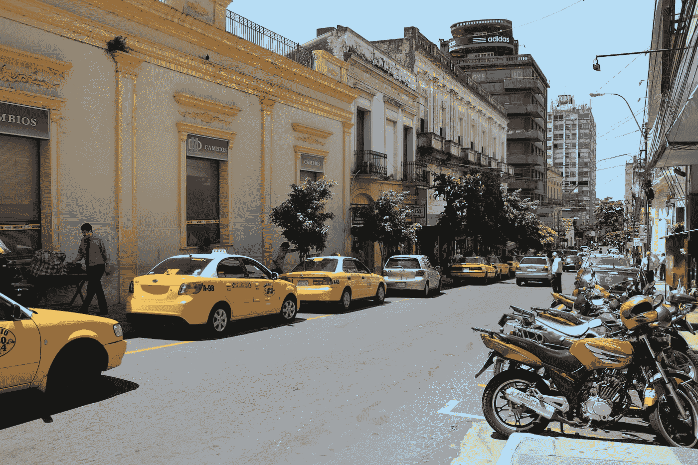

# 投资者的拉美新天堂

> 原文：<https://medium.datadriveninvestor.com/the-new-latin-american-paradise-for-investors-720d2ad8e0f3?source=collection_archive---------18----------------------->

## 面积比德国大，人口比匈牙利少，意味着空间大。

Image from [Veronika Schaale](https://pixabay.com/pt/users/schaale-3287515/?utm_source=link-attribution&utm_medium=referral&utm_campaign=image&utm_content=2121027) for [Pixabay](https://pixabay.com/pt/?utm_source=link-attribution&utm_medium=referral&utm_campaign=image&utm_content=2121027)

也许你已经听说过爱沙尼亚对新技术公司有多有吸引力，或者泰国对数字游牧民族有多有吸引力。然而，在南美洲有一个有趣的国家适合商业投资。它比英国大三倍，但居民比伦敦少。唯一一个大多数人说瓜拉尼语的国家。

在南美洲，你可以看到复杂的税收和商业法律(如巴西)，高通胀(如阿根廷)，或者经济崩溃和暴力猖獗(如委内瑞拉)。在那里，巴拉圭作为一片难得的乐土熠熠生辉。无声无息地，来自新世界各地的工业迁移到这个内陆国家。尽管如此，人们还是将他们与更发达的乌拉圭相混淆——提出了谁是最好的乌拉圭的问题。

在这篇文章中，我将揭示为什么巴拉圭是最适合冒险者的地方之一，并且很快会成为企业家圈里一个冉冉升起的名字。

## 按照拉丁美洲的标准，税收非常低

巴拉圭是南方共同市场(西班牙语称为南方共同市场)的创始成员国。这个贸易集团包括近 60%的拉丁美洲经济，包括 4 个处于不同发展阶段的经济体。虽然在收入或人类发展指数等指标上落后，但有一项指标巴拉圭人更擅长:税收。这可以通过比较[税收负担占 GDP 的百分比](/tax burden as a percentage of the GDP)来验证:

*   阿根廷:24.95%
*   巴西:34.4%
*   巴拉圭:12%
*   乌拉圭:23.1%

让我们客观地看待这些数字。这意味着巴西 1/3 的经济产出和阿根廷 1/4 的经济产出成为税收，与此同时，巴拉圭人支付的要少得多。这不仅使他们的一些城市，如埃斯特城，成为边境游客的购物天堂，而且对新企业也很有吸引力。

重要的是，巴拉圭的低税收是有成本的。该国的卫生或教育等公共服务不稳定，落后于该地区。

较低的税收吸引了整个大陆的产业，比如巴西服装巨头 Riachuelo。据 T4 报纸《国家报》报道，126 家阿根廷公司搬到巴拉圭以减少增值税，因为巴拉圭的增值税率只有 1%。正因如此，2017 年，《环球金融》杂志将巴拉圭戏称为南美的*迷你中国。该期刊认为这是进口零件和组装成品出口的理想场所。*

## 有利的人口金字塔。

66%的巴拉圭人不到 35 岁。这是该地区最高的百分比。

年轻人口使得社会保障平衡更容易处理。与巴西或阿根廷相比，这一点显而易见，这两个国家的退休人员数量相对于总人口而言都很大(而且还在增加)。

## 有弹性的经济

最近《经济学人》杂志将 T2 列为最强大的新兴经济体。巴拉圭和秘鲁(第 20 位)是唯一进入前 20 名的国家，远远高于其他南方共同市场成员国，仅次于捷克共和国。

*   巴西:第 30 名
*   乌拉圭:第 33 位
*   阿根廷:第 57 位
*   委内瑞拉(现已暂停经济集团成员资格):第 66 位(也是最后一位)。

该排名考虑了诸如*公共债务、外债、借贷成本*和*储备覆盖*等指标。巴拉圭的公共债务占 GDP 的百分比(越低越好)和借贷成本都很高。仅在*储备覆盖中，结果低于平均水平。*

 [## 为什么我们投资 FidoCure，也就是技术如何帮助拯救狗(最终拯救人类)免于癌症|…

### 10 月，安宣布获得由北极星创投领投的 1000 万美元 A 轮融资，我们增加了…

www.datadriveninvestor.com](https://www.datadriveninvestor.com/2020/12/06/why-we-invested-in-fidocure-aka-how-tech-can-help-save-dogs-and-eventually-humans-from-cancer/) 

## 该地区控制得最好的通货膨胀

《经济学人》的排名没有考虑一个在南美特别重要的指标:通货膨胀。如果他们这样做了，巴拉圭很可能会比其邻国拥有更大的优势。下面的 2019 年通货膨胀数字证实了瓜拉尼民族的优异表现:

*   阿根廷:53%
*   巴西:3.73%
*   巴拉圭: **2.76%**
*   乌拉圭:7.88%

所有的措施都显示了一个稳定和充满希望的经济。然而，的确，巴拉圭仍然没有面临[中等收入陷阱](https://en.wikipedia.org/wiki/Middle_income_trap)(当一个国家因为工资上涨而失去制成品出口的竞争优势)，而巴西等国家却陷入了其中。一旦他们达到这一水平，他们要么跟随韩国模式继续上升，要么像他们说葡萄牙语的邻居一样停滞不前。

## 这是一个快乐的国家

这可能与之前提出的所有其他观点形成对比。但是任何企业家都知道，生活满意度和其他非商业因素会影响业绩。

根据[盖洛普世界情绪温度](https://news.gallup.com/poll/248876/state-global-emotions.aspx)，巴拉圭拥有世界上最高的积极体验指数得分。该报告基于 140 多个国家的 150，000 多份采访，对人们的正面和负面经历进行了概述。91%的巴拉圭人表示有享受的感觉。这是立陶宛或白俄罗斯等欧洲国家的两倍多。

盖洛普全球管理合伙人[乔恩克利夫顿解释道](/Jon Clifton, explained):

> *【拉丁美洲的人们】也许并不总是认为他们的生活是最好的……但是他们笑着，微笑着，享受着世界上其他人所没有的快乐。*

作为一名拉丁美洲人，我赞同乔恩·克利夫顿的观点。在我的东欧创业之旅中，整个微笑事件已经导致了一些奇怪的情况。

## 结论——一个充满希望和独特的国家，有自己的挑战

几十年来，投资者忽视了巴拉圭。这个国家远离企业家的世界舞台。随着前几届政府的改革以及在过去二十年中实现(并保持)的稳定，瓜拉尼语国家成为南美洲的一个异类。

你可以把它想象成一个现代的埃尔拉多，有着自己的承诺和挑战。他们友好的文化和对投资的激励为寻求当地盟友的企业铺平了道路。巴拉圭仍然严重依赖巴西和阿根廷的经济(主要的商业伙伴)，不知何故，近年来巴拉圭的表现远远好于这两个邻国。

毫不夸张地说，就增长潜力而言，巴拉圭与埃塞俄比亚(世界上增长最快的经济体)或博茨瓦纳等国家不相上下。对于冒险者来说，巴拉圭是最好的选择。

*列维·博尔巴是 expatriateconsultancy.com***的 CEO，也是畅销书作家。你可以在这里* *查阅* [*他的书籍，在这里*](https://www.amazon.com/Levi-Borba/e/B082X6GSZF?ref_=dbs_p_ebk_r00_abau_000000) *订阅他的* [*未来文章(并免费领取电子书)。*](https://expatriateconsultancy.com/travel_hacks/)*

***获取专家观点—** [**订阅 DDI 英特尔**](https://datadriveninvestor.com/ddi-intel)*