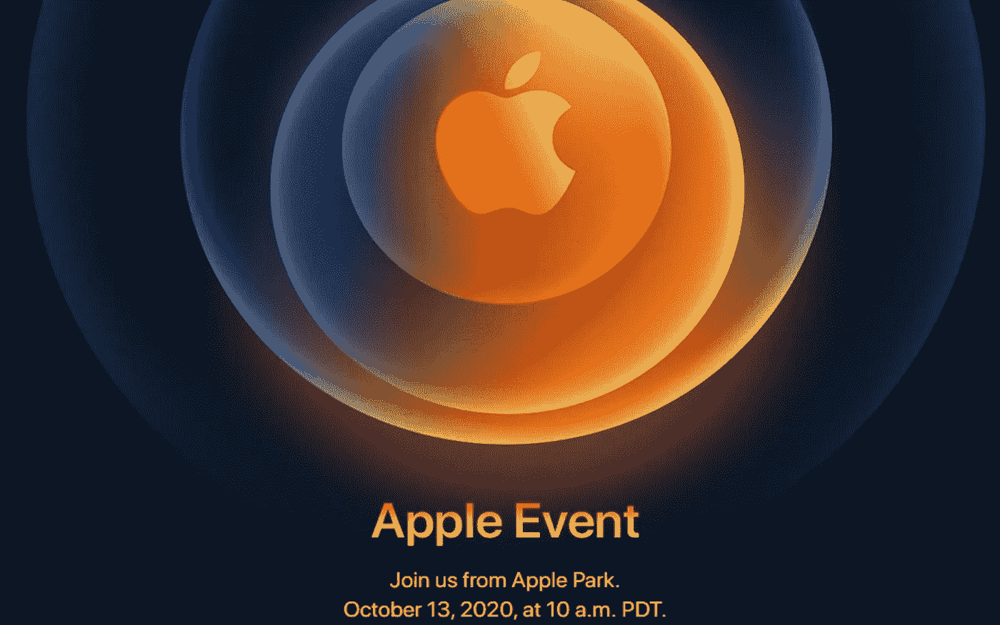
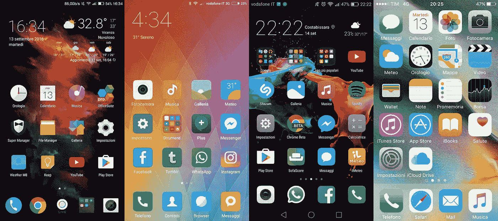
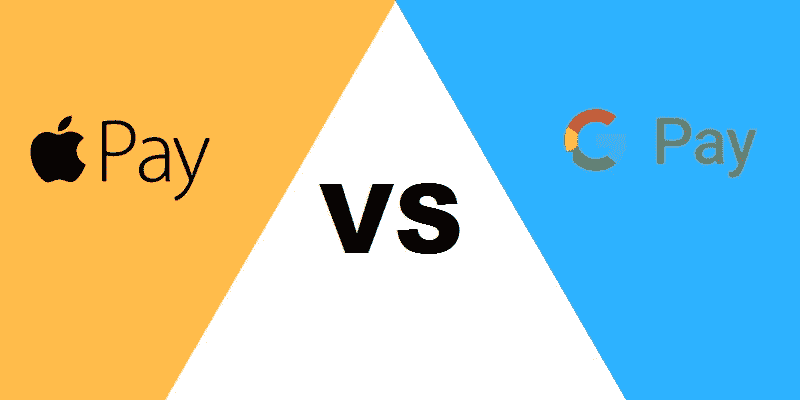
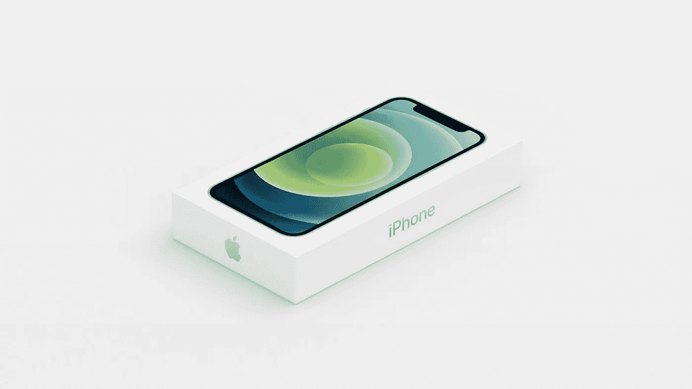

# 下一个大的技术趋势

> 原文：<https://medium.datadriveninvestor.com/the-next-big-tech-trend-1697fe095ab7?source=collection_archive---------33----------------------->

一旦一家大公司开始这样做，其他公司迟早都会效仿。

Credits: Apple

随着时间的推移，我们了解到，当一家大公司做一个新项目甚至一个新行为时，**大多数竞争对手也会做同样的事情**。他们何时应对并不重要，但趋势就是这样形成的。

让我们更具体地了解我的意思，但要做到这一点**我需要重温一些往事。**

 [## 抓住智能营销，获得巨大成果|数据驱动的投资者

### 网上的人都看过。每当人们在谷歌上搜索某样东西，他们最终都会与类似的广告互动…

www.datadriveninvestor.com](https://www.datadriveninvestor.com/2020/08/19/grab-on-to-intelligent-marketing-for-great-results/) 

大家都知道**限定**和极小是 iPhone 的主屏，而且那个(**在 iOS 14 更新**之前)它没有**抽屉**。在发布第一代 **iPhone** 几年后发生了什么？ **Huwaei** 带着他们的 **UI** 进来，而且不是唯一的，举几个例子，我们还有**小米**和 **Oppo** 。**用户界面的最小化主题确保了更少的内存消耗**。

MIUI vs EUI vs EMUI vs iOS

还有一个就是 Apple Pay 刚推出的时候，除了中国的一些公司像微信，小米有自己的钱包 app 等等之外，没有一家著名的智能手机公司马上就做了。接下来发生了什么？看到了关于 Samsung Pay 和 Google Pay 的广告。所以它变成了一种趋势。

Apple Pay Vs GPay

但是为什么我经常提到苹果呢？**因为这是主要论点，iPhone。**

我们来分析一下。苹果公司刚刚在 10 月 13 日公布了 iPhone 12 的发布日期。**10 月 23 日**，将会发布 iPhone 12，但是对于 Pro 和 Mini 版本，我们必须等到 11 月 13 日。在展示库比蒂诺的公司设备时，**首席执行官蒂姆·库克**宣布，iPhone 的盒子将会更薄，“更轻**”。**

****

****在 iPhone 盒子里，我们显然会有手机，但不会有** [**充电器和耳机。**](https://medium.com/y-technology/whats-happening-apple-d9ae60a8b982) 我们收到的 **USB C-Lightning** 用于快速充电。苹果公司表示，这是因为世界上有太多的电子垃圾。**

> **“在碳排放方面，这相当于每年减少 45 万辆汽车上路”，苹果表示。**

**实际上，这是对是错并不重要，甚至他们是在撒谎还是在说真话也不重要。**这是销售智能手机**和配件的新方式的开始。其他公司将会看到这种策略正在起作用，并且(可能)会看到其他公司会用他们的产品做同样的事情，这只是时间问题。**所以另一个趋势即将被创造。****

> **“下一个大的技术趋势。”**

**有了这个策略，**智能手机的营销将完全改变**对环境友好，或者向你出售一些过去几年生产但销售较少的配件。**

**回复你对这个话题的想法，如果你也是这么想的，就分享一下吧。**

## ****干杯！****

****

## **访问专家视图— [订阅 DDI 英特尔](https://datadriveninvestor.com/ddi-intel)**