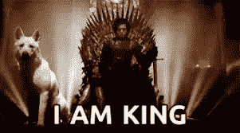
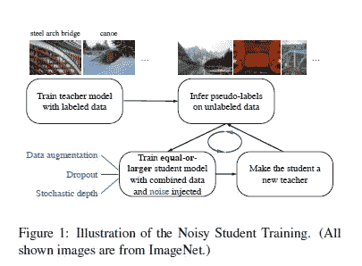
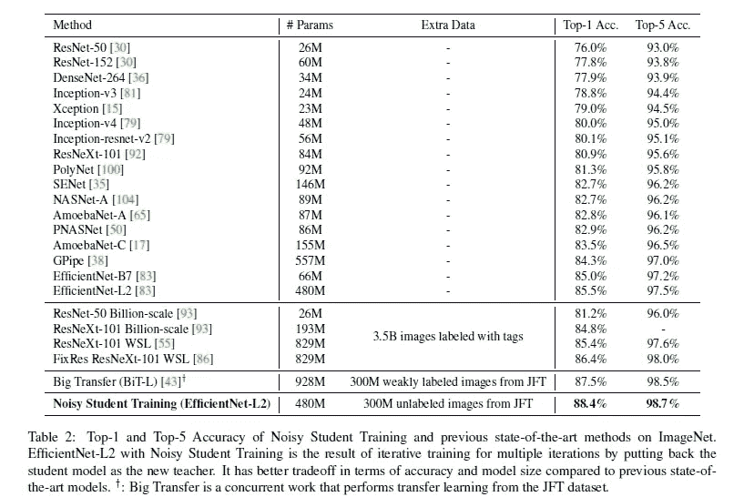
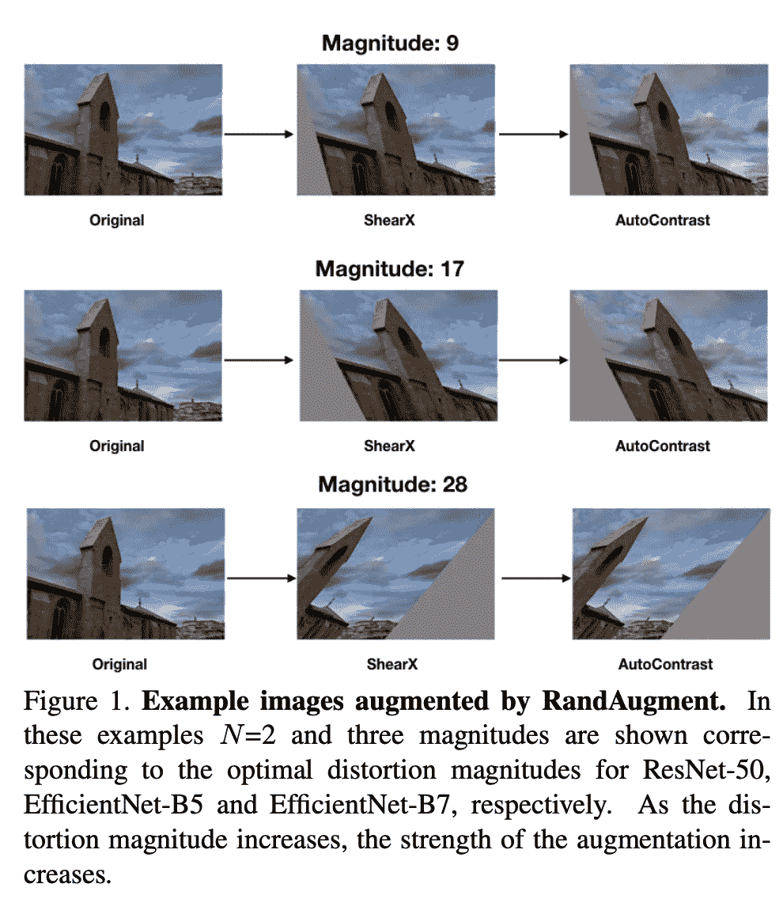
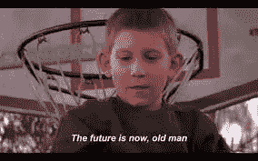
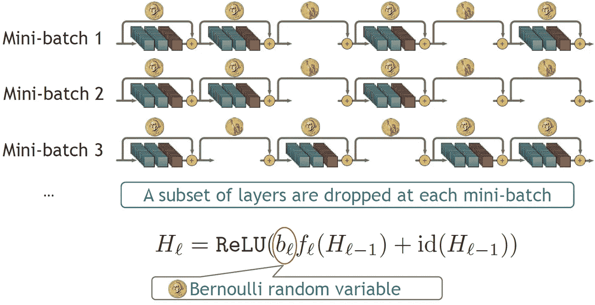
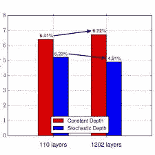
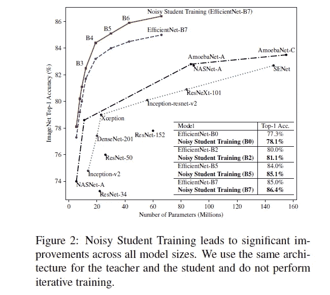
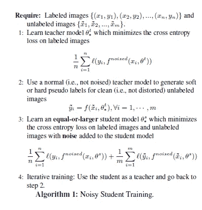
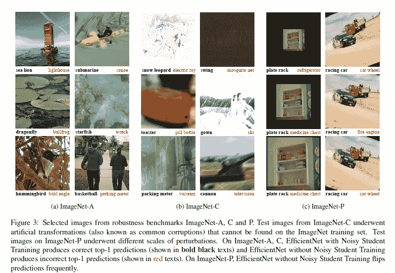

# 为什么用吵闹的学生进行自我训练比 SOTA 图像分类用更少的资源要好。第 1 部分:设置和噪声

> 原文：<https://medium.datadriveninvestor.com/the-next-big-thing-in-image-classification-self-training-with-noisy-student-for-improving-22d52dc74dda?source=collection_archive---------0----------------------->

## 老师们错了。吵闹的学生=最好的学生

作为一个有机器学习经验的人，让我告诉你一些事情:**给数据贴标签是一件痛苦的事情。**价格昂贵，必须非常小心。但是训练健壮的监督学习模型需要这一步。这就是为什么[【与吵闹的学生一起自我训练提高 ImageNet 分类】](https://arxiv.org/abs/1911.04252)谢启哲等人写的东西让我很开心。它利用噪声实现半监督学习来创建图像分类。他们的方法优于所有其他方法，同时需要更少的标记数据(双赢)。

本文将是深入研究该论文的系列文章的一部分。它将解释研究人员在他们的实验中使用的预处理、选择和训练策略(直到论文的第 3 部分)。我还会在文章的最后留下一个带注释的版本。它将突出论文的重要方面，并解释一些概念。如果你对这个话题感兴趣，一定要取消鼓掌按钮，这样我就可以有一些媒体影响力，让我的父母为我感到骄傲。

## 半监督学习(SSL):两全其美？

尽管有标记的成本，但放弃 SL 进行无监督学习是不可行的。它可以快速实现，适用于大量的任务。跟踪学习过程相对更容易，过程直观。模型训练也往往比无监督学习的计算成本更低。这导致了半监督学习(SSL)的兴起。SSL 是一种在训练过程中结合少量[标记数据](https://en.wikipedia.org/wiki/Labeled_data)和大量未标记数据的方法。这使得它可以获得具有大数据集的监督学习算法的好处(鲁棒和准确的算法)，而不需要投资标记大数据集。

SSL to training other approaches

## SSL 之前就有了。这张纸有什么不同？

这里有一个视频介绍了设置及其工作原理。

An illustration from the paper showing how they trained their models

从表面上看，他们的方法似乎是标准的。然而，有两件事情他们做得不同，增加了鲁棒性(开箱即用的泛化，或模型在新的看不见的数据上工作得如何)和准确性(标准数据集的更高分数)。这种优异表现的关键在于训练前和训练中采取的步骤。无标签学生模型比老师大。该团队还将**不同类型的噪声**注入到数据和模型中，确保每个学生比他们的老师学到更多类型的数据分布。这与迭代训练相结合特别有效，因为这利用了不断提高的教师。

Noisy Student uses lesser extra Data still outperforms. Looks like ResNet was ended.

## 关于那噪音

S 由于我们已经确定了噪音在本次培训中的重要性，所以了解不同种类的噪音也很重要。有两大类噪声可以实现。**模型噪音**指在训练过程中干扰模型。这可以防止过度拟合，并通过允许模型从不同的“角度”评估数据，实际上可能会提高准确性和稳健性。另一种称为**输入噪声**，在这种情况下，您会向输入端注入噪声。研究人员特别使用 RandAugment 来实现这一点。这有两个目的，一是增加数据的多样性，二是提高预测的准确性(特别是对于真实世界的数据，这是非常嘈杂的)。

Real Picture of the researchers in this paper

## 图表 1:输入噪声的随机增大

The GOAT at work

世界上有一些非常复杂的噪声函数。RandAugment 不在其中。不过不要被愚弄了，这是最有效的算法之一。它以一种非常容易理解的方式工作。想象一下，有 N 种方法可以扭曲一幅图像。这可以是任何事情，从改变一些像素为白色，到沿轴剪切。RandAugment 采用 2 个输入(n，m ),其中 n 是应用的失真数量，m 是失真的幅度。它返回最终图像。失真是随机应用的，通过增加可变性来增加噪声。

在该图中，我们看到 RandAugment 在不同的幅度下仅应用了两个(固定的)变换。这三个样本已经非常不同了。不需要天才就能算出通过改变多个图像的两个值可以得到多少(答案:很多)。不应忽视数据扩充。这也确保了学生模型总是至少和老师一样大，因此需要更少

## 附件 2:模型噪声的损失

辍学是一个过程中使用的神经网络等。它的过程非常容易描述:每次运行网络时忽略一些神经元。图片:

Standard DropOut Procedure

应用放弃是因为它停止过度拟合。通过忽略不同的单位，你改变了输出。反馈使它能够更好地概括。此外，可以实现 dropout 来创建来自一个网络的迷你学习者列表。通过集成，迷你学习者可以胜过父网络。

The Mini-learner Ensemble to the parent network

## 附件 3:模型噪声的随机深度

坦率地说，我对这个概念不是很熟悉。但是，嘿，这就是谷歌的目的。对此进行解读是令人惊讶的。这可能是整篇论文中我最喜欢的东西。如果我必须重新开始只有一个记忆的生活，这将是它。现在我们已经建立了宣传…

随机深度包括以下步骤。

1.  从非常深的网络开始
2.  在训练期间，对于每个小批量，随机丢弃一个层子集，并使用 identity 函数绕过它们。
3.  重复(如果需要)

Since we love visualizations

这似乎非常类似于辍学。在某种程度上的确如此。可以把它想象成深度网络的放大版。但是，确实有效。*“它大大减少了训练时间，并显著改善了我们用于评估的几乎所有数据集的测试误差。利用随机深度，我们可以增加剩余网络的深度，甚至超过 1200 层，并且仍然可以在测试误差方面产生有意义的改进(在 CIFAR-10 上为 4.91 %)。”这一点我不能否认。将很快对此进行深入研究。现在，看看这个图的绘图错误:*

See that Billy? That is Peak Performance

这三种噪音都以独特的方式对训练有所贡献。这三种方法都通过增加输入的变化来增加预测的稳健性。这是它在健壮性方面区别于所有其他先进模型的地方。事实上，它们非常有效，即使没有迭代训练过程，该过程也能够改进当前的网络技术水平(更多细节请见第 2 部分)。

Just applying noise has consistent improvements.

# 培训过程

现在我们已经了解了不同的步骤和调整是如何改进分类的，我们应该研究一些实现细节。

该团队使用交叉熵损失来计算损失。损失"*测量分类模型的性能，其输出是 0 和 1 之间的概率值。随着预测概率偏离实际标签，损失会增加。”*

对我来说，训练中最重要的部分是第三步。研究人员表示*“具体来说，在我们的方法中，教师通过读取干净的图像来产生高质量的伪标签，而* ***学生需要复制那些带有增强图像的标签作为输入*** *。”正如我们所见，给图像(或模型)添加噪声会极大地改变它们的外观。通过强迫学生使用增强图像，它允许模型以很高的准确性预测非常不清晰的图像。这方面的细节将在第 2 部分。但是现在，这里有一个例子来说明这对于预测模糊图像是多么重要。*

Take my money already, you beautiful model

# 后续步骤

感谢您阅读至此。这篇文章应该让你更好地理解团队使用的噪声和训练策略的种类。在第二章。我将分解实验细节，以及进一步创建最佳图像分类器的可能扩展。

查看我在 Medium 上的其他文章。:[https://rb.gy/zn1aiu](https://rb.gy/oaojch)

我的 YouTube。这是一个正在进行中的工作哈哈:[https://rb.gy/88iwdd](https://rb.gy/88iwdd)

在 LinkedIn 上联系我。我们来连线:[https://rb.gy/m5ok2y](https://rb.gy/m5ok2y)

我的推特:[https://twitter.com/Machine01776819](https://twitter.com/Machine01776819)

我的子任务:[https://devanshacc.substack.com/](https://devanshacc.substack.com/)

如果你想和我一起工作，请发邮件给我:devanshverma425@gmail.com

twitch 现场对话:[https://rb.gy/zlhk9y](https://rb.gy/zlhk9y)

获取我的内容更新-insta gram:[https://rb.gy/gmvuy9](https://rb.gy/gmvuy9)

获得罗宾汉的免费股票:[https://join.robinhood.com/fnud75](https://www.youtube.com/redirect?redir_token=QUFFLUhqa0xDdC1jTW9nSU91WXlCSFhEVkJ0emJvN1FaUXxBQ3Jtc0ttWkRObUdfem1DZzIyZElfcXVZNGlVNE1xSUc4aVhSVkxBVGtHMWpmei1lWWVKNzlDUXVJR24ydHBtWG1PSXNaMlBMWDQycnlIVXNMYjJZWjdXcHNZQWNnaFBnQUhCV2dNVERQajFLTTVNMV9NVnA3UQ%3D%3D&q=https%3A%2F%2Fjoin.robinhood.com%2Ffnud75&v=WAYRtSj0ces&event=video_description)

这是承诺的文件。