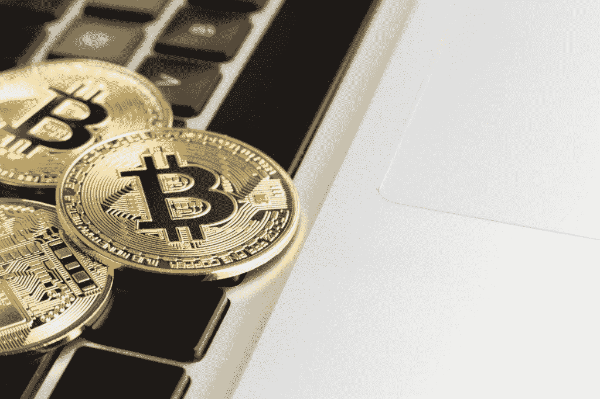
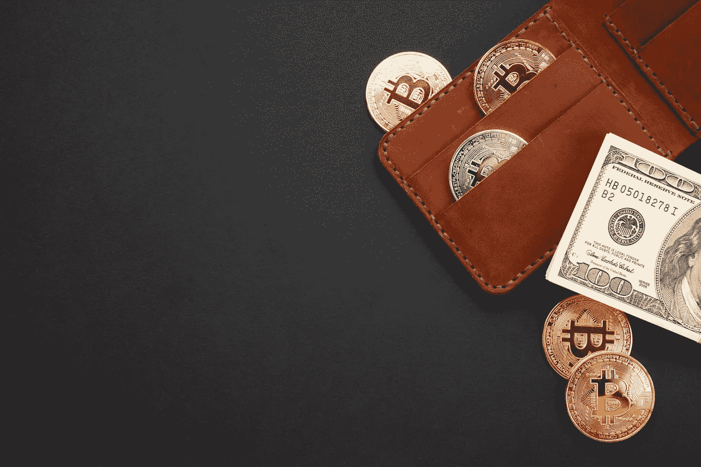

# 下一次比特币减半即将到来——抓紧了！

> 原文：<https://medium.datadriveninvestor.com/the-next-bitcoin-halving-is-coming-up-soon-hang-on-tight-7d5460a13e6e?source=collection_archive---------8----------------------->

Image from [Freepik](https://www.freepik.com/free-photo/bitcoin-top-keyboard_5481209.htm#page=1&query=bitcoin&position=45)

2019 年 11 月 24 日，我写了一篇文章，谈谈即将到来的比特币减半事件，以及围绕这一事件的炒作。你可以点击这里的或下面的[进入文章。](https://opinined.com/moving-towards-the-next-bitcoin-halving-event/)

 [## 即将到来的 2020 年比特币减半有什么大不了的？

### 预计 2020 年比特币减半将对比特币价格产生影响。但是具体怎么做呢？阅读来找出答案。

medium.com](https://medium.com/swlh/whats-the-big-deal-about-the-upcoming-bitcoin-halving-in-2020-318680a66915) 

今天，我在这里再次谈论将于 2020 年 5 月发生的比特币减半或“减半”事件。

无论你是加密领域的初学者，还是已经从事加密交易有一段时间了，这篇文章都将证明对你建立加密货币知识基础是有价值的，这样你就可以在这个理应蓬勃发展的行业做出更明智的投资决策。

我将首先讨论什么是减半，为什么会减半，减半对比特币的未来有什么影响。

为了让比特币减半更容易理解，有三个关于比特币网络的关键概念你需要知道。

## 什么是比特币区块链？

首先，让我们简单谈谈比特币区块链。比特币区块链基本上是所有比特币交易的实时运行记录。要理解区块链的意思，最简单的方法是把“块”和“链”分开。想象一下个人交易的记录，比如一个人给另一个人的付款，一个接一个地被列出或索引。一旦列表中的交易达到一定数量，就会形成一个阻塞。这是因为每个块都有它可以存储的最大事务数据量。

 [## 总部位于瑞士的 ETP 进入加密交易市场|数据驱动的投资者

### 虽然金融市场几乎没有沉闷的时刻，特别是在引入…

www.datadriveninvestor.com](https://www.datadriveninvestor.com/2019/03/10/swiss-based-etp-enters-the-crypto-trading-market/) 

一旦达到该块的最大事务数据量，就将该块添加到前一个事务块的后面。现在想象这些交易块用一条链连接在一起。因此，区块链仅仅指的是相互关联的几组交易数据。

比特币区块链的基本结构由一个遍布全球的电脑网络组成，电脑上安装了比特币软件。当比特币交易发生时，数据被传送到这个计算机网络，这些计算机验证交易，将交易添加到它们的比特币分类账副本中，然后将分类账更改广播到网络上的其他计算机。每个区块可以保存的数据量是最大的，因此大约每 10 分钟就会有一个新的比特币交易区块被创建、验证并发布到比特币区块链。

## 什么是比特币挖矿？

接下来，让我们谈谈所有这些比特币交易是如何在比特币网络上得到验证的。区块链上交易的验证和过账由矿工通过称为“采矿”的过程来完成。矿工是使用计算机处理能力来维护比特币区块链的人或人群。这包括通过将新交易分组为块并广播给比特币网络的其余部分进行验证，来保持比特币交易的分类账干净、一致和永久。

每个新的事务块都有一个在它之前发布的块的加密哈希，这是将所有事务块链接在一起以形成区块链的原因。因此，为了让网络接受一个新的块，矿工需要遵循一个工作证明系统，这涉及到为新完成的块创建一个新的加密哈希。因此，新的交易块具有来自前一个块的唯一散列，并且为了发布到分类帐，需要创建另一个唯一散列，该散列将经过验证过程，然后传递到下一个块，等等。为了为交易块创建新的唯一散列，矿工使用计算机能力相互竞争，试图成为第一个提出 64 位十六进制数或小于或等于网络的当前难度目标的散列的人。

为了更好地理解比特币 having 事件，你需要知道的关于比特币采矿的基本概念是，矿工每次验证一个新的交易块都会获得比特币奖励。挖矿奖励是之前没有流通的新挖矿比特币单位和已经流通的比特币交易费的组合。这些奖励旨在激励矿工参与采矿过程，以确保比特币网络继续受到审计，并在本质上保持冷静。

## 比特币的供应量怎么样？

让我们继续讨论比特币供应的概念。比特币是一种数字货币，由化名为“中本聪”的未知个人或群体开发。你对比特币了解的越多，开始理解的越多，你就会发现比特币和黄金之间的相似之处越多。这是因为 Satoshi 开发了数字货币比特币，以故意隐藏贵金属黄金的特征。我们在前面讨论的挖掘过程中认识到了这一点。勘探新的金矿床建造一个矿井并在矿井中开采黄金是费力的，类似于比特币矿工需要巨大的计算能力来进行猜测，以创建新的独特哈希来验证新的交易块。

另一个编入比特币的金光特性是最大供应量。可以存在的比特币总数是 2100 万个单位。这个 2100 万单位的最高限额是为了反映黄金稳定的通货膨胀率。你可能已经阅读和观看了解释比特币如何通货膨胀的内容，而其他内容解释了比特币如何通货紧缩。点击[此处](https://opinined.com/analyzing-bitcoin-price-prediction-models-for-2020-and-ahead/)或下方，阅读 2020 年及以后的比特币价格预测。文章谈到了预测比特币价格波动的两种最流行的模型。

 [## 分析 2020 年及以后的比特币价格预测模型

### 可以理解，对比特币未来表现的猜测是加密货币领域最热门的话题之一…

medium.com](https://medium.com/swlh/analyzing-bitcoin-price-prediction-models-for-2020-and-ahead-8fe1020f94fe) 

理解通货膨胀有两种不同的定义是很重要的。“通货膨胀”这个词最现代、最常见的用法是指货币购买力的下降。“通货膨胀”一词更古老的传统用法是指在现代通货膨胀背景下，没有黄金支持的货币供应量的增加。比特币是通缩的，因为随着时间的推移，由于其固定的供应，其购买力将增加而不是减少。理解这一概念的一个方法是考虑未来新的黄金前景变得极其罕见的时候。在采矿业，新前景的成本增加，直到开采新的黄金变得过于昂贵。因此，预开采黄金的固定供应量将随着时间的推移而增值，因为黄金无法被创造出来。有道理，对吧？

在传统的通胀背景下，比特币具有通胀性，因为没有黄金支持的比特币的供应正在增加，因为矿工们通过验证新的交易区块来开采新的比特币。目前，约有 1800 万比特币在流通，总供应量为 2100 万。按照它目前的轨迹，最后一枚比特币将在 2140 年被开采出来，也就是从现在算起的 120 年。所以在我们的有生之年，比特币的供应量会继续增加。太好了！

## 那么什么是比特币减半呢？

现在你已经对比特币网络、比特币挖矿和比特币的固定供应有了一点了解，我们来谈谈什么是减半，为什么会发生减半，减半对比特币的未来有什么影响。

比特币方面减半是指发放给矿工的比特币块奖励减少一半。目前，矿工的集体奖励是一个新开采的比特币的 12.5 个单位，这是以前没有流通的比特币。当减半发生时，在 2020 年 5 月，区块奖励将减半或减少一半，这将给予矿工每个有效区块 6.25 单位的新开采的比特币。

减半被编程为每 210，000 个块发生一次，由于大约每 10 分钟完成一个新的事务块，这相当于平均每四年发生一次减半事件。2009 年比特币刚开发的时候，2012 年的区块奖励是 50 个比特币。第一次减半将方块奖励降低到 25 个比特币，2016 年第二次减半事件将方块奖励降低到现在的样子，12.5 个比特币数字。

Image from [Freepik](https://www.freepik.com/free-photo/wallet-with-currency-flat-lay_5481290.htm#page=1&query=bitcoin&position=1)

## 为什么会出现减半？

中本聪计划每 21 万块新开采的比特币减半，以防止通货膨胀降低比特币的购买力。Satoshi 还考虑到比特币算法随着时间的推移技术进步的增加，因此新块验证越快，为新块创建新的唯一散列就越困难。按照目前每块 12.5 比特币的区块奖励率(大约每 10 分钟发生一次)，每天约有 1800 个新的比特币被开采出来，这使得传统意义上的通胀率约为 3.8%。在 2020 年 5 月将块奖励率减半至 6.25 比特币后，每天将开采约 900 个新比特币，将年通胀率降至 1.8%，这将使比特币的通胀率低于美国经济！

将新开采的比特币数量分阶段减半，可以控制比特币的有限或固定供应随着时间推移逐渐进入流通领域的速度。与黄金类似，这创造了一个可预测的、不断降低的通胀率，最终将达到零。

## 比特币减半意味着什么？

现在我们来谈谈减半对一个比特币有什么影响。黄金被认为是最好的价值储存手段之一，因为它的供应是固定的，而且由于供应不是非常充足，黄金是稀缺的。这种稀缺性是自然造成的，因为我们无法创造黄金来增加供应。类似地，规定比特币固定供应量的算法旨在让比特币比黄金更稀缺。因此，如果比特币的固定稀缺供应需求保持稳定或增加，比特币的价格将受到积极的长期影响。在 5 月份减半后，比特币的供应将变得更加稀缺。

我们来看看之前的比特币有了之后发生了什么。2012 年 11 月第一次减半时，比特币约为 11 美元。然后在 2013 年，整整一年后，比特币飙升至 1100 美元——这是当时比特币的最高价格，之后回落至 220 美元左右，并在接下来的几年里保持在 1000 美元以下。2016 年 7 月，在第二次减半期间，比特币在 600 美元左右，然后在 2017 年底附近飙升至 20，000 美元，这是大约 18 个月后的事情。因此，从历史上看，在减半事件发生后的 12 至 18 个月内，比特币价格没有太大变化。此外，还不太清楚减半事件后 12 至 18 个月内的价格峰值实际上只与减半相关。比特币价格第一次飙升至 1100 英镑发生在减半事件整整一年后，似乎与塞浦路斯纾困计划有关。比特币价格第二次飙升至 2 万美元发生在减半发生后的整整 18 个月或一年半，这似乎是由市场操纵引起的，因为加密货币正在主流媒体上出现，并吸引了大众的注意力。

那么，减半对 2017 年末飙升至 2 万美元有影响吗？或许不是价格飙升，但更有可能的是，自那以后，比特币价格一直保持在 3000 美元以上。那么，关于即将到来的 2020 年 5 月减半事件，这些历史数据告诉了我们什么？自 2016 年上次减半以来，比特币变得越来越受欢迎，5 月份即将减半的价格可能已经反映在价格中，并且已经有一段时间了。有很多关于即将减半的炒作，所以比特币的价格很可能会在减半事件后大幅下跌，因为如此多缺乏经验的人和投资者都认为比特币的价格会在减半事件后立即上涨。

## 那么我们得出什么结论呢？

与之前的减半事件一样，我不希望看到任何仅因减半事件而产生的剧烈而持久的变化，而没有相关的积极或消极的外部力量，如政府监管、市场操纵、经济事件或类似事件。关于 2020 年 5 月及随后几年比特币价格减半的问题，反对比特币定价未来的理论、观点和预测有很大空间。因此，对即将到来的比特币减半进行自己的研究并得出自己的结论非常重要。

*原载于 2020 年 3 月 8 日*[*【https://opinined.com】*](https://opinined.com/understanding-the-upcoming-bitcoin-halving-in-may-2020/)*。*