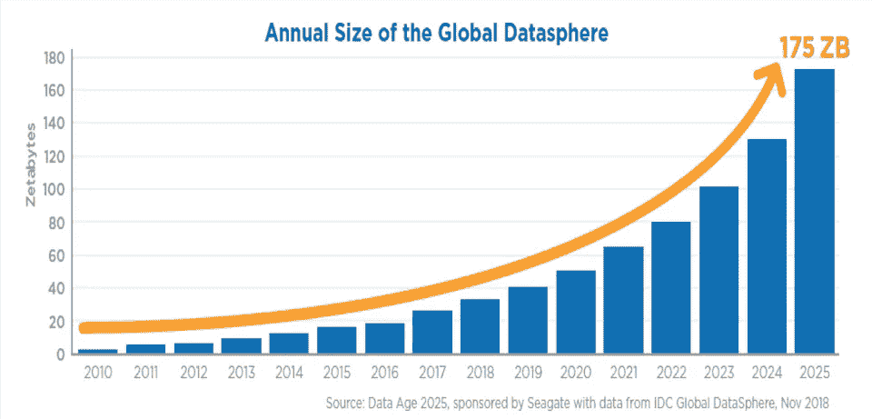
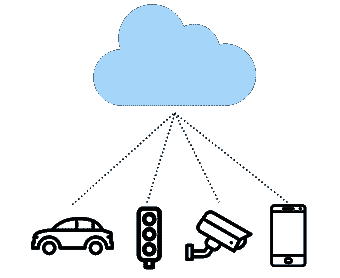
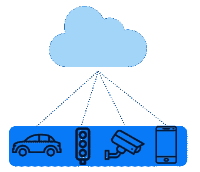
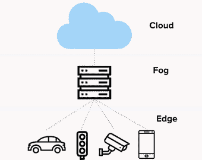
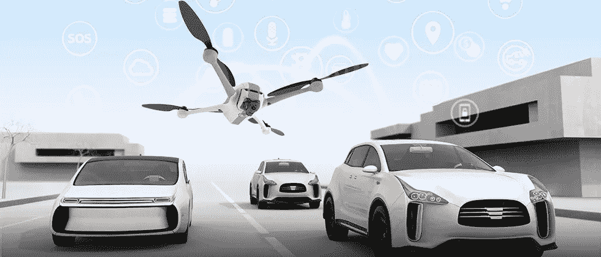

# 下一个云:边缘计算

> 原文：<https://medium.datadriveninvestor.com/the-next-cloud-edge-computing-4254c6443572?source=collection_archive---------11----------------------->

## 边缘计算实现物联网乌托邦

每天我们都会产生超过 2.5 万亿字节的数据！！**我们 90%以上的数据都是在过去 4 年中产生的。**随着我们走向我们在书中读到的未来科技乌托邦，这些数字只会越来越多，每个家庭都有智能设备，无人驾驶汽车在街上漫游。物联网将连接从智能手表、电视、医院、烤面包机到城市的一切。

但是这种重数据的视觉有美元和网络成本。自主车辆🚗据前英特尔首席执行官称，平均每八小时驾驶会产生超过"[40tb](https://channels.theinnovationenterprise.com/articles/why-big-data-is-the-future-of-self-driving-cars)的数据"。

去年，我们有超过 142 亿台物联网设备，到 2025 年将达到 750 亿台。比 2015 年增长了 5 倍！到 2026 年，我们将在这些设备上投资超过 [1 万亿](https://www.statista.com/topics/2637/internet-of-things/)，物联网将产生超过 79.4 兆字节(ZB)。

那么这些数据都去了哪里呢？到云☁️.

## 按需计算，云

你最常用电脑做什么？在网上看猫咪视频？这与 95%的人主要使用笔记本电脑浏览互联网相差不远。如果你用过 gmail、i cloud 或者从网上买了什么东西，你就已经和云互动过了。

 [## 生活在边缘|数据驱动的投资者

### 为边缘和混合计算而重新设计的旧思想这是一种数据抓取！感觉每个行业的每个人…

www.datadriveninvestor.com](https://www.datadriveninvestor.com/2019/03/22/living-life-on-the-edge/) 

云计算是从你的电脑上处理数据。**如果你有互联网，你可以在任何地方访问它**，它基本上是按需计算。人们不需要购买额外的存储硬件，也不需要担心维护问题。数据被发送到像 AWS 或 Google cloud 这样的云中心，由他们来处理这些脏活。

但是有一些短暂的云…

*   延迟，如果数据太多，速度会很慢。
*   发送这么多原始数据是有风险的，可能容易侵犯隐私。
*   依赖于互联网连接。

Edge devices send data to be computed on the cloud

存储所有这些数据需要巨大的能量和代价💰。它还会阻塞大量带宽，如果你想到像高速公路上的汽车这样的数据，如果汽车太多，道路就会变得拥堵，汽车需要更长的时间才能到达目的地。当数据太多，到达目的地(云)需要更长时间时，同样的情况也会发生

高带宽就像宽阔的道路，但如果我们一开始就可以减少路上的汽车，如果我们不需要向云发送这么多数据，会怎么样？

好吧，当云不够的时候，边缘就出现了

## 云计算伙伴:边缘计算

边缘设备位于网络的**边缘，在这里数字世界和现实世界相连接，想想你的手机、汽车、相机等等。**

边缘计算是在我们将数据发送到云之前，在边缘设备上清理数据并运行分析。我们正在将计算过程从云端转移到离用户更近的地方。

Edge devices AND the cloud compute

这怎么更好？

通常，我们会将大量数据发送到云中，然后开始对其进行分析。在边缘计算中，通过在发送之前清理数据，我们节省了时间、成本、隐私和能源，因为它需要传输的距离更短。

仍然考虑像道路上的汽车这样的数据，如果有很多汽车，那么将会有拥堵的交通，汽车将会移动缓慢。

当我们在本地预处理数据时，路上的车辆基本上减少了，使得车辆行驶得更快。

数据传输需要多长时间(汽车到达目的地需要多长时间)被称为[延迟](https://www.highspeedinternet.com/resources/bandwidth-vs-latency-what-is-the-difference)以秒计算，**我们希望延迟更少所以延迟更低。** [带宽](https://www.youtube.com/watch?v=bNUIliQocTc)就像汽车的速度或道路的宽度，数据传输的速率，以比特率(比特/秒)来衡量

比依赖互联网的云更可靠。即使有故障点，我们也能运行，没有互联网，边缘设备仍能进行基本计算。

## 中间层雾计算

雾计算和边缘计算这两个词经常互换使用。雾计算是一个笼统的术语，而边缘计算是雾的一个细分。雾层位于云和边缘之间，将它们连接在一起。

## 5g + edge = power combo

今天的 4g 网络可以支持每英里 4000 台设备，5 g 可以让这一数字翻一番。传言 5g 比 4g 网络快 10 倍。但 5g 也需要用户比 4g 距离更近。太打击这个 5g 需要边缘计算才能生存。服务提供商有许多边缘(蜂窝塔)，通过边缘计算，他们可以比从核心进行更快地提高速度，他们甚至可以通过向第三方开放其边缘来产生 IaaS(基础设施即服务)收入。

边缘计算将被用在任何需要快速、安全、廉价的数据传输的地方。随着 5g 和边缘计算的发展，物联网将会蓬勃发展。

## 游戏和虚拟现实

人们渴望实时和互动游戏，在数百万人在线的竞技游戏中，每一毫秒对玩家来说都可能是成功或失败的时刻，滞后时间实际上是非常昂贵的。借助边缘计算，高质量游戏变得更加容易。

亚马逊 Prime、网飞和 Disney+等流媒体服务将产生大量数据，以应对他们使用边缘缓存的网络负载。受欢迎的节目和电影被缓存在用户附近的中心。

要让 VR 和 AR 像真实世界一样身临其境，人们需要能够实时交互，尤其是在多人游戏环境中。滞后甚至会导致一些用户头晕和恶心，潜在地使他们迷失方向。

## 自动驾驶汽车和无人机

当生命垂危时，每多一秒钟都可能是致命的，自动驾驶汽车需要快速的响应时间，他们每秒钟必须运行数百次计算。平均而言，一辆自动驾驶汽车每天将产生 15tb 的数据。将如此大量的数据发送到云是昂贵的，机载计算和数据预处理可以帮助减少延迟并提高安全性。

## 智能医院和城市

城市将从管理交通、公共设施和其他基础设施的传感器和摄像机中产生大量数据。它们可以与自动驾驶汽车协同工作。红绿灯和摄像头实时行动同样重要

医院有许多分析和收集患者数据的设备。如此多的原始患者数据被随意发送，有被截取的风险。我们希望尽可能多的数据留在本地。

边缘计算不会取代云，相反，它们将是一对强大的搭档，相互支持，实现我们梦想的充满互联汽车、城市、人、物和大量数据的未来科技乌托邦。

## 关键要点🔑

*   边缘设备是现实世界和数字世界的交汇点
*   边缘计算是指这些设备清理数据并进行一些计算，然后将其发送到云中进行进一步计算
*   边缘计算与云计算协同工作，延迟更低，更安全，更便宜，甚至在云失败时也能工作
*   云计算是连接边缘和云的一层
*   边缘计算将影响需要低延迟和大量数据的领域，如自动驾驶汽车、智能城市，并将帮助推动 5G 向前发展

希望你学到了一些新东西，并一如既往地随时联系 LinkedIn 或订阅我的 T2 时事通讯获取新内容:)