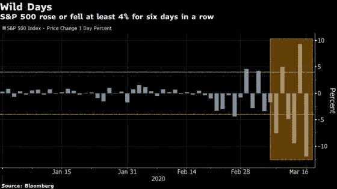

# 下一次萧条？

> 原文：<https://medium.datadriveninvestor.com/the-next-depression-af083b846e0d?source=collection_archive---------13----------------------->

Volatile Days

世界经济应该为 2007/2008 年规模的灾难做好准备，甚至可能是大萧条，因为电晕疫情和随后政府未能充分应对。

西方自由民主国家的典型反应是通过货币政策来解决股市下跌的问题。发生这种情况通常是因为政治部门的党派之争迟缓，以及央行被视为公正和技术官僚的凭证。对于央行来说，策略很简单。大幅降息以刺激投资，并投入数万亿美元支撑不断下跌的资产价格。然而，认为这除了支撑失败投资者的资金之外，还会有任何其他效果，那是完全可笑和痴心妄想的。失败投资者仍将继续像野火一样抛售股票。为什么会这样呢？

经济基本面处于混乱状态，因此这些股票价格的真实性被完全破坏了，无论你试图玩多少量化宽松的绝地思维把戏。你所做的一切都是在让某个阶层的人富裕起来，那些拥有股票的人。

 [## 保护主义、政治和经济动荡|数据驱动的投资者

### 美国股市昨日出现 400 多点的大幅反转，为未来的事情发出了警告信号。市场…

www.datadriveninvestor.com](https://www.datadriveninvestor.com/2018/06/28/protectionism-politics-economic-turmoil/) 

受影响国家的消费正处于历史最高水平，这是因为完全的经济关闭，中国工厂关闭的供应冲击，以及每个国家都在参与(理所当然地)减缓疾病传播的日益孤立主义态度。简单地说，这是企业的收入问题——每个人都在赔钱。现在，当企业亏损时，像大幅降低利率(甚至降至零)这样的政策不太可能鼓励负担沉重的企业在一个失败的商业周期中进行更多投资。即使他们真的这么做了，他们最终也会背上更多的债务(尽管利息更低)，并且没有足够的收入来维持运营。虽然银行可能还没有陷入困境，而且由于资本缓冲和杠杆限制，它们比 2007 年安全得多，但全面持续的亏损将严重损害银行业。

当务之急是，政府不要救助倒闭的企业，而是利用财政政策增强消费者的权能。如果僵化和一成不变的雇主在短期内得到拯救，没有顾客的企业将无法持续，只会成为纳税人的负担，成为对各地劳动人民的侮辱。让企业对不断变化的经济做出适当的反应。只有通过允许企业对需求和供应做出有机反应，才能找到长期解决方案——是的，这意味着短期内经济将在航空等特定部门陷入困境，但这不是像特朗普所说的那样，让资本主义游戏中的“失败者”变得更加富有——那些未能对灾难性情况负责的商人(更重要的是，那些幸存下来的人将更具竞争力，更有备无患)。政府的责任不是充当企业的最后代理人，而是成为一个负责任的代理人，关注此类灾难的社会、政治和经济后果。对政府来说，不平等和社会动荡与繁荣的经济一样重要。

自上而下拯救企业的论点有两个方面:首先，这些企业都形成了一个健康、稳定的经济和政治所需的错综复杂的服务网络。杂货商、餐馆、飞机、零售商店都是出于各种原因需要的，无论它们是基于健康的、基于娱乐的，还是经济机器中的一个重要齿轮。第二，这些企业是就业的核心，为数十万甚至数百万人提供了生存手段。

至于第一个论点，扶持一家濒临破产的企业，却不给人们从这些企业购买的手段，是一种不切实际的解决方案。你将支持航空业，却发现没有人还在飞，从而给政府造成巨大损失，最终给公司员工造成损失。这是一个短期的解决办法，是大洪水之前的一根手指。它还从根本上误解了驱动经济的因素，以及经济的实际需求:人。人们有贪得无厌的需求，如食物、衣服和娱乐。他们将尽其所能满足这一点。只要人们有办法，企业就有一个社会目的:提供目的。没有手段，企业就无法实现目标。如果能避免许多行业的短期崩溃，我不反对对企业和消费者进行双重救助。人们仍然更希望看到企业有机地适应不断变化的需求和供给。

至于第二个论点，虽然企业确实提供了大部分就业机会，但无可争议的是，雇主拿走了大部分利润和收入，几乎没有给雇员留下什么。对企业供应面的任何提振都不会改变相对利润/工资比率。此外，任何对消费者的好处，如降低产品价格，都将被可能降低的工资所抵消。

我怀疑(我可能错了)解决需求侧消费这一关键问题的措施不会很多。这有几个原因。首先，美国的行政部门最有可能坚持共和党的供应方推理。还有一个额外的因素是金融、商业、政治精英复合体，在那里富人混杂在一起并资助政客，创造了巨大的激励来拯救他们的伙伴和赞助人免于彻底崩溃。这种政治经济精英的“融合”适用于所有国家，而不仅仅是美国。

更糟糕的是，由于病毒的性质，财政政策在短期内可能没有效果。只有在人们购买的情况下，需求才会起作用，尽管直接提高工资、薪水或建立全民基本收入等措施会增加消费者的购买力，但围绕冠状病毒的恐惧和恐慌仍有可能抑制消费者的购买决心。

因此，做好准备，迎接一场非常、非常严峻的短期危机，甚至可能是一场更加致命的长期危机。