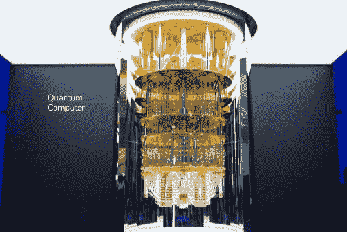
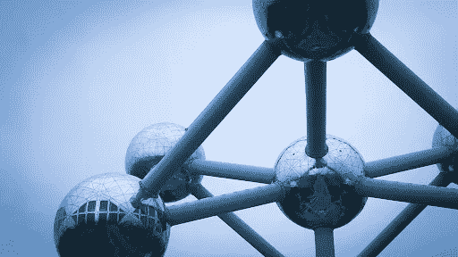

# 下一个科技时代

> 原文：<https://medium.datadriveninvestor.com/the-next-era-of-tech-6f7323333e40?source=collection_archive---------24----------------------->

量子计算。

这似乎是继人工智能之后最流行的词汇。然而，我用来尝试理解量子计算概念的许多资源很难快速理解。在我自己理解了这些概念之后，我决定撰写这篇文章，作为理解下一个技术时代:量子计算的简单易懂的指南。

*N.A. IBM System Q One. N.A. IBM.* [*https://www.ibm.com/quantum-computing/*](https://www.ibm.com/quantum-computing/)*.*

# 什么是量子计算？

今天的技术是基于经典物理学的。然而，**经典物理学正在限制我们技术的能力，并导致计算机效率降低**。量子计算机基于量子物理学，特别是量子力学，它在原子的尺度上解释了自然的物理性质。这使得计算机更有效率，并增加了它们的能力。

你一定想知道，量子计算机到底是如何变得更高效的*？让我解释一下…*

# 拥有超能力的粒子？！

量子计算机引入了计算机从未见过的量子物理学方面:

*   **叠加**

允许亚原子粒子同时是波和粒子。

*   **纠缠**

允许不同的粒子同时受到影响，即使只有一个粒子直接受到原因的影响。

*   **量子隧道效应**

允许粒子穿过屏障，比如经典计算机中的晶体管。

*Kurzgesagt — In a Nutshell. “Quantum Computers Explained — Limits of Human Technology.” YouTube, commentary by Steve Taylor, December 8, 2015,* [*https://www.youtube.com/watch?v=JhHMJCUmq28*](https://www.youtube.com/watch?v=JhHMJCUmq28)*.*

本质上，这些超级英雄般的粒子可以同时处于两种或更多种状态，可以通灵，可以穿墙。利用这些方面，与经典计算机相比，量子计算机以非常不同的方式处理信息。普通的计算机使用比特，一系列的 1 和 0 来理解信息。然而，一个位只能是 1*或 0*。**量子计算机使用量子比特，由于叠加的缘故，量子比特能够以多种状态存在**。这允许它们同时为 1 *和* 0。多酷啊。

所以请继续阅读…

# 效率的例子

由于量子位使用了如上所述的特性，量子计算机在解决某些问题时比经典计算机更有效。经典计算机的能力是有限的，因为计算机部件只能如此之小，直到量子物理属性(如量子隧道效应)开始对计算机的功能产生负面影响。

这方面的一个例子是，在经典计算机中，电子利用量子隧道效应穿过晶体管。当计算机部件变得超级小，并进入量子物理领域时，这可能会发生。

*Kurzgesagt — In a Nutshell. “Quantum Computers Explained — Limits of Human Technology.” YouTube, commentary by Steve Taylor, December 8, 2015,* [*https://www.youtube.com/watch?v=JhHMJCUmq28*](https://www.youtube.com/watch?v=JhHMJCUmq28)*.*

相反，量子计算能够利用量子物理的特性为自己服务。例如，量子计算机在解决旅行推销员问题时比经典计算机快得多。如果你不熟悉这个问题，它说一个销售人员需要访问一系列城市。使用每对城市之间的距离，访问每个城市然后将销售员返回到始发城市的最短可能路线是什么？

这个问题可以用传统的计算机来解决，但是这需要很长的时间，因为传统的计算机会单独测试每一条路线。例如，如果给定一个包含 33 000 个城市的列表，一台传统的计算机需要 15 年才能解决这个问题。**如果计算机使用 85 000 个城市的列表，解决这个问题需要 136 年。**使用量子计算机，由于量子位可以同时处于不同的状态，计算机可以同时测试多条路径。这使得该过程更加有效。

现在精彩的部分来了…

# 量子计算的现实应用

## 药物开发

模拟不同化合物的化学组成是经典计算机难以有效执行的另一个问题。然而，量子计算机能够快速完成这项任务。使用量子计算机进行药物开发的公司之一是 [ProteinQure](https://www.proteinqure.com/) 。这家公司结合人工智能和量子计算等技术来设计医学。

## 网络安全

今天的在线安全系统是基于非常大的数字的分解，因为这是一个经典计算机需要花费大量时间来执行的任务。这些系统将被量子计算机破坏，因为它们能够相当快地分解大量数字。然而，现在还不要惊慌！今天的量子计算机太容易出错，无法开始拆除我们的安全系统，但这是未来网络安全的一个领域。

尽管能够拆除我们的加密系统，量子计算也可以有助于创建更强大的网络安全系统。后量子密码术，也称为抗量子密码术，是一个正在开发对经典和量子计算机都安全的加密系统的研究领域。 [Post-Quantum](https://www.post-quantum.com/) 是一家目前致力于创建后量子密码加密系统的公司！

## 天气预报和气候变化

即使使用今天用来预测天气预报的技术，有时预测也可能完全错误。量子计算机能够分析大量用于天气预报的数据，因此它们在预测天气时会更加精确。然而，这是量子计算的一个应用，处于研究的早期阶段。

此外，量子计算在应对气候变化的斗争中非常有用。量子计算机可以建立改进的气候模型，使我们能够更快地对气候变化的潜在影响做出反应。此外，量子计算可以通过模拟复杂的碳捕获分子来帮助应对气候变化，这比当前的模型更便宜、更有效。对于量子计算来说，这绝对是一个令人兴奋且非常有影响力的应用！

# 当前量子计算机的一些缺点

即使量子计算是下一个技术时代的一部分，这些计算机要成为主流还有很长的路要走。这些只是量子计算机向前发展需要解决的一些缺点:

*   它们需要保持非常低的温度(-273 摄氏度)，以减缓粒子的速度，防止可能改变结果的碰撞。
*   他们制造很多噪音。点击[这里](https://www.youtube.com/watch?time_continue=2&v=o-FyH2A7Ed0)听 IBM 的量子计算机。
*   他们现在有很多错误。

量子计算机肯定还有很大的改进潜力！

# 关键要点

*   经典物理学正在限制我们技术的能力，并导致计算机效率降低。
*   量子计算机引入了量子物理学的一些方面，使它们更有效率。
*   这些方面包括叠加、纠缠和量子隧道效应。
*   量子计算机使用量子位而不是比特，并应用上面概述的量子物理学原理来提高效率。
*   量子计算的现实应用包括药物开发、网络安全、天气预报和气候变化

量子计算机绝对是引领下一个科技时代的先锋。请在下面留下你对量子计算的看法！你认为量子计算机什么时候会变得更加主流和知名？

*原载于 2020 年 7 月 14 日 https://www.datadriveninvestor.com***。**