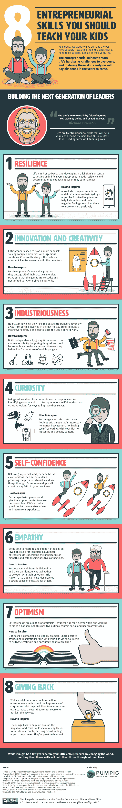

# 下一代企业家:养育孩子的 8 个技巧

> 原文：<https://medium.datadriveninvestor.com/the-next-generation-of-entrepreneurs-8-tips-for-parenting-a-kidpreneur-1fe58f5c1940?source=collection_archive---------11----------------------->

## 当谈到在年轻时培养企业家精神时，让你的孩子在经营企业时牢记这些技能

Photo by [Free To Use Sounds](https://unsplash.com/@freetousesoundscom?utm_source=medium&utm_medium=referral) on [Unsplash](https://unsplash.com?utm_source=medium&utm_medium=referral)

当夕阳西下，最后一点温暖从建筑物的烤砖上消散后，当我和我的未婚妻决定去公园享受宜人的天气时，寒风开始吹过小镇。在公园的远处角落，我们注意到一个小孩靠卖冰淇淋发了财。这个世界上没有人能轻视对冰淇淋的渴望！因此，不用担心卡路里的摄入，我们吃了一份圣代冰淇淋，上面撒了糖屑、鲜奶油、棉花糖和黑樱桃。

我一边享用甜点，一边小声对我的搭档说:“他每天晚上都在这个地方卖冰淇淋。”

作为对我评论的回应，我的未婚妻补充道，“是的，他从来不像其他青少年那样玩。我想知道为什么？”

在寻找答案的时候，我看到了他店里写的一句话——“生活就像冰淇淋……在它融化之前尽情享受吧”。想了很久，我回答说:“也许孩子**是天生的企业家**，有着**的商业思维**”。

> 一个儿童企业家不会像其他青少年那样思考问题。

大多数孩子都在玩电子游戏，看电视，或者在他们的邻居家玩耍。他们的生活围绕着研究世界是如何运转的。然而，儿童企业家以独特的眼光看待世界。他们知道自己的抱负、谋生的方式，以及如何塑造他们希望看到的世界。

儿童创业者喜欢跨越障碍——这是一种优秀的品质，可以在生活中给他们带来很大的帮助。他们不怕失败，也不愿意投降。失败不会击垮一个孩子，相反，它会激发一种在生活中永不放弃的态度。

有几个世界上最杰出的企业家在 20 岁之前就成为了百万富翁。成为百万富翁也没有最低年龄限制，因为这些孩子在很小的时候就拥有了世界。

虽然有些孩子天生就是企业家，但同样重要的是，父母要在孩子生命的早期教给他们宝贵的经验，这样他们才能找到成为下一个史蒂夫·乔布斯、T2、马克·扎克伯格或 T4·比尔·盖茨的道路。

> 即使你的孩子没有成为成功的企业家，他们仍然会从这些有价值的技能中受益。

父母可以教给孩子成为成功企业家的八项技能是什么？根据 Pumpic 制作的一张信息图，这里有一些让你的孩子从小就更有创造力、好奇心和自信的重要建议:

*   韧性:人类比我们想象的要顺从得多，因此看护者必须训练孩子恢复健康。
*   **创新与创意:**玩是他们的一种生活方式。让他们参与到他们的创造性活动中，你会看到一个帝国的开始。
*   勤奋:为了建立强大的职业道德，孩子们需要学习努力工作的价值。给他们家务，让他们独立并负责完成事情。
*   **好奇心:**好奇心是创业的核心，也是发现突破性想法的关键。鼓励他们发现新的爱好，培养他们的兴趣。
*   自信:给他们选择。在孩子小的时候学会做出简单的选择，将有助于他们在未来几年做出艰难的选择。
*   感同身受:承认孩子说的话，并询问他们的感受和想法。听听他们的谈话。
*   乐观:做一个积极的榜样。给他们读乐观的故事。
*   回馈:鼓励孩子在邻里间帮忙。

*Infographic* by Pumpic Mobile Monitoring on [Pumpic](https://pumpic.com/entrepreneurial-skills-to-teach-your-child.html)

积极的自信是你能给孩子最好的礼物之一。如果你是那种相信你的小宝贝可以改变世界的父母，那就没有理由等到他们 18 岁或 21 岁。在一些指导和帮助下，他们可以加入青少年企业家的行列，赚取财富。

你的孩子表现出企业家的特征了吗？如果你有更多塑造儿童企业家的好建议，欢迎在下面发表评论。

**感谢阅读！
你可以找到我在 Medium 上的其他作品的链接，关注我** [**这里**](https://medium.com/@faraazdhuka28) **。**