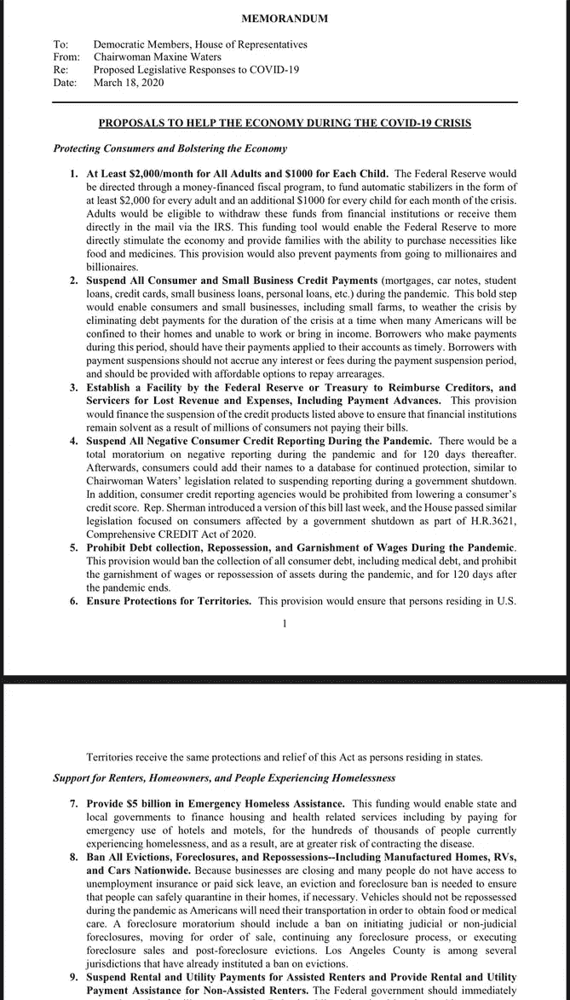

# 经济救济的下一阶段。

> 原文：<https://medium.datadriveninvestor.com/the-next-phase-of-economic-relief-2e4bf384b6d7?source=collection_archive---------22----------------------->

Photo by [Clark Young](https://unsplash.com/@cbyoung?utm_source=medium&utm_medium=referral) on [Unsplash](https://unsplash.com?utm_source=medium&utm_medium=referral)

众议院民主党人正快速进入下一阶段。几天前我提出的一些事情就是其中的一部分。一个原因是，根据财政部长史蒂夫·姆努钦的说法，在接下来的两个月里，失业率可能高达 20%。我个人认为失业率可能高达百分之三十。唯一还会有工作的人是一线的关键工人。这意味着媒体、杂货店、医疗、邮政、物流和急救人员。这不一定符合顺序，我包括媒体是因为你需要信息。是的，一些白领工作将会保留，但是地毯正在从我们脚下被拉开。

我们生活在一个专注于增长和消费的经济中。当我们许多人坐在家里时，两者都不能工作。因此，我们不会产生对餐馆、服装、小配件或任何其他产品的需求。这意味着这些工人已经被解雇了。底特律的三大汽车公司也将员工遣送回国。尽管在清洁和消毒之后，我建议重新装备医用口罩和防护装备。这将艾米丽工人和服务那些在第一线。可能会生产一些通风机，最好是电池驱动的，然后可以连接到当地的太阳能电池组。这是野战医院的思维。我们需要很多。

 [## 为什么包容性财富指数比 GDP 更能衡量社会进步？|数据驱动…

### 你不需要成为一个经济奇才或金融大师就能知道 GDP 的定义。即使你从未拿过 ECON 奖…

www.datadriveninvestor.com](https://www.datadriveninvestor.com/2019/03/08/why-inclusive-wealth-index-is-a-better-measure-of-societal-progress-than-gdp/) 

总统签署了让我们进入战时状态的命令，但后来告诉人们，当我们需要的时候。我们现在就需要。值得庆幸的是，规划者很可能会参与其中，而不是等待总统。我建议财政部借鉴第二次世界大战的经验，也就是我们上一次颁布该法案的时候，成立一个计划委员会来研究所有这些问题。不像战争，联邦应急管理局已经有了这些。

那么考虑到这一点，众议院在考虑什么？

*持续期间的普遍基本收入。这些数字意味着每个成年人 2000 美元，每个未成年人 1000 美元。持续时间可长达 18 个月。与大萧条不同，我们不能让人们去野战厨房。所以为了让人们有饭吃，我们需要这样做。没错，赤字将会飙升，但这是支撑经济的唯一切实可行的方法。在你说租金…和哦加州…
*之前，暂停所有个人和小企业的债务支付。这意味着抵押贷款、汽车贷款、小企业贷款和其他形式的信贷。紧急情况发生后，这些付款都不应追溯。是的，这意味着地方财产税将受到冲击。这意味着地方和州政府从财政部和应急基金中转移资金。这不在议案中，但必须列入。
*这也意味着没有人会因为信用不良而被举报。为什么？我们中的许多人没有工作。
*联邦政府也将向债权人转移资金。这将支持损失。我怀疑时间不会是百分之百，但我们都将不得不做出牺牲。
*在危机期间暂停所有 wave 扣押、债务催收和收回。这也意味着更多的工资损失。然而，这是非常情况。
* 50 亿用于无家可归者救助。各州也必须这样做。一些州，比如加州，已经在这么做了。
*禁止所有驱逐、止赎和收回。一些管辖区，如洛杉矶和圣地亚哥，已经有了。这需要是全国性的。
*当然，这必须扩展到州和地区。

这些都不会便宜。这需要一个有弹性的、灵活的、敏捷的联邦政府。这也迫使许多小政府右翼保守派直面怪物。政府扮演着重要的角色。这不仅仅局限于共和党人。许多蓝狗民主党人开始意识到这一点。虽然他们更快。

新自由主义的时代已经结束。因为我们需要的是自 1929 年以来就不再需要的大萧条时代的凯恩斯经济学。

以上计划够用吗？嗯，这不会受欢迎，但这只是我们需要的首期付款。当我们从另一边出来时，贪婪是好的时代也结束了。我们需要重建美国和全球经济。但是有些事情是显而易见的。

*   战略制造业将需要留在国界之内。我们需要建立一个更加人性化的系统。医疗系统需要摆脱利润，我们需要让每个人都参与到这个系统中来。我们最薄弱的环节是没有保险的美国人。一直都是这样，现在是透明的。我们需要联邦医疗假。我们需要生活工资。拥有世界上所有的钱并不能保护你。
    *我们需要适应气候变化。因为这预示着我们所面临的各种破坏。