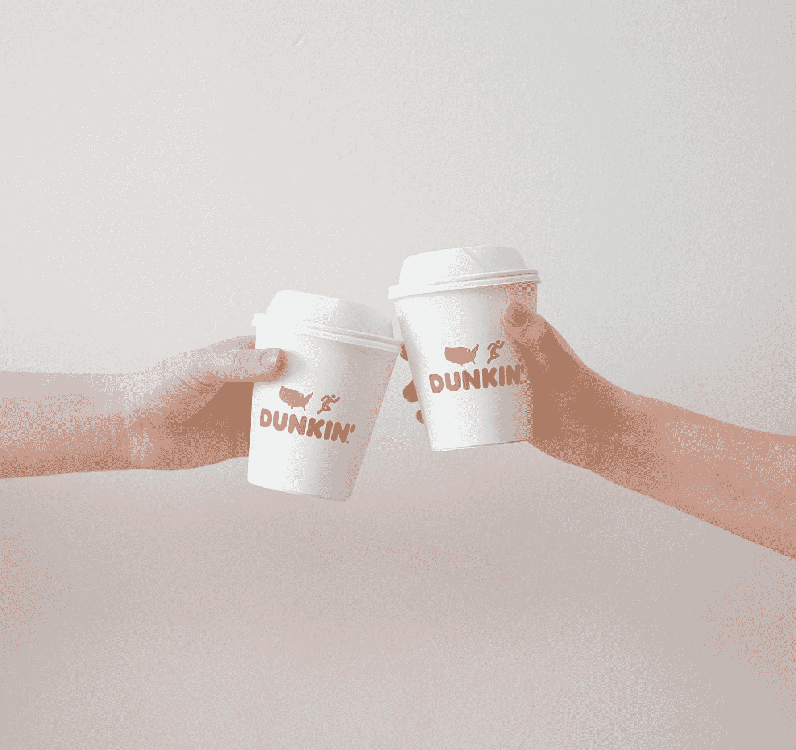
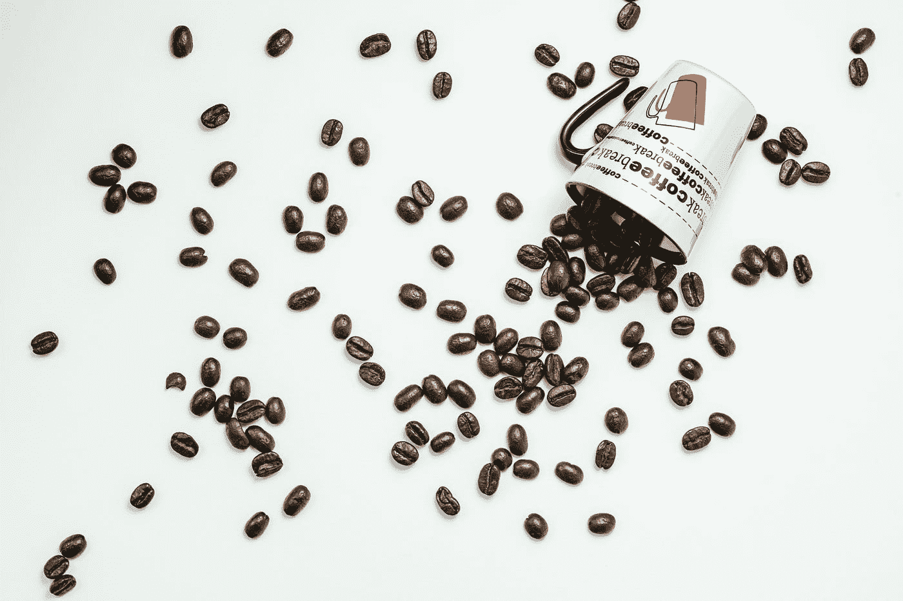

# 下一次你在谷歌上搜索 Dunkin' Near Me，它会显示 Inspire Brands 以 88 亿美元收购 Dunkin '后附近有一家 Arby's

> 原文：<https://medium.datadriveninvestor.com/the-next-time-you-google-dunkin-near-me-it-will-show-an-arby-s-nearby-after-inspire-brands-3608f9bfc463?source=collection_archive---------25----------------------->

## 查理冰咖啡饮料和阿比烤牛肉会成为套餐吗

Photo by [Isabella and Louisa Fischer](https://unsplash.com/@twinsfisch?utm_source=medium&utm_medium=referral) on [Unsplash](https://unsplash.com?utm_source=medium&utm_medium=referral)

像大多数作家一样，我从煮咖啡开始新的一天。我称之为我的早茶，顺便说一下，这是我开始一天工作时阅读的时事通讯。

我甚至试图[戒掉咖啡 7 天，](https://medium.com/the-innovation/7-days-of-quitting-coffee-challenge-2cbad66f3a31)但它只留给我一个问题， ***我在想什么？***

 [## 戒咖啡 7 天，我在想什么？

### 戒掉咖啡 7 天，结果令人惊讶

medium.com](https://medium.com/the-innovation/7-days-of-quitting-coffee-challenge-2cbad66f3a31) 

> 我需要咖啡因来写我的故事。

我们可以整天谈论咖啡，它不仅帮助了作家，也帮助了艺术家和歌曲作者。我最喜欢的新歌是 Beabadoobee 的，除了“咖啡”还有什么。由于加拿大说唱歌手 Powfu 制作了它的一个版本[《死亡之床》(为你的脑袋准备的咖啡)，它已经成为一首风靡全球的歌曲。](https://en.wikipedia.org/wiki/Death_Bed_(Coffee_for_Your_Head))

> 2020 年初，这首歌在视频分享应用[抖音](https://en.wikipedia.org/wiki/Death_Bed_(Coffee_for_Your_Head))上疯传，仅 3 月份就获得了超过 41 亿次播放

咖啡就是生活。就像歌曲一样，它成为我们生活的一部分，对我们这些爱喝咖啡的人来说。

# 邓金的收购故事。

当《波士顿环球报》报道 Inspire Brands 收购 Dunkin 的消息时，人们感到惊讶。你可能会认为 2020 年不会发生价值 10 亿美元的收购，因为世界正面临着最大的经济挑战。

> 但是机会总是在最困难的时候出现。

当我读新闻的时候，它引发了我仍然去不同咖啡馆的记忆。这些年来，咖啡店给我的不仅仅是咖啡。我去过无数的星巴克、邓金和蒂姆·霍顿。我也支持小咖啡店，在那里你可以和店主交谈。

咖啡不仅仅是一种饮料，它会让你想起和你一起出去玩的人。它也是你孤独时刻的伴侣，当一杯咖啡让你走神的时候。

# 扣篮交易

Photo by [Adam Nieścioruk](https://unsplash.com/@adamsky1973?utm_source=medium&utm_medium=referral) on [Unsplash](https://unsplash.com?utm_source=medium&utm_medium=referral)

像世界其他地方一样，美国不得不关闭企业。人们被迫在家工作。生意受到影响，大多数餐馆不得不关门。星巴克和 Dunkin 都分担了损失，因为他们的顾客是办公室职员，现在都在家里工作。

Dunkin 的销售额下降了 20 %，并将关闭全美 800 家商店。随着人们对新常态的习惯，这种感觉变得更加强烈。有报道称[最大的竞争对手星巴克](https://www.cnbc.com/2020/07/28/starbucks-sbux-q3-2020-earnings.html)在疫情早期损失了 40%的销售额，估计为 31 亿美元。

Dunkin 可以感谢其在 2018 年实施的免下车业务计划。甚至[星巴克](https://stories.starbucks.com/stories/2020/starbucks-to-accelerate-expansion-of-drive-thru-pickup-and-curbside-pickup/)也不得不奋起直追，通过路边取货增加他们的店铺。

> 我们知道当企业玩追赶游戏时会发生什么，谁先走谁就赢。

这让邓金避免了灾难性的一年。相反，它即将被 [Inspire Brands，](https://inspirebrands.com/)以高于其股票价值 20%的溢价收购。激励品牌，该公司拥有:

*   达比的作品
*   [布法罗辣鸡翅](https://buffalowildwings.com/)
*   [音速](https://sonicdrivein.com/)
*   [锈玉米卷](https://rustytaco.com/)
*   吉米·约翰的

> 随着 Dunkin 成为一个私有品牌，它将继续成为咖啡连锁店的全球顶级玩家之一。

# 扣篮做对的三件事

Dunkin 将其品牌定位为高级外带咖啡。当星巴克开始提供浓缩咖啡饮料时，它就盯上了它的老大位置。Dunkin 正在向大的 Z 世代市场发展，随着年龄的增长，他们也变得更加了解喝咖啡的人，但是他们也在寻找物有所值的东西。

 [## Dunkin's Espresso 是一个改变游戏规则的品牌，历经数年打造

### 最初披露时，Dunkin ' 1 亿美元的美国业务增长计划缺乏细节。65%的人会…

www.qsrmagazine.com](https://www.qsrmagazine.com/fast-food/dunkins-espresso-game-changer-years-making) 

“得来速”,一个移动应用程序，和一个抖音超级巨星……拯救了邓金。这是一个强大的组合，就像[查理，](https://www.tiktok.com/@charlidamelio?lang=en)用全脂牛奶和三泵焦糖漩涡冷酿造。

1.  它早在 2018 年就投资了更多的得来速商店，根据 QSR 的说法，这使它成为 2018 年最具[转型的品牌，为此，它在 2020 年成为了 Dunkin 的救命稻草。](https://www.qsrmagazine.com/fast-food/why-dunkin-was-2018s-most-transformational-brand)
2.  它利用技术，通过其专有的移动应用程序，使订购变得简单。他们的移动订购和支付让顾客可以在购买他们最喜欢的 Dunkin 咖啡饮料前 24 小时就可以轻松在线订购。
3.  它吸引了像 Charli 这样的社交媒体影响者，使一个 70 岁的传统咖啡品牌吸引了**Z**代。拥有超过 9540 万粉丝的抖音女王查理·达梅里奥(Charli D'Amelio)在名为“查理”的 Dunkin 菜单上点了她的酒。

这是一个营销妙招，查理·达梅里奥大部分时间都在她的抖音视频中喝着一杯邓金饮料。她继续在抖音聚集数百万粉丝，那里是大多数 Z 世代的聚集地，他们在网上消磨时间。

冠状病毒改变了我们喝咖啡的方式。不是因为咖啡是冠状病毒的潜在来源，远非如此。随着越来越多的人在家工作，如果你还没有买咖啡机，开始为自己冲一杯咖啡。

疫情也让更多的人习惯于在网上订购，包括咖啡。虽然普通的自制咖啡在大多数时候都可以，但我们有时会觉得需要一些特别的东西。这是星巴克和 Dunkin 的大本营。

在未来的岁月里，当这个疫情结束时，我们都可以放心大胆地去我们最喜欢的咖啡馆。或者当我们回到忙碌的生活中，或者呆在舒适的家里。Dunkin 可以成为你的首选咖啡，无论是在家还是在旅途中都可以享用。

随着即将到来的收购， ***下次你谷歌***[***Dunkin ' Near Me***](https://trends.google.com/trends/explore?date=all&geo=US&q=dunkin%20near%20me)***，它会显示附近有一家 Arby's。***

Z 世代的顾客会穿过街道，开始点 Arby 著名的烤牛肉三明治来搭配他们的咖啡吗？

激发品牌灵感的东西可能是烹饪，也许是套餐。目前，有了这笔 88 亿美元的交易，Dunkin 可以放心，它仍将是星巴克最大的竞争对手。

在一个咖啡是主要饮料选择的世界里，这笔交易的香味会让 Dunkin 的股东感到有点兴奋。