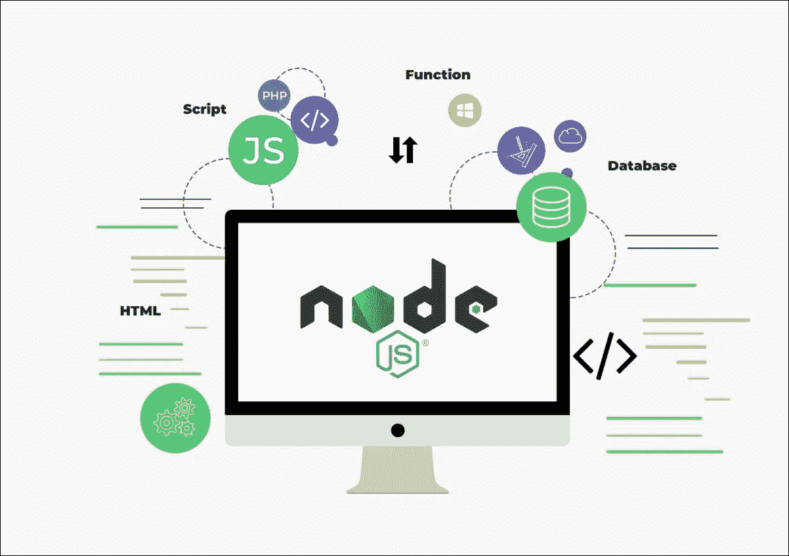
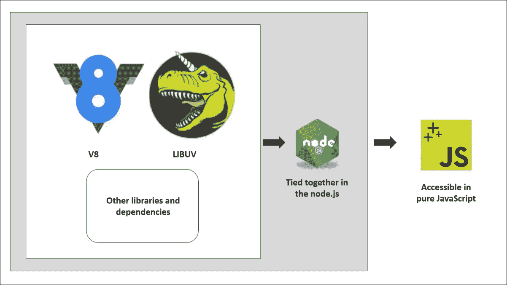
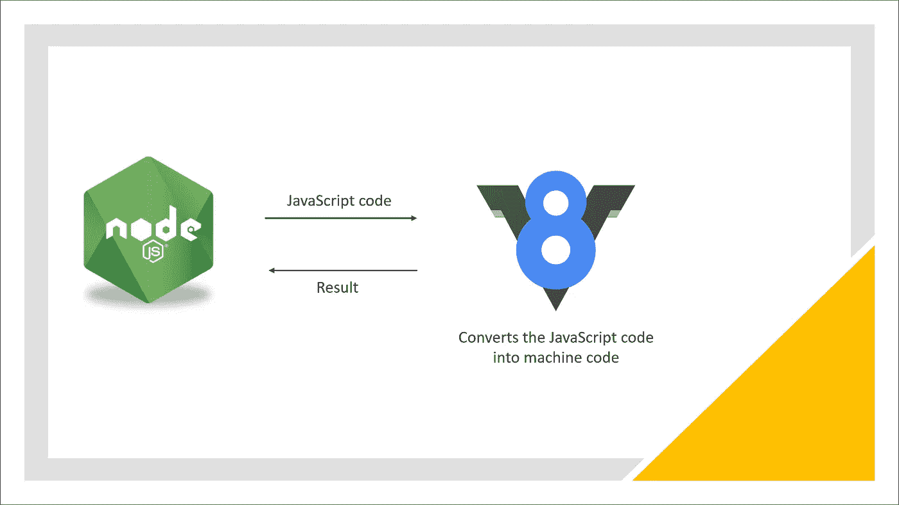
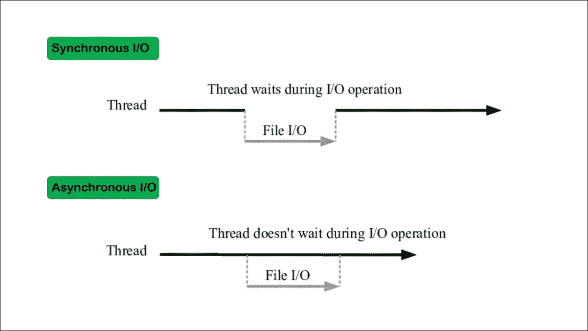
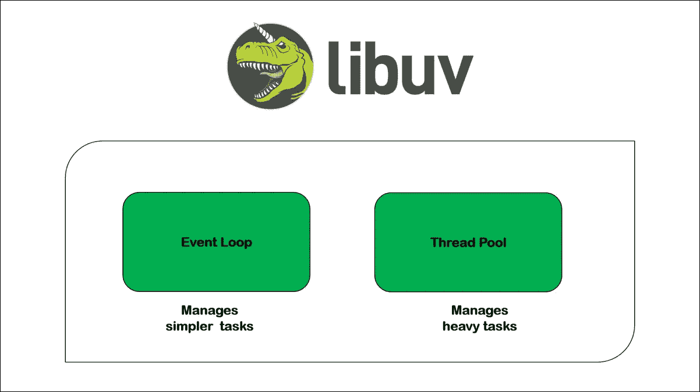
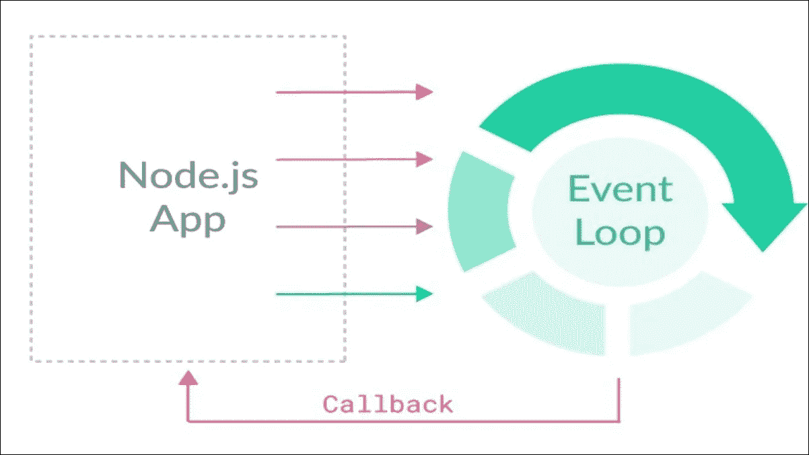
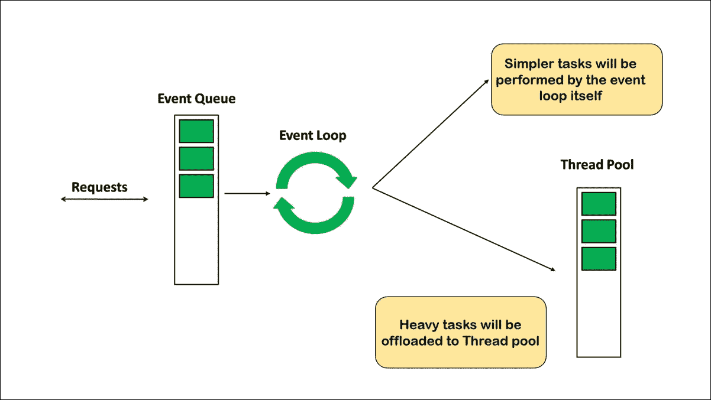
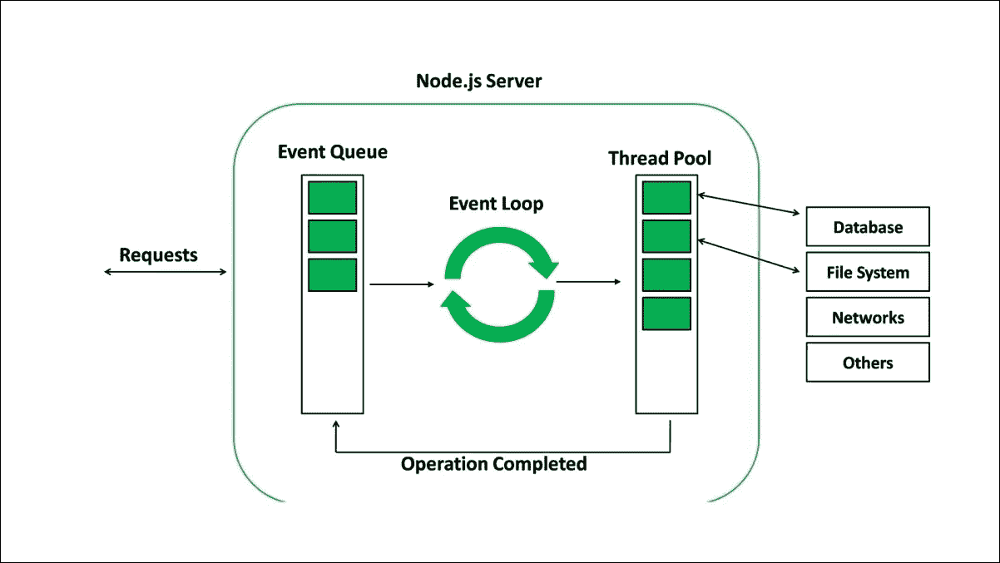
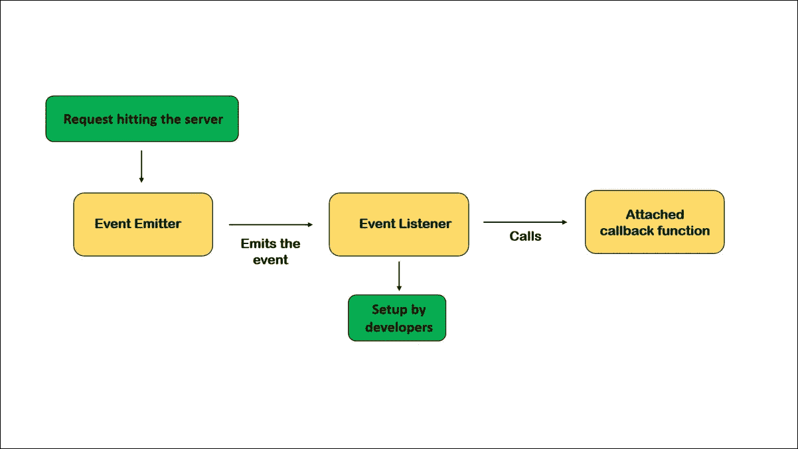

# Node.js 架构！

> 原文：<https://medium.datadriveninvestor.com/the-node-js-architecture-f86e2337bcd2?source=collection_archive---------0----------------------->

大家好。我希望你过得好！今天，在本文中，我将讨论 awesome node.js 的工作方式，深入探讨代码在 node 运行时会发生什么。它是 node.js 的核心库、依赖项和大脑。

Node.js 单独用 Javascript 写，用 c++和 Javascript 写才能正确运行。node 依赖于许多库。然而，V8 和 LIBUV 是处理大多数 node.js 操作的两个最重要的依赖项。

这两个依赖项提供了一个非常好的抽象层，允许我们编写在 Node.js 中运行的纯 JavaScript 代码，并且仍然允许我们访问在 LIBUV 和其他 C++库中实现的文件读取功能。这一切的美妙之处在于 Node.js 将所有这些库绑定在一起，不管它们是用 C++还是 JavaScript 编写的，让我们可以用纯 JavaScript 访问它们的功能。这使得我们更容易专注于应用程序代码，而无需处理 C++代码。

现在让我们一次探索一个。

# V8

Node.js 建立在谷歌的 V8 引擎之上。它是最快的 javascript 引擎。V8 引擎将 javascript 代码转换成计算机能够理解的机器代码。然后生成结果并返回给 node.js，Node.js 无法理解我们在没有 V8 的情况下编写的 javascript 代码。除了 javascript，V8 还使用 C++。

## * *在开始使用 LIBUV 之前，您应该对异步 I/O 有一个基本的了解。

# 异步输入输出

异步 I/O 允许应用程序将处理与 I/O 操作重叠。简单地说，目标是程序永远不要阻塞。

在同步 I/O 中，线程(一个线程就是一系列指令)会一直等到整个操作完成。另一方面，在异步 I/O 中，行在操作期间不等待。该操作将在后台运行，完成后将被调用。异步 I/O 特性使应用程序能够在 I/O 发生时有更多的 CPU 时间来执行其他处理。

 [## 是什么让一个伟大的 Web 开发者与众不同？数据驱动的投资者

### 你知道吗，2019 年，一个网页开发者的平均工资是每年 73760 美元？更令人震惊的是…

www.datadriveninvestor.com](https://www.datadriveninvestor.com/2020/11/27/what-separates-a-great-web-developer-from-others/) 

# LIBUV

LIBUV 是 node.js 的另一个重要依赖项，它让 node.js 可以访问机器操作系统、网络、文件系统等等。LIBUV 是一个开源库，主要关注异步 I/O(输入输出)。LIBUV 是用 C++写的。除了关注异步 I/O，LIBUV 还实现了两个基本特性:事件循环和线程池。

事件循环处理更简单的任务，线程池管理繁重的任务。让我们一个一个的去探索。

# 事件循环

当我们在一台计算机上使用 Node.js 时，有一个节点进程在那台计算机上运行。流程只是一个执行中的程序。在这个过程中，Node.js 在一个线程中运行。线程只是一系列的指令，深入理解什么是线程或进程并不重要。把线程想象成一个盒子，在那里我们的代码在计算机的处理器中执行。现在，需要理解的是，节点只在一个线程中运行。例如，如果我们有四个不同的任务，那么这四个任务都将发生在一个线程中。

我们为 PHP 等语言中的每个任务创建了一个新线程。同样，如果您运行节点应用程序，它将只在一个线程中运行。不管你有一个用户还是 100 个用户，或者可能有 1 亿个用户同时访问你的应用程序。事件循环被称为 node.js 的心脏。它在单个线程中执行所有的回调函数(一些工作一完成就调用的函数)，并且它还卸载繁重或昂贵的任务，如将文件压缩到线程池。Eventloop 使 node.js 中的异步编程成为可能，我将在下一篇文章中讨论异步编程。

它负责处理所有传入的事件，并通过将较重的任务卸载到线程池中并自己完成较简单的任务来执行平衡部分。我将在接下来的几篇文章中再次讨论事件循环，因为还有更多内容，它是 node.js 中的基本特性。你应该记住，事件循环是 node js 的核心，这使 Node 完全不同于其他后端语言。

# 线程池

线程池从事件循环中的单个主线程中为我们提供了四个独立的线程。我们最多可以配置 128 行，但是通常，这四行就够了。所以这四个线程一起形成了一个线程池。事件循环会将繁重的任务卸载到线程池，这在后台自动发生。不是我们开发人员决定什么进入线程池，什么不进入线程池。被卸载的一些昂贵的任务都是处理文件的操作，所有与加密相关的事情，如缓存密码，所有与压缩相关的功能，DNS 查找(将 web 域与其对应的真实 IP 地址匹配)，等等。这是最容易阻塞主线程的东西。因此，节点通过自动将它们卸载到线程池中来处理它。

例如，当请求到达节点服务器时，它将通过事件队列进入事件循环。事件循环现在将检查任务是否繁重，如处理文件的操作或与网络相关的操作。如果任务很重，它将把任务卸载到线程池，线程池将单独执行任务。它不会阻塞我们的事件循环，事件循环可以执行所有不太复杂的任务

# 其他重要的图书馆

Node.js 最重要的库是 LIBUV 和 V8。然而，该节点不仅基于 V8 和 LIBUV，还基于其他一些库，如用于解析 HTTP 的 HTTP parser、用于 DNS 查询的 C-ARES、用于加密的 OpenSSL 和用于文件压缩的 Zlib。当所有这些组件完美地结合在一起时，我们就有了 Node。JS 可以在服务器端用于我们所有的应用程序。

# 事件驱动架构

该节点的大多数核心模块，如 HTTP 文件系统，都是围绕事件驱动的架构构建的。这个概念很简单。在 node 中，有一些称为事件发射器的特定对象，一旦应用程序中发生重要的事情，如请求到达服务器或文件完成读取，它们就会发出命名的事件。事件监听器然后拾取我们开发人员设置的这些事件，这些事件将触发附加到每个监听器的函数(回调函数)。

一方面，我们有将发出命名事件的事件发射器，另一方面，我们有通过调用回调函数对发出的事件做出反应的事件侦听器。事件驱动的架构使得多次响应同一事件变得更加简单。我们所要做的就是设置多个监听器。

好了，简而言之，这就是节点的事件驱动架构。不要担心这似乎有点太理论化。我将在下一篇文章中解释更多关于事件和回调函数的内容，我们也将看到这种逻辑在许多情况下被使用。所以在我的下一篇文章中再见。祝您愉快！

## 访问专家视图— [订阅 DDI 英特尔](https://datadriveninvestor.com/ddi-intel)