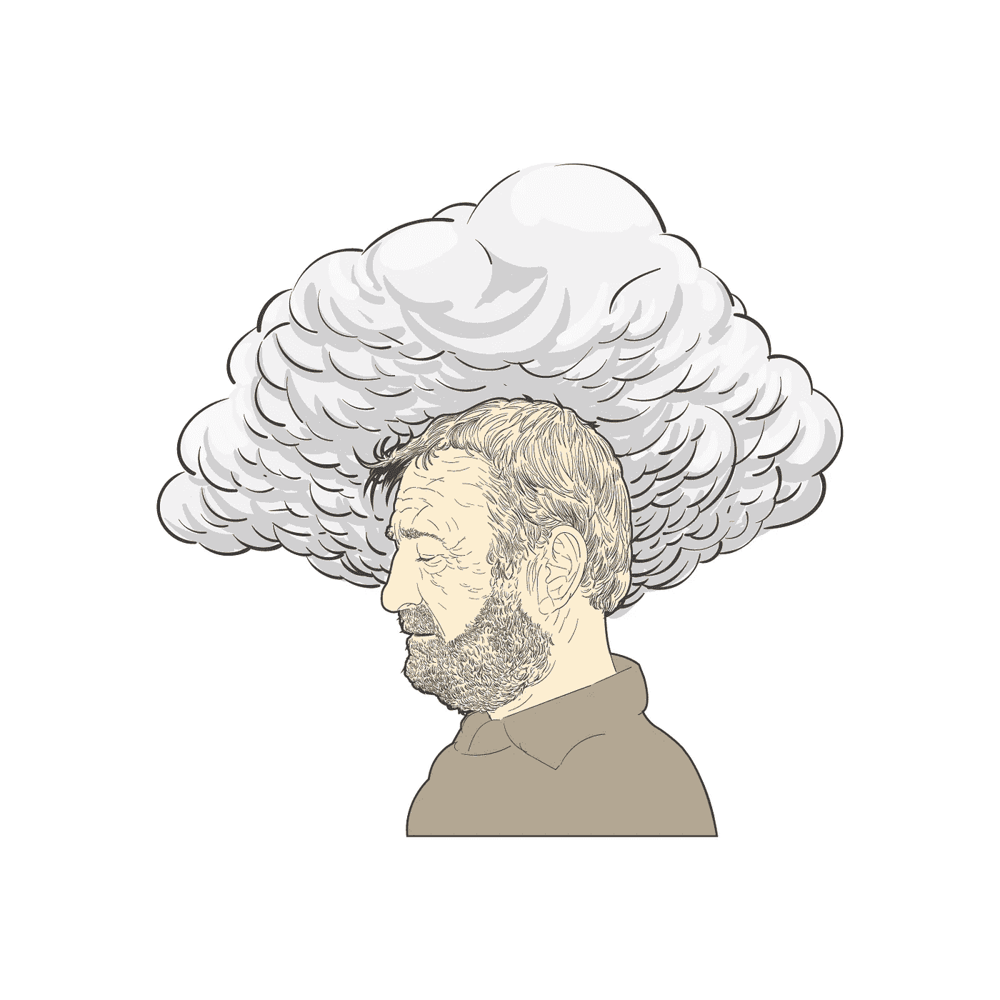

# 灵魂的养料

> 原文：<https://medium.datadriveninvestor.com/the-nourishment-of-the-soul-25e0a3d66264?source=collection_archive---------18----------------------->

你曾经感到完全孤独吗？你早上起床，从床上爬起来，然后走过场。你肩上扛着巨大的重量。有时候你想放弃。你绝望地往外看。如果有一个灵魂能感受到你的想法，一个能与你分享风景的人。

你在寻找安慰。一切都会好的，你会挺过去的，或者我知道你的感受。我们寻找简单的短语来控制我们的不安全感。

最严厉的批评家不是外在的，而是存在于我们内心。它总是在观察，随时准备跳跃，并在我们出现任何闪失时击败我们。没有人能让我们像自己一样痛苦。然而，克服它有时可能是困难和不可能的。

> 这是我们的最低点。我们需要鼓励的话语来继续生活，面对我们最深刻的挑战。

# 不安全感:

你决定通过创业或学习更多公共演讲来实现你的梦想。你看起来很自信，你一直在双倍下注，但你在晚上入睡前会感到一种挥之不去的疑虑。你认为自己不够好，追求这个目标没有意义。

我们担心自己不够。我们想与世界分享，但又害怕自己不合群，害怕自己的想法愚蠢，害怕自己不够聪明。

自我怀疑迫使我们低着头，羞于说出自己的想法，并且不去搅动锅里的水。

> 毕竟何必引起不必要的麻烦呢？

# 治疗方法:

一个工作中的新人日子不好过，所有的概念对他来说都很难掌握，他每天都感觉自己像个冒名顶替者。几句善意的话，告诉他，每个人都经历这些，没关系，他应该过一天算一天。那些话就够了。

它可以是对出色工作的认可，对付出额外努力的赞美。注意它是如何照亮眼睛，让他们脸上露出笑容的。

我们内心有一种超能力，可以让人们振作起来，摆脱不安全感，提升情绪。这不需要太多努力。我们所需要做的就是注意并说一些正确的话。

目的不是撒谎或把他们引入歧途。这不是操纵我们的命令。这是为了意识到，我们也需要有人认可我们的努力，让我们消除恐惧。

我们很难独自战胜自我怀疑。我们需要帮助让我们走上正确的道路。生活不是孤独的。

> 当有人在我们最黑暗的时刻向我们伸出援手，我们可以成为他人的明灯。

# 给予保证:

我们如何给予保证？我们有没有办法把它送给那些需要它的人？

这里有一些方法，

*   观察:注意你周围的人，你的朋友，你的同事，甚至你俱乐部的新成员。看看他们是否在挣扎，帮他们一把。
*   **倾听**:一旦你注意到他们有困难，倾听他们的疑惑，不要评判或打断。让他们分享他们的忧虑，这样他们就会乐于接受鼓励。
*   **鼓励**:使用简单的鼓励话语。例如，“每个人都会经历这个”，“一切都会好的”，“生活有时会让人不知所措。”。确认他们的感受，让他们感到安心。
*   **顺其自然**:不要操纵或期待恩惠。当你这样做是为了获得回报时，人们会随着时间的推移而注意到，并停止开放。
*   **强调**:最后，要明白你也会经历这些。感到不安全和怀疑是很自然的。毕竟，我们只是人类。

以下，这你将能够帮助人们时，他们在一个车辙。

> 你将学到的最重要的一课是我们的渺小感是如何束缚我们的。

每个人都面临着他们的守护进程，我们需要彼此来度过这一天。这就是为某人而存在的意义。