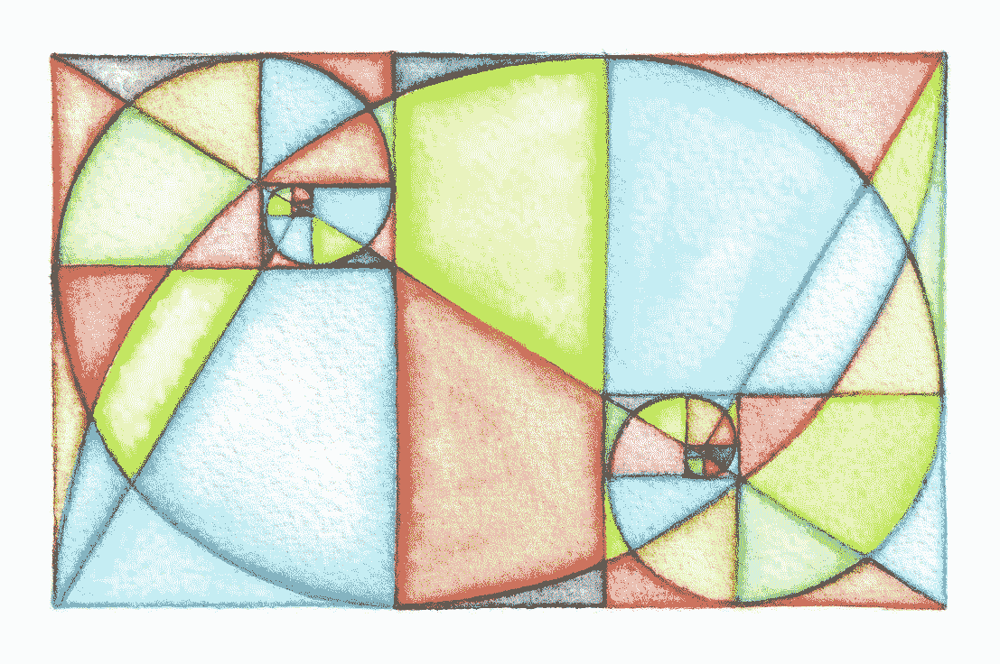

# 数字 2021 &投资中的金融科技

> 原文：<https://medium.datadriveninvestor.com/the-number-2021-fintech-in-investing-7ff269a64f15?source=collection_archive---------18----------------------->

新年快乐！

21 是一个原型数字，有几个与之相关的模式。《圣约翰福音》有 21 章，使徒保罗写了大约 21 宗罪，耶稣基督在巴勒斯坦的 21 个地方出现以证实他的复活。一些人声称 21 是成熟和完美的象征(在圣经的上下文中)。

那些相信守护天使的人，把 21 日解释为新的开始和改变的时刻。

从数学的角度来看，21 不是质数，而是一个合数，是 3 和 7 的乘积。当然，七是众所周知的精神数字(7 个天堂，7 个脉轮等)，这可能是 21 被认为是一个与实现、完成、成功联系在一起的重要能量符号的原因(按照狄巴克·乔布拉的说法)。

我们也不要忘记 21 是斐波那契数列的第八项。

2021(数字相加等于 5)；5 是转化数。

在金融界，有明显的迹象表明新的开端、变化和转变正在进行。这些主要与潜在的**新的治理方式**有关，这种方式源于现有市场结构的大规模非中介化，也源于**越来越多地使用开源基础设施**来构建产品和服务。

在可编程货币、私人数字货币和新形式的另类投资等领域，可以看到明显的变化(在非常早期的阶段)。增加对央行数字货币、公司代币以及不可替代物品(如艺术品、运动卡或人物)的代币化的实验。

下一代互联网 Web 3.0 只能建立在开源基础设施和更公平的治理机制上，这些机制更具包容性，并基于更多的协作流程。

让我们始终记住这些正在发生的长期趋势。给它们计时不是我们的工作。我们只能观察到我们才刚刚开始。开始总是缓慢的，然后突然有一个转折点，一个拐点，一个看似随机的设置，加速了采用。

现在，让我们看看现有的设置中发生了什么，它以一种非常熟悉的方式工作。当我想到投资领域时，很清楚投资产品是在哪里制造的，以及它们是如何被最终消费者(个人或机构)分销和获取的。金融科技以几种不同的方式影响了这些过程。它降低了获取投资产品的成本(机器人投资、零佣金交易、各种众筹)，在某些情况下还降低了管理投资产品的成本(通过 API 和 DLT)。Fintech 拓宽了进入新分销渠道的途径(通过 API ),但没有从本质上改变分销机制。

金融科技极大地改善了客户体验(小额投资、纯移动投资服务、24/7 等)。它实现了与 BigTech 和电子商务的合作，以及现任者之间和金融科技公司之间的合作。随着金融科技导致生态系统和平台成为获胜的商业模式，收入共享和订阅模式一直在上升。

在传统的投资子行业，去年我们看到了 M&A 的整合，有两笔重要交易引人注目，摩根士丹利收购 E-Trade 和嘉信理财收购 TD Ameritrade。我们也看到了独立机器人的大量资金，Stash 总资金达到 3 亿美元。此外，大型老牌金融机构加快了财富管理部门与其个人银行业务的整合，这是一个非常必要的举措，因为成熟的金融科技公司建立了更完整的体系，这些体系具有现有金融机构所缺乏的内在灵活性。美国银行、摩根士丹利和高盛是在这些方面取得进展的三大银行。

我在 2020 年的每周博客中详细写了以上所有内容(点击这里查看)。

在西方世界，投资领域的所有数字趋势都继续支持消费者直接投资。最终消费者继续得到王子般的服务。当我在 2020 年 12 月 [Finimize](https://www.finimize.com/) 峰会上听取 Stash 和 Plum 的见解时，我更加清楚地看到，在美国和英国，投资的数字化转型主要是指金融科技真正贴近终端投资者——消费者。

> ***WealthTech 更多的是让终端投资者更接近投资。这不仅仅是 DIY——自己动手——更多的是朝着整体财务健康方向的智能整合。消费者银行业务和投资业务之间不再有隔阂。***

[李子](https://withplum.com/)是英国人工智能储蓄模拟的 Stash。凭借去年夏天追加的 1000 万美元资金，他们计划在西班牙和法国扩张。英国有 100 万客户，他们 2021 年的目标是在欧洲增加到 500 万客户。

在法国，Plum 已经通过 API 连接到 **Banque Populaire、BNP Paribas、Caisse d'Epargne、credit Agricole、credit Mutuel、HelloBank、Société Générale 和 Revolu** t 的银行账户。因此，这些银行的任何客户都可以**使用 Plum brain** 进行储蓄、账单管理和投资。商业模式是一种廉价的订阅模式，有三层，免费，每月 1 美元，每月 2.99 美元。

提及:Plum，Stash， [finimize](https://medium.com/u/2ac0beaedb0?source=post_page-----7ff269a64f15--------------------------------) ，美国银行，摩根士丹利，高盛。

**访问专家视图—** [**订阅 DDI 英特尔**](https://datadriveninvestor.com/ddi-intel)

**📌网页:**[https://efipylarinou.com/](https://efipylarinou.com/)

📌订阅我的 **YouTube 频道**，了解我的见解和行业领袖访谈。**每周三新视频:**[https://www.youtube.com/EfiPylarinou](https://www.youtube.com/EfiPylarinou)

**📌领英:**[https://www.linkedin.com/in/efipylarinou/](https://www.linkedin.com/in/efipylarinou/)

**📌推特:**https://twitter.com/efipm