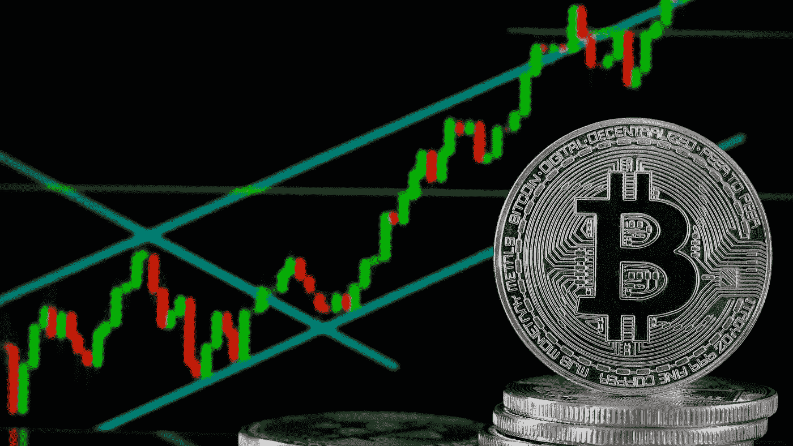

# 比特币的纯数字牛市案例(上):

> 原文：<https://medium.datadriveninvestor.com/the-numbers-only-bull-case-for-bitcoin-4-bitcoin-bull-and-bear-market-cycles-since-2011-b1d7564aa2df?source=collection_archive---------0----------------------->

【2011 年以来 4 次比特币牛市&熊市周期分析

**下一个牛市高峰在哪里？**

我开始这篇分析时，并没有打算写一篇关于比特币牛市的文章。

今天早上我醒得很早，查看了 BTC 的价格。哇——我想，它一直在上涨，什么时候会下跌呢？截至美国东部时间上午 7 点 15 分，比特币基地的价格为 49700 美元。作为一个长期看涨霍德勒/比特币的人，我一直在兴高采烈地迎接最近的牛市，但在我的脑海里也确实有一个悄悄的想法。会在哪里达到顶峰？现在是出售的时候吗？我会失去这么多的这种收获，以后后悔吗？2017 年损失了那么多未实现收益，不想提了。事实上，我醒来时害怕失去这一切。但我深吸了一口气，决定在做出任何轻率的决定之前收集更多的信息。

我一直认为，看好比特币的最有力的理由是，随着多年来市场周期的重复，价格将长期保持上涨。尽管如此，当价格下降 5%或 10%时，这并不能消除我紧张不安的感觉。

我过去读过“空前”的图表，也听别人提到过。然而，我从未如此仔细地观察过这些数字。

幸运的是，我痴迷于数字，所以我决定找点乐子来对抗我肚子里的那些蝴蝶。我决定看看这些数字。

在我给你看我所看到的之前，让我声明:

0) **永远不要投资超过你愿意失去的。**绝不**
1)这不是理财建议。自己做研究。这只是考虑了统计数据，而不是基本面。我没有受过正式的统计分析或交易培训。
4)过去并不总是反映未来——但这是我们分析市场最常用的不完美的方法。**

话虽如此，我们开始吧:

**日期:BTC 价格**

## 2011 年 6 月 9 日至 11 日:19.58 美元(牛市顶部)
2011 年 11 月 18 日至 11 日:2.13 美元(熊市底部)
2013 年 4 月 10 日至 13 日:181.66 美元(牛市顶部)
2013 年 7 月 6 日至 13 日:69.05 美元(熊市底部)
2013 年 11 月 29 日:1132 美元(牛市顶部)
2017 年 1 月 15 日:199.25 美元(熊市底部)

进一步分析数据，然后我将每个牛市顶部和熊市底部与之前的牛市顶部和熊市底部进行比较。然后我看了看最弱的牛市，基于%的涨幅和牛市平均%的涨幅。我也看了最强的熊市。

**下一个牛市巅峰对上一个熊市谷底**

基于这些数据，平均牛市峰值比之前的熊市底部高出 66.51 倍。最弱的牛市峰值是之前熊市底部的 19.40 倍。

如果从 2018 年 12 月 16 日的最后一个熊市底部开始重复，该平均值将导致 218，358 美元**(平均情况)**的牛市峰值。如果重复最弱的牛峰，将导致 53833.59 美元的牛峰**(熊市)**。

迄今为止最强劲的熊市(之前的熊市——2017 年 12 月 16 日见顶)的牛市峰值是 2015 年 1 月 17 日之前熊市底部的 97.85 倍。在这一点上，你可能会开始嘲笑我。还是那句话，我在这里只是做方程，过去并不能保证未来。实际上，我本打算把它删掉，但我最终还是崩溃了，决定写下它——321，247.93 美元。不，这不是玩笑。这也不太可能，我还想指出的是，在这个指标上——牛市峰值与之前的熊市相比，它上升/下降/上升，因此基于这一点，这更有可能是一个比上一个更弱的牛市峰值。

**下一个高峰对上一个高峰**

或者，将牛峰与先前的牛峰进行比较，平均值比先前的牛峰高 10.91 倍。最弱的牛市峰值比前一个牛市峰值高 6.23 倍。2017 年 12 月，最强的牛峰与前一个牛峰相比再次成为最后一个，比前一个高出 17.21 倍。

基于此，如果重复:
**均值案例:**$ 212713.77
**看跌案例:**$ 121521.93
**看涨案例**:我连……真的我都不敢。如果你愿意，可以在 Twitter @alexandre_lores 上给我发消息。

**结论**

就像我上面说的，这不是投资建议。但是，平均出上面的熊市，不包括任何看涨的基本面，这将表明当前比特币牛市的峰值在**87，677.76 美元。平均案件数为 215，536.34 美元**。

不用说，我是**而不是**急于卖掉我的比特币…

接下来:

**比特币怀疑者？真相在趋势中:(第二部分)
下一个熊市底部在哪里？**

你重视这些文章吗？关注分享！

更多博客，最新的加密和金融科技新闻，以及更多更多信息，请访问我们的网站:[thelatestblock.com](https://thelatestblock.com/)。

…

*本文不是投资建议，也不考虑你的个人财务状况。永远不要投资超过你愿意损失的，也不要赊账购买比特币或其他投资。我写下我的观察和个人观点，目的是与他人分享我所学到的东西。*

*披露:本人投资比特币和其他加密货币。*