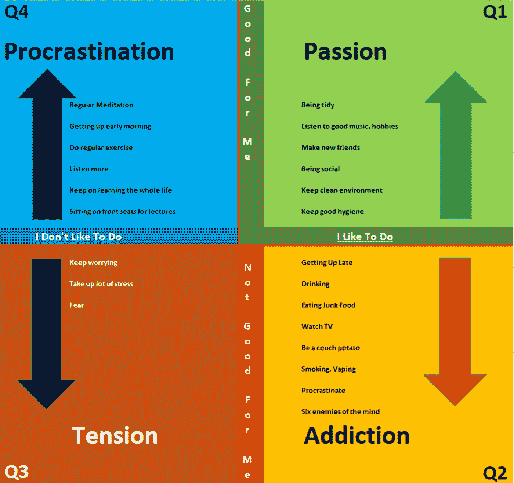
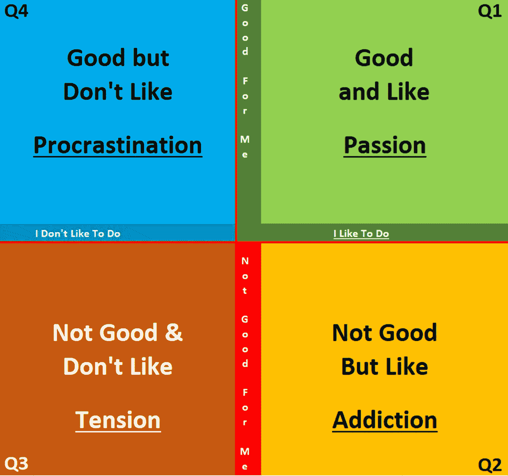
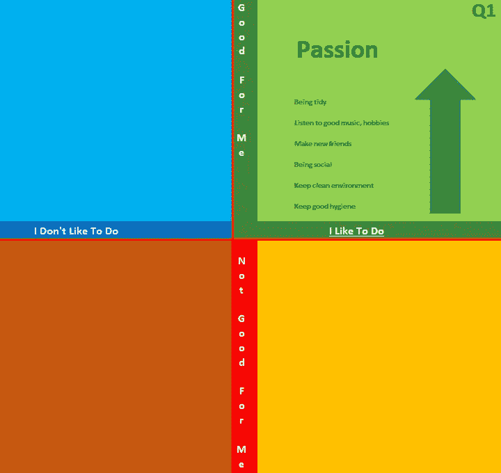
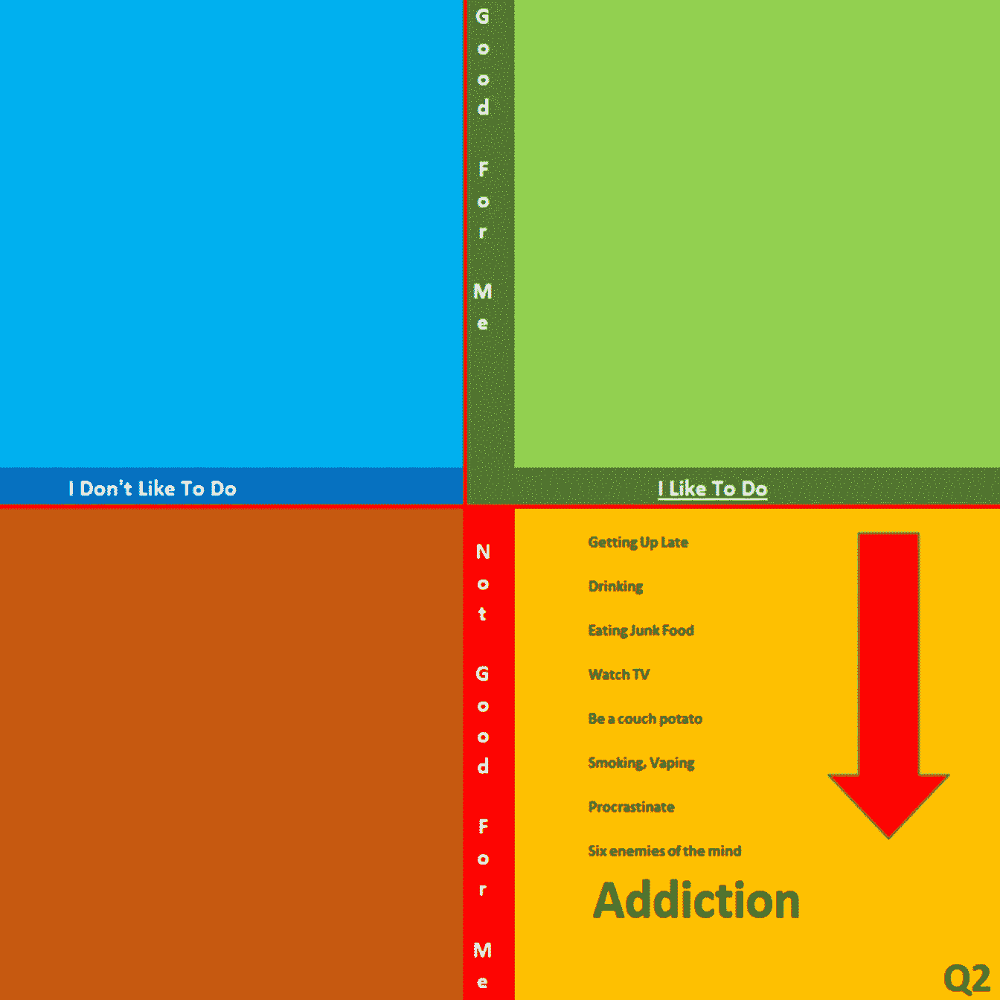
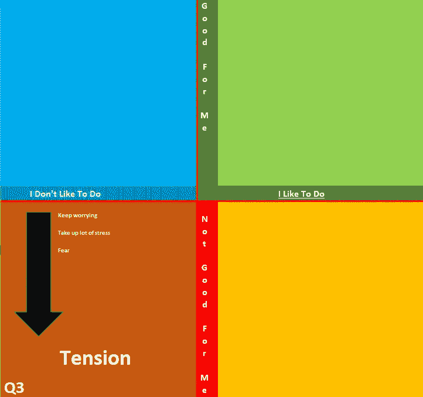
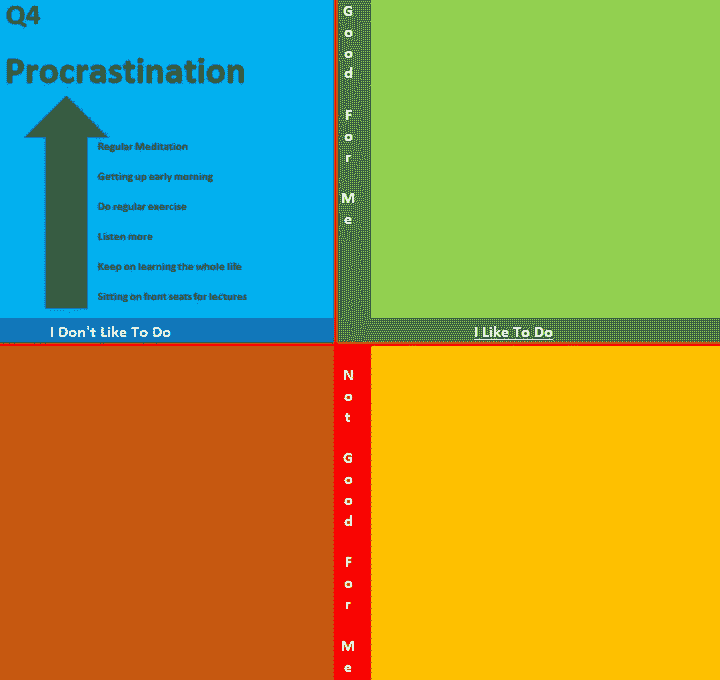
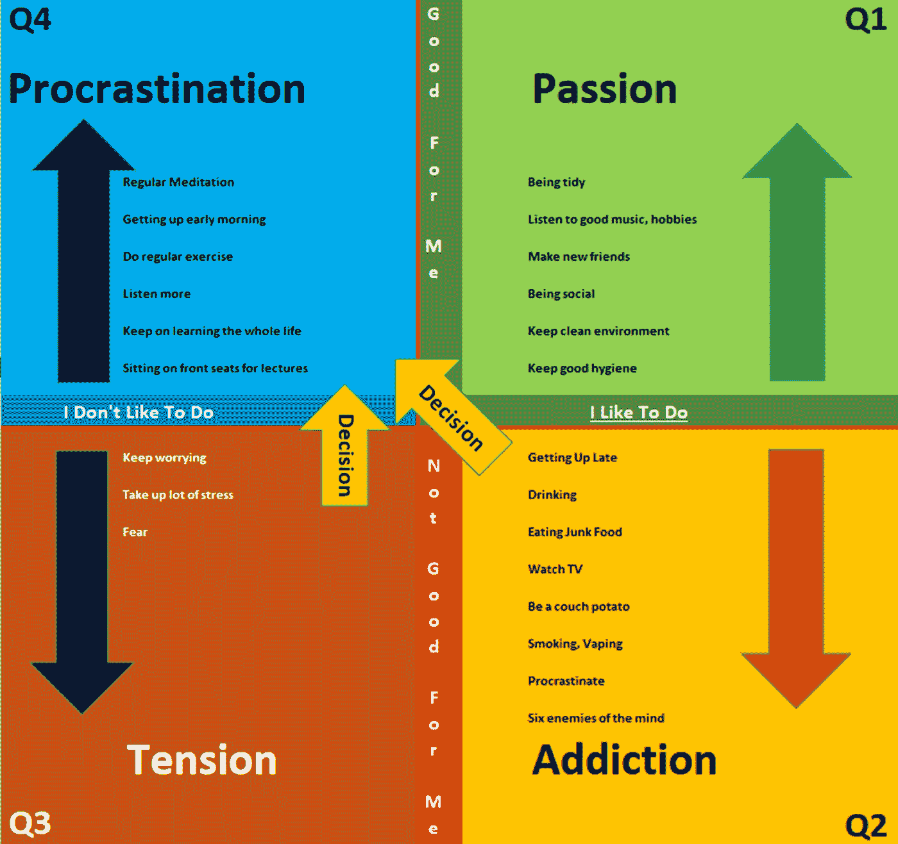

# 伟大的领导者适应的一个习惯——即使他们不喜欢

> 原文：<https://medium.datadriveninvestor.com/the-one-habit-great-leaders-adapt-even-if-they-dislike-c0906c3560dd?source=collection_archive---------5----------------------->

## 你也可以成为其中一员

© Shashi Kulkarni — 2020

理查德·布兰森爵士是 T2 的商业巨头、投资者、作家和慈善家。他在 20 世纪 70 年代创建了[维珍集团](https://en.wikipedia.org/wiki/Virgin_Group)，该集团控制着各个领域的 400 多家公司。

> 他有一句名言:“在你的生活和工作中，没有比追随你的激情更伟大的事情了——以一种服务于世界和你自己的方式。”

**迈克尔·杰克逊**，美国歌手、词曲作者、舞蹈家，被称为[流行音乐之王](https://en.wikipedia.org/wiki/Honorific_nicknames_in_popular_music)，是[流行音乐史上获奖最多的艺人](https://en.wikipedia.org/wiki/List_of_awards_and_nominations_received_by_Michael_Jackson)。1984 年，他在一次百事广告中遭遇意外。许多年后的 1993 年，他承认自从那次事故后，他就迷上了处方药，并将进入康复中心。

> “我仍然不在这个国家。我一直在接受对止痛药依赖的治疗。这种药物最初是为了缓解我在最近的头皮重建手术后遭受的极度痛苦，”这位歌手当时在一份声明中说。

罗宾·威廉姆斯是美国演员和喜剧演员。他经常被评论家认为是有史以来最好的喜剧演员之一。2014 年，他的去世震惊了世界，让数百万人感到困惑。

> 在他去世当天由他的发言人发布的一份声明中，她透露威廉姆斯“最近一直在与严重的抑郁症作斗争。”

达芬奇是一位[意大利](https://en.wikipedia.org/wiki/Italians) [博学的人，被广泛认为是有史以来最伟大的画家之一。《蒙娜丽莎》是他最著名的作品，也是最著名的肖像画。](https://en.wikipedia.org/wiki/Polymath))*最后的晚餐是有史以来被复制最多的宗教画。*

*他备受赞誉的《蒙娜丽莎》花了 16 年才完成，而更大的《岩石中的圣母》花了 13 年才完成。达芬奇是如此的以拖延闻名**，以至于他的恩人不得不以破产来威胁他，以激励他完成委托的作品。***

**这些是名人关于激情、上瘾、紧张和拖延的例子。**

**然而，我们看到成百上千的领导者克服了毒瘾和抑郁症，尽管他们有拖延症，但还是变得很有名。**

**所有这些都可以根据两个简单的特征进行分类。**

1.  **知道什么对我们好，什么对我们不好**
2.  **不管我们喜欢什么还是不喜欢什么**

**基于这两个因素，我们可以画出四个象限。**

****

**© Shashi Kulkarni — 2020**

**成功的领导者会养成一个主要的习惯来处理这些事情。**

**在我们养成这个习惯之前，让我们进一步理解每个象限。**

## **Q1——激情**

> **“我没有特殊才能。我只是强烈好奇。”― *爱因斯坦***

****

**© Shashi Kulkarni — 2020**

**四个象限中唯一富有成效的象限是这个 ***象限——激情的象限*** 。这些是我们知道对我们有益的活动，我们也喜欢做这些活动。**

**没有人需要告诉我们从这个象限开始、工作和完成活动。我们每天醒来都满怀热情去做这些。**

*   **这可能是一个我们真正感兴趣的工作项目**
*   **或者是那本我们读完才能放下的书**
*   **或者那把等待我们手指弹奏出美妙音乐的小提琴**
*   **或者那些我们迫不及待想打电话去建立良好关系的朋友**

**每个人都有一些自己热爱的活动。当我们参与这些活动时，我们忘记了时间过得多快。**

> **“激情就是能量。感受专注于让你兴奋的事情所带来的力量。”——奥普拉·温弗瑞**

## **Q2——上瘾**

> **“我们沉迷于自己的思想。如果我们不能改变我们的想法，我们就不能改变任何事情。”―桑托什·卡尔瓦尔**

****

**© Shashi Kulkarni — 2020**

**丹尼尔·雷德克里夫在著名的电影系列中扮演哈利·波特，并成为世界著名的明星，他这样描述自己的饮酒习惯:**

> **“我一直生活在恐惧之中，害怕我会遇见谁，害怕我会对他们说些什么，害怕我会对他们做些什么，所以我会一连几天呆在公寓里独自喝酒。我 20 岁的时候是个隐士。太可悲了——那不是我。我是一个有趣、有礼貌的人，但这让我变成了一个粗鲁的讨厌鬼。”*~丹尼尔·雷德克里夫***

**上瘾可以有许多不同的形式。这一类中众所周知的有喝酒、抽烟、抽大麻、吸毒、吃垃圾食品等等。**

**但是我们中的许多人沉迷于我们的手机，我们的社交媒体角色，以及我们通过手机上的应用程序从喜欢和相关通知中获得的多巴胺。**

** [## 技术拯救雇佣关系第一天|数据驱动的投资者

### 面对困难的经济，有才华的人很难找到工作。在招聘过程中迷失…

www.datadriveninvestor.com](https://www.datadriveninvestor.com/2020/06/29/technology-rescues-relationships-from-hiring-day-1/) 

我们开始看电视，就像看一部著名连续剧的一集一样，在我们知道之前，我们已经在一两天内看完了整部连续剧。

我们知道，晚起床、吃太多糖、嫉妒或者每隔几分钟就查看一次手机 ***对我们*** 都没有好处。我们仍然坚持做它们 ***，因为我们喜欢它们*** 。

这些都是 ***象限二的活动对*** 上瘾或渴求。它们驱使我们从现在所处的位置开始向下循环。

> 这些活动占用了我们大部分的时间，而且大部分是非生产性的。

这些活动应该被限制在可以称为放松的时间内，这是重新振作起来所必需的。那些符合渴望标准的人应该被密切关注，并代之以只吃健康食品。

属于纯粹上瘾的活动，需要通过正念、冥想和瑜伽练习来控制。很多时候，这些成瘾需要医疗帮助来摆脱它。** 

## **Q3 —张力**

> **如果你问长寿最重要的秘诀是什么，我会说是避免忧虑、压力和紧张。如果你不问我，我还是会说。―乔治·伯恩斯**

****

**© Shashi Kulkarni — 2020**

**担忧是借用未来想象中的问题来用在当下，困扰我们的头脑。**

**担心会阻止我们现在采取任何行动，并破坏我们对未来可能发生或可能不会发生的事情的思考。当我们担忧时，我们生活在未来。**

**同样，我们过去的失败有时会阻止我们为未来迈出好的一步，因为我们一直害怕失败的重复。那是我们的过去毁了我们的现在，也可能毁了我们的未来。**

**有时这可能会导致抑郁或焦虑症。**

**迪皮卡·帕度柯妮——一位宝莱坞著名女演员，不仅在一次电视采访中公开了自己患有抑郁症，还率先建立了一个精神健康中心来帮助那些经历相同阶段的人。**

> **我认为这是压力，所以我试图通过专注于工作来分散自己的注意力，并让自己周围的人，这在一段时间内有所帮助。但是这种困扰的感觉并没有消失。我呼吸急促，注意力不集中，经常崩溃——迪皮卡·帕度柯妮**

**我们知道这些 ***对我们*** 不好，我们 ***也不喜欢它们*** 但是我们无法控制自己，仍然在这些事情上浪费我们的时间。**

**它们形成了张力 象限三的 ***的活动或者说是不活动。*****

> **这些活动是完全的能量吸血鬼，消耗我们的能量和时间。他们控制了我们的思想，让它对我们不利。**

## **Q4——拖延**

> **“推掉一件容易的事会使它变得困难，推掉一件困难的事会使它变得不可能。”―乔治·洛里梅**

****

**© Shashi Kulkarni — 2020**

**这个象限代表所有那些我们知道对我们有好处，但我们就是不喜欢做的活动。**

**在我们开始关注这些活动或围绕这些活动形成习惯之前，我们需要克服巨大的阻力。**

*   **我们大多数人都知道早上早起的好处**
*   **我们也知道定期锻炼的好处**
*   **我们知道[移情聆听](https://blog.usejournal.com/the-one-skill-that-distinguishes-good-leaders-from-mediocre-bosses-3c8f73d034e3)的重要性**
*   **我们已经阅读了数百篇关于正念和冥想的文章**
*   **我们都知道持续学习有多重要**
*   **但是，我们不喜欢这些，所以它们在我们明天要做的事情清单上，而我们永远不会像今天这样生活，因为我们有其他更重要的事情，可以带来直接的好处或快乐**

> **拖延是一种坏习惯，它把前天应该做的事情推到后天——拿破仑·希尔**

**在我们开始这些活动之前，我们继续等待其他事情的发生。**

> **这个象限的活动都在等着我们给他们时间和精力。**

**这就是拖延症的 ***象限四*** 。**

# **伟大的领导者适应的一个习惯**

**我们可以看到上半象限——Q1 激情和第四季度拖延——充满了一切有成效的事情，这些事情将在短期或长期内使我们受益。它们是填满了 ***对我们有益的一切*** 的象限。**

**包含 Q2 上瘾象限和第三季度紧张象限的下半部分完全没有生产力。在这些象限的活动中花费的大部分时间和精力纯粹是浪费。**

**不幸的是，即使知道了这一点，我们中的许多人还是无法控制或停止上瘾、渴望、担忧和压力。**

> **优秀的领导者会有意识地决定减少或停止 Q2 和第三季度的相关活动。**

**我们都知道一个决定意味着什么，但这并不意味着我们有能力做出好的决定。**

## **决定**

> **“不成功的人根据自己的现状做决定；成功人士根据自己的目标做出决定。”―匿名**

**决定是你在考虑了几种可能性之后做出的选择。这意味着我们只能从多个选项中选择一个。**

**这反过来意味着我们也决定不采用其他多种选择。决定一词来源于 *de* “关”(见[**de-**](https://www.etymonline.com/word/de-?ref=etymonline_crossreference))+*caedere*“切。”**

> **伟大的领导者专注于摆脱 Q2 和第三季度的相关活动，而是决定利用这些时间和精力去完成第四季度的相关活动，即使他们不喜欢这样做。**

**他们将寻求一切可能的帮助来实现这一转变。这个象限的一些活动，如冥想，有助于进一步坚持这些决定。**

**这就像一个良性循环，你进入其中，然后自动获得动力去做剩下的事情。**

****

**© Shashi Kulkarni — 2020**

> **伟大的领导者专注于做对自己有益的事情，不管他们喜不喜欢。**
> 
> **相反，他们更关注对他们有益的事情，但他们自然不喜欢这些事情，并为此付出额外的精力。**

****

****访问专家视图—** [**订阅 DDI 英特尔**](https://datadriveninvestor.com/ddi-intel)**