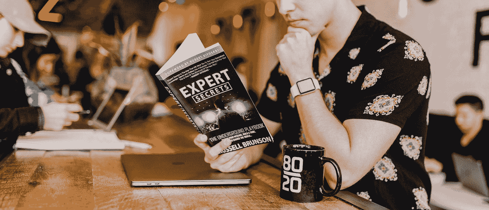

# 每个股票和期权交易者都需要问的一个问题

> 原文：<https://medium.datadriveninvestor.com/the-one-question-every-stock-and-options-trader-needs-to-ask-6faaa6807585?source=collection_archive---------7----------------------->

## 这是我交易心理的基石

Photo by [Austin Distel](https://unsplash.com/@austindistel?utm_source=medium&utm_medium=referral) on [Unsplash](https://unsplash.com?utm_source=medium&utm_medium=referral)

# 我不擅长交易，但至少我很幸运…

这就是我的感觉，直到我在第三年和第四年的 交易期权中发现了一些一致性。2013 年左右，当我 25 岁左右开始进入股市交易时，我带着 600 美元和一个梦想开始。当我在巴哈马群岛的海滩上放松的时候，我会通过交易低价股赚很多钱…我肯定我们都看过那些广告。

我从细价股开始，很快增加赌注到 2-5 美元的股票。到 2015 年中期，我的名字已经达到了 5-10 美元。那年晚些时候，我发现了一些选择，但我没有做好准备。

我的第一笔期权交易成功了。在买入美国银行的看涨期权后不久，该股上涨了 30%。现在，我把它归因于新手的运气，因为从那以后我的期权交易相当糟糕。我是游戏新手，有很多关于希腊人和多腿策略的东西要学。

## 免责声明:

请记住，这是交易建议，而不是投资建议。我没有金融职业，也不是专业交易者。我只是一个喜欢交易期权的人。需要真正的理财建议就找专业人士吧！

# 现实一次又一次地入住

现实是，[对于大多数尝试短期期权交易的人来说，这是一项繁重的工作。事实上，如果我能再做一次，我想我会简单地买入并持有蓝筹股或做间谍，而不是花费所有的时间、精力和金钱去交易期权。但是那有什么乐趣呢？](https://www.investopedia.com/articles/active-trading/053115/average-rate-return-day-traders.asp)

我头几年交易股票还不错，但我头几年的交易选择很糟糕。到 2018 年底，我的第二个全年交易期权(因为生活原因，2016 年的大部分时间都没有交易)，我盯着两千美元的损失。我一半以上的账户消失在其他交易者的口袋里。当我回头看时，我看到了几个不同的原因:

> 过度交易
> 糟糕的策略
> 糟糕的风险管理

有多少像我一样的想成为交易者的人在第一次开始做期权交易时能体会到这个周期？：

> 我会发现一些很好的设置，做出很大的改变，变得自大，在很短的时间内失去所有的收益。我的运气总是用完，因为我总是专注于在下一次交易中赚更多，而不是保存我的资本。我想要 10 倍于我的钱的本垒打交易，我每天都想要。

看我那年的账户历史，我做了**超过 400 笔交易**。对于这样规模的账户来说，这实在是太离谱了！我从好的交易中获得的任何利润都被我花在费用和佣金上的一小笔财富吃掉了。我无法告诉你我有多高兴免佣金交易变得如此普遍。

 [## 每个交易者都应该知道的最佳交易策略指标|数据驱动的投资者

### 像其他生意一样，成功的交易需要对我们的表现进行分析。在运用策略时…

www.datadriveninvestor.com](https://www.datadriveninvestor.com/2020/11/16/best-trading-strategy-metric-every-trader-should-know/) 

# 在每次交易前，问自己这个问题

每当我和新交易者交谈时，大多数人都像我刚开始时一样。他们总是问在哪里可以获得最好的回报，赚一两个快钱……每个交易者应该问自己的问题是:

> 我能损失多少？

最近的一个例子，也是现在可能正在重复的一个例子，就是 crypto。几年前比特币首次流行时，每个人和他们的兄弟都在购买。网上流传着一些人卖掉房子去买比特币的故事。许多人赊购。很多人被消灭了！每个人都在关注它能涨到多高。在热潮期间，我从未听到有人问音乐停止时它会多快下跌。每个人都认为他们会变得富有，我相信他们中的一些人确实如此。然而，我个人并不认识任何促成此事的人。

# 你能损失多少？

这个问题成了我过去一年交易心理的基石。我已经受够了在期权上的巨大损失。从 2019 年末开始，我决定只拿账户的 1%进行交易。如果我在我 5000 美元的账户里支付了 400 美元的买入费，而那笔买入费跌到了 350 美元，我就接受了那笔损失，而不是抱着卷土重来的希望。在过去，持有亏损对我来说是一场灾难，所以为什么还要继续这样做呢？

每当我损失了 1%,我就离开市场。第二天，我在分析我的交易，试图看看哪里出错了。马后炮毕竟是 20/20。

# 永远要有一个目标

当我开始关注少亏而不是多赚时，我的交易目标发生了巨大的变化。我开始把更多的钱放在长期头寸上，而不是保持资金的流动性来交易期权。

如果你想做日内交易，我的建议是为年收益设定一个现实的目标。当然，这是一种简化，但这就是我现在对待日内交易/短期波动交易的方式:

> 我的目标是让我的钱每年增长 15%。这意味着我需要每天获得 0.0006%的收益，因为一年有 252 个交易日。在一个 5k 的账户中，那就是每天 3 美元(3 * 252 = 756/5000 = 15.12%)。

# 保持正确的观点

因为我有这样的观点，我不再试图做全垒打交易了。我保持我的仓位大小适合我的风险承受能力，并且总是有一个退出交易的目标价格。

一旦我的交易达到我的目标，我就退出……大多数时候。如果我的合同有足够的时间，并且有不错的进展，我会尽我最大的努力让他们跑起来。不可否认，这是我目前在交易中做得最多的。我需要更好地让我的赢家跑起来。如果你有更好的建议，请写在评论里！

> 如果你在交易选项中挣扎，开始问自己这样的问题，“我能损失多少？”以及“我退出交易的价格目标是多少？”

一旦你有了更好的视角，立足于现实，而不是在 r/wallstreetbets 和 stocktwits 等社交媒体上与他人比较，我打赌你会发现自己更经常地做出更好的交易。

# 谢谢大家！

*   *如果你喜欢我的作品，* [*关注我的中*](https://medium.com/@erickleppen) *了解更多！*
*   [*通过订阅*](https://erickleppen.medium.com/membership) 获得完全访问权限并帮助支持我的内容！
*   *我们来连线一下*[*LinkedIn*](https://www.linkedin.com/in/erickleppen01/)
*   *用 Python 分析数据？查看我的* [*网站*](https://pythondashboards.com/) ！

[**—埃里克·克莱本**](http://pythondashboards.com/)

 [## 每个新期权交易者应该知道的 5 件事

### 不要被市场淹没！

medium.com](https://medium.com/datadriveninvestor/5-things-every-new-options-trader-should-know-c237389032a4)  [## 如何使用 Python 和 Dash 创建控制股市的仪表板

### 自由期权订单流、价格、基本面、聊天集于一身

medium.com](https://medium.com/swlh/how-to-create-a-dashboard-to-dominate-the-stock-market-using-python-and-dash-c35a12108c93)  [## 成为持续盈利的交易者——两条规则

### 我如何停止在市场上赔钱

medium.com](https://medium.com/datadriveninvestor/become-a-consistent-and-profitable-trader-two-rules-8cc93574c4ad) 

## 访问专家视图— [订阅 DDI 英特尔](https://datadriveninvestor.com/ddi-intel)