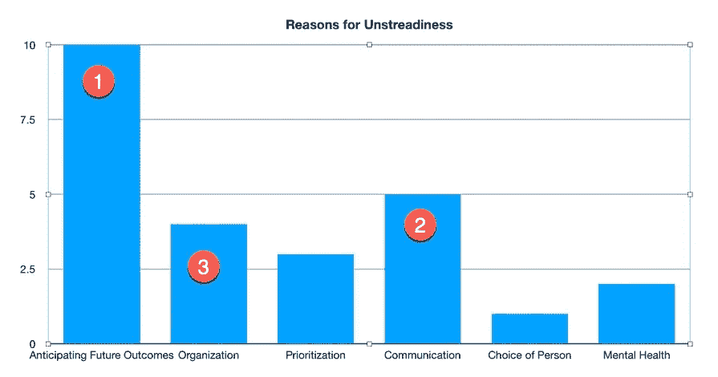

# 一项可以消除我前十个问题的技能

> 原文：<https://medium.datadriveninvestor.com/the-one-skill-that-would-have-eliminated-my-last-ten-problems-b816b6451e41?source=collection_archive---------12----------------------->

## 我决定回顾一下我最近的十个问题，看看我如何能更好地处理它们。结果令我吃惊。

Photo by [James Pond](https://unsplash.com/@jamesponddotco?utm_source=medium&utm_medium=referral) on [Unsplash](https://unsplash.com?utm_source=medium&utm_medium=referral)

我意识到我几乎不知道是什么导致了我的问题。我甚至不知道哪些技能可以消除或最小化我的问题。

所以我决定把我最近的挑战分解一下。

# 我最近的十个问题

1.  我和一个承包商发生了冲突，花了我很多钱。
2.  有人退出了一个重要的项目。
3.  该企业错过了多个项目的最后期限。
4.  我无法完成我们营销机构的必要任务。
5.  家里发生了紧急情况。
6.  我们经历了电子邮件选择加入的下降。
7.  我们没有达到每天的销售目标。
8.  我没有花足够的时间陪我的孩子。
9.  我停止健康饮食有几天了。
10.  我和我的另一半发生了争执。

我想弄清这些问题的真相。

# 我是如何把我的问题分解成小块的

Photo by [Daniel Cheung](https://unsplash.com/@danielkcheung?utm_source=medium&utm_medium=referral) on [Unsplash](https://unsplash.com?utm_source=medium&utm_medium=referral)

我决定用三个简单的步骤来解决每个问题。

## 第一步。识别事件。

例:我们没有达到每日销售目标。

## 第二步。确定这个问题的起源？

*例如:一月份的营销活动并不关注收入。因此，收入较低。*

## 第三步。什么技能可以带来更好的结果？

*例子:预测未来的结果和优先考虑每天的销售目标可以最小化或消除这个问题。*

请注意，在第三步中，我强调了能够带来更好结果的技能。

为什么？

因为我无法控制别人做什么，我的环境，或者一群人的行为。但是我可以控制我对情况的反应。

在分析了每个问题之后，我把它分成了几页的简单图表。这是它看起来的样子。

# 可能有助于解决最近问题的技能

A chart of skills that could have eliminated uneasiness

我以为我的问题出在我的脑袋里。我相信我需要练习彻底接受环境。面对暴风雨要冷静。

 [## 跑步摆脱疯狂:锻炼如何提高你的生产力|数据驱动的投资者

### 没有比锻炼更好的方式来开始一天的工作了。我试着一周至少做四天，在…

www.datadriveninvestor.com](https://www.datadriveninvestor.com/2018/10/23/running-to-get-rid-of-the-crazy-how-working-out-increases-your-productivity/) 

我错了。

事实证明，我的大部分问题都来自于对结果的不预期。

例如，我们在一月份没有达到每天的销售目标。但这不应该让我感到惊讶。

我决定，在一月份所有的促销和销售之后，我会冷静下来，努力在一月份销售产品。相反，我会专注于为我的观众提供有价值的内容。

# 让我们看看，如果我能更好地预测未来的结果，会发生什么…

Photo by [Nik MacMillan](https://unsplash.com/@nikarthur?utm_source=medium&utm_medium=referral) on [Unsplash](https://unsplash.com?utm_source=medium&utm_medium=referral)

## 激活事件。

我将在一月份集中精力为我们的观众制作杀手级的内容。

## 预期未来结果#1。

这将导致创建内容，并为我的客户和订户提供价值。

## 预期未来结果#2。

创造内容和提供价值需要时间和财力，否则这些资源将会集中在销售上。

## 预期未来结果#3。

这种重心的转移将导致 1 月份的销售额减少。但这也会让顾客更开心。

## 最后结局

销售额会降低，因为你把创造内容和提供价值放在了首位。

# 我从分解最近的问题中学到了什么

当你预见未来的事件时，一切都不那么可怕了。

当然，如果我专注于为客户创造内容，我的销售额会更低。这一切都不应该是一个惊喜。

但我是在真空中看着低销量的。我不认为这是我关注不同事物的自然结果。

# 外卖食品

*   尝试分解你的问题。
*   找出你问题的核心，思考什么样的技能可以最小化或消除它们。
*   全面地看待你的问题。问问你自己，一个事件是真的是灾难性的，还是仅仅是你行为的一个可预测的结果。