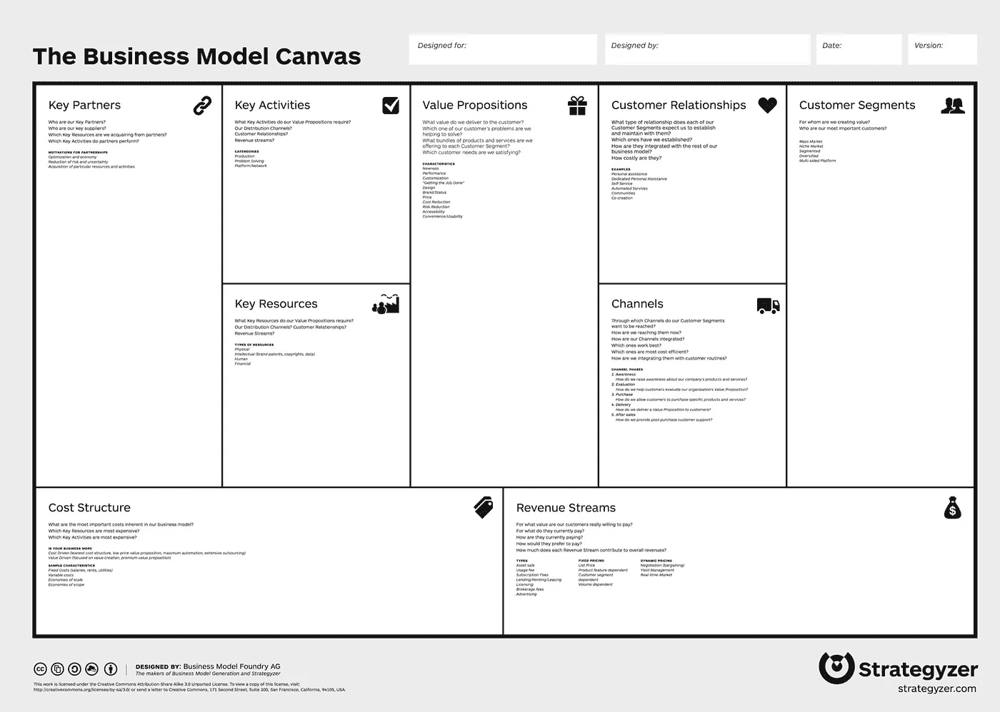

# 每个企业家在考虑任何商业想法之前都需要遵循的一个步骤

> 原文：<https://medium.datadriveninvestor.com/the-one-step-you-need-to-follow-before-considering-any-business-idea-5963606e415?source=collection_archive---------32----------------------->

## 在你完成这个之前，不要想写任何商业计划

Photo by [bruce mars](https://unsplash.com/@brucemars) on Unsplash.

去年，当我在攻读时尚和奢侈品牌管理的硕士学位时，一位教授声称他将向我们展示顶级战略，以测试我们的商业理念并了解其可行性。

我通常怀疑那些概括。

除非你已经创建了一家 1B 退出创业公司，否则我不敢做出这样的断言。甚至不在那里。

无知被必然所掩盖。

## 他向我们介绍了**商业模式画布**

商业模式画布是许多企业家和商学院**用来描述由 Alexander Osterwalder 和 Ives Pigneur 开发的商业模式的图形模板。**

这是一个非常直观的工具，涵盖了九个方面，在测试这个想法之前，应该在团队内部进行讨论。

Source: strategyzer.com

从第一分钟开始，我就觉得这需要大量的工作和研究。如果我甚至不知道这个想法值不值得，还有必要考虑成本和合作关系吗？有人会买我的产品吗？我需要和工厂谈一谈，以便有一个估计的成本吗？而且还想到了营销方案？是不是太过分了？

幸运的是，有人会验证我关于商业模型画布的不方便和耗时的想法。

去年 6 月，我在斯坦福大学参加了一个关于创业和创新的高管项目。该项目的目标是开发一种新产品/服务，并将其推销给投资者。这绝不是吹牛，而是为了证明如果我能从硅谷真正的初创企业身上学到东西，斯坦福就是我要去的地方。

## 商业模式画布有什么问题？

1.  关键活动和关键资源不是商业模式的一部分，而是商业计划的要素。
2.  它给业务模型设计过程增加了不必要的复杂性。它没有一个坚固的结构，却能深入细节。
3.  测试一个商业想法不是一个好的选择；相反，一旦你构建了整个商业模型，它就成了一个有用的清单。

## 你应该怎么做？

首先，使用[设计思维](https://www.interaction-design.org/literature/topics/design-thinking)方法向潜在客户验证你的想法是至关重要的。在考虑任何产品/服务开发之前，确认有人愿意购买是至关重要的。

设计思维的核心有两个原则:

创新:源自对人们生活中想要和需要的彻底理解和彻底的直接观察。

**同理心:**采取“以人为本”方法的目标是满足潜在需求。

设计思维过程非常容易遵循:

1.  灵感:你看看外面的世界，看看人们正面临着什么问题，你试图了解你的想法如何能与其中一个相匹配。
2.  构思:分析信息和开发原型的过程(即使在用原型表达想法非常困难的情况下，也应该有一些产品或服务的视觉表现)。
3.  实现:与人交谈并测试原型。

构思和实施过程是一个双重且相互关联的过程。您测试想法，获得反馈，进行改进，然后继续测试…

这就是循环。

## 遵循设计思维方法，你会避免哪些错误？

**错误一:**

许多企业家认为他们的想法涵盖了大量的需求，但没有足够大的市场来做有利可图的生意。

或者，他们认为他们的产品满足了一种需求，而对另一种需求来说更好。

通过首先测试你的想法，你可以避免因为一个无用的想法而损失金钱和时间，并且如果你需要调整你的核心想法，你可以更快地改变主意。

**错误二:**

弄错了目标。

例如，你可能认为测量压力的便携式设备的目标是 30 多岁从事高压力工作的男性，但它更适合儿童，因为他们无法用语言来表达他们的压力水平。

**错误三:**

你避免生产一个最终版本的原型来验证你的想法。你需要带着你的 [MVP](https://en.wikipedia.org/wiki/Minimum_viable_product) -你的产品最快最便宜的版本。通过这种方式，你甚至在投资一美元之前就获得了第一手的反馈。

一旦你从访谈和与人交谈中得到了需要的确认，**你就可以继续任何商业模式的其他垂直领域，它们是:**

## **价值创造模式:**

1.谁是你的客户，你的产品/服务是什么

2.该产品如何为他们创造差异化价值？

3.什么是价值链？你在哪个部分？

4.什么是走向市场战略？

## 盈利模式:

1.  你的收入来源是什么？
2.  你的成本结构是什么？
3.  盈利能力的关键驱动因素是什么？

## 逻辑:

1.  业务的逻辑是什么？

**遵循这个流程能保证成功吗？我希望！**

但可以肯定的是，这将帮助你最大限度地利用你的资源。

企业家不再能因为觉得产品有趣而随意思考产品，并希望它们能适应市场。

我们正处于一个以人为本的时代。

是否要创建？去和人们交谈。在你完成至少大量的面试之前，忘记写商业计划或分析成本。你不是创造者，而是共同创造者，倾听并让人们告诉你他们需要什么。

如果你没有想法，愿意创业，那就看看这个世界。作为人类，我们变得越复杂，我们的问题就越大。通过擦亮你的眼睛，了解最新的趋势和新闻，与人交谈，你成功创业的机会会成倍增长。

不要忘记在旅程的每个阶段都要感同身受！