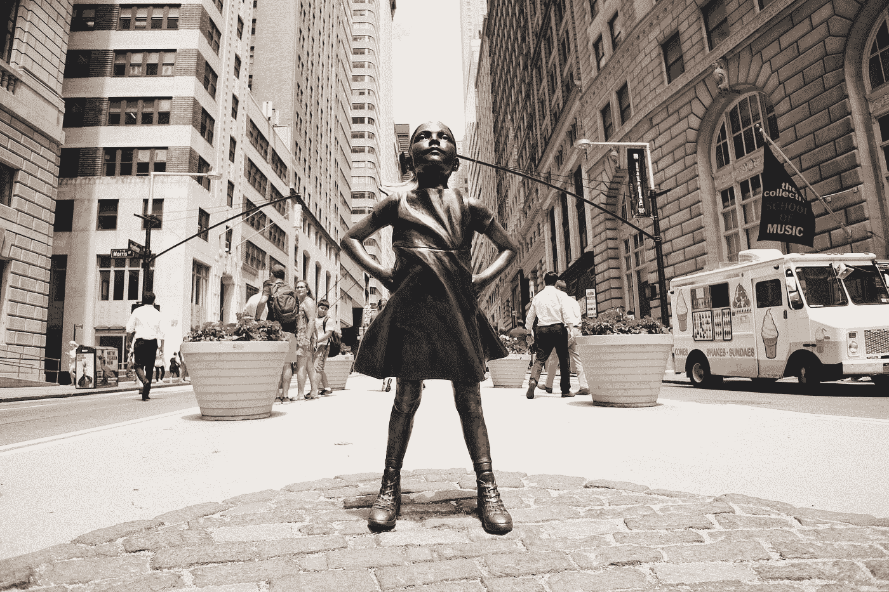

# 关于投资，他们不会在金融课上教的一件事是

> 原文：<https://medium.datadriveninvestor.com/the-one-thing-about-investing-they-dont-teach-in-finance-class-e1477fea9b95?source=collection_archive---------10----------------------->

## 你的情绪状态对你的财务前景起着至关重要的作用。

Photo by [Robert Bye](https://unsplash.com/@robertbye?utm_source=medium&utm_medium=referral) on [Unsplash](https://unsplash.com?utm_source=medium&utm_medium=referral)

有一些关于市场、利率、资本、股票期货和期权的东西是没有人真正谈论的。金融奇才很少提到人的因素——我们行为背后的情感。

说到生意，你是最大的对手、敌人和朋友。如果你战胜了自己，你就能赢得胜利。这个教训在买卖股票、债券和私募股权时尤其适用。

你是你投资组合中最重要的资产。在每一次投资失误之后，我都被提醒，我的情绪状态对我的财务未来起着至关重要的作用。也许在我的财务未来中最突出的角色是由我的情绪单独决定的。在过去七年的大部分时间里，我都在投资，我正在慢慢学习交易的技巧。

我在股票市场上赚钱，也经常赔钱。我会抬起头，试着从错误中吸取教训。但是我的错误往往归结于我的执行力差，没有耐心。我有把现金余额花在投资账户上的冲动，即使投资在我的风险舒适区之外。

无论你是哪种鱼，池塘都充满了不安全感和情绪困扰。经验法则:赢的时候保持耐心，输的时候逃之夭夭。

可怜的投资者在亏损时停留太久，在盈利时终止头寸太快。我总是忘记这个金融智慧的黄金牛轧糖。如果你认为这很简单，我向你保证这并不简单。最糟糕的经济状况是大输小赢。不成比例的收益策略只有在你大赢小输的情况下才有效。

你可以在五年内赚到 1000 万美元，然后在一夜之间失去，连同你的配偶、房子和狗。接下来你知道的是，你住在车里，几乎没有钱买汽油和食物。你很久没洗澡了，已经习惯了那股臭味，你甚至都不在乎了。

但是 1000 万美元是一大笔钱。有了那个数字，你可以舒舒服服地生活几十年。你可以教育你的孩子，你可以让你的配偶快乐。看到你回家，狗总是很兴奋。你觉得你有归属感，你是这个故事的英雄。你唯一要做的就是不要孤注一掷，以小失大。

你需要勇气和荣耀以小失大。把你的生活想象成一项投资。受伤总比残废好。残废比死了好一百倍。但投资者很难面对这样的现实。你是为了胜利而来，但你不接受你的利润表上的负平衡。

从个人痛苦来说:你可以赢很多次，但你可能只输一次。一旦你的投资组合跌到谷底，你就很难回来了。如果你损失了 5%,你就可以继续战斗。大多数投资都是这样的:活着以备将来。永远选择活下去，越过也许只有万分之一胜算的疯狂风险。

不要孤注一掷；运气并不总是站在你这边。在繁荣时期保持耐心，在不确定时期保护你的资产。赢不了就努力活下去。