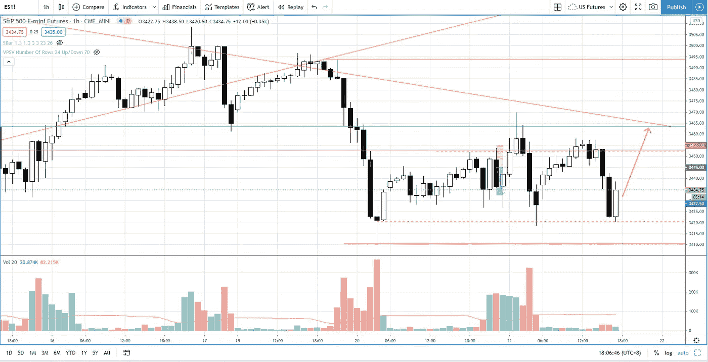

# 交易者在交易假突破时应该做的一件事(这确实有效)

> 原文：<https://medium.datadriveninvestor.com/the-one-thing-every-trader-should-do-when-trading-false-breakout-s-p-500-day-trading-5f13ef146403?source=collection_archive---------31----------------------->

在交易回顾部分，你会发现当你交易假突破时，为了增加胜率，你必须做的一件事。

观看视频，了解 2020 年 10 月 21 日交易时段标准普尔 500 指数期货的**每日市场分析。在这个视频中，我向你展示了上一个交易日的市场回顾和三分钟内的交易回顾(包括进场、出场和背后的原理)。展望未来，我将涵盖偏见，要注意的关键水平，我稍后的交易计划。**

## 时间戳

*   [1:05](https://www.youtube.com/watch?v=nWbGqS4nAyg&t=65s) 市场回顾
*   [3:38](https://www.youtube.com/watch?v=nWbGqS4nAyg&t=218s) 贸易回顾
*   [7:10](https://www.youtube.com/watch?v=nWbGqS4nAyg&t=430s) 一件事
*   供应的增加
*   [12:40](https://www.youtube.com/watch?v=nWbGqS4nAyg&t=760s) 当前市场前景
*   [14:15](https://www.youtube.com/watch?v=nWbGqS4nAyg&t=855s) 量差分析找出供应量

如果你还没有看我在上一期的[每日市场分析视频](https://www.youtube.com/watch?v=A2T_A5dTRCs)，以便更好地了解市场回顾和交易回顾。

**偏向** —中性(日内交易)；看涨(长期)

**关键点位** —阻力:3490–3500，3460；支持:3390–3420

**潜在设置** —在关键级别寻找潜在反转。

# 资源

**每周市场展望&最佳交易建议**直达您的收件箱:[https://www.tradeprecise.com/](https://www.tradeprecise.com/)

**职业免费**制图平台:创建账户→[www.TradingView.com](https://bit.ly/2U2Femd)

**非美国居民？** ( **马来西亚、新加坡**、澳大利亚、新西兰、欧洲等):[点击此处，存款 2000 新加坡元](https://ji.hn/sgtiger)即可获得**免费股票(价值 100++美元&老虎经纪**的欢迎礼物)

美国居民？[点击此处，存款 1500 美元](https://ji.hn/ustradeup)，就有机会在 TradeUP 获得**份免费的 AMZN(价值 3000++** ) & **份欢迎礼物**

**从媒体获取无限文章** —加入以下:[https://priceactiontrading.medium.com/membership](https://priceactiontrading.medium.com/membership)

# 进一步阅读

 [## 摇摆交易的顶级仙股——HNRG、QEP、SNDL，告诉[巨大的上涨潜力]

### 找出这 4 只最便宜的股票——HNRG、QEP、SNDL，告诉他们基于回调可以进行摇摆交易…

medium.com](https://medium.com/datadriveninvestor/top-penny-stocks-for-swing-trading-hnrg-qep-sndl-tell-huge-upside-potential-b4937a3ce955)  [## 苹果(AAPL)收益前创历史新高——买还是卖？

### 苹果打破了杯子和把手的模式，在昨天 Q1 财报发布前跃升至历史新高。什么是…

medium.com](https://medium.com/datadriveninvestor/apple-aapl-at-record-highs-ahead-of-earnings-buy-or-sell-726c7989daeb)  [## ARK Invest 的 Cathie Wood 预测基因组股表现优于特斯拉？

### 方舟投资公司的首席执行官凯西·伍德预测，最大的上涨惊喜可能来自基因组股票，尤其是…

medium.com](https://medium.com/datadriveninvestor/ark-invests-cathie-wood-predicts-genomic-stocks-outperform-tesla-b67f3c4bbc68) 

Photo by Author — Ming Jong Tey

Photo by Author — Ming Jong Tey

披露:如果您点击本文中的链接进行购买或开立账户，并将所需金额存入推荐的经纪人账户，我们将免费为您赚取佣金。

免责声明:本演示中的信息仅用于教育目的，不应作为投资建议。