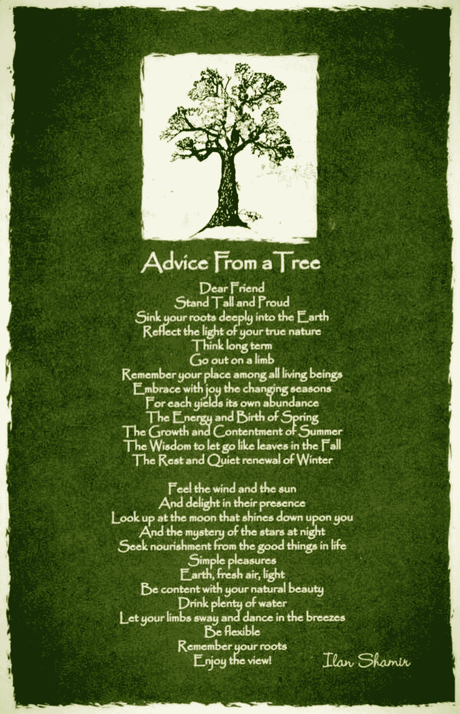

# 我希望在新的一年里看到的一件事是疏远的终结

> 原文：<https://medium.datadriveninvestor.com/the-one-thing-i-would-like-to-see-happen-in-the-new-year-is-the-end-of-alienation-1eb2541fef0f?source=collection_archive---------22----------------------->

My Name is **Hope**. The one thing I would like to see happen in the New Year is for people to wake up every morning with the hope for a beautiful life each and every day filling their hearts. Photo by @freepik via freepik.com

# 我希望在新的一年里看到的一件事是疏远的终结

祝我所有的读者和关注者新年快乐！感谢您花时间阅读我的作品，并通过您的评论与我互动。我感谢你们每一个人。开始新的一年总是充满期待；考虑到我们在 2020 年都经历了什么，2021 年承载了很多希望。关于去年有很多话要说，如果我可以用一个词来简洁地总结，我会用“疯狂”这个词。接下来，如果有一件事是我希望在新的一年里看到的，那就是结束我们似乎都在受折磨的**疏离状态。**

My name is **Estrange.** The one thing I would like to see this New Year is that we stop being alienated from each other. Photo by @freepik via freepik.com

*“异化”一词*来源于拉丁语 ***“疏远”*** 被定义为人类与其本性或社会的某些本质方面的分离或疏远，通常会导致无力感或无助感。

去年一整年，我们彼此疏远，被迫呆在家里，远离朋友、家人、同事和客户。把我们所有的时间都花在室内，花在我们自己的、很少消毒的、没有病毒的泡泡里；仅仅通过我们的电子设备与外界联系正在成为“新常态”，这反过来疏远了我们彼此、自然和我们自己。

# 彼此疏远

> *没有人是孤岛*

**人类是社会动物，联系是人类的核心需求；我们需要健康的关系来茁壮成长。正是通过联系，我们完成了生活中发生在我们身上的几乎所有事情。这不仅仅是一种偏好，这是一种生存需要。因此，毫不奇怪，在马斯洛的需求金字塔中，联系和归属感排在第三位，仅次于食物、水、住所，这是我们生存所必需的第一基本需求，以及通过就业获得安全的需求，健康和财产，这是马斯洛的第二基本需求。**

**快速复习一下，亚伯拉罕·马斯洛是一位美国心理学家，因撰写了《人类动机理论》和《存在心理学》而闻名。他定义了自我实现的概念。马斯洛研究心理学的独特方法来自于他决定研究心理健康的个体，而不是有严重心理问题的人。他关注的是自我——现实化的个人，他们对现实有更好的洞察力，深深地接受自己、他人和世界，并分享诸如真理、善良、活力、独特和有趣的品质。**

****

**My name is **Esteem**. The one thing I would like to see happen this New Year is for people to feel recognized and appreciated for what they do. Photo by @freepik via freepik.com**

**在马斯洛需求金字塔的底部，你可以找到食物、水、睡眠、性等人类的*基本需求*。下一个层次是*安全需求*或对安全、秩序和稳定的需求。一旦个人获得了基本的营养、住所和安全需求，他们就可以自由地完成更多的事情；这是他们进入下一个层次的方式，比如爱，属于一个团体，联系。第四个层次即 ***自尊*** 是需要感到胜任和被认可；当个人对自己通过职业成功和地位所取得的成就感到满意时，就达到了这一水平。在金字塔的顶端，你有自我实现的需求，当个人达到和谐和理解的状态时，这种需求就会出现，因为他们正在努力实现自己的全部潜力。**

**回到本文的主要观点，几项研究已经证明了这样一个事实，即与他人联系对我们的身心健康有好处。真正的联系比单纯的交谈更深刻。真正的联系可以在没有语言的情况下发生，与我们甚至不认识的人发生。另一方面，持续的联系，比如每天和某人一起工作，并不能保证真正的联系。**

**真正的联系发生在当你向他人敞开心扉，而他人也向你敞开心扉的时候。当我们在身体上被拥抱，在情感上被理解，并且被另一个人支持的时候，我们会感到和某人有联系；你在这种混合中加入一些同理心和同情心，你就有了建立良好关系的秘诀。**

**科学家对此进行了研究，科学在这个问题上很清楚，我们在人际关系中有多幸福对我们的健康和幸福有很大的影响。哈佛成人发展研究是有史以来对成人生活进行的最长的研究，允许研究人员收集大量关于男性身心健康的数据。女性没有参与最初的研究，因为这所大学仍然全是男性。这项研究始于 1938 年，当时科学家开始跟踪 268 名哈佛大学二年级学生的健康状况；他们希望这项研究能揭示健康快乐生活的线索。科学家们扩大了他们的研究范围，将这些男性的后代也包括在内，十多年前，他们的妻子也加入了这项研究。在参与这项研究的男性中，一些人后来成为了成功的商人、医生和律师，而另一些人则最终成为了精神分裂症患者或酗酒者。令人惊讶的发现是，我们的关系，以及我们在关系中有多快乐，对我们的健康有很大的影响。启示是:照顾好自己的身体很重要，但照顾好自己的人际关系在长寿和快乐的生活中扮演着重要角色，也是一种自助形式。亲密的关系，比金钱或名誉更能让人一生快乐。这些紧密的联系保护人们免受生活中的不满，有助于延缓精神和身体的衰退，是比社会阶层、智商甚至基因更好的长寿和幸福生活的指标。**

> ***在新的一年里，我希望看到的一件事是结束我们现在所经历的彼此疏远的状态。我希望 2021 年是我们能够安全地与家人、朋友、同事和客户重新联系的一年。***

# **与自然的疏离**

**在这个世界上，我们花越来越多的时间呆在室内，粘在屏幕上，我们应该把*走出去，沉浸在大自然中*作为我们新年决心清单上的一个额外项目。没有什么比在公园、树林或海滩散步更能振奋我们的感官，给我们一种幸福和宁静的感觉了。科学家开始发现证据表明，身处大自然对我们的大脑和行为有着深远的影响，有助于我们减少焦虑、压力，并改善我们的免疫系统。**

**犹他大学的研究员大卫·斯特赖尔证实，大脑扫描明确显示，当我们与自然互动时，我们的身心会更加健康。科学证明了我们直觉上所知道的，自然让我们快乐。**

****

**My name is **Sunshine**. What I would like to see happen in the New Year is that people go out more to enjoy feeling the sun on their skin. Photo by @freepik via freepik.com**

> **我们必须珍惜自然世界，因为我们是它的一部分，我们依赖于它**
> 
> **大卫·爱登堡爵士**

**一天在*的阳光下可以为我们提供维生素 D，这对良好的免疫系统至关重要。今天有很大一部分人缺乏维生素 D，这种缺乏经常被发现是癌症、糖尿病、老年痴呆症等疾病的根源。这个问题很容易解决，只要多在户外晒晒太阳。***

***环境是天然的净化器。花几个小时在户外有助于从我们的身体中释放毒素，让我们感觉新鲜和充满活力。此外，花在户外的时间自然会促使我们做更多的体育活动，如散步、慢跑、骑自行车、游泳冲浪、踢足球。任何户外运动都有助于燃烧脂肪，改善身体的新陈代谢。***

***如果你住在市区，并且离公园不是很近，在家里种些植物会创造奇迹。在家里种植植物可以为你的生活空间增添美感，但也有助于净化你呼吸的空气。***

******伊兰沙米尔******

******

> ***在新的一年里，我希望看到的一件事是结束目前这种与自然疏远的状态。我希望 2021 年是我们走出去拥抱季节变化的一年，春天的能量和诞生，夏天的成长和满足，像秋天的树叶一样放手的智慧，冬天的休息和安静的更新。***

# ***自我异化***

***你知道你是谁，你的本性是什么吗？在我们真实的本性中运作经常被搁置，因为每天都有更紧迫的事情要处理。人们倾向于迷失在他们永无止境的义务、家务和平凡的生活中。***

***每个人都要承受自己内心挣扎的负担。生活会给你带来一连串的好运和不幸。学习如何应对由此产生的喜悦或痛苦和困惑总是一场斗争；但是如果我们学会了从我们真正的本质出发去行动，这将会是一场更少的斗争。***

***对我们人类来说，重新获得与自己联系的感觉的一个方法是留心并活在当下，关注我们对特定情况的感受，比如恐惧、贪婪、嫉妒、愤怒、憎恨。我们的想法是让这些感觉包围我们，并尽我们所能用同情和智慧来处理它们。***

> ****什么是恐惧？不接受不确定性。如果我们接受不确定性，它就成了一次冒险。什么是羡慕？不接受他人的优点。如果我们接受他人的优点，它就会成为灵感。什么是愤怒？不接受我们无法控制的事情。如果我们接受它，它就变成了宽容。什么是恨？不接受人们的本来面目。如果我们无条件接受，它就会变得缓慢。n****
> 
> ****美洲原住民的智慧****

******

***My name is **Clarity**. The one thing I would like to see happen this New Year is for people to have more clarity. Photo by @freepik via freepik.com***

***根据古希腊人的说法，一切智慧的源泉*是认识自己*。这句格言是刻在特尔斐阿波罗神庙上的格言之一。有了这段铭文，特尔斐的神谕邀请人们向内凝视，并发现一个人生命的本质不是在我们之外寻找，而是在我们之内，这是我们发现清晰的地方。*****

> ***“太多的人会花上 30-40 年的时间去检查他们不擅长的事情，浪费大量的时间并失去这些东西。”***
> 
> ****加里·韦内尔丘克****

***自我意识是对自己的性格、感情、动机和欲望的有意识的了解；没有自我意识，你的很多选择都是在无意识中做出的；*爱谁或者不爱谁，为什么会觉得难过，为什么会觉得开心，为什么会留在现在的工作岗位？****

> ***在新的一年里，我希望看到的一件事是结束许多人现在正在经历的自我疏离的状态。我希望 2021 年是人们重新认识自我的一年，并找到之前逃避的清晰。***

***我亲爱的朋友，这是你对 2021 年的追求。***

******

***Joanne Reed The Author
Author of “This Is Your Quest”. You can’t buy happiness but you can buy books. Your mission, should you wish to accept it is to experience happiness***

*****访问专家视图—** [**订阅 DDI 英特尔**](https://datadriveninvestor.com/ddi-intel)***