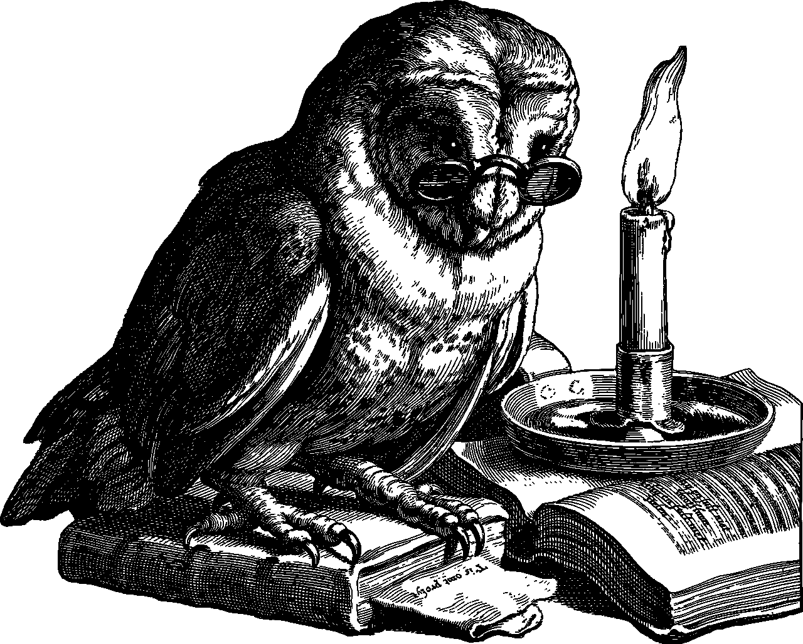
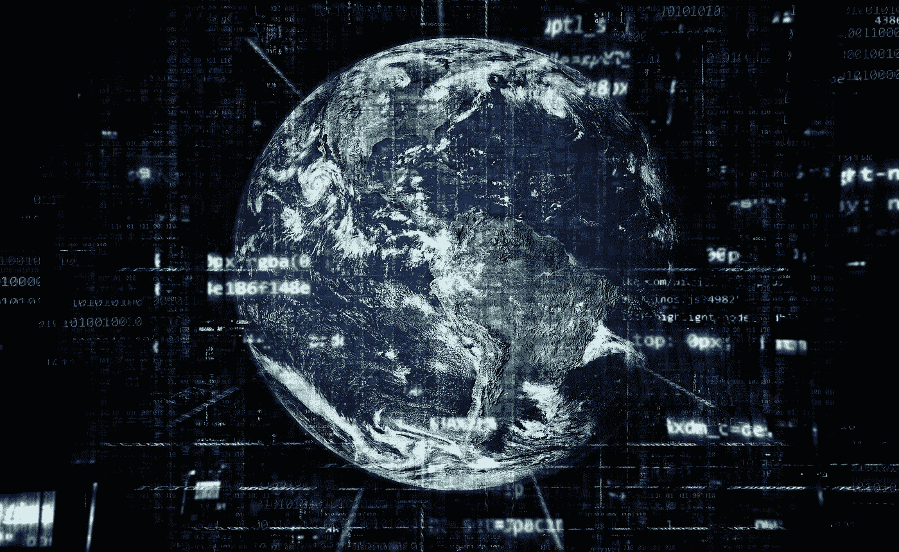

# 唯一能拯救金融界的东西！

> 原文：<https://medium.datadriveninvestor.com/the-one-thing-that-can-save-the-financial-world-a06dcb9aa903?source=collection_archive---------14----------------------->

Image from unsplash.com

# 电晕危机之后，太多的事情将会改变。但是仅仅一个就能拯救经济！

让我解释一下。许多预言家每天都告诉我们，他们已经预测到了这场经济危机。

实际上，他们一年预测一次或两次。

在这么多年的预测中，总有一天他们会是对的。其他的 99 个都是错的。

我将向你展示关于金融世界的非常重要的观点！

## 首先，这不是一场经济危机。这是一场健康危机！这意味着，尽管所有的预测表明全球经济将放缓，但我们正处于近代史上最长的牛市。在那段时间里，没有抵押贷款崩溃，没有长期债务崩溃，没有从技术上把牛市变成熊市的经济现象。

当然，存在结构性问题，而且总会发生周期性事件。有些软，有些硬。有些是可预见的，有些是意想不到的。它是这个复杂游戏的一部分！

但是疫情现象总是会给全球经济带来麻烦！毫无疑问！

为什么？

因为没有一个完美的经济体系可以对抗彻底的关闭。一点系统都没有！

所以我们到处看到成千上万的评论试图解释这场“经济危机”的起源。答案很简单。

全球疫情健康危机！

不是俄罗斯人、沙特阿拉伯人或中国人。不是股票或债券。这不是美元。这不是信贷或债务。

是电晕病毒！

Photo from Sarah Kilian on unsplash.com

这种事件叫黑天鹅！

# 什么是黑天鹅？

[黑天鹅是一种不可预测的事件，超出了正常情况下的预期，具有潜在的严重后果。黑天鹅事件的特点是极其罕见，影响严重，而且人们普遍认为事后才明白。](https://www.investopedia.com/terms/b/blackswan.asp)

我看到了许多人对这一令人震惊的疫情事件的精彩反应。尽管我们无法避免发生可怕的损失和健康问题，但这些新时代将让我们反思全球经济中的许多结构性问题。

 [## 使用谷歌搜索趋势预测首次申请失业救济人数|数据驱动的投资者

### 几年来，我的重点一直是使用多种替代数据来预测宏观经济统计数据…

www.datadriveninvestor.com](https://www.datadriveninvestor.com/2020/03/25/using-google-search-trends-to-predict-initial-jobless-claims/) 

我们不能回避一些经济原则。如果世界 GDP 创造了全球财富的 1%到 3%，而我们需要 138 万亿美元来资助这种过去 30 年的人为增长，[正如杰夫·布斯在这个令人难以置信的采访](https://www.youtube.com/watch?v=F8lfLqnhuGs&t=6s)中所说，用错误的标准把美元放在人们手中，我们只是在与魔鬼玩耍。

这个量化宽松的游戏会一直玩下去，直到它不再有效。但是真正全球化的代价将是灾难性的。

那么，我们该如何应对呢？

神奇药水是什么？

Image from pexel.com

# 比特币还是黄金？

如你所愿，当美元不再是现代世界的主要贸易货币时，这两种资产或货币或大宗商品是超级富豪们同意成为未来平衡的坚实基础。

我们看到尊敬的投资者反思这种 QE 瘾。我读过的最好的观察来自 Rick Rule，Sprott US Holdings Inc .的首席执行官，在银条电视上。

Rick 解释说，我们必须理解，首先作为个人，然后作为一个团体，我们必须省钱。节约是关键！

> [“我希望看到的重置是开始发展你需要照顾自己的心态，你需要照顾你的家人，你需要在群体中照顾自己，但你交流的群体。让国家照顾好自己，让地球上 77 亿人能照顾好自己的事情。(……)如果个人自我重置，社会就会自动重置。”](https://www.youtube.com/watch?v=55z7J1V4BTU)

这可能是应对我们所处的这种系统性螺旋的最佳方法，即直升机撒钱政策。可惜是乌托邦思想！

考虑到我们，作为个人，有工具可以同时开始，为困难时期存钱，这是非常困难的，因为我们都依赖于上层建筑的法律和规则。

**人们没有知识、力量或权力去做系统不想让我们做的事情！**

但是有些事情可以从我、你、我们的邻居、我们的城市和我们的国家开始，来改变这个世界…

有两位作者强烈认为黄金是未来的储备货币。我读过他们的书，多少理解了他们的信仰。

[罗伯特·清崎，出自《富爸爸穷爸爸》一书](https://www.amazon.com/Rich-Dad-Poor-Teach-Middle/dp/B008BUHTLE/ref=sr_1_1?crid=1SW6EP7PCKSCN&dchild=1&keywords=rich+dad+poor+dad&qid=1588234577&sprefix=rich+dad+%2Caps%2C273&sr=8-1)，是一个金银币迷。他认为，今天我们生活在虚假的金钱、虚假的教育和虚假的政治中，这是预测 2016 年崩溃的“预言家”之一。失败了 4 年。我尊重罗伯特先生。毕竟，他是反对这种金融架构的声音之一。

詹姆斯·里卡德写了一本很棒的书，叫做《余波》。一本写得非常好的书，讲述了这种无法控制的债务上瘾症，它将改变世界经济，扼杀美元。他是另一个金本位迷。

但关于不可控制的债务成瘾和回归金本位作为储备货币，里克·规则说了一句非同寻常的话:

**“这在民主世界里永远不会再发生了。政治权力将金本位视为对其权力的一种约束，政治生活和繁荣依赖于他们唯一拥有的硬币——权力"**

加密货币呢？

加密货币开始进入我们的社会。慢慢地，静静地。不要犯错误。这将把银行和法定货币置于一个具有挑战性的位置。

你了解杰克·多西吗？他是 Twitter 的首席执行官，最近成立了一家名为 Square 的公司。

Square 最初是一家支付初创公司，后来转型为 260 亿美元的金融科技巨头。它可以将任何智能手机变成信用卡读卡器。但这还不是全部。Square 为中小企业家提供了融资的可能性，因为他们的规模越来越大。该公司利用其令人难以置信的数据科学来检查客户的可信度，以帮助他们获得更多的金融工具来改善他们的业务。

你猜怎么着？

他们有一个使用加密货币的应用程序(Cash app)。因此，杰克·多西广场的支付结构已经使用了加密货币。目前，Cash 应用程序只是一个交易应用程序。Square 只是一个进行信用卡支付的设备。但是让我们听听杰克的话:

[“如果有一个词能代表我们正在努力做的事情，那就是这个词——接入！(……)我相信互联网应该也需要一种本土货币，我是比特币的忠实信徒！”](https://www.youtube.com/watch?v=60KJz1BVTyU)

这篇文章的标题是:

## “唯一能拯救金融界的东西！”

Image from pexel.com

# 答案是:**技术**