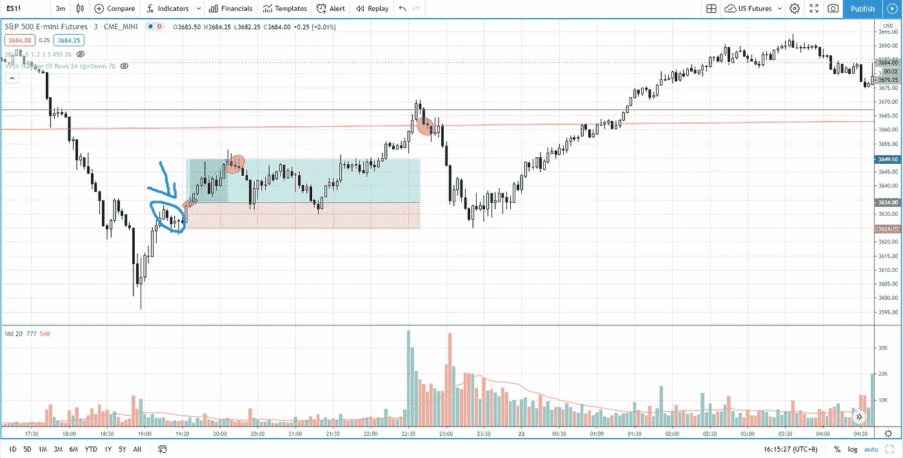

# 交易者在交易威科夫强势反弹信号时应该做的一件事——标准普尔 500 日交易

> 原文：<https://medium.datadriveninvestor.com/the-one-thing-traders-should-do-when-trading-wyckoff-sign-of-strength-rally-s-p-500-day-trading-db3e64abf2a1?source=collection_archive---------26----------------------->

找出每个交易者在交易威科夫强势反弹信号时应该做的一件事，以增加胜率。

观看视频，了解 2020 年 12 月 23 日交易时段标准普尔 500 指数期货的**每日市场分析。在这个视频中，你将看到上一个交易日的市场回顾和三分钟的交易回顾(包括进场、出场和背后的原理)。展望未来，我将涵盖偏见，要注意的关键水平，我稍后的交易计划。**

## 时间戳

*   [1:15](https://www.youtube.com/watch?v=nTVLx4Y_zkE&t=75s) 市场回顾
*   [3:52](https://www.youtube.com/watch?v=nTVLx4Y_zkE&t=232s) 贸易回顾
*   [6:20](https://www.youtube.com/watch?v=nTVLx4Y_zkE&t=380s) 从下降通道超卖
*   [6:50](https://www.youtube.com/watch?v=nTVLx4Y_zkE&t=410s) 强势反弹的迹象
*   只有一件事——等待测试
*   [9:55](https://www.youtube.com/watch?v=nTVLx4Y_zkE&t=595s) 反转棒作为确认
*   [14:00](https://www.youtube.com/watch?v=nTVLx4Y_zkE&t=840s) 当前股市展望

如果你还没有看我在上一次会议中的[市场分析视频](https://www.youtube.com/watch?v=SlrtcvOd7ro)，以便更好地了解市场回顾和行业评论。

**偏向** —中性(日内交易)；看涨(长期)

**关键点位** —阻力:3750，3720，3700；支持:3670–3680

**潜在设置** —在关键级别寻找潜在反转。

# 资源

**每周市场展望&最佳交易建议**直达您的收件箱:[https://www.tradeprecise.com/](https://www.tradeprecise.com/)

**职业免费**制图平台:创建账户→[www.TradingView.com](https://bit.ly/2U2Femd)

**非美国居民？** ( **、新加波**、澳洲、纽西兰、欧洲等……):[存款 2000 新币](https://ji.hn/sgtiger)即可获得**免费股票(价值 100 美元++ &老虎经纪公司的欢迎礼物**

美国居民？[点击此处，当您存入 1500 美元](https://ji.hn/ustradeup)时，就有机会在 TradeUP 上获得**份免费的 AMZN 股票(价值 3000++美元** ) & **份欢迎礼物**

**无限制访问媒体文章** —加入以下:[https://priceactiontrading.medium.com/membership](https://priceactiontrading.medium.com/membership)

# 进一步阅读

 [## 新冠肺炎期间股票交易的 9 个教训|数据驱动的投资者

### 在你浏览之前，让我告诉你一些关于我自己的情况。我是…

www.datadriveninvestor.com](https://www.datadriveninvestor.com/2020/12/09/9-lessons-learned-about-stock-trading-during-covid-19/)  [## 凯西·伍德警告市场即将调整——标准普尔 500 价格走势分析

### 在 2020 年 12 月 18 日对彭博的采访中，方舟投资公司的首席执行官兼首席信息官凯西·伍德警告说…

medium.com](https://medium.com/datadriveninvestor/cathie-wood-warns-market-correction-soon-price-action-analysis-on-s-p-500-7e621e013310)  [## 市场修正，泡沫还是崩盘？标准普尔 500 价格行为分析

### 标准普尔 500 期货(es)昨日因供应激增下跌 2.5%，跌破上行通道。这是正常的…

medium.com](https://medium.com/datadriveninvestor/market-correction-bubble-or-crash-s-p-500-price-action-analysis-6f26e6698dbc)  [## 2021 年这些绿色能源股会涨 400%-1300%吗？

### 2021 年第 3 周市场回顾

medium.com](https://medium.com/datadriveninvestor/will-these-green-energy-stocks-gained-400-1300-in-2021-3f7288227c76) 

Photo by Author — Ming Jong Tey

Photo by Author — Ming Jong Tey

披露:如果您点击本文中的链接进行购买或开立账户，并将所需金额存入推荐的经纪人账户，我们将免费为您赚取佣金。

免责声明:本演示中的信息仅用于教育目的，不应作为投资建议。

## 访问专家视图— [订阅 DDI 英特尔](https://datadriveninvestor.com/ddi-intel)