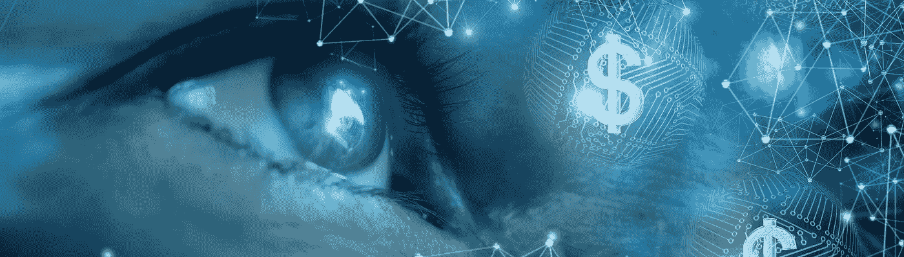

# 让你负债累累的一个词。

> 原文：<https://medium.datadriveninvestor.com/the-one-word-keeping-you-in-debt-458a8e3152a9?source=collection_archive---------15----------------------->

## 当我在广告中听到“值得”这个词时，我会退缩。

Image by Natali_Mis Getty Images Pro via Canva

你*不配得到*任何东西。我知道这是一个困难的，两极分化的概念，但这是真的。 ***值得拥有*** 是一个营销词——消费者的触发词。你应该得到这个新奇闪亮的东西。现在就买。数量有限。别等了！

对营销大师来说，我们是上岸休假的醉醺醺的水手，口袋里装满了现金，在红灯区游荡。他们狂热地摇动他们的集体资本主义评估来引诱你进去，这样他们就能攫取你辛苦赚来的金子。

你可能会想，“我整天都在工作。我配得上各种东西。”

我谦虚地说。不，你真的不知道。

让我们假设你不是邦德电影中的超级坏蛋。有你需要的基本东西，也有你买得起的非基本东西。我们用我们在这个星球上有限的时间来换钱，我们用这些钱买东西。你的*时间*值多少？是一辆六万美元的车还是一柜子的鞋子？值得去异国度假还是买房子？

这里没有错误的答案，但要知道你在用生命换什么，并据此制定计划。

现在是信用卡。我们需要的所有闪亮的新东西，寄生月服务，或者你想要的最新手机。你的消费债务可能与你的教育债务相比相形见绌，显得无关紧要，但事实并非如此。

用*我需要这个来生存吗*的镜头来看待大大小小的日常购买会减少你的支出。对于非必需品的购买，我的人生格言是:如果你吃不下，就卖掉或者去他妈的。不要在这上面花钱。

还债不是随便发生的。计划还清债务，执行你的计划，当结果需要时调整计划。在 Vertex42.com[可以找到一些有用的工作表。滚雪球或雪崩式的回报方法可以帮助你瞄准第一步。即使是去杂货店的简单旅行也需要一些计划。](https://www.vertex42.com/Calculators/debt-reduction-calculator.html)

把情绪从你的财务中拿出来，算一算。你每天的生活成本是什么？你每天赚多少钱？这些答案会因你所处的人生阶段而大相径庭。注意“B”字不见了。预算对于那些倾向于使用它们的人来说是很棒的，但对于我们其他人来说，它们会耗尽我们的生活。

了解你的数字，而不是别人告诉你你应得的数字。

假设你每天的生活花费你 205 美元。你一天挣 402 美元，剩下的钱去哪了？

我不知道答案。一些钱存了起来。一些钱用来支付信用卡账单。一吨垃圾蒸发到太空中，这是我应得的。可能需要几个月的调查来确定你的数字。就像食物摄入宏指令一样，你如何处理这些数字将是改变你处境的关键。

截至 2020 年 9 月，储蓄率低得可怜。我用 Marcus.com 作为我的储蓄账户。我相信有目标的储蓄。马库斯允许我免费保留多个储蓄账户。资金通过自动存款转移到一个度假基金，一个用于写作开支的小基金，和一个用于日常紧急情况的中央基金。我开始慢慢存钱。这些年来，这些小钱救了我好几次。

使用适合你的银行。在谷歌上简单搜索一下最佳网上储蓄账户，就会出现一个选择列表。选择一家对你来说没有手续费和最低存款额的银行。请务必在开户第一天就设定好你的受益人。

**倒楣的事情发生了。糟糕的事情毫无征兆的发生，提前计划。**

现在，我存了更少的钱来支付信用卡的使用。以不到百分之一的利率存钱并支付信用卡余额的百分之六到百分之十八是没有数学意义的。

感情上我需要省钱。省，省，省是老一辈人往我们脑子里钻的。指定用于支付高利率债务的储蓄的滑动资金深深刺痛了我的不安全感。

面对这些难题时，我求助于数学。我的号码是多少？我如何降低我的费用数字？我可以在不增加费用的情况下增加收入吗？

利用好巩固贷款。就在疫情崩溃前，我改建了一间出租屋。为了腾出资金购买弹药和卫生纸，我把这些费用合并成一笔整洁的低利率付款，还是和马库斯一起。

**巩固债务的帽子戏法是不要让你的消费债务再次达到最大。**

这就是债务整合这把双刃剑的血腥一面。如果你不知道你的信用卡收费是多少，你会不断增加债务。你可能会以合并支付和支付新的信用卡账单而告终。有更多的钱可供你支配的兴奋感甚至会诱使你重新购买你生存所不需要的东西。

我目前的情况有点不同，但我过去巩固了直接的信用卡购买。几十年前，我清理了我的行为，还清了一切，包括合并贷款，只是为了再做一次。我成年后已经八次无债一身轻，这种感觉是超然的，但也是情感驱使的。

从金钱决策中去除羞愧、恐惧和我们应得的东西等情绪，将有助于你掌控自己的财务。你的自我价值与你的负债比率或银行账户余额无关。

我每个季度都会查看我的储蓄账户余额和欠款。当数学起作用时，我会还清大部分抵押贷款或清除非零利率债务。

我不用购物卡。我只使用利率最低或零利率的主要信用卡，如果我能找到它们的话。

使用零利率促销。我喜欢 PayPal 六个月零利息。我使用 PayPal 进行网上购物，并在六个月的促销活动结束前付清购物款。

我关注自己的信用评分，按时支付账单。一个好的分数可以让我抢到那些低利率的信用卡。我知道，不是胡扯，但这件事很重要，值得一提。按时付款。

在可能的情况下，使用公用事业服务的“平衡支付”选项。这些程序在极端天气波动期间削减了令人惊讶的高额电费，给你一个恒定的费用数字。

我没有一辆价值六万美元的汽车，也没有一柜子的鞋子。融资买车让我想吐。汽车是你在周一购买的那些“资产”之一，到周五会贬值。我存钱或用低息促销来买车。

我每两个月评估一次我的月费和年费，剔除我不再需要的额外服务和项目。这些小小的寄生购买可以累积每月数百元的无用支出。

作为一个社会，我们不会公开谈论金钱——沉默在经济上阻碍了后代。大多数人在讨论他们挣多少钱或者他们如何花钱之前，会分享他们性行为中的隐私细节。

不足以维持生计。你需要保护你的财富。如果是最初的 20 美元，你会不情愿地把它存入储蓄账户，或者你决定把 10 万美元存入投资基金。应该有很多问题——在选择攻击计划之前研究几种方法。第一步是问数学是什么，而不是问我应得什么。

[西莉·威尔斯](https://www.celiewells.com) 2020