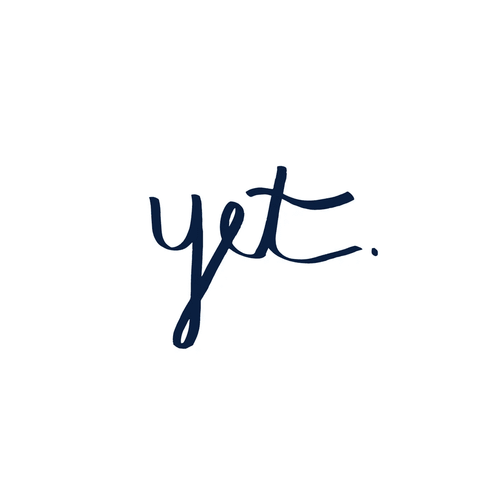

# 改变你创新方式的一个词

> 原文：<https://medium.datadriveninvestor.com/the-one-word-that-transforms-your-approach-to-innovation-dd6bbad765d9?source=collection_archive---------32----------------------->

你最后一次听到这些是什么时候？

“我们没时间了”

“我们的人没有技能”

“我们没有预算”

“这不是我们做的”

**我总是听到他们。**

有时，当一家公司开始投资建设创新能力时，有时在一对一的利益相关者访谈中，当人们更自由地分享他们的诚实意见时，有时在投资完成后很久，人们会说这些话。

**每一次，它们都是创新终结的开始。**

但是一个词可以改变这一切。

“我们还没有时间。”

“我们的员工还没有这方面的技能。”

“我们还没有预算。”

“这还不是我们要做的——目前还不是。”

## **还没有。**

**然而创造了改变的空间。它承认你正处于旅程的中途，而不是终点。它鼓励交谈。**

“我们还没有时间。”

“好的，我知道团队很忙，他们正在做的事情很重要。让我们看看人们正在做什么，看看我们是否可以推迟或停止一些事情，以便为此创造空间。”

“我们的人还没有这方面的技能。”

“要知道，说到创新，我们都在锻炼新肌肉。好消息，技能是可以学习的。让我们来谈谈我们需要教给人们什么，以及最好的方法。”

“我们还没有预算。”

“我明白了。事情很紧张。我们知道这是一个优先事项，所以让我们看看预算，看看是否有办法腾出一些现金。如果没有，那么我们将回到领导层，寻求指导。”

“这还不是我们要做的——现在还不是。”

“我知道。请记住，我们这样做不是心血来潮，我们这样做是因为(填写原因)，我们有权这样做是因为(填写过去的成功、当前的实力或竞争优势。”

## 你还需要介绍一下。

人们很少在自己的陈述中加上“然而”。但是你可以。

当有人说出扼杀创新的话时，简单地回答“还没有”也许顽皮地笑着，然后重复他们的陈述，并在结尾加上“然而”。

毕竟，你不是不同意他们，你只是在限定他们所说的话。他们的说法现在是正确的，但这并不意味着它将永远正确。通过重申他们的主张并加上“然而”，你在邀请他们成为变革的一部分，在创造新的未来状态中扮演积极的角色。

关于这个小词的巨大影响，有大量的研究。它帮助表现不佳的学生取得了优异成绩，并与卡罗尔·德韦克博士对固定和学习心态的研究密切相关。

底线是“还”有效。

## 为你、你的组织以及你的创新和成长努力工作。

*Robyn M. Bolton 是* [*MileZero*](http://www.milezero.io/) *的创始人&首席导航员，她在那里与大中型公司合作，利用创新获得实际成果。你可以在*[*www . mile zero . io*](http://www.milezero.io/)了解更多关于她的信息和她的作品

由...所写

# 罗宾·波顿

## MileZero 创始人兼首席导航员、增长和创新专家、人员和业务构建者、复杂性克星