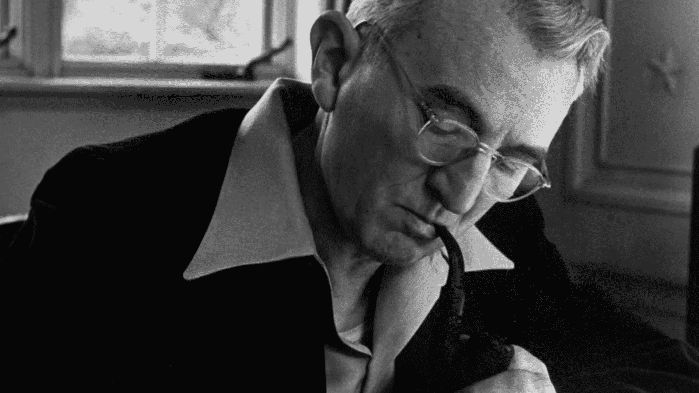

# 你唯一会读的书

> 原文：<https://medium.datadriveninvestor.com/the-only-book-youll-ever-read-b75441f8a144?source=collection_archive---------10----------------------->

## 如果我可以选择一种媒介来度过余生，你肯定会选择卡内基的任何一本书。

> 通过对别人感兴趣，你可以在两个月内交到比两年内让别人对你感兴趣更多的朋友。

这就是最初在卡内基的书中吸引我的东西。虽然试图理解他的引用让我头疼，但最终还是有意义的。老实说，我一直以为是反过来的。我从来都不是一个真正的倾听者，而是一个非常健谈的人。你可以问问我的小学和中学老师，他们都会同意。从很小的时候起，我就发现很难去倾听，更不用说去理解别人在说什么了。所以我求助于他的畅销书，只是想看看我是否能从中受益。

卡耐基的书卖出了 3000 多万册，自成一格。在父母的推荐下，我决定尝试卡耐基臭名昭著的*如何赢得朋友和影响他人*。作为一个不那么狂热的读者，一直读到卡内基的书的结尾真的让我很震惊。

为了真正验证这一点，我甚至在日常生活中采纳了他的建议。

这是我对他的书的看法。

# 原则

对于那些没有听说过这本书的人，请自便。你要去兜风了。

## 待人接物的技巧

1.  *不要批评、谴责或抱怨*

请举例说明批评曾经给你带来什么好处。

想不出来吗？

无论是批评别人，还是批评你自己，都会招致报复。与其谴责人，不如试着去理解人。弄清楚他们为什么做这些事。这比批评有益得多，而且能培养善意。

我们作为生命中每一分钟都会犯错的人类，没有理由去评判别人。那么我们为什么？

2.*给予真诚的欣赏*

约翰·杜威，美国最深刻的哲学家之一，说人性中最深的冲动是“成为重要人物的欲望”。对人类来说，重要感是一种巨大的需求，这种需求很少被满足。人类渴望这个。

例如，正是这种渴望引诱年轻的男孩和女孩加入帮派和从事犯罪活动。这一切都是为了完成获得聚光灯的冲动，并尽可能长时间地保持它。

3.激发他人的渴望

在另一个人身上创造一种“想要”和操纵某人按你说的去做之间有一条非常细微的界限。把枪放在某人的头上可以完成任务，但这也违背了这一切，如果我从看电影中学到了一件事，那就是它永远不会有好结果。永远不会。

使用他们喜欢的东西，以帮助引发“需求”，让他们觉得这样做是有益的。

电话工程师 K.T. Dutschmann 无法让他三岁的孩子吃早餐。他的责骂被认为是无效的。但是他利用她所喜爱的东西，也就是模仿她母亲的东西，在她女儿身上形成一种“想要”的东西。

所以，父母让她自己做早餐麦片，把牛奶和甜甜圈混合在一起，并给了她权力，让她坐在高凳子上。她吃了两碗麦片，她发现做麦片是变得自信的一种方式。

## 如何让别人喜欢你

1.  *真正对他人感兴趣*

当威尔士王子计划去南美旅行时，他决定学习该地区的语言，他这样做了几个月。他有用人们的语言说话的思维模式，因此南美人喜欢他。

如果你想交朋友，你最好相信你需要付出努力。让我们带着钦佩和热情与人打招呼。如果你想发展真正的友谊，你必须对人感兴趣，**百分百真诚**。

2.*微笑*

我觉得这真的是这本书的锦上添花。包括我自己在内的许多人都倾向于低估像柴郡猫那样开怀大笑的力量。

向婴儿学习。婴儿微笑的力量足以让你也微笑，对吗？没错。

事实上，微笑是如此的有力量，以至于它也能被察觉。例如，当你打电话时，你可以根据对方的语气感觉到对方是否在笑。你的微笑甚至来自你的声音。永远不要忘记微笑的力量。

3.*记住，在任何语言中，一个人的名字对他来说都是最甜美、最重要的声音*

在吉姆·法利的一次采访中，卡耐基问他成功的秘诀是什么。吉姆·法利是民主党全国委员会主席和美国邮政局长。

不用说，他绝对是合法的。

吉姆把问题抛回给他。卡内基说是因为他背了一万个名字。

不，吉姆说，是五万元。

这种把名字和脸联系起来的能力帮助法利先生把富兰克林·罗斯福送进了白宫。

你能想象吗？仅仅说一句“嗨，你好，今晚过得怎么样”，就引发了第 32 任总统的就职典礼。

4.做一个好的倾听者。鼓励他人谈论自己

全神贯注于和你说话的人是非常重要的。

例如，我曾经参加过一个朋友的生日聚会，我遇到了一位热爱人类心理学的年轻女性。我坐在座位边上，听她讲述自己 15 岁时的支出和心理学背景。我一直在敬畏地倾听，特别是因为我从未见过像她这样充满激情的人。

几个小时过去了，我们都道别了。第二天，聚会的主人说我是“一个很好交谈的人”。

去聊天吗？整段时间我几乎没说话，但我在专心听。那种真诚的倾听，就是让她产生火花的东西，也是你能给任何人最好的赞美。

如果你渴望成为一个好的健谈者，那就做一个好的倾听者。要有趣，**要有兴趣**。这是快速获得朋友的最有效的方法之一。

5.*根据对方的兴趣交谈*

一名男子试图通过在纽约当地一家酒店做广告来扩大他的面包生意。每次他试图给经理打电话或搭讪，都无济于事。这个过程他持续了四年。

自然，他做了功课，了解了更多关于经理的情况。原来，他是国际迎宾协会的主席。第二天，他开始和经理谈论迎宾员。
结果呢？经理充满活力的语气让这个人几天后带着面包的样品和价格过来了。

有趣的部分？他一次也没有谈到面包，或者暗示过面包这个词。

6.*让对方觉得自己很重要——真诚地去做*

一位老师的班上有一个非常安静的学生，但他会勤奋地工作几个小时。他问这个学生是否愿意进高级班。学生说:“我？—我配得上吗？”当学生站起来走向高级班时，老师注意到他的脸上、身体姿势和语气中有一丝光亮。
这个故事的寓意:描绘了我们深切渴望**感到重要**。

## 让人们接受你的想法

1.  赢得争论的唯一方法是避免争论

这种解释是一种更非传统的解释方式，与我遵循的一贯格式相反。但这是一个很容易遵循的原则。

*   **欢迎不同意见**

感谢你的对手让你注意到了这一点。这也是你应该承认你的立场是错误的时候。

*   **不相信自己的第一直觉**

当我们遇到分歧时，我们的第一个本能反应是自卫。锻炼你的自制力，把这件事拖住。在完全理解环境之前，注意你的言行

*   **先听**

这是你停止说话的信号！！不要抗拒、辩护或争论。这只会使局势紧张，并最终造成严重破坏。

*   **寻找意见一致的领域**

他们必须是你和你的对手达成一致的东西…仔细想想。

*   **实话实说**

为你的任何错误道歉。这会让你和你的对手冷静下来，引导一个新的思维。

*   **承诺考虑你对手的想法并仔细研究它们**

如果你的对手是对的，就直说。请不要出洋相，无中生有。

*   真诚地感谢你的对手对你感兴趣

把他们当成想帮你的人，你可能会把对手变成朋友。

*   **推迟行动，给双方时间思考问题**

这通常会给讨论双方一些喘息的空间。鼓起勇气，问一些困难的问题:“我的对手真的是对的吗？”

*2。尊重对方的意见。永远不要说，“你错了”*

心理学家卡尔·罗杰斯在他的书《成为一个人》中写下了这段令人沉迷的摘录:

“我发现，当我能够允许自己去理解他人时，这是非常有价值的。我们对大多数陈述(从别人那里听到的)的第一反应是评价…，而不是理解它。当有人解释他们的[立场]…，我们的倾向几乎是立即感觉…“那是愚蠢的”，“那是不正常的”，“那是不合理的”，“那是不正确的”…。我们很少允许自己准确理解这句话对别人的意义。”

*3。如果你错了，迅速而坚定地承认*

阿尔伯特·哈伯德是最伟大的作家之一，因其有争议的观点而臭名昭著。他有一种罕见的技巧，能很好地与人交往，把他们从敌人变成朋友。一位曾经被激怒的读者根据他在书中的观点这样那样称呼哈伯德，哈伯德是这样回应的:

“仔细想想，我自己也不完全同意。并不是我昨天写的所有东西今天都对我有吸引力。”

他继续感谢那人提起这件事，并邀请他随时来做客。

当我们觉得自己是对的时候，让我们试着温和而机智地赢得人们的信任。当我们错了的时候，让我们诚实并热情地承认我们的错误。

*4。以友好的方式开始*

这次我想用一个个人的例子。这是在我读完卡内基的书之后，我想把他的原则付诸行动。我在中学时代参加的一个 100 人的学生俱乐部主办了他们的年度选举。我已经确保和每个人都打成一片，而且大部分都是通过熟人认识的。

我的演讲大概是这样的:

我很高兴来到这里，认识并见过你们每一个迷人的人，我们又见面了。这次不是作为陌生人，而是作为朋友。我很高兴能有一个候选人的位置，本着相互友谊的精神，我很高兴今年开始与…

然后我继续前进。当然，不是这么正式，但我尽力让它尽可能的随意。结果是:

我为自己赢得了副总裁的职位。Squeeee！！

*5。让对方立即说“好的，好的”*

如果你不介意的话，我想再用一个个人的场景。有一家免下车冰淇淋店是我非常喜欢的，直到今天我仍然喜欢。那是在垒球练习之后，我很想吃些奶油冰淇淋。我问了我爸爸，答案是否定的。很自然地，我求助于“**苏格拉底式教学法**”，或者被称为“**是，是**”的回答。

于是我戴上思考帽，问我爸，
“我还没吃饭呢，经过一整天的击球练习，你觉得之后吃点提神的零食有意义吗？”
**“是……”**

我第一次答应了！

“既然家里没什么可吃的，去一家开车很方便而且我们不用下车的免下车餐馆不是很有意义吗？”

**“是……”**

但他似乎仍然没有被说服。所以我还需要一个同意。有时这是必要的，完全没问题。现在，我需要小心我的言辞。没有回答“不”的问题。

“嗯，妈妈(我叫我妈妈“妈妈”)不是说要确保我们在回家前吃了东西，而且去[这里的冰淇淋地名]而不是打电话到餐馆，等 30 分钟，然后下车去取不是很有意义吗？”

“嗯，实际上这确实有道理；好吧，就这一次……”

很高兴我手里拿着卡内基的书。

*6。让对方说很多话*

在一个更具因果关系的案例中，卡内基采访了纽约市的顶级就业顾问。她指出，她在该机构工作期间没有任何朋友。她说:

“我发现许多人憎恨我的胜利，而不是相反。我真的很想和他们成为朋友，所以我很少谈论自己，更多地倾听我的同事。我立刻注意到他们喜欢吹嘘他们的成就，而不是我的。而且他们问起的时候我只提我的成绩。”

这与卡内基之前关于倾听的力量的观点紧密相关。在学校，在家里，在任何地方，它都能创造奇迹！

*7。让对方觉得这个想法是他或她的*

一个人计划去国外钓鱼和划独木舟。他给一家旅游局写了一封信，说明他到底在找什么。因为上面有他的邮寄地址，他收到了无数的电子邮件。但是一个营地主人使用了这种技术。他发送了曾在他的营地逗留过的人的电话号码。很自然地，这个人拨通了其中一个号码，他惊喜地发现营地主人能提供什么。

不可避免地，他选择了那个营地作为他的娱乐活动。这一切都是因为营地的主人让他觉得他是真心想去的，让这个想法成为了他的想法。

*8。试着诚实地从他人的角度看问题*

在杰拉尔德·s·尼伦伯格博士的书《与人沟通》中，他提到，快乐生活的关键之一是学会理解他人的观点，并加以反思。他说:
“当你表现出你认为其他人的想法和感受**和你自己的想法和感受**一样重要时，对话中的合作就达到了。”

这就是这句名言“学会设身处地为他人着想”的由来。

*9。同情他人的想法和愿望*

杰伊·马格南代表一家电梯维护公司。酒店的一部自动扶梯需要维修，但酒店经理要求自动扶梯只能每隔两小时关闭一次。马格南说，与其以毒攻毒，

“我知道您的酒店非常繁忙，您希望自动扶梯至少关闭一次……我们想尽一切可能满足您的需求。然而，我们的诊断…显示如果我们现在不做一个完整的工作，你的自动扶梯可能…导致更长时间的关闭。我知道你不想让你的客人几天都不方便。”

经理不得不同意，立即进行 8 小时的维修比自动扶梯关闭几天要好。通过同情经理让他的客人得到保障的愿望，马格南先生能够说服酒店经理接受他的想法。

*10。诉诸更高尚的动机*

这个原则是最难执行和真正理解的原则之一。因此，我发现通过卡内基的解释，一个例子可以很好地完成这项工作。

北岩勋爵发现一家报纸用了他的一张照片，他不愿意刊登这张照片。所以，他给编辑写了封信。他有没有说，“嘿，我不喜欢你未经我允许就贴我的照片。马上取下来。”不，他知道报业相当顽固。他诉诸更高尚的动机。他说:“请不要再刊登我的照片了。我妈不喜欢。”通过唤起我们所有人对母亲的尊重和爱，他能够表达他的观点，并把照片拿下来供将来使用。

嘣，就是这么做的**。**

***11。戏剧化你的想法***

**最终，你需要运用表演技巧来真正吸引你的观众。电影做到了。头条做到了。真人秀做到了。什么阻止了你？**

**橱窗展示专家了解戏剧化的力量。例如，一种新老鼠药的制造商给经销商一个橱窗展示，里面有两只活老鼠。老鼠展示的那一周，销售额飙升至正常水平的五倍。**

**但是为什么这种特殊的环境如此有效呢？在作出进入商店的行政决定之前，我们的眼睛会去看商店的名称和陈列。对于服装店来说，那可能是穿着最新潮流的人体模特，你会在精选商品上看到“**五折**的标志！今天销售结束！”**

**在你意识到之前，你的脚突然把你带到了商店的门口。**

**12。发起挑战**

**这张是粉丝的最爱。这个原则在我 10 岁的弟弟身上产生了奇迹。我敢打赌，这对你的任何一个年轻朋友或兄弟姐妹都会同样有效。**

**我将以一个个人的例子来结束。**

**通常，当我和家人离开家时，我总是会在寒冷的日子里忘记带外套。我没有脱掉鞋子上楼去拿我需要的任何东西，而是让我的兄弟加齐去做。**

**他通常不会第一个说出来就做，所以我坚持这个原则。我做了一个倒计时，然后说，“加齐，你有十秒钟的时间把我的红色夹克拿来；准备好了吗？”然后他的脸亮了起来。我太了解他了，这总是在心跳中起作用。他摆出专注的表情，我夸张地说，“准备，一，二，三，开始！”。五秒钟后他拿着我需要的东西下来了。**

**这都要归功于卡内基。**

## **为什么这是你唯一需要的书**

**我要说，在我从*中简要解释的如何赢得朋友和影响他人的每一条原则中，肯定都有知识炸弹。但是，是什么让这本书在竞争者中脱颖而出呢？首先，在你的生活中立即采取行动是很容易的。他的原则有一个惊人的结构，无论何时何地都可以生效！就我个人而言，他的哲学和他的为人也让这本书如此引人入胜。***

**我过去总是害怕公开演讲。对我来说，这基本上听起来像是死刑判决。但是卡内基曾经说过，害怕公开演讲的人认为他们没有什么有价值的东西可说。我有点被冒犯了。作为一个健谈的小女孩，我试图找出为什么我如此害怕在外国观众面前说话。这本书和他的其他几本书一样,*《有效演讲的快速简单方法》*对我的生活产生了巨大的影响，坦率地说，很难用一句连贯的话来表达。他对我、我的生活方式和我的自我认知产生了巨大的影响，如果没有这本书，我甚至无法认识自己。**

**所以，如果卡内基有一点点可能正在阅读这篇文章，谢谢你。**

**我的读者朋友们，感谢你们跟随我踏上这段旅程。我希望你会买这本书(你可以在亚马逊上找到)，并了解更多关于卡内基的原则和他尽可能帮助人们的奉献精神。**

**为此，当你遇到外国情况时，这将是你在职业生涯中取得成功所需要的唯一一本书。**

**当你成长为一个小小的卡内基。**

## **个人笔记**

**希望你喜欢阅读！查看我的[**LinkedIn**](https://www.linkedin.com/in/fatimah-hussain/)[**insta gram**](https://www.instagram.com/fxtimxhh/?hl=en)，关注我的 [**中**](https://medium.com/@fatimahandhussain) 。当我写这些文章的时候，我总是付出 100%的努力和奉献，所以我希望你过得愉快！敬请关注，点击关注按钮，获取每周更新和引人入胜的文章！**

## **访问专家视图— [订阅 DDI 英特尔](https://datadriveninvestor.com/ddi-intel)**