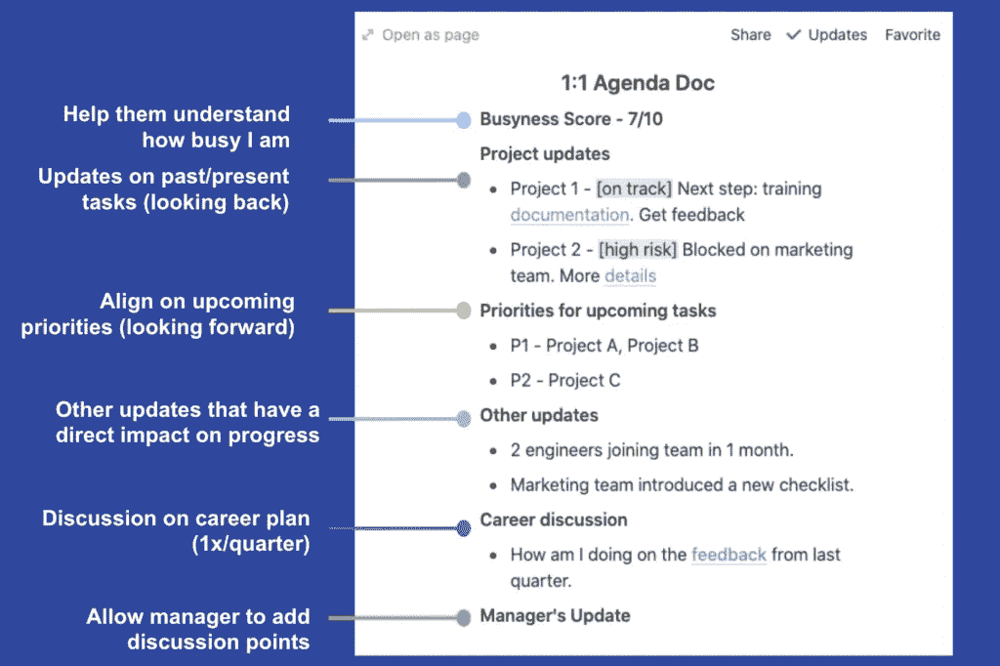

# 与经理进行有效的一对一会谈所需的唯一指南

> 原文：<https://medium.datadriveninvestor.com/the-only-guide-you-need-to-run-effective-one-on-one-meetings-with-your-manager-fea6b0d28385?source=collection_archive---------22----------------------->

Photo by [krakenimages](https://unsplash.com/@krakenimages?utm_source=medium&utm_medium=referral) on [Unsplash](https://unsplash.com?utm_source=medium&utm_medium=referral)

你的*经理*几乎总是会在你的职业成长中扮演关键角色。

这基本上意味着你应该始终与你的经理就你的目标和抱负保持一致。

你们双方应该坦率地讨论并就短期和长期目标达成一致。你们两个都应该定期重新评估这些计划，以确保你考虑到了发生的任何变化。

我发现对这些对话有用的一个渠道是*一对一会议*(又名 1:1 会议)。

我每周与我的经理会面至少 50 分钟。在这些会议中，我会讨论所有直接或间接有助于我成功和成长的话题。以下是更多相关信息。

多年来，我尝试了不同形式的一对一会议。我终于达到了一个阶段，这种形式非常适合我。

今天，我分享一下细节。请随意使用相同的系统或修改它以满足您的需求。

# 摘要

1.  永远为你的 1:1 设定一个明确的目标。
2.  你应该掌控会议的结构。
3.  永远不要错过或取消一对一。
4.  明确要求反馈，但也要给出反馈。
5.  设定适合你的频率。

作为奖励，我还分享了我与经理进行一对一会谈时使用的简单模板。

# 永远为你的一对一计划设定一个明确的目标

我强烈建议你让一对一会议真正有针对性。要做到这一点，你应该为你的会议设定明确的目标。

这是我的目标清单:

1.  (重新)确定下周/下个月的优先事项。
2.  分享正在进行的和已完成的任务的进度。强调成功和挑战。
3.  突出阻碍进步的障碍。请求帮助解除阻止。
4.  相关时寻求反馈。
5.  讨论职业规划和个人成长，每季度一次。

一旦你有了自己的清单，设计适合自己的格式就简单多了。

# 你应该掌控会议的结构。

请记住，这次会议是关于你的成长和你的职业成功。所以你应该掌控会议的议程和结构。

但是如果你和一个有经验的经理一起工作，她有自己喜欢的结构，理解她系统背后的基本原理。如果她的理由不能引起你的共鸣，那么合作创造一些对你们双方都有用的东西。

目标很简单:商定一个能让你实现一对一目标的结构。

这是我如何与我的经理建立一对一关系的:

Simple template for 1:1 meetings

# 永远不要错过或取消你的一对一会议。

如果一方或双方不能参加会议，请重新安排会议时间或日期。尽快做它。

如果你在同一周内找不到其他时间，可以延长下周的会议。在那次会议中，讨论两周的议程。

只有在你真的没有任何有意义的东西可以分享的情况下，取消会议。不过，这种情况很少发生。

# 明确要求反馈，但也要给出反馈。

利用这段时间明确地寻求反馈。

每当我发布高影响力的功能或进行重要的演示时，我都会向我的经理寻求具体的反馈。

这件事(我寻求反馈)仍然历历在目。这有助于我的经理提供真实的反馈，也有助于我理解和同意/不同意这些反馈。

这种交流的另一个重要部分是**向我的经理提供坦诚的反馈**,我开始做的时间比我应该做的晚了很多。

如果我的经理没有按照我的成长要求行事，我会坦率地告诉他们，并要求他们改正。

# 设定适合你的频率

我建议从每周一次的会议开始。这很有效，尤其是如果你是公司或团队的新人。此外，如果经理是团队的新人，这种方法也很有效。

然而，适合我的不一定适合你。所以花点时间去试验，看看什么最有效。

*如果你喜欢这个指南，请与你的朋友分享。*

*如果你想每周收到一份新的指南(就像这份)，请* [*订阅*](https://justanotherpm.com/signup/) *简讯。*