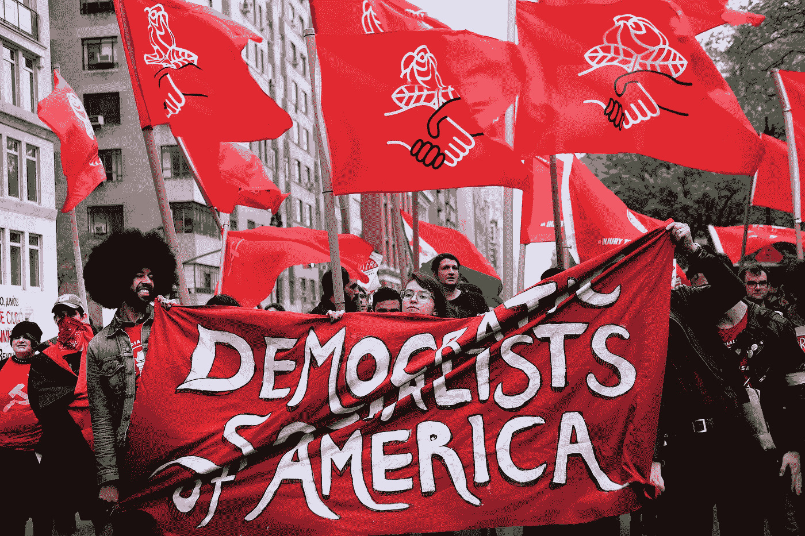

# 来到美国。

> 原文：<https://medium.datadriveninvestor.com/the-only-rags-to-riches-stories-from-socialism-usually-start-with-coming-to-america-bbc4601c76ac?source=collection_archive---------11----------------------->

## 与其对富人征税让政府救穷人，为什么富人不能通过帮助穷人变富来赚钱？

Democratic Socialist Protestors — RockerFeller Enterprises

> “社会安全网由非缴费性援助组成，旨在改善处于贫困、赤贫或其他困境的弱势家庭和个人的生活。”未知的

除了少数例外，没有一个美国人反对帮助弱势群体。但是为什么我们的政府要对那些被我们的企业认为不适合工作的人的照顾和福利负责呢？

## **我们的资本主义制度没有理由忽视数百万依靠政府福利生活的人。**

然而，有一个原因，一个解释。回到人类诞生之初，我们都知道这样一句话，*适者生存——*自然之道——所有生物、植物、昆虫、鱼类和动物的自然消长。我不知道谁是第一个在商业中使用它的人，但在杰克·韦尔奇统治时期，它以通用方式而闻名。

这一理念为他赢得了“中子杰克”的绰号，因为每年，通用电气及其所有部门都会对所有员工进行评估，只有 90%的人得分良好。剩下的 10%将被放弃。每年都是。

许多像吉姆·科林斯的《打造持久的》*这样的书都建议企业应该使用 S *墨船战略*；把所有人都扔到水里，只救你真正需要的人。*

*最近，网飞首席执行官雷德·哈斯汀斯把它加入到他的员工守则中，并称之为“出色的表现可以获得丰厚的遣散费”他把这比作被奥林匹克队除名——你可能很优秀，但你已经不够优秀了。*

*具有讽刺意味的是，即使是这些公司交易股票的“市场”，也使用同样的达尔文主义计划。通用电气在 2018 年因表现不佳而被除名后，道琼斯工业平均指数的原始成份股中没有一个继续列在 30 家公司的指数上。它们已经被更新、更好、更相关的名字所取代。*

*不管你是否同意这些经理的观点，最终，总会有这样的情况，人们没有，也许不能得到一份有报酬的工作，这使他们能够照顾自己，自给自足。*

> ***“总会有失业的人需要被照顾，把他们留在人群的后面等死不会让你在 yelp 上获得好评。”***

*但是自从美国人决定政府应该对他们的福祉负责，这些社会项目的规模、数量和成本就失去了控制。我们需要解决我们政府的规模和范围，以及需要做些什么来开始缩减过程。允许政府掌管，或者管得太大，既不健康也不明智。*

*就我个人而言，当我听到公司裁员数千人，有时甚至上万人时，我总是很着迷。我不禁想知道，他们最初是如何设法拥有如此多的员工的？谁负责雇佣他们？*

***管理是所有商业问题的头号元凶。**你如何经营你的企业，你如何对待你的员工，以及你工作场所的氛围，都取决于管理，如果你是老板或所有者，那就是你。*

***最近有两种管理风格备受媒体关注。*股东理论*和*利益相关者理论*。***

*任何时候有人投资金钱或等价货币到商业风险企业，他们就自动成为股东*和*利益相关者，因为他们拥有股份，如果出现问题，这些股份就岌岌可危。大多数公开交易的企业都在股东模式下运作。他们的顾虑、动机和目标是最大化股东回报，而不是保护环境或其他利益相关者。*

*利益相关者是任何可能受到公司影响、受益或损害的人，无论他们是否拥有股份**。所有员工都是利益相关者。但员工的家庭、社区和自然资源也是如此。***

*在美国和大多数自由世界，在资本主义经济下运作，可以理解的是，我们的很多注意力和资源都投入到改善我们的业务上，这是我们的生计，我们早上起床的原因。*

*当这些业务对我们有利时，我们让它们不受阻碍地继续下去。当一些事情发生打断了这种自满，村民们聚集在街上，拿着叉子和火把，寻找可以责备的人。*

*当企业缩小规模甚至倒闭时，它对社区的影响可能会对所有公民的健康和福利造成毁灭性的影响。但是这对我们的政府有什么影响呢？*

*随着认为社会主义可能解决问题的人数的周期性上升，我们已经听到越来越多的政府官员鼓吹免费为所有人提供资金的好处。*

* [## 免费的钱是答案还是免费的钱是问题？

### 假人的现代货币理论

medium.com](https://medium.com/@RockerFeller/modern-monetary-theory-for-dummies-b9c98736c68) 

社会历史上的每一个共产主义和社会主义社会都是从提供免费帮助开始的；为社区中的任何人提供帮助和协助。走向全面社会主义的步骤是:

1.提供免费的钱。

2.制造一种恐惧感。

3.利用这种恐惧来制定法律。

4.使用政府力量来执行这些法律。

5.确定谁对生产一定水平的商品至关重要，这种商品能让人们活下去，但不能让他们变得富有。

6.控制媒体的叙事，让一方相信另一方是邪恶的。

7.摧毁邪恶的一面，从而创造出一群永远不会还手的羊。

**为了向非信徒兜售这一点，他们创造了这个术语，*社会民主党*。或者*民主社会主义者*，好像加上了民主主义者这个词，不知何故让它变得更容易接受。*** 

*自 1865 年以来，当美国黑人奴隶被“给予”自由，但没有权利或所有权时，我们的政府一直在缓慢而稳步地增加“贫困”人口的名册。通过让他们呆在福利车里，他们有了大量的选民来确保他们继续执政。结果是一个如此臃肿的政府，看起来就像赫特人贾巴说的，“很快你就会学会欣赏我。”*

**

*“You will soon appreciate me.” Jabba the Hutt — Star Wars*

*政府膨胀助长了自满、低效和腐败，表现为对权力的渴望、控制欲的、激进的左翼国会、参议院、司法部门，有时甚至是总统。**企业在*优胜劣汰*下运作，政府在*不能解雇任何人*的前提下运作。***

> *拉尔夫·沃尔多·爱默生说:“因果法则是法律的法则。”*

*就像煮青蛙一样，在上个世纪，这两种极端策略都在缓慢而稳定地发展壮大。他们是当今美国的头号问题。如果企业不雇佣他们，政府就有责任照顾他们。*

*如果自然，也就是达尔文主义，是资本主义裁员的原因，那么我们需要回答的问题是，“我们希望政府收拾残局吗？还是大自然要照顾我们所有人？”*

*在[“如何让你的名字出现在名单上”](https://medium.com/an-idea/how-to-get-your-name-on-the-list-d68190b3439)中，我为那些财富不是自己挣来的而是继承来的富人提供了一个机会——总共约 9500 亿美元，来创建一个或多个商业实体，与政府项目相抗衡。*

* [## 如果不是你赢得的，你应该保留它吗？

### 人生彩票中奖者名单

medium.com](https://medium.com/an-idea/how-to-get-your-name-on-the-list-d68190b3439) 

这些实体将是企业——而不是慈善机构——雇佣、培训和支持不幸的人，提供资源，帮助他们自给自足，并支付完成上述所有工作的雇员的工资。

我们可以称它为 *Charity，Inc.* ，它的使命宣言将是，“**提供社会民主党声称提供的每一个承诺，而不需要对我们的企业征税，也不需要破坏经济。”*** 

*今天，许多公司正在采取措施对利益相关者更加友好。不幸的是，随着目前的 Covid-Chaos，一些公司被迫裁员。虽然肯定不是企业的错，但解决方案仍不必是，**“让政府来处理。”***

*快速搜索那些在过度反应期间确实在招聘的公司，会发现一长串数十万个职位空缺。对慈善公司来说有多难。把*下岗*和*求助*匹配起来？可能需要一些指导，但那将是慈善公司的使命。**为什么政府需要负责？***

## *与其对富人征税让政府救穷人(眨眼，眨眼)，为什么富人不能通过帮助穷人变富来赚钱？*

*黑人电影制片人泰勒·佩里在接受《福布斯》采访时说，“我喜欢人们说我出身卑微。”斯派克·李也是一名黑人电影制片人。他们的意思是我穷得要命。”*

*佩里还说，“所有权改变一切。”*

*他从他的好朋友奥普拉·温弗瑞那里学到了这一点，奥普拉也是一名黑人电影制片人，在福布斯白手起家排行榜上获得了 10 分——最高分。她很早就建议他，“写自己的支票和完全掌控的重要性。”*

> *为什么没有更多的黑人掌权？一百多年后，自由和所有权发生了什么变化？社会民主党出现了。*

*民主社会主义者可能一开始是穷人和弱势群体的救星，但他们已经变得更加强大。在社会安全网的伪装下，他们现在的目标是控制。他们想要——他们需要——控制投票给他们的人。*

*除了给他们免费的钱，控制他们的最好方法是什么？媒体。谁控制了媒体，谁就控制了叙事。谁控制了信息，谁就控制了人民。*

**

*Black MAGA Hulk says, “Vote RED — Remove Every Democrat.”*

*民主社会主义是煮青蛙的第一阶段。趁早离开水。从锅里出来，投更好的。#走开*

* [## 企业能做政府做不到的事吗？

### 正确运作的资本主义应该很容易胜过政府。

medium.com](https://medium.com/@RockerFeller/capitalism-3-0-bb644b0f51a3)*