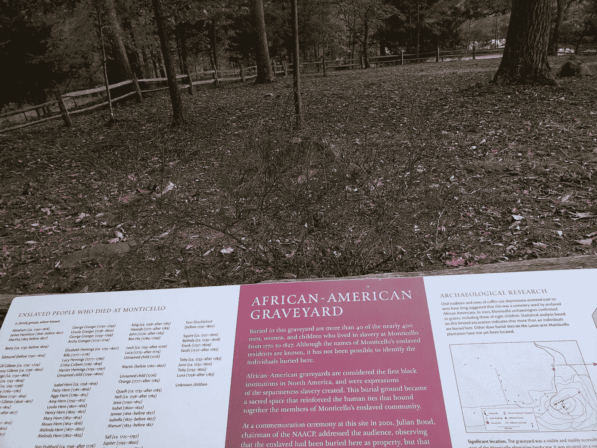

# 另一个蒙蒂塞洛公墓

> 原文：<https://medium.datadriveninvestor.com/the-other-monticello-cemetery-9f32ec47e411?source=collection_archive---------5----------------------->

## 托马斯·杰斐逊家中的生与死的不平等

Photo by Carol Burns

如果你参观托马斯·杰斐逊的蒙蒂塞洛故居，根据一周中的日期和你愿意花费的费用，有多种游览方式可供选择。在其中一次游览中，你可以乘坐穿梭巴士到主家，在没有人陪同的情况下，在导游的指引下穿过家和庭院。在返程班车上，你会经过家族拥有和经营的墓地，那里埋葬着托马斯·杰斐逊以及托马斯和他妻子玛莎的直系后代。有一个超过 2000 人的等候名单，简直是迫不及待地想要进去；明年将扩建场地以腾出空间。我问了这个问题，“莎莉·海明斯葬在那里吗？”

班车司机的回答很啰嗦；托马斯死后，萨莉似乎已经离开了蒙蒂塞洛，没人知道她被埋在哪里。她的儿子麦迪逊·海明斯(Madison Hemings)说，她一直和他以及他的兄弟埃斯顿(Eston)住在附近的夏洛茨维尔，直到 1835 年去世。没有一个海明人葬在蒙蒂塞洛公墓。没有以前被奴役的人被埋葬在那里，因为家族拥有的蒙蒂塞洛协会直到最近才承认托马斯有任何黑人后裔。司机建议我们参观非裔美国人墓地，就在停车场 C & D 附近。

白人的主要墓地被围了起来，不让不速之客进入。坟墓上有凸起的墓碑、扁平的标记、方尖碑，从远处看似乎是一座坟墓。坟墓排成一排，距离相等，标记清楚。

在非裔美国人的墓地里却不是这样。没有一个坟墓被标记，尽管偶尔有一块石头表明有人被埋在那里。一块牌子确实标明了埋在那里的一些死者的名字。有些人有名字和姓氏，有些人有名字或姓氏，有些人仍然不知道。所有人的出生和死亡年份都包括在内。我被一个不知名的孩子震惊了，他出生在某一年，第二年就去世了。他/她活了多久？一周？一年？会计要求正确记录资产的创造和价值的损失，而给孩子起名字是没有必要的。埋在非裔美国人墓地里的许多无名之辈，他们的寿命被适当地记录下来，名字却不那么多。

黑色墓地周围有部分围栏。在入口附近，有一个鼓励人们尊重他人的标志。因为只有几个坟墓用石头做了标记，所以没有办法知道你什么时候走过一个没有标记的坟墓。如果新冠肺炎允许的话，有计划在 2021 年改善墓地。六个停车位将被移除，茂密的灌木将被种植，作为坟墓和停放的汽车之间的分界线。一条无障碍通道将环绕场地，还将安装一个特殊的反思座位区，包括一个子孙专用区。它将被遮蔽。

理论上，自从家庭现在承认莎莉·海明斯生了几个托马斯·杰斐逊的孩子。他们的后代应该有资格加入 2000 多人的主要墓地等候名单。他们可能得不到方尖碑和其他华丽的标记。至少他们的名字可以被记录下来。他们至少应该得到这些。

非洲裔美国人墓地估计有 40 具尸体。它回避了一个问题，其余的在哪里？在他的一生中，杰斐逊在蒙蒂塞洛的 60 年间拥有大约 400 名奴隶，在他的其他财产中拥有另外 200 名奴隶。我不禁想起了最近在塔尔萨发现的一个万人坑，很可能与黑色华尔街有关。毫无疑问，被奴役者的死亡人数。尸体埋在哪里完全是另一回事。