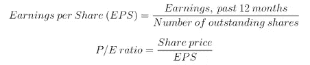
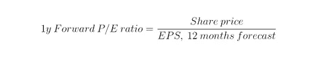

# 市盈率捕捉到的信息比许多人想象的要多

> 原文：<https://medium.datadriveninvestor.com/the-p-e-ratio-captures-more-information-than-many-think-2d266c221ae9?source=collection_archive---------7----------------------->

## 财务分析

## 作为一种估价工具，这个比率是不够的，但它是大局的重要组成部分

Photo by [Massimiliano Donghi](https://unsplash.com/@milanstagram?utm_source=medium&utm_medium=referral) on [Unsplash](https://unsplash.com?utm_source=medium&utm_medium=referral)

投资者，尤其是那些关注成长型股票的投资者，经常抨击市盈率。

声称这一比率毫无用处，使用这一比率的投资者被困在上个世纪并不少见。

反对这一倍数的观点基于一个无可争议的论断，即它不足以衡量一只股票被低估或高估。但这一论断虽然正确，却不能得出市盈率无用的结论。

如下所述，市盈率包含有用的信息。反过来，它通常作为估值分析中有用的第一步(的一部分)。

但你必须知道要寻找什么，以及如何进一步深入研究企业的估值指标。

## 快速浏览一下市盈率

关于市盈率的关键要点是:从它开始，为基于揭示假设而不是隐含假设的结构化分析铺平了道路。

查看简单的倍数风险忽略了公司的重要信息，但它有助于进一步的分析，并可以揭示困惑，让分析师了解公司前景的基本方面。

> (对一家公司的)所有评估都可以归结为一点:公司现在和未来是否会产生利润

评估一家企业时，必须考虑许多因素。一个企业是否会兴旺取决于无数的因素。

其中包括管理实力、资本结构、对市场份额变化的预期，以及公司是否已经或正在建立护城河(允许公司保护市场份额并保持盈利的优势，从而实现一定程度的定价能力)。

但所有的评估都归结为一件事:公司现在和未来是否会产生利润。

市盈率表达的是相对于每股收益(EPS)的股价。因此，它给投资者一个模糊的指示，即拥有某一公司的一部分的价值是否补偿了所有权的成本。

但这个价值不仅取决于当前收益，还取决于预期未来收益的现值。市盈率不衡量这个。

对市盈率的一个常见的直观解释是“市盈率告诉我们多少年的收益才能等于股价。”然而，这种解释依赖于一个至关重要的假设——收益是永久的。

市盈率可以被认为是动态变量的静态一瞥。收入很少会随着时间的推移而保持不变。

如果一家企业正在增长，其未来收益将意味着更大的分母，这意味着未来的市盈率(假设股价不变)将会更低。因此，在其他条件相同的情况下，高预期收益增长率证明了高市盈率的合理性。

## 远期市盈率

使用追踪倍数和远期倍数的组合给投资者提供了关于市场对未来盈利能力的预期的有价值的信息，反过来，销售、收入或收益的增长是否已经反映在价格中。

虽然远期市盈率有助于根据对近期收益的预期评估估值，但我们必须记住几件事。

首先，收益预测是不确定的。公司的前瞻指引相对可靠，但不能总是预见未来的宏观经济环境。

其次，一只股票的价值不仅取决于未来几年，还取决于未来几十年。时间越长，收益的不确定性就越大。

但了解当前的市盈率、未来两年的预期市盈率(公司通常会进行前瞻性指引)，以及不同的预期收益增长路径对预期市盈率意味着什么，可以帮助投资者了解市场已经消化了多少收益增长。

## 其他倍数

一些公司不盈利。一个例子是软件公司花费他们所有的收入(甚至更多)来获得市场份额。竞争往往很激烈，这意味着获得额外的市场份额成本很高。

但是，如果转换成本很高，如果有显著的网络效应，或者公司在其他方面有护城河，未来来自更高市场份额的收入将超过短期成本。在这种情况下，市盈率是不确定的——无论如何也没有意义。

投资者通常会转而关注市净率。但对利润率的预期对估值非常重要，这再次表明单一倍数是无法独立存在的。

另一个例子是市场上还没有产品的生物技术和制药公司。他们今天赚不到钱的事实并不意味着他们一文不值。

如果他们有有前途的产品，他们很可能在未来有很高的利润和巨大的投资。

以上述倍数对它们进行估值将需要销售和盈利预测，如果首批产品仍处于临床试验阶段，这将是一件困难且高度不确定的事情。

 [## 如何在不牺牲孩子或财务的情况下安全理智地离婚|数据驱动…

### 在美国，七月是以孩子为中心的离婚月。作为 cdfaⓡ的专业人士，我可以向你保证，从长远来看…

www.datadriveninvestor.com](https://www.datadriveninvestor.com/2020/07/28/how-to-divorce-safely-and-sanely-without-sacrificing-your-children-or-your-finances/) 

## 周期性和角比率

经济的周期性波动也会扭曲市盈率。经济衰退将在短期内打击大多数公司。

收益下降将意味着高市盈率，除非股价同样下跌。但一家健康发展的公司的长期前景可能不会受到倍数所显示的影响。

由此可见，市盈率，以及应该如何解读它们，在真实的商业周期中是变化的。旨在纠正这种波动的措施的一个例子是 CAPE 比率。

CAPE ratio 代表经周期调整的市盈率，由经济学家罗伯特·席勒和约翰·坎贝尔在 20 世纪 80 年代末提出。

该指标尤其适用于分析广泛的市场情绪以及特定国家和行业的估值水平。但它也有其他缺点，尤其是在分析特定公司时。

这一指标是以相对于过去十年经通胀调整的平均收益的价格来计算的，这意味着它落后了很多(想象一下根据亚马逊或脸书五到十年前的收益来评估它们)。

 [## CAPE 比率表明股票市场是有吸引力的

### 坎贝尔和诺贝尔奖得主席勒发明的这一指标预示着股市的乐观前景

medium.com](https://medium.com/datadriveninvestor/the-cape-ratio-suggests-the-stock-market-is-attractive-7eb3fc22816b) 

## 盘点

市盈率很简单。但是简化是有用的，因为它们允许形式化的概述，并提供了一个坚实的核心，在此基础上可以对进一步的分析进行基准测试。

倍数是一种对企业、其前景和估值进行结构化思考的工具。

> 仅仅将市盈率作为任何估值论据的基础，就像只关心收入增长一样愚蠢

没有一个单一的倍数能准确反映一家公司的价值。这个世界太复杂了，无法用一个一维的数字来捕捉。

在真空中，多次波遗漏了有价值的信息，但它们也提供了有用的视角。理解为什么市盈率会高或低意味着理解潜在的公司。

当将市盈率、市盈率和各种企业价值倍数等倍数放在上下文中并与其他定量和定性指标一起使用时，可以帮助投资者理解可用信息。

仅仅将市盈率作为任何估值论据的基础，就像只关心收入增长一样愚蠢。一位智者曾经说过，一切都是相对的。在投资领域，这当然是正确的。

思考行业、公司或真实商业和市场周期的不同阶段之间的市盈率差异，将有助于揭示投资决策的重要基础。

充分了解一家公司以证明其高市盈率是合理的，或者解释为什么它不应该有这么高的市盈率，这是朝着确定该公司是否是一个可靠投资的正确方向迈出的一大步。

 [## 特殊目的收购公司是新的黑人

### IPO 替代方案已经大规模回归，投资者的兴趣将使派对持续到 2021 年

medium.com](https://medium.com/datadriveninvestor/spac-is-the-new-black-296947838e2e)  [## 为什么散户投资者能持续击败专业人士

### 机构投资者受到委托的束缚。个人投资者可以自由选择什么是最好的。

medium.com](https://medium.com/datadriveninvestor/why-retail-investors-can-consistently-beat-professionals-96e603161c39) 

## 获得专家视图— [订阅 DDI 英特尔](https://datadriveninvestor.com/ddi-intel)